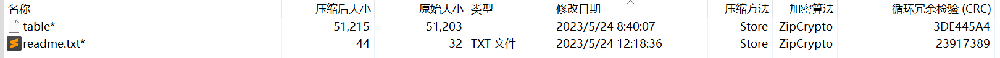
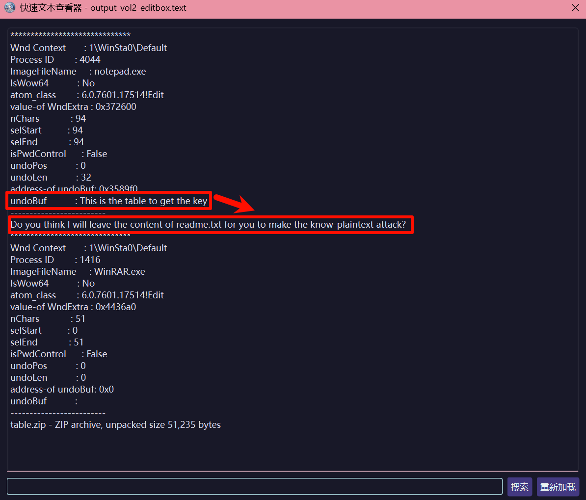
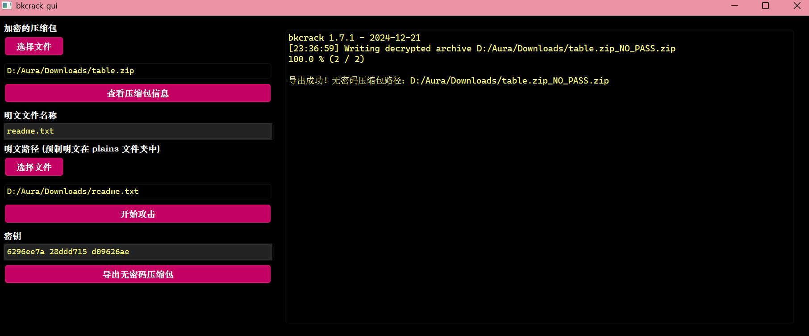
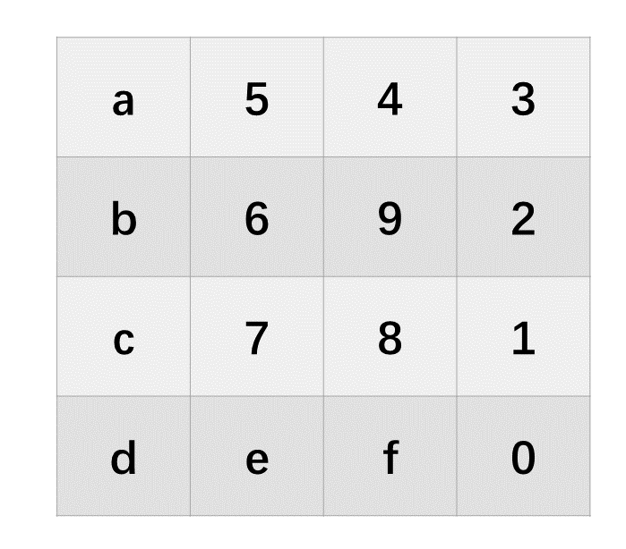
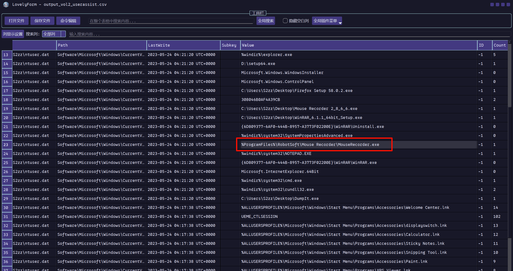
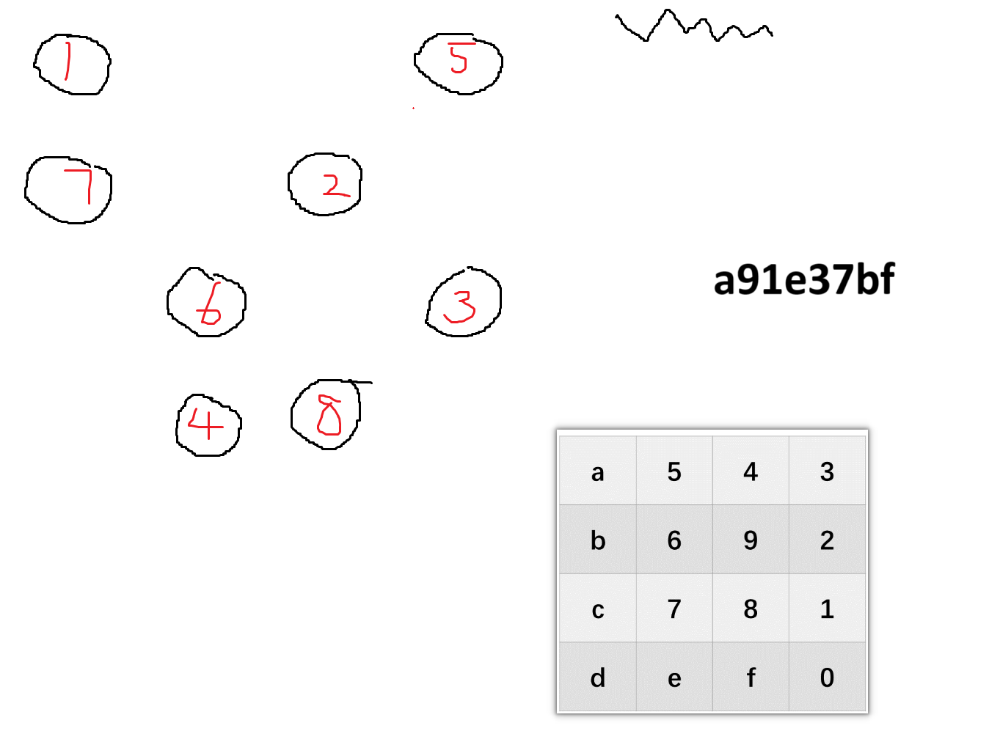
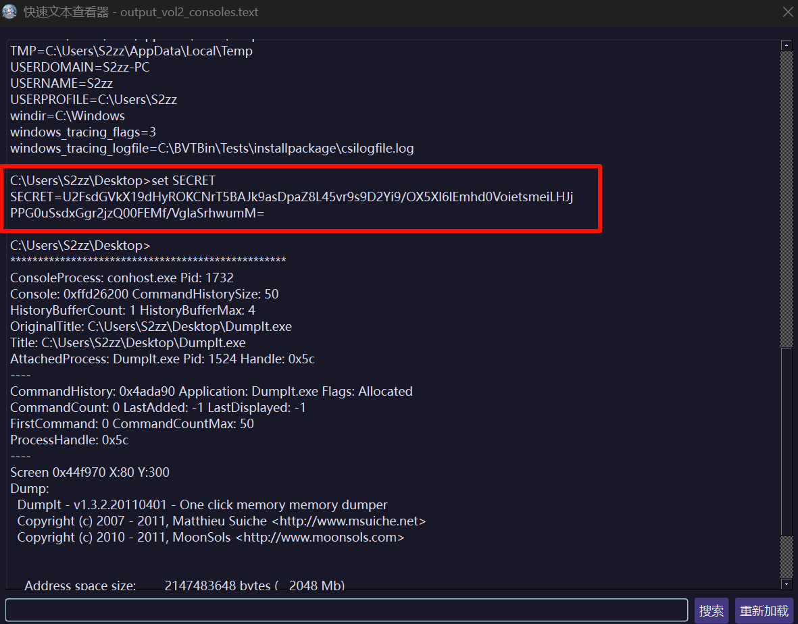
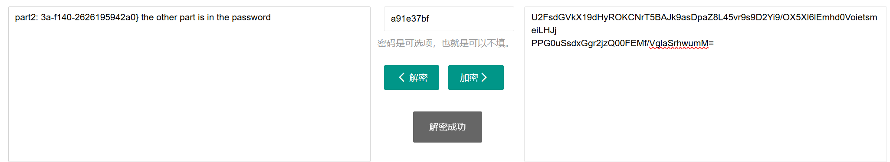
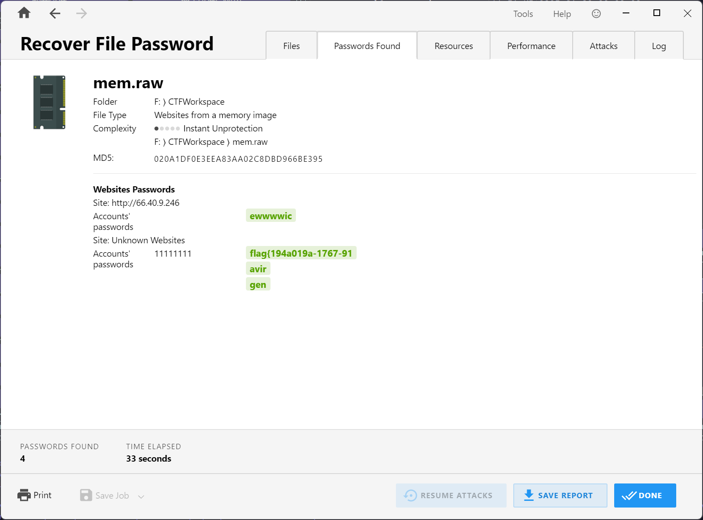

拿到一个内存镜像，先扫描一下文件，发现桌面上面有几个文件，分别是 key.rsmr，table.zip，readme.txt。

table.zip 里面也有一个 readme.txt，很明显是明文攻击。



但是桌面上的 readme.txt 和压缩包中的 readme.txt 大小对应不上，可能被修改过，于是去看编辑框 editbox。



上面 undoBuf 中的内容才是真正的 readme.txt 中的内容。

然后明文攻击。

解开压缩包拿到里面的一个 table 文件，其实是一个 png，是这样的内容。



桌面上还有一个 rsmr 文件，不知道是干什么的，可以看一下用户操作记录。



发现这个应该是一个记录鼠标相关信息的一个文件，移动轨迹？

网上搜一下这个工具，安装好以后可以自动识别这个 rsmr 文件，双击打开会直接播放鼠标行为，开一个画图记录下来。

发现可以和之前那张 table 图片对应。



得到一个字符串 a91e37bf。

继续看内存镜像，在 consoles 里面有一串密文，应该是 AES，用在线网站解密可以得到 flag 的第二部分。







第一部分在这里，可以用 Passware Kit 找到。

```plain
flag{194a019a-1767-913a-f140-2626195942a0}

```

