有嫌疑人在使用Windows系统，取证人员对该系统进行了硬盘镜像。通过自己的工具软件对档案袋中的镜像文件进行提取、分析、逆向、恢复、破解、查找等，在线完成填空、简答。

计算机镜像资料镜像名为“windows7disk.E01”


## Question 1
> 请找出操作系统主机名。
>

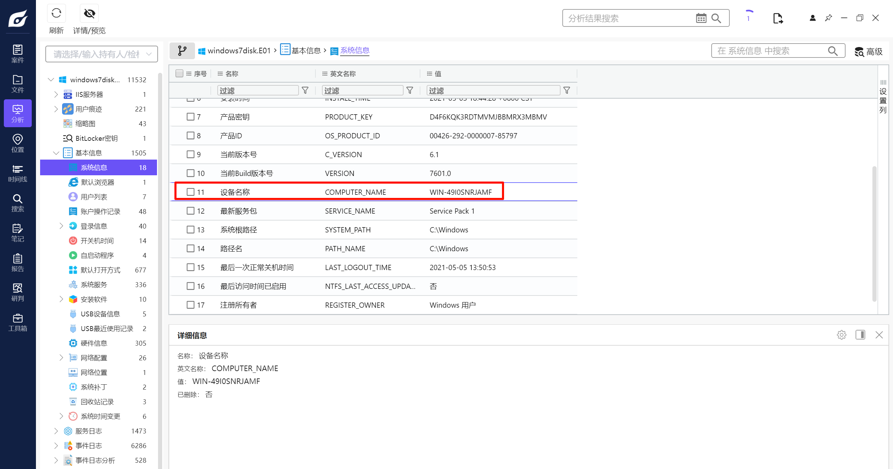

```plain
<font style="color:rgba(0, 0, 0, 0.87);">WIN-49I0SNRJAMF</font>

```

## Question 2
> 请给出源磁盘的SHA256哈希值。
>

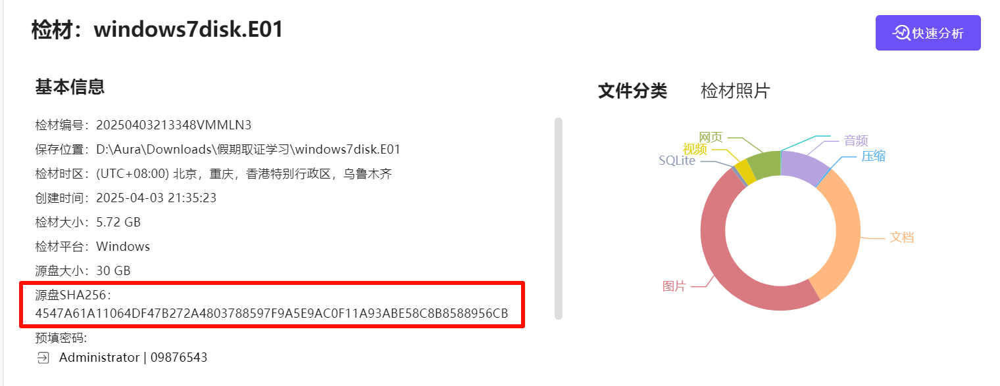

```plain
4547A61A11064DF47B272A4803788597F9A5E9AC0F11A93ABE58C8B8588956CB

```

## Question 3
> 请找出操作系统中安装的Android模拟器名称和安装日期。
>
> 格式：模拟器名时间
>
> 例子：雷电模拟器2022年06月23日
>

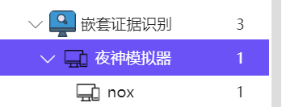

找到一个夜神模拟器，然后去看安装的软件。

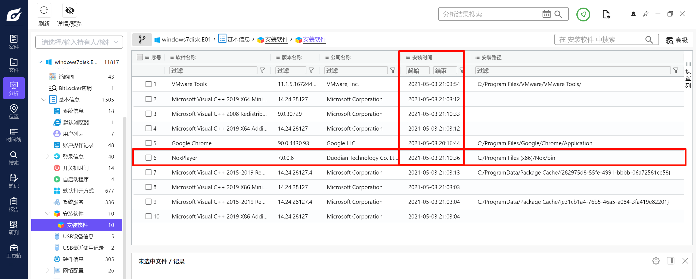

可以找到安装日期。

```plain
夜神模拟器2021年05月03日

```

## Question 4 
> 请找出使用Bitlocker加密的虚拟磁盘文件。
>
> 格式：1.txt/2.txt
>

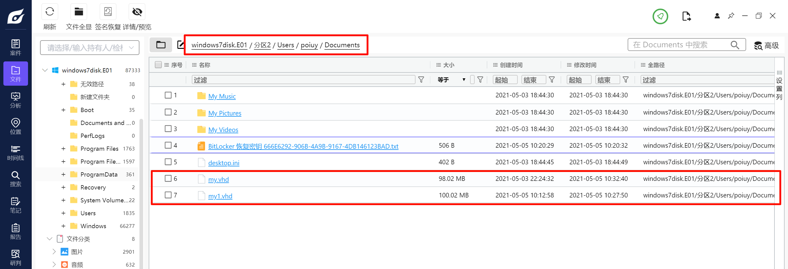

在 poiuy 用户的 Documents 中。

```plain
my.vhd/my1.vhd

```

## Question 5
> 请找出操作系统安装日期。
>
> 格式:2022-01-04 12:47:43
>

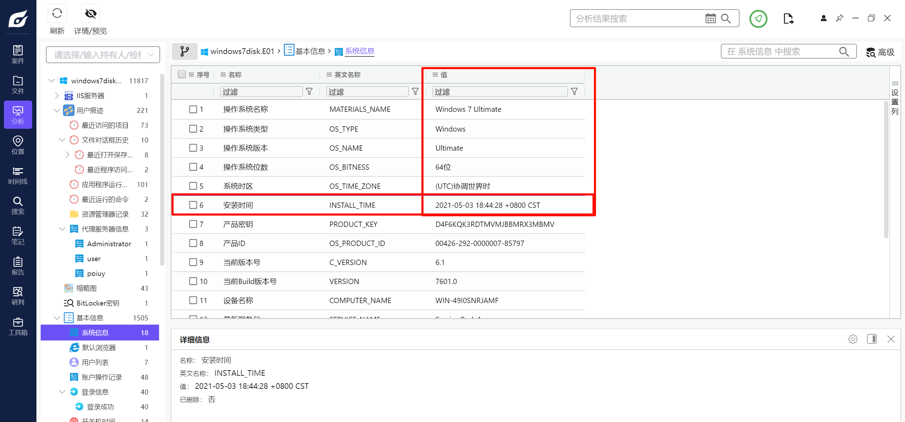

```plain
<font style="color:rgba(0, 0, 0, 0.87);">2021-05-03 18:44:28</font>

```


## Question 6
> 请找出操作系统最后登录的用户。
>

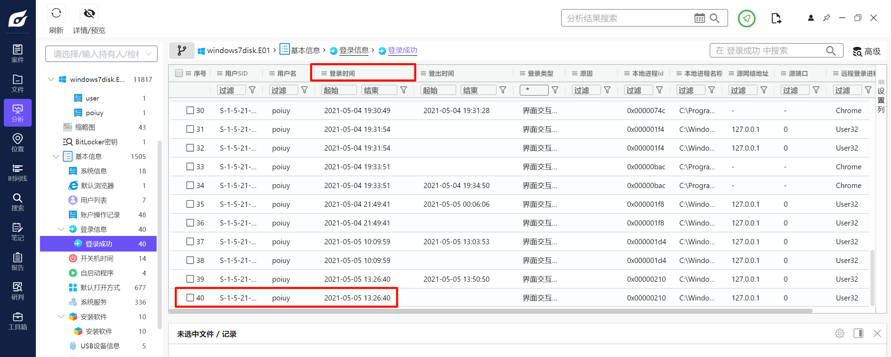

```plain
<font style="color:rgba(0, 0, 0, 0.87);">poiuy</font>

```


## Question 7
> 请找出操作系统中安装的浏览器最后浏览过的网站域名 [格式： www.baidu.com]
>

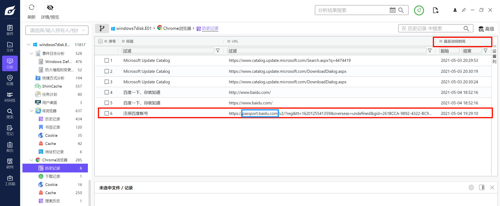

```plain
passport.baidu.com

```


## Question 8
> 请找出操作系统中安装的浏览器名称的对应的安装日期。
>
> 本题仅一次答题机会
>
> 
>
> □ 360浏览器2021-05-03 20:16:43
>
> □ Edge浏览器2021-05-03 20:26:44
>
> □ 谷歌浏览器2021-05-03 20:16:44
>
> □ 搜狗极速浏览器2021-06-03 20:16:44
>

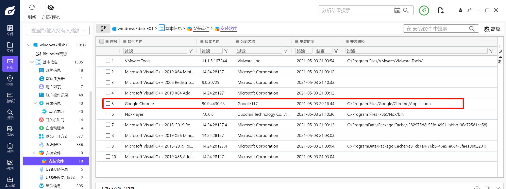

只有一个谷歌浏览器，时间也对的上，选 C。

```plain
C

```

## Question 9
> 请找出操作系统版本号。
>

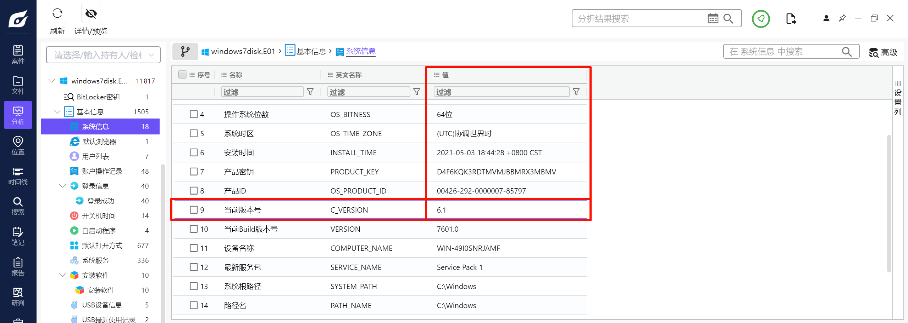

```plain
6.1

```


## Question 10
> 请找出操作系统设置的时区名称。
>
> 本题仅一次答题机会
>
> 
>
> □ UTC+8
>
> □ UTC+4
>
> □ UTC+2
>
> □ UTC+6
>

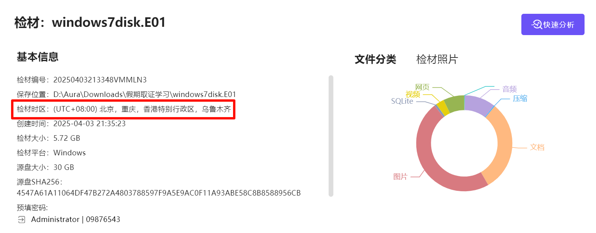

```plain
A

```

## Question 11
> 请找出操作系统中安装的浏览器“自动填充”中保存的网站密码信息（网站、用户名、密码）
>
> 格式：网站+用户名+密码
>
> 例子：[https://blog.didctf.com/+admin+admin111](https://blog.didctf.com/+admin+admin111)
>

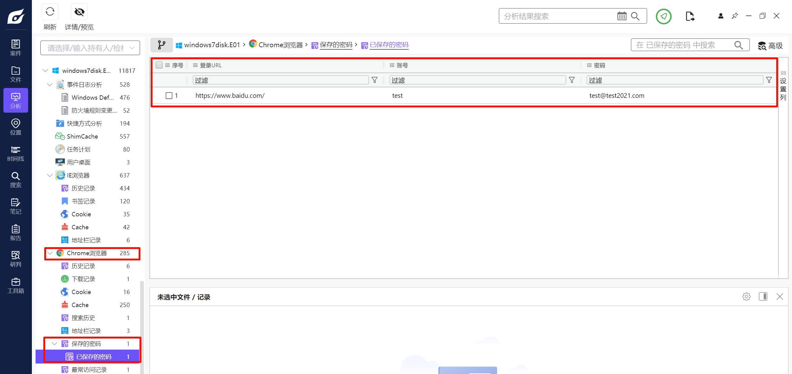

```plain
[https://www.baidu.com/](https://www.baidu.com/)+<font style="color:rgba(0, 0, 0, 0.87);">test+test@test2021.com</font>

```


## Question 12
> 请找出用户“poiuy”的SID。
>

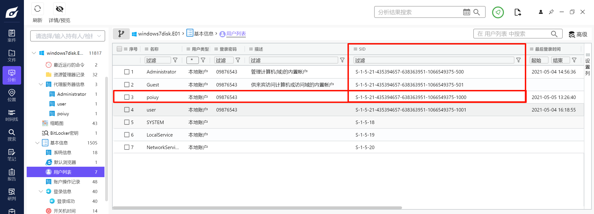

```plain
<font style="color:rgba(0, 0, 0, 0.87);">S-1-5-21-435394657-638363951-1066549375-1000</font>

```


## Question 13
> 请给出源磁盘的大小（字节）。
>

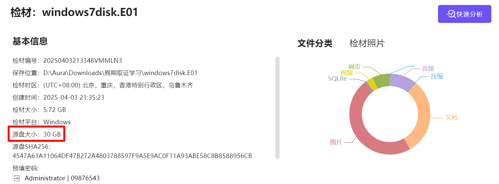

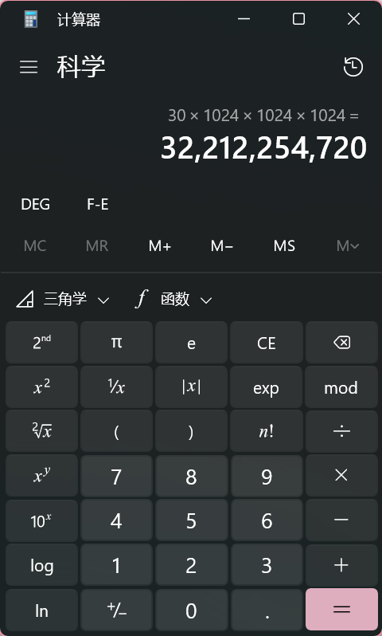

简单的换算关系。

```plain
32212254720

```


## Question 14
> 请找出各分区文件系统类型。
>

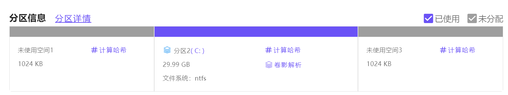

```plain
ntfs

```

## Question 15
> 请找出曾经连接到该系统的U盘的品牌、序列号、最后插拔日期。
>
> 格式：SAMSUNG+FAWC524213104FAWV146+2022-07-14
>

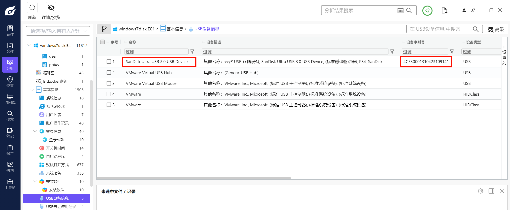

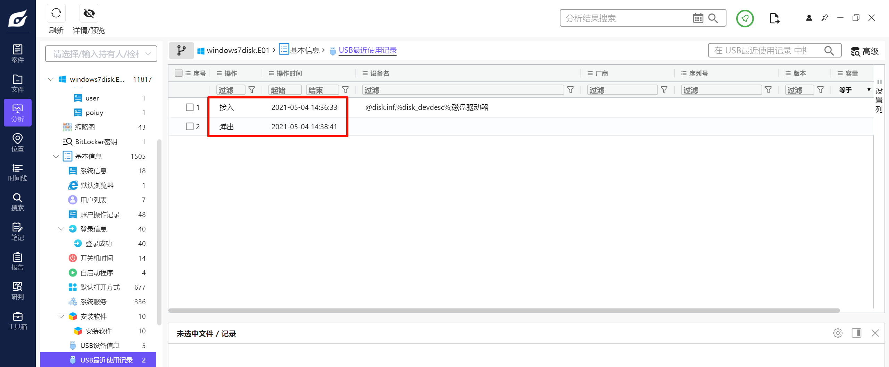

```plain
SanDisk+<font style="color:rgba(0, 0, 0, 0.87);">4C530001310423109141+2021-05-04</font>

```

## Question 16
> 请找出回收站中的文件的名称
>
> 格式：2333.exe+1.txt+3.E01
>
> 注意顺序
>

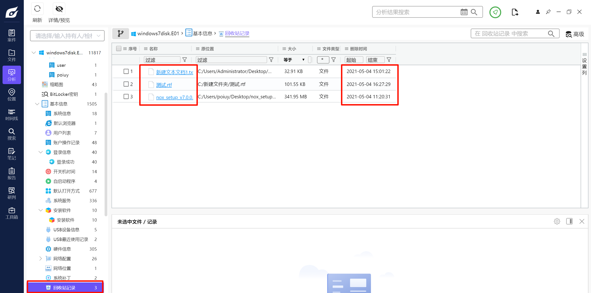

注意按照时间顺序排序。

```plain
<font style="color:rgba(0, 0, 0, 0.87);">nox_setup_v7.0.0.6_full.exe+新建文本文档1.txt+测试.rtf</font>

```

## Question 17
> 请找出使用Bitlocker加密的虚拟磁盘文件恢复密钥文件名是什么。
>

两种方法。

### 法 1
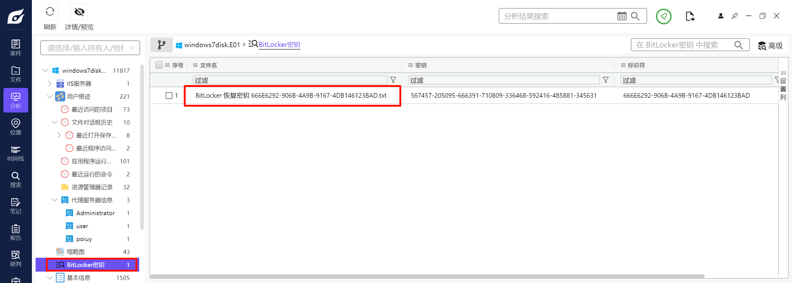

### 法 2
BitLocker 的密钥放在了 poiuy 用户的 Documents 中，可以直接找到。

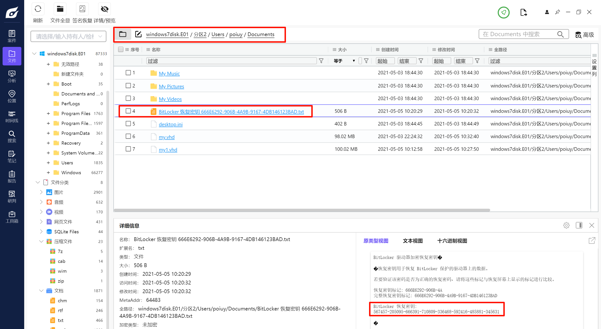

```plain
<font style="color:rgba(0, 0, 0, 0.87);">BitLocker 恢复密钥 666E6292-906B-4A9B-9167-4DB146123BAD.txt</font>

```

## <font style="color:rgba(0, 0, 0, 0.87);">Question 18</font>
> 请找出用户“poiuy”的登录密码。
>

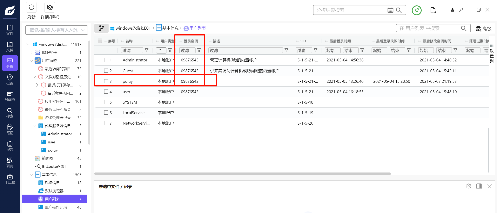

```plain
<font style="color:rgba(0, 0, 0, 0.87);">09876543</font>

```

