> 月光穿过百叶窗，在书房地板上投下斑驳光影。钟无声站在智能锁前，手指轻触屏幕，几行代码在掌中屏闪过，门锁悄然开启。
>
> 他环视书房，檀木书架堆满文件夹，落地台灯将影子拉得老长。拉开抽屉时，玉兰香从窗台飘入，混合着线香余韵。钟无声翻动文件，指尖划过烫金账本时，书房门轴发出轻微响动。
>
> 贾韦码站在门口，手中还攥着车钥匙。钟无声合上账本的动作很慢，窗外巡逻车的灯光扫过波斯地毯。当喉结在贾韦码颈间滑动时，玉兰花瓣正落在血渍边缘。
>
> 书房恢复寂静，落地灯将钟无声的影子投在紧闭的智能锁上，像一幅静止的画。
>


> 在诈骗团伙中，贾韦码和钟无声是两个核心人物。贾韦码因违反保密协议，被钟无声盯上了。一天深夜，钟无声利用智能锁的漏洞，悄无声息地潜入贾韦码家中。他四处搜寻账本，但一无所获。就在他准备离开时，贾韦码回来了。钟无声一把抓住他，逼问账本的下落。贾韦码惊恐万分，最终在威胁下说出了藏匿之处。钟无声拿到账本后，为了灭口，残忍地杀害了贾韦码。随后，他带着账本消失在夜色中，留下一个血腥的现场。
>

**挂载密钥：**

**<font style="color:rgb(49, 49, 49);background-color:rgba(255, 255, 255, 0);">VR：</font>**<font style="color:rgb(49, 49, 49);background-color:rgba(255, 255, 255, 0);">9f8L2kP7mQv3RzX1tB5n6yH4CwJp9TqEa2rF1xSbD0LcKjZ</font>

**<font style="background-color:rgba(255, 255, 255, 0);">检材：</font>**<font style="color:rgb(49, 49, 49);background-color:rgba(255, 255, 255, 0);">01tn0GdE0]BF00pT0T&f00&u0k-q0Up41UhA00N,0\-L0kRr0j-p0T&R1F&=0\Ni1GR]</font>

**<font style="color:rgb(49, 49, 49);background-color:rgba(255, 255, 255, 0);">阅读须知：</font>**

**<font style="color:rgb(49, 49, 49);background-color:rgba(255, 255, 255, 0);">[*] 标注的为“未完成”</font>**

**<font style="color:rgb(49, 49, 49);background-color:rgba(255, 255, 255, 0);">[?] 标注的为“不确定答案”</font>**

## <font style="color:#01B2BC;background-color:rgba(255, 255, 255, 0);">手机取证 Mobile Forensics</font>
### <font style="color:#AE146E;">Q</font><font style="color:#213BC0;">uestion </font><font style="color:#AE146E;">1</font>
> <font style="color:rgba(0, 0, 0, 0.85);">分析安卓手机检材，手机的IMSI是？[答案格式：660336842291717] </font>
>

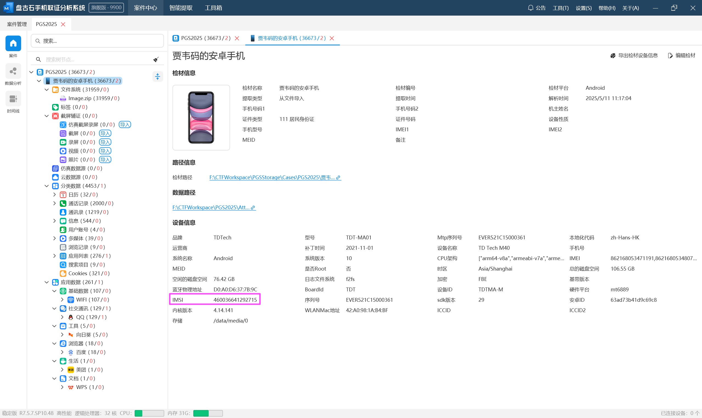

```plain
460036641292715
```

### <font style="color:#AE146E;">Q</font><font style="color:#213BC0;">uestion </font><font style="color:#AE146E;">2</font>
> <font style="color:rgba(0, 0, 0, 0.85);">养鱼诈骗投资1000，五天后收益是？[答案格式：123]</font>
>

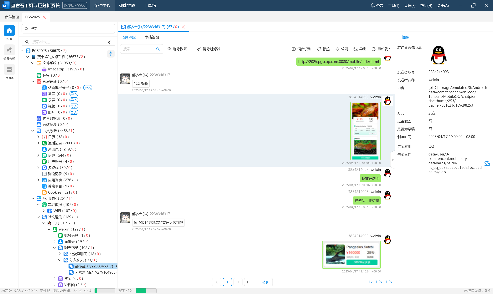

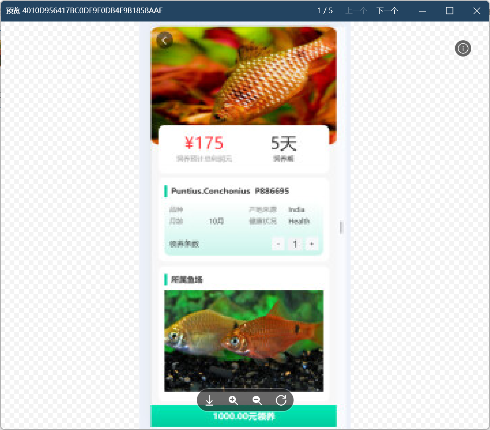

```plain
175
```

### <font style="color:#AE146E;">Q</font><font style="color:#213BC0;">uestion </font><font style="color:#AE146E;">3</font>
> <font style="color:rgba(0, 0, 0, 0.85);">分析苹果手机检材，手机的IDFA是？[答案格式：E377D1D7-BA02-4A79-BB9A-5C2DE5BD1F17]</font>
>

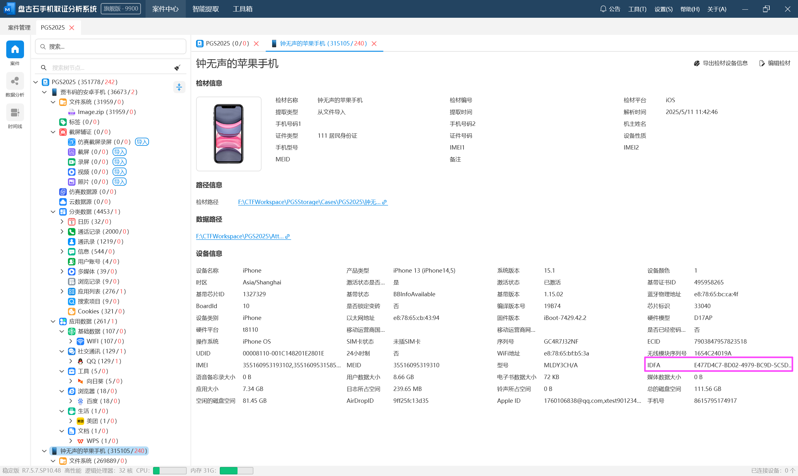

```plain
E477D4C7-BD02-4979-BC9D-5C5DE7BD1F17
```

### <font style="color:#AE146E;">Q</font><font style="color:#213BC0;">uestion </font><font style="color:#AE146E;">4</font>
> <font style="color:rgba(0, 0, 0, 0.85);">Telegram应用的卸载时间是？[答案格式：2023-01-22-17:37:50]</font>
>

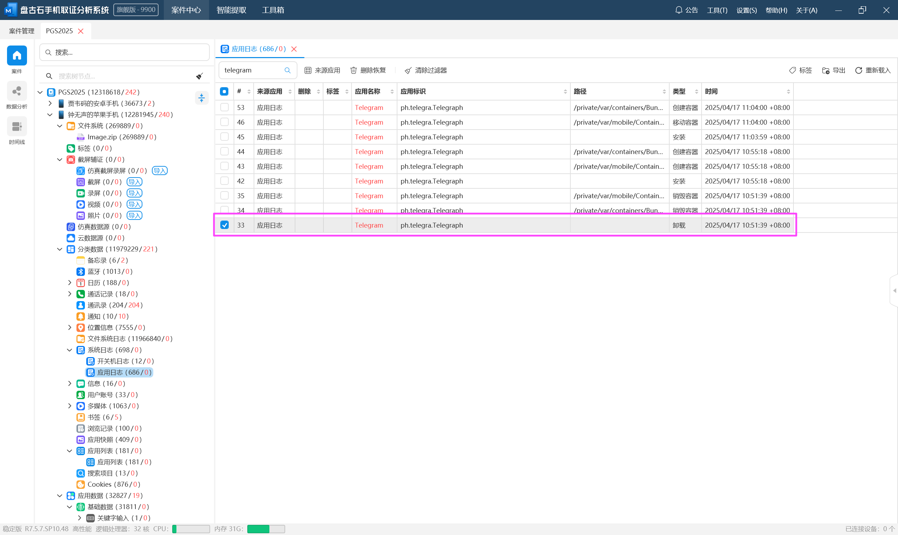

```plain
2025-04-17-10:51:39
```

### <font style="color:#AE146E;">Q</font><font style="color:#213BC0;">uestion </font><font style="color:#AE146E;">5</font>
> <font style="color:rgba(0, 0, 0, 0.85);">机主hotmail邮箱地址是？[答案格式：123345@hotmail.com]</font>
>

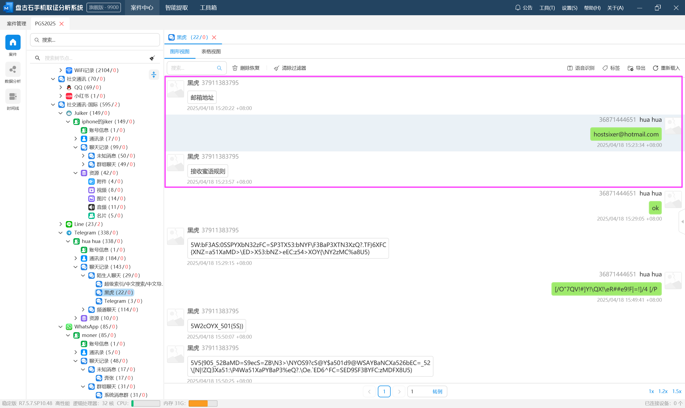

```plain
hostsixer@hotmail.com
```

### <font style="color:#AE146E;">Q</font><font style="color:#213BC0;">uestion </font><font style="color:#AE146E;">6</font>
> <font style="color:rgba(0, 0, 0, 0.85);">苹果电脑开机密码是？[答案格式：12345]</font>
>

<font style="color:rgba(0, 0, 0, 0.85);">看一眼苹果手机的截屏。</font>

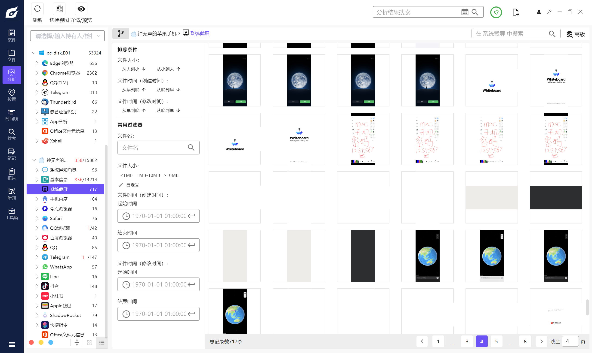

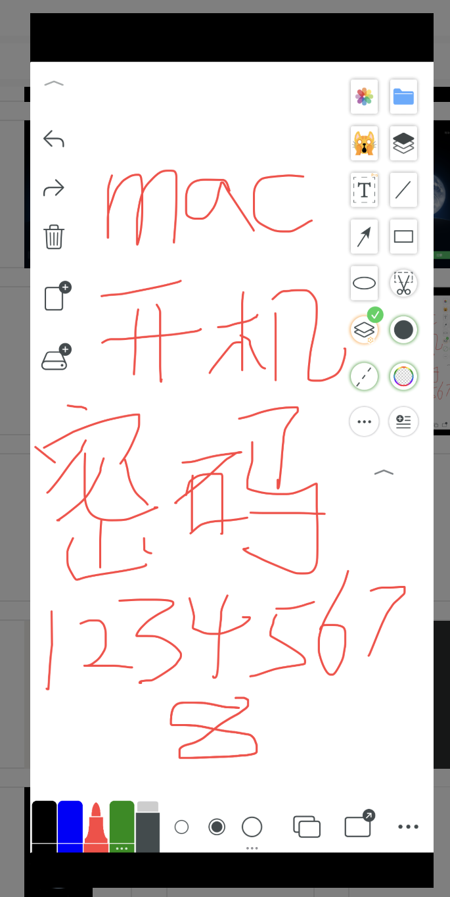

```plain
12345678
```

### <font style="color:#AE146E;">Q</font><font style="color:#213BC0;">uestion </font><font style="color:#AE146E;">7</font>
> <font style="color:rgba(0, 0, 0, 0.85);">Telegram加密通讯中，加密聊天信息用到的第二个解密载体是？[答案格式：123.zip]</font>
>

<font style="color:rgba(0, 0, 0, 0.85);">需要去看一下苹果电脑，发现蜜语规则。</font>

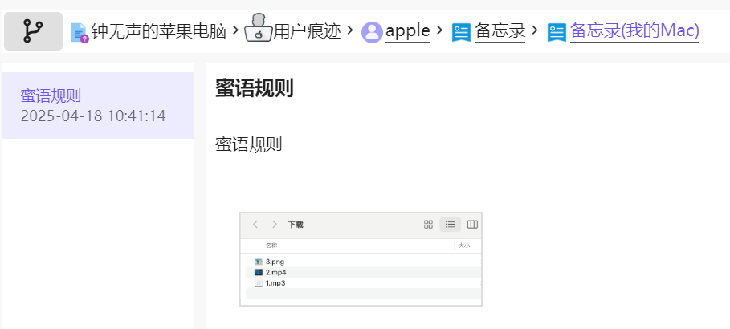

去看一下 2.mp4，发现中间有几帧弹了个图片出来，这个就是解密规则的一部分。

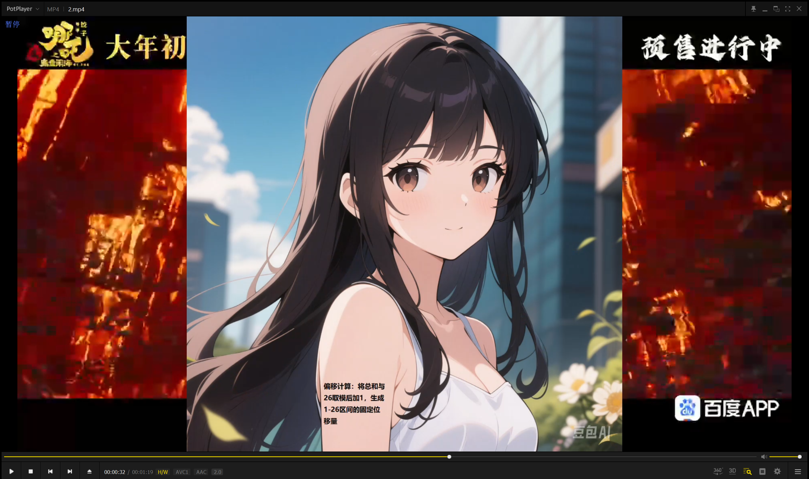

```plain
2.mp4
```

### <font style="color:#AE146E;">Q</font><font style="color:#213BC0;">uestion </font><font style="color:#AE146E;">8</font>
> <font style="color:rgba(0, 0, 0, 0.85);">贾韦码的内部代号是？[答案格式：77]</font>
>

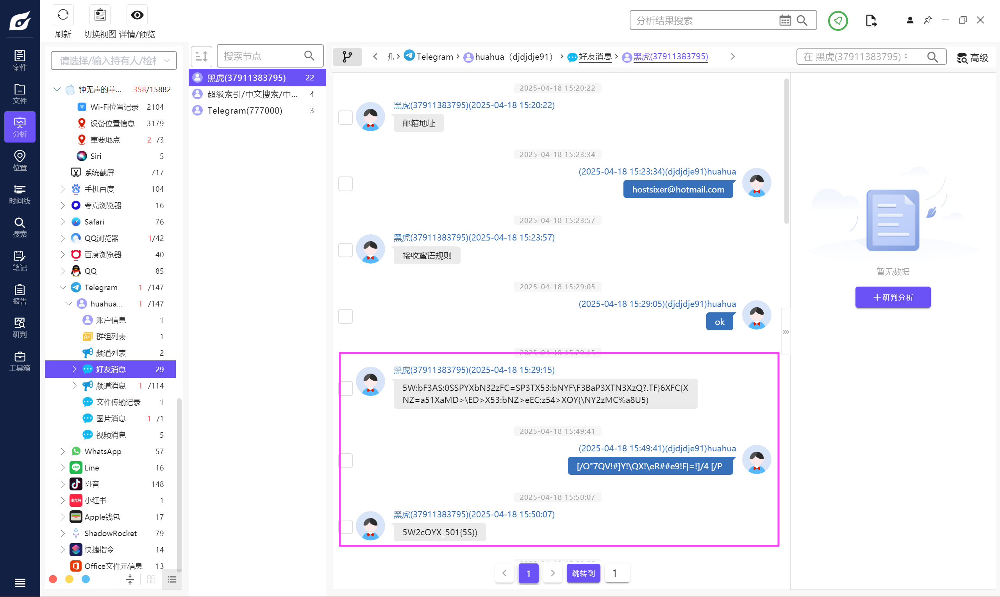

tg 的聊天似乎是某种暗号，也就是上面说的“蜜语”，可以在这个手机找到聊天话术 V2 和 V3 两个 word 文档，里面就是“蜜语”的规则，其实就是一个替换。

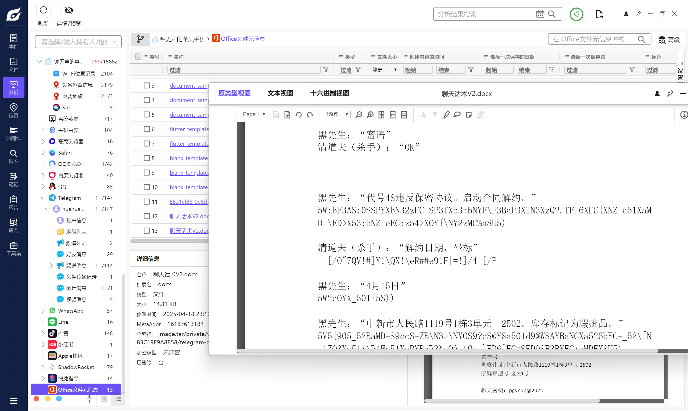

整理一下，得到解密后的聊天记录，这里为了方便看直接模拟了一下。

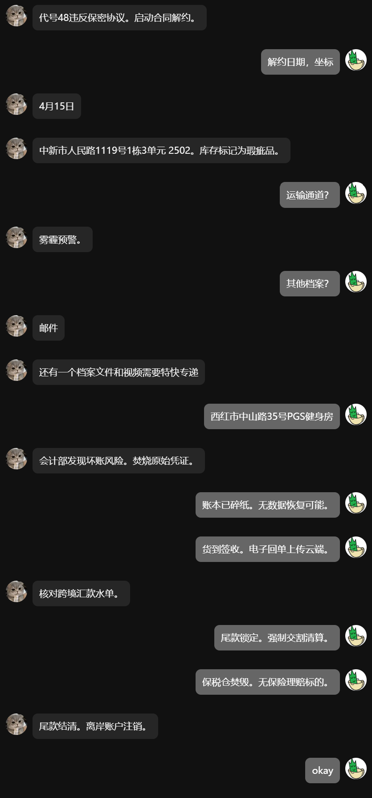

可以得知贾韦码的代号是 48。

```plain
48
```

### <font style="color:#AE146E;">Q</font><font style="color:#213BC0;">uestion </font><font style="color:#AE146E;">9</font>
> <font style="color:rgba(0, 0, 0, 0.85);">特快专递的收货地址是？[标准格式：老牛市快速路11号ADE公司]</font>
>

<font style="color:rgba(0, 0, 0, 0.85);">继续分析上述聊天记录，可以直接看到收货地址。</font>

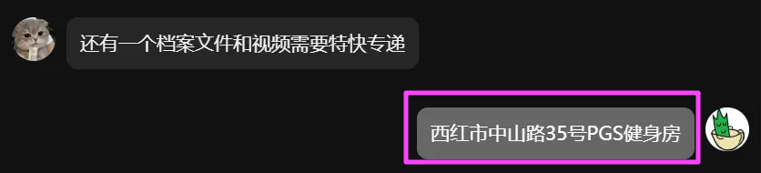

```plain
西红市中山路35号PGS健身房
```

## <font style="color:#01B2BC;background-color:rgba(255, 255, 255, 0);">APK取证 APK Forensics</font>
### <font style="color:#AE146E;">Q</font><font style="color:#213BC0;">uestion </font><font style="color:#AE146E;">1</font>
> <font style="color:rgba(0, 0, 0, 0.85);">分析安卓检材，远控工具包名是？[标准格式：com.app.cpp]</font>
>

<font style="color:rgba(0, 0, 0, 0.85);">看 QQ 聊天记录，发现一个 银联会议.apk，分析聊天记录可以得知这个就是远控工具。</font>

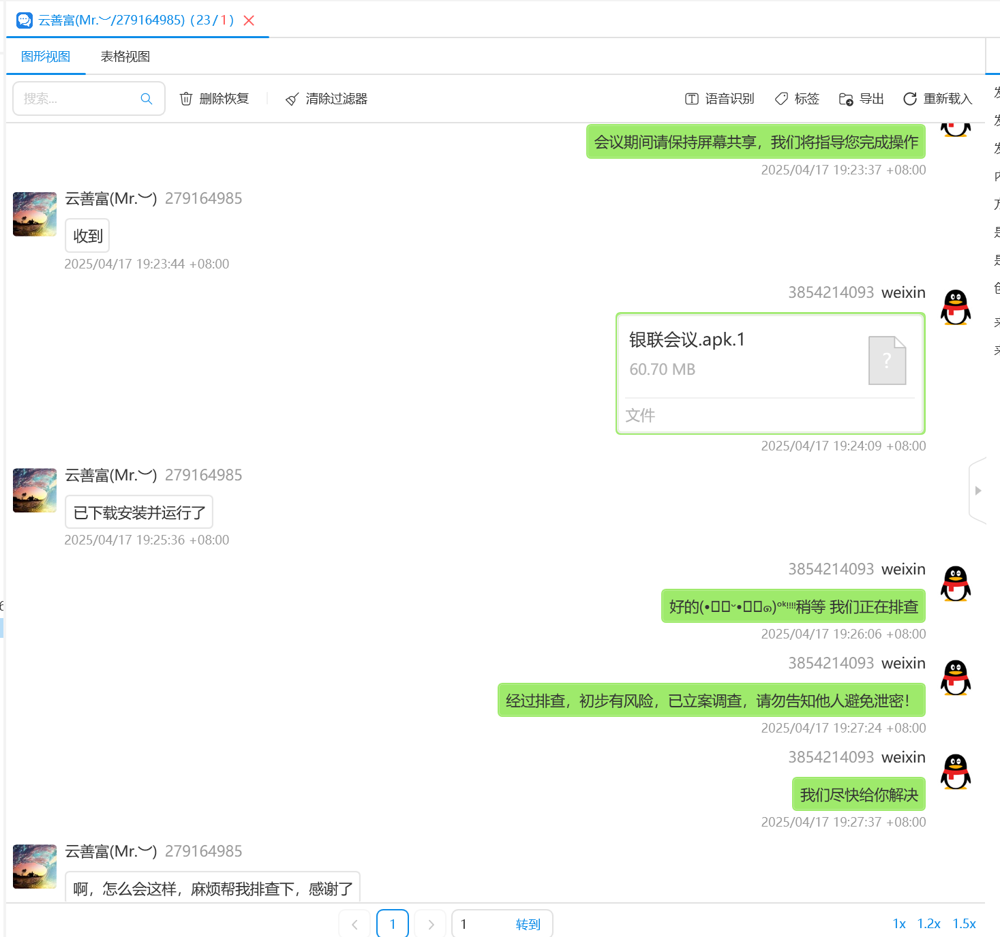

```plain
com.carriez.flutter_hbb
```

### <font style="color:#AE146E;">Q</font><font style="color:#213BC0;">uestion </font><font style="color:#AE146E;">2</font>
> <font style="color:rgba(0, 0, 0, 0.85);">远控工具中继服务器IP是？[标准格式：192.168.11.11]</font>
>

<font style="color:rgba(0, 0, 0, 0.85);">去看 </font>`<font style="color:rgba(0, 0, 0, 0.85);">/data/user/0/com.carriez.flutter_hbb</font>`<font style="color:rgba(0, 0, 0, 0.85);"> 目录，可以看到有关该工具的信息。</font>

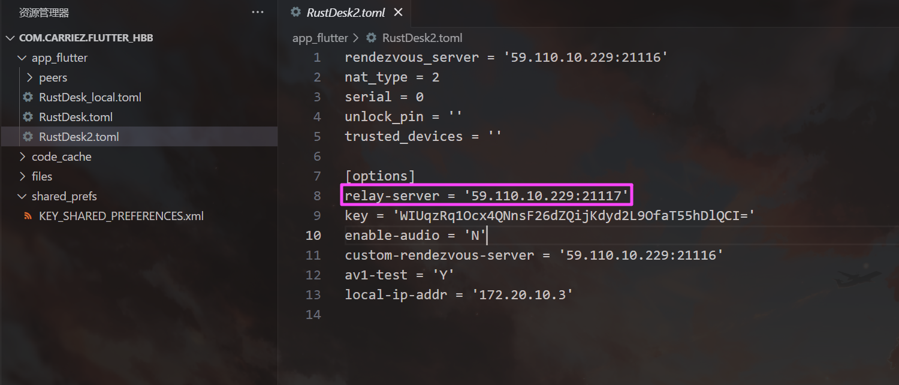

relay-server 就是我们的中转服务器。

```plain
59.110.10.229
```

### <font style="color:#AE146E;">Q</font><font style="color:#213BC0;">uestion </font><font style="color:#AE146E;">3</font>
> <font style="color:rgba(0, 0, 0, 0.85);">远控工具ID服务器端口是？[标准格式：8088]</font>
>

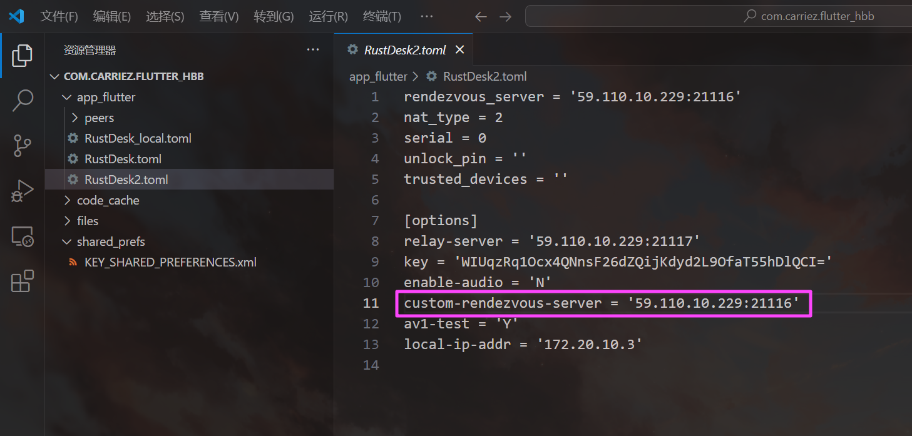

```plain
21116
```

### <font style="color:#AE146E;">Q</font><font style="color:#213BC0;">uestion </font><font style="color:#AE146E;">4</font>
> <font style="color:rgba(0, 0, 0, 0.85);">远控工具中继服务器Key是？[标准格式：HoTwGxUuV9OxSSEWRFsr1DVxQBkbbFRe0ImYMTlzyec=]</font>
>

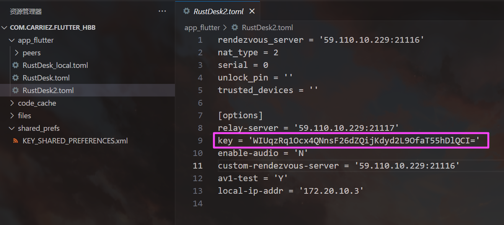

```plain
WIUqzRq1Ocx4QNnsF26dZQijKdyd2L9OfaT55hDlQCI=
```

### <font style="color:#AE146E;">Q</font><font style="color:#213BC0;">uestion </font><font style="color:#AE146E;">5</font>
> <font style="color:rgba(0, 0, 0, 0.85);">远控工具中收藏的远程ID是？[标准格式：123456]</font>
>

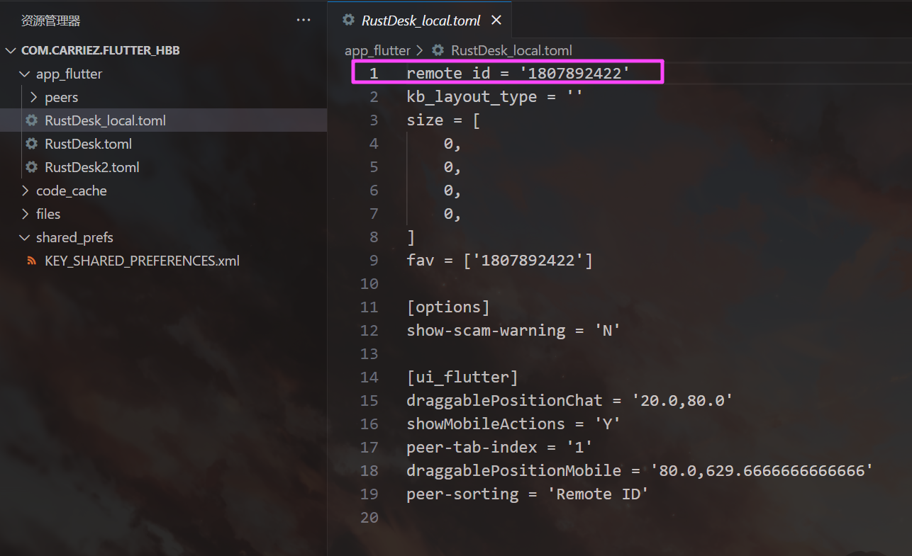

```plain
1807892422
```

### <font style="color:#AE146E;">Q</font><font style="color:#213BC0;">uestion </font><font style="color:#AE146E;">6</font>
> <font style="color:rgba(0, 0, 0, 0.85);">远程控制该手机的手机型号是？[标准格式：huawei-Hot]</font>
>

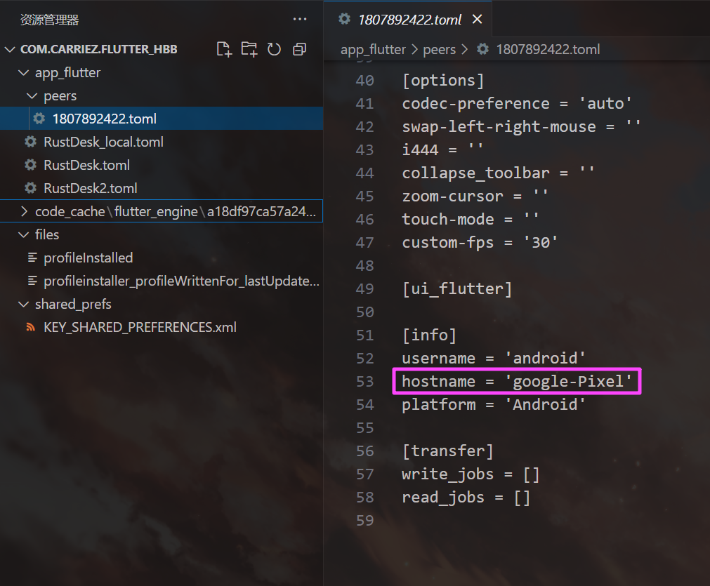

```plain
google-Pixel
```

### <font style="color:#AE146E;">Q</font><font style="color:#213BC0;">uestion </font><font style="color:#AE146E;">7</font>
> <font style="color:rgba(0, 0, 0, 0.85);">监听工具包名是？[标准格式：com.app.cpp]</font>
>

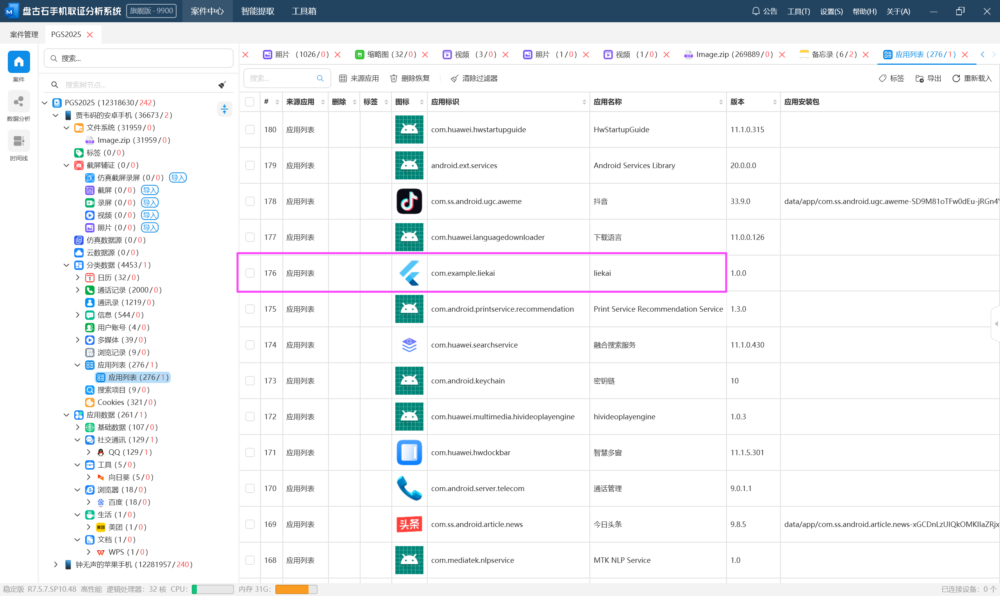

有一个可疑的应用，导出后分析就能发现这个就是监听工具。

```plain
com.example.liekai
```

### <font style="color:#AE146E;">Q</font><font style="color:#213BC0;">uestion </font><font style="color:#AE146E;">8</font>
> <font style="color:rgba(0, 0, 0, 0.85);">监听工具代码主入口是？[标准格式：com.app.cpp.MainActidddy]</font>
>

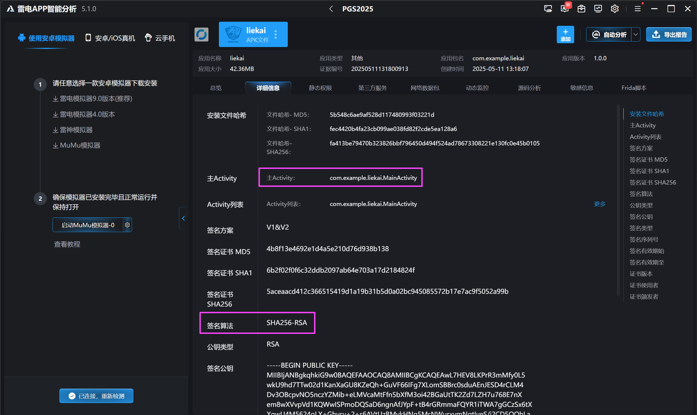

```plain
com.example.liekai.MainActivity
```

### <font style="color:#AE146E;">Q</font><font style="color:#213BC0;">uestion </font><font style="color:#AE146E;">9</font>
> <font style="color:rgba(0, 0, 0, 0.85);">监听工具的签名算法是？[标准格式：AES123RSA ]</font>
>

<font style="color:rgba(0, 0, 0, 0.85);">见上面。</font>

```plain
SHA256RSA
```

### <font style="color:#AE146E;">Q</font><font style="color:#213BC0;">uestion </font><font style="color:#AE146E;">10</font>
> <font style="color:rgba(0, 0, 0, 0.85);">监听工具运行多少秒后会跳转成黑色幕布？[标准格式：3.000]</font>
>

<font style="color:rgba(0, 0, 0, 0.85);">直接用模拟器运行，发现大约 1 秒后变成黑色幕布。</font>

```plain
1.000
```

### <font style="color:#AE146E;">Q</font><font style="color:#213BC0;">uestion </font><font style="color:#AE146E;">11</font>
> <font style="color:rgba(0, 0, 0, 0.85);">监听工具运行后，黑色幕布上字符串是？[标准格式：aes取证平台]</font>
>

<font style="color:rgba(0, 0, 0, 0.85);">需要逆向一下 flutter，先用 </font>[<font style="color:rgba(0, 0, 0, 0.85);">blutter</font>](https://github.com/worawit/blutter)<font style="color:rgba(0, 0, 0, 0.85);"> 将符号表导出来，然后用 IDA 运行一下跑出来的 addNames.py（这里建议使用 IDA9），接下来搜索 liekai，能看到里面的函数，不过在这里面找不到黑色幕布上面的字。</font>

<font style="color:rgba(0, 0, 0, 0.85);">去看一下跑出来的 asm 那个文件夹，liekai 里面有一个 screens 文件夹，里面有一个 dart 写的 black_overlay.dart，这个就是和黑色幕布相关的东西。</font>

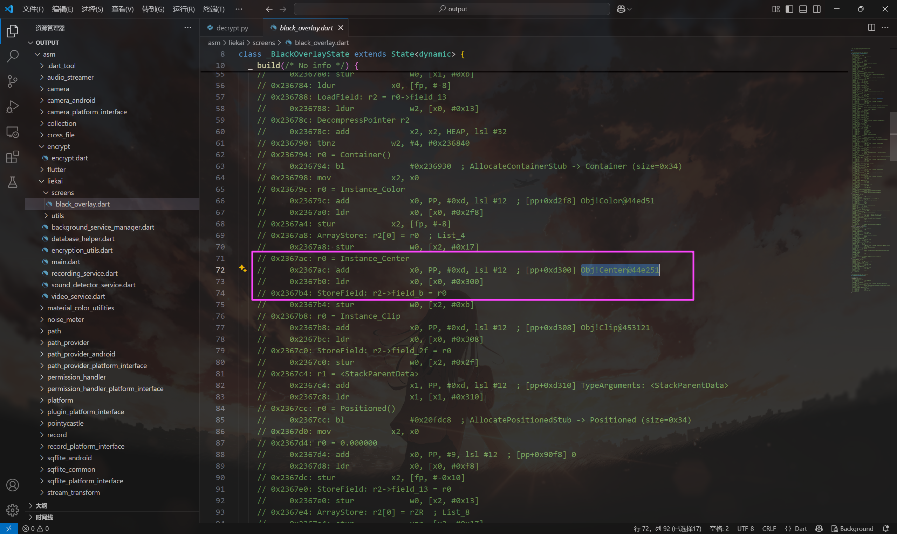

去搜一下对应的这个 Obj，能找到黑色幕布中间的字符串。

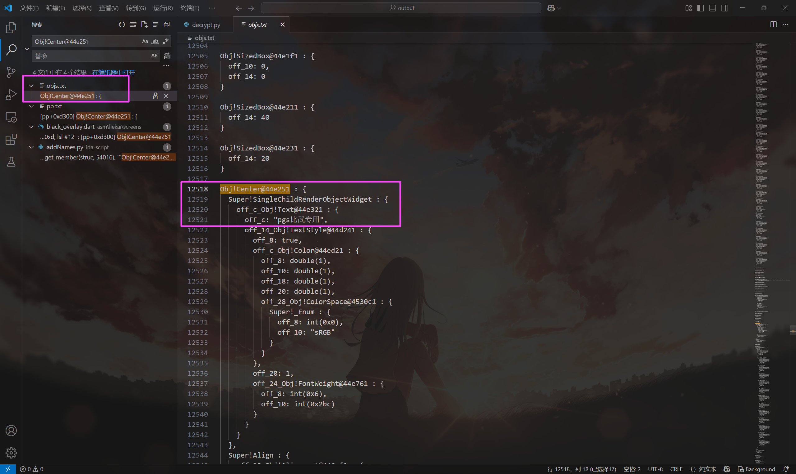

```plain
pgs比武专用
```

### <font style="color:#AE146E;">Q</font><font style="color:#213BC0;">uestion </font><font style="color:#AE146E;">12</font>
> <font style="color:rgba(0, 0, 0, 0.85);">监听工具检测到多少分贝开始录音？[标准格式：30]</font>
>

<font style="color:rgba(0, 0, 0, 0.85);">趁还没黑屏赶紧截图，能直接看到。</font>

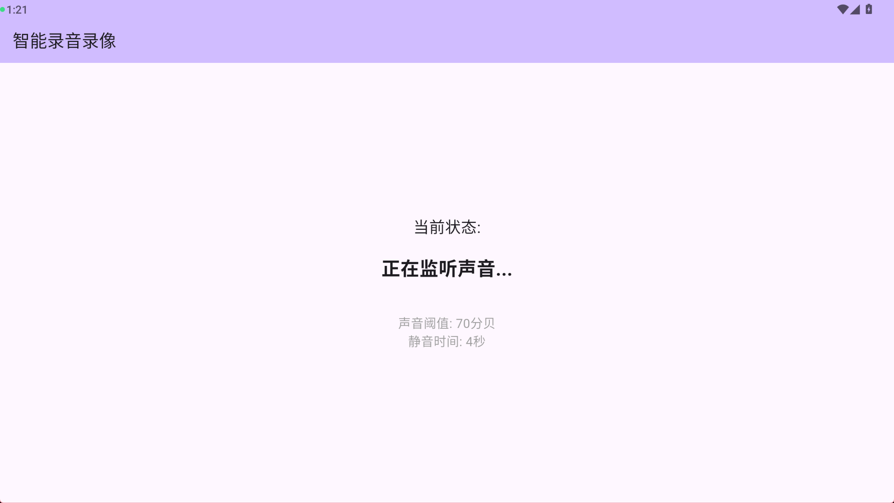

```plain
70
```

### <font style="color:#AE146E;">Q</font><font style="color:#213BC0;">uestion </font><font style="color:#AE146E;">13</font>
> <font style="color:rgba(0, 0, 0, 0.85);">监听工具录音连续几秒没有检测到声音停止录音？[标准格式：3]</font>
>

<font style="color:rgba(0, 0, 0, 0.85);">见上面。</font>

```plain
4
```

### <font style="color:#AE146E;">Q</font><font style="color:#213BC0;">uestion </font><font style="color:#AE146E;">14</font>
> <font style="color:rgba(0, 0, 0, 0.85);">监听工具保存文件存储路径的数据库名称是？[标准格式：sqlite.db]</font>
>

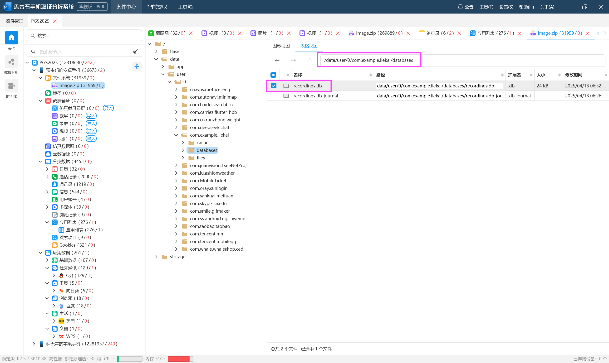

```plain
recordings.db
```

### <font style="color:#AE146E;">Q</font><font style="color:#213BC0;">uestion </font><font style="color:#AE146E;">15</font>
> <font style="color:rgba(0, 0, 0, 0.85);">监听工具保存录像文件的文件夹是？[标准格式：file]</font>
>

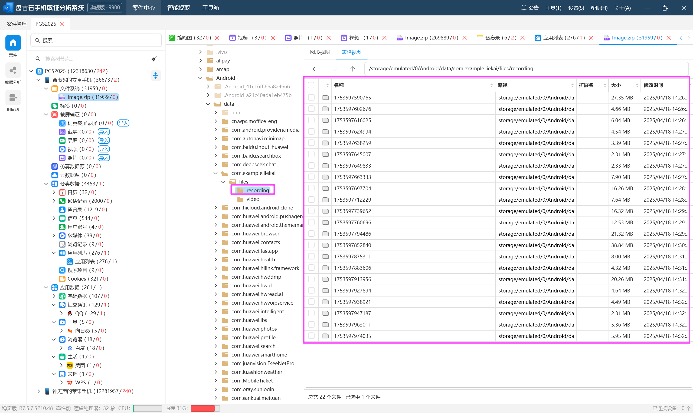

```plain
recording
```

### <font style="color:#AE146E;">Q</font><font style="color:#213BC0;">uestion </font><font style="color:#AE146E;">16</font>
> <font style="color:rgba(0, 0, 0, 0.85);">监听工具数据库中保存音视频文件的路径使用什么加密？[标准格式：Rsa]</font>
>

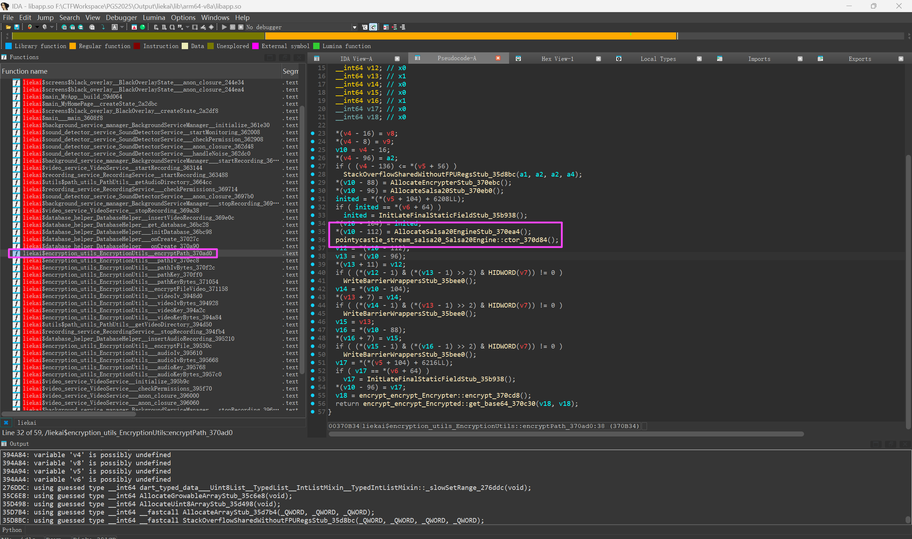

```plain
Salsa20
```

### <font style="color:#AE146E;">Q</font><font style="color:#213BC0;">uestion </font><font style="color:#AE146E;">17</font>
> <font style="color:rgba(0, 0, 0, 0.85);">录音的文件采用什么加密方式？[标准格式：RC4-123]</font>
>

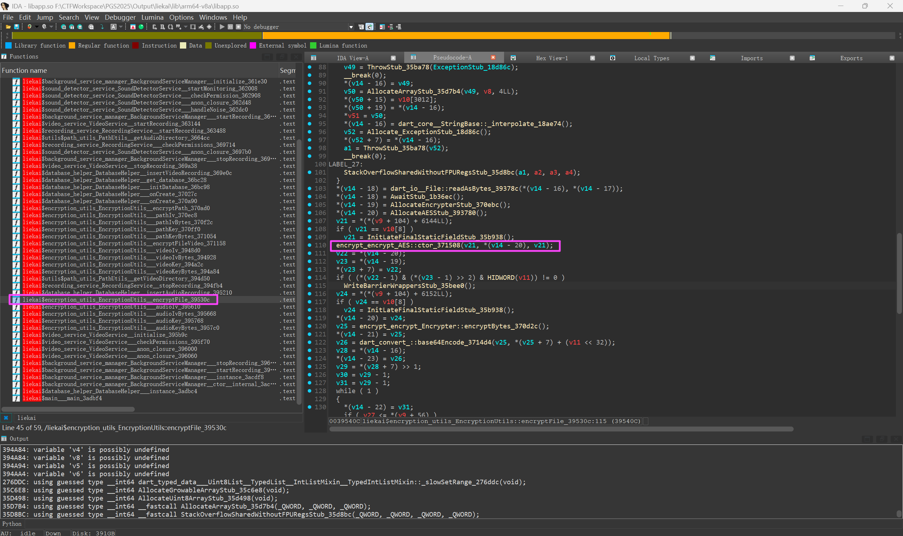

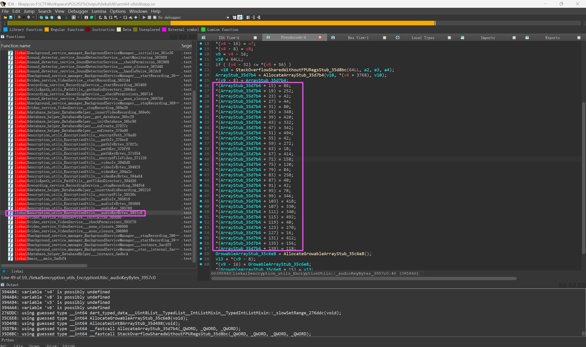

密钥长度是 32，说明这是 AES-256。

```plain
AES-256
```

### <font style="color:#AE146E;">Q</font><font style="color:#213BC0;">uestion </font><font style="color:#AE146E;">18</font>
> <font style="color:rgba(0, 0, 0, 0.85);">录像文件加密秘钥的最后一位是？[标准格式：0x6A]</font>
>

**感谢川佬提供的思路**

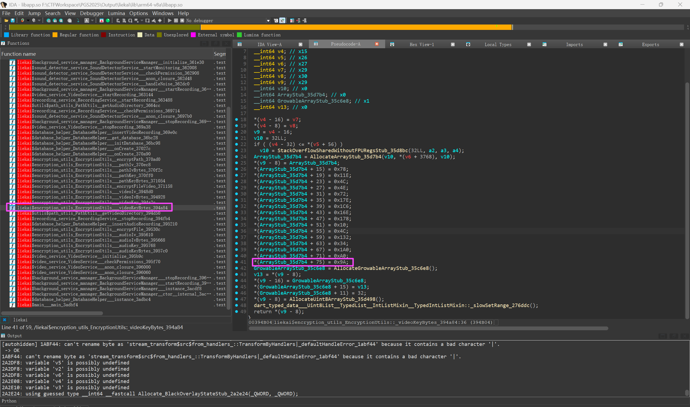

注意这个并不是最终的密钥，每个数需要按位右移一位，也就是除以 2，IV 同理

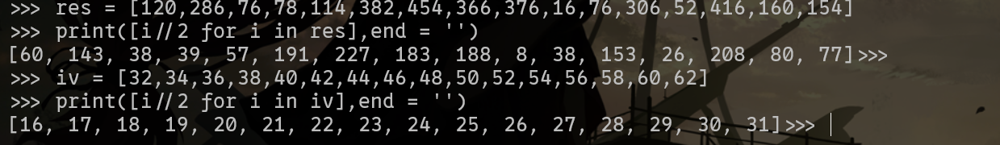

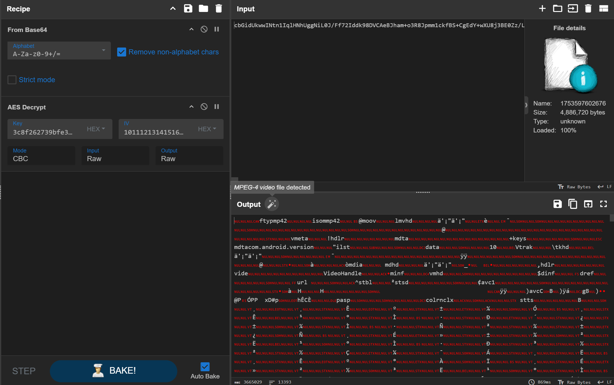

最终视频的密钥和 IV 分别是 `3c8f262739bfe3b7bc0826991ad0504d` 和 `101112131415161718191a1b1c1d1e1f`。

```plain
0x4D
```

### <font style="color:#AE146E;">Q</font><font style="color:#213BC0;">uestion </font><font style="color:#AE146E;">19</font>
> <font style="color:rgba(0, 0, 0, 0.85);">原始文件md5为3b4d****55ae的创建时间是？[标准格式：2024-2-14-16:32:8]</font>
>

<font style="color:rgba(0, 0, 0, 0.85);">这个文件在加密的 video 文件夹里面，也就是保存的录音。</font>

<font style="color:rgba(0, 0, 0, 0.85);">解密录音和上面的思路一样，key 和 IV 都要右移一位，下面是提取出来的 key 和 IV：</font>

`<font style="color:#000000;">key:2b7e151628aed2a6abf7158809cf4f3c2a7d141527add1a5aaf6148708ce4e3b</font>`

`<font style="color:#000000;">IV:000102030405060708090a0b0c0d0e0f</font>`

<font style="color:rgba(0, 0, 0, 0.85);">注意解密的时候选择 NoPadding，不然哈希对不上。</font>


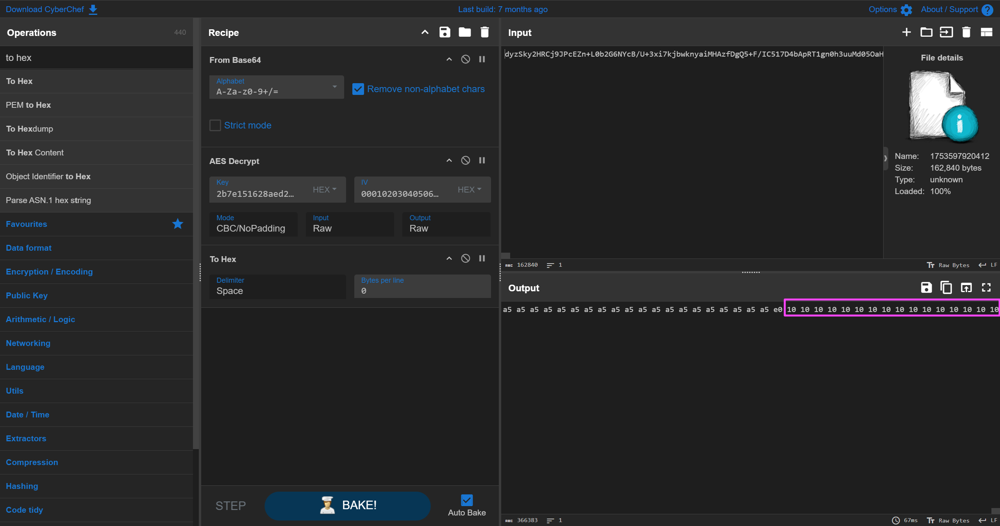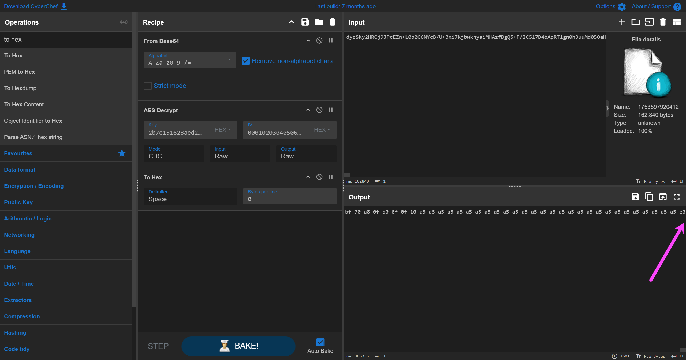

这里应该是出题人的问题，谁解密这玩意选 NoPadding 啊。

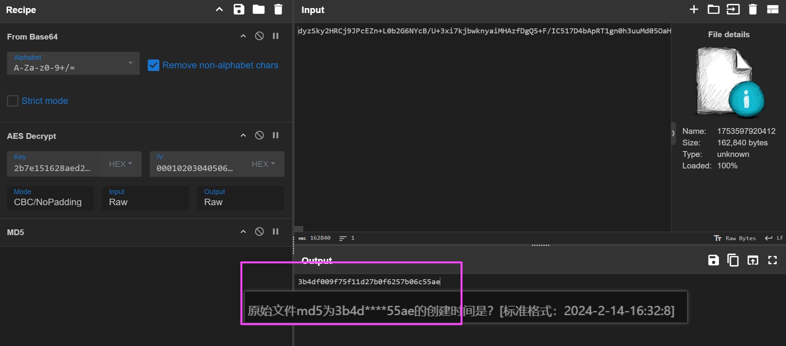

有点抽象。

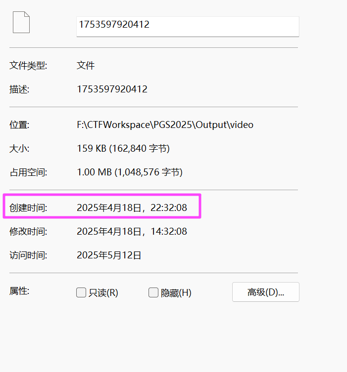

```plain
2025-4-18-22:32:8
```

## <font style="color:#01B2BC;">计算机取证 Computer Forensics</font>
### <font style="color:#AE146E;">Q</font><font style="color:#213BC0;">uestion </font><font style="color:#AE146E;">1</font>
> <font style="color:rgba(0, 0, 0, 0.85);">分析贾韦码计算机检材，计算机系统Build版本为？[标准格式：19000]</font>
>

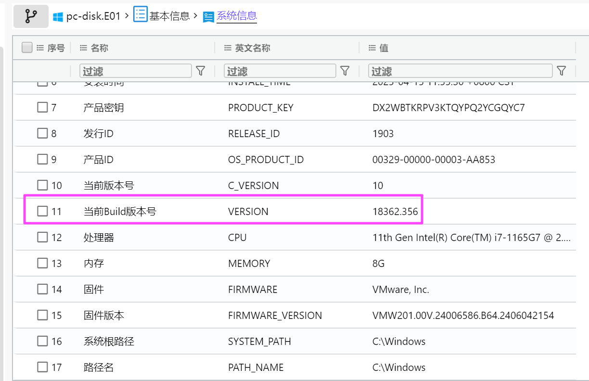

```plain
18362
```

### <font style="color:#AE146E;">Q</font><font style="color:#213BC0;">uestion </font><font style="color:#AE146E;">2</font>
> <font style="color:rgba(0, 0, 0, 0.85);">计算机最后一次正常关机的时间为？UTC +0 [标准格式：2025-05-06 09:00:00]</font>
>

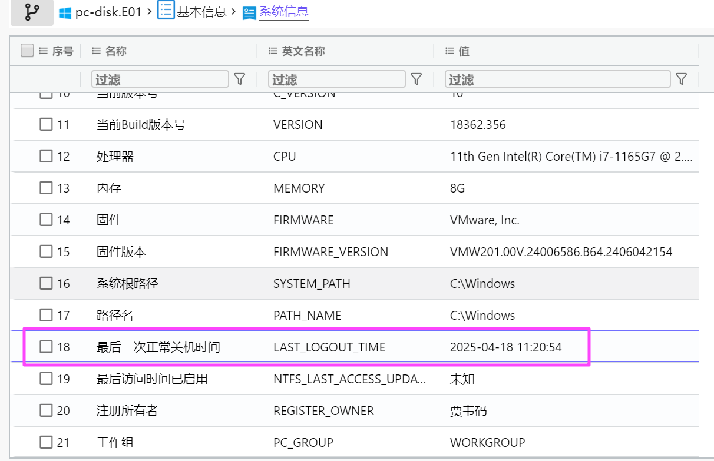

注意检材的时区是 UTC+8，答案要求 UTC+0，需要减去 8 小时。

```plain
2025-04-18 03:20:54
```

### <font style="color:#AE146E;">Q</font><font style="color:#213BC0;">uestion </font><font style="color:#AE146E;">3</font>
> <font style="color:rgba(0, 0, 0, 0.85);">计算机网卡的MAC地址为？[标准格式：00-0B-00-A0-00-00]</font>
>

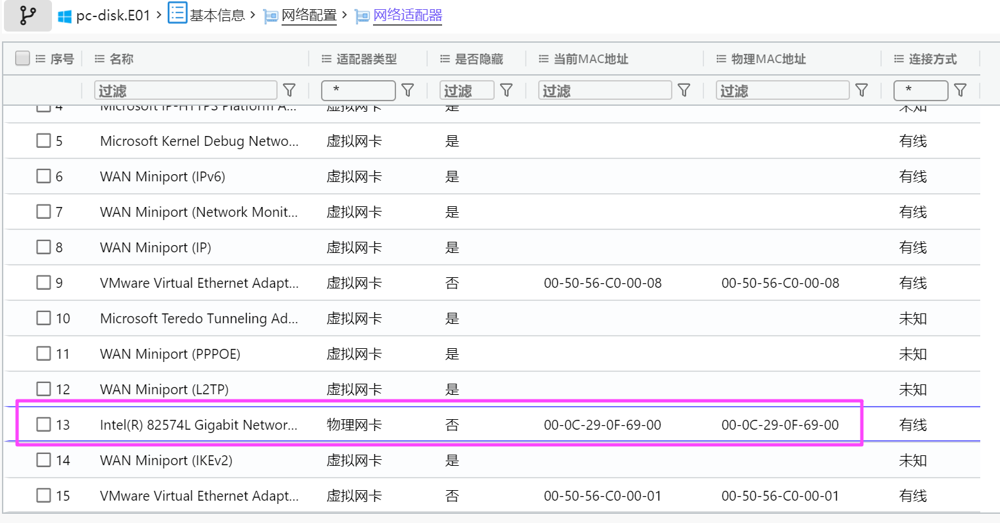

```plain
00-0C-29-0F-69-00
```

### <font style="color:#AE146E;">Q</font><font style="color:#213BC0;">uestion </font><font style="color:#AE146E;">4</font>
> <font style="color:rgba(0, 0, 0, 0.85);">计算机用户“贾韦码” 安全标识符SID为？[标准格式：S-X-X-X-X-X-X-X]</font>
>

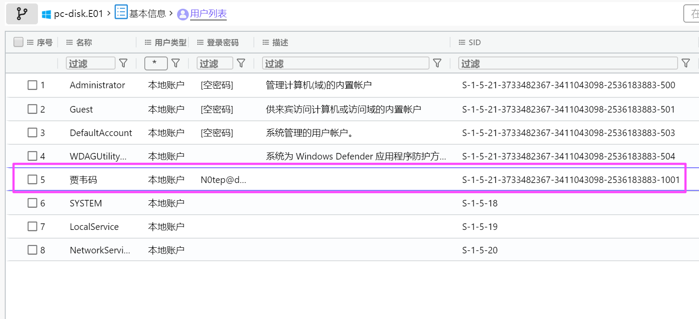

```plain
 S-1-5-21-3733482367-3411043098-2536183883-1001
```

### <font style="color:#AE146E;">Q</font><font style="color:#213BC0;">uestion </font><font style="color:#AE146E;">5</font>
> <font style="color:rgba(0, 0, 0, 0.85);">计算机默认浏览器为？[标准格式：Mozilla Firefox]</font>
>

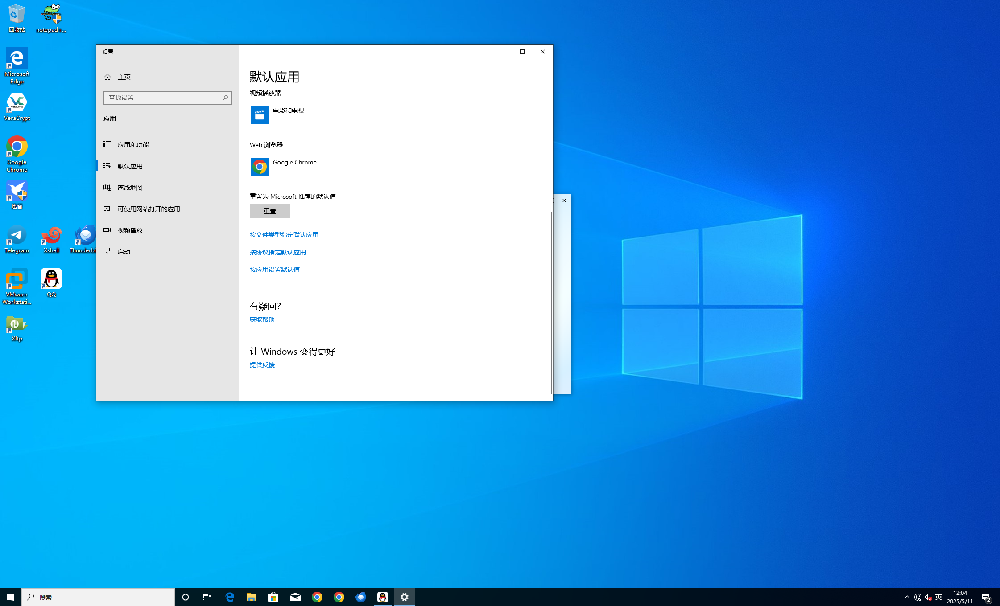

```plain
Google Chrome
```

### <font style="color:#AE146E;">Q</font><font style="color:#213BC0;">uestion </font><font style="color:#AE146E;">6</font>
> <font style="color:rgba(0, 0, 0, 0.85);">计算机默认浏览器版本为？[标准格式：000.0.0000.00]</font>
>

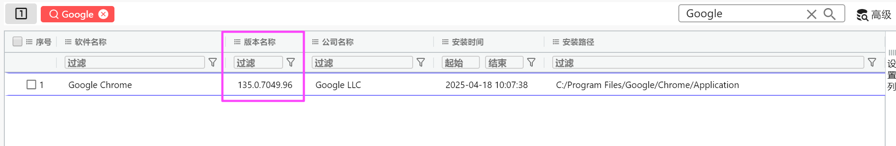

```plain
135.0.7049.96
```

### <font style="color:#AE146E;">Q</font><font style="color:#213BC0;">uestion </font><font style="color:#AE146E;">7</font>
> <font style="color:rgba(0, 0, 0, 0.85);">机主通过浏览器搜索国外社交软件为？[标准格式：Whatsapp]</font>
>

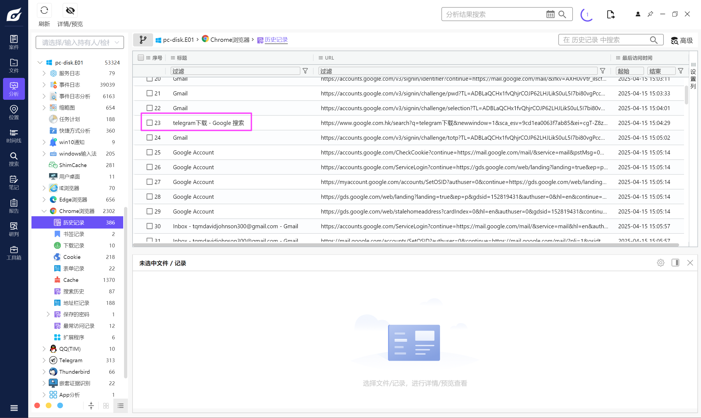

```plain
Telegram
```

### <font style="color:#AE146E;">Q</font><font style="color:#213BC0;">uestion </font><font style="color:#AE146E;">8</font>
> <font style="color:rgba(0, 0, 0, 0.85);">机主的邮箱账号为？[标准格式：pgscup@pgs.com]</font>
>

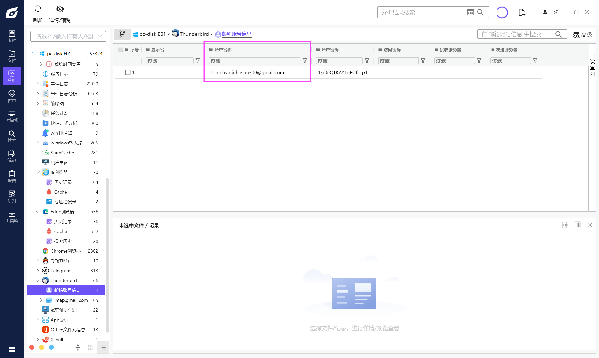

```plain
 tqmdavidjohnson300@gmail.com
```

### <font style="color:#AE146E;">Q</font><font style="color:#213BC0;">uestion </font><font style="color:#AE146E;">9</font>
> <font style="color:rgba(0, 0, 0, 0.85);">计算机装过一款反取证软件为？[标准格式：EnCrypt.exe]</font>
>

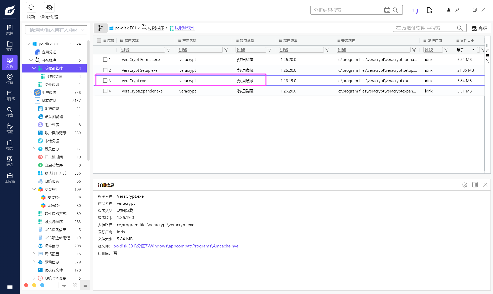

```plain
VeraCrypt.exe
```

### <font style="color:#AE146E;">Q</font><font style="color:#213BC0;">uestion </font><font style="color:#AE146E;">10</font>
> <font style="color:rgba(0, 0, 0, 0.85);">计算机通过Xshell远程连接的ip地址为？[标准格式：127.0.0.1]</font>
>

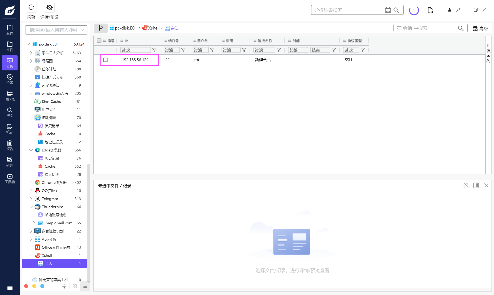

```plain
192.168.56.129
```

### <font style="color:#AE146E;">Q</font><font style="color:#213BC0;">uestion </font><font style="color:#AE146E;">11</font>
> <font style="color:rgba(0, 0, 0, 0.85);">机主曾买过一个美国的TG账号，请给该账号的原两步验证密码？[标准格式：8位数字]</font>
>

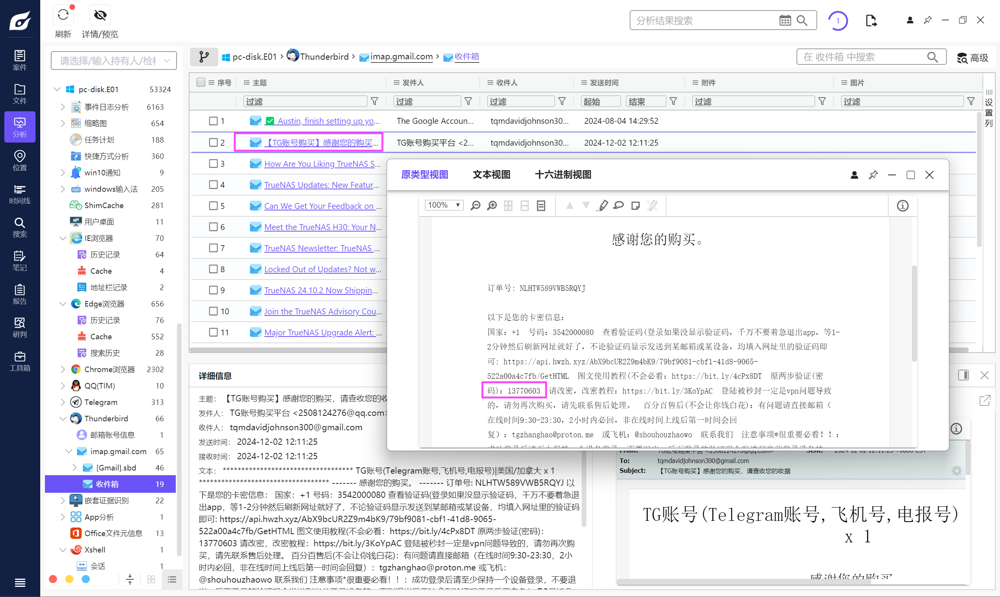

```plain
13770603
```

### <font style="color:#AE146E;">Q</font><font style="color:#213BC0;">uestion </font><font style="color:#AE146E;">12</font>
> <font style="color:rgba(0, 0, 0, 0.85);">给出其电脑内加密容器的解密密码？[标准格式：Abc@123]</font>
>

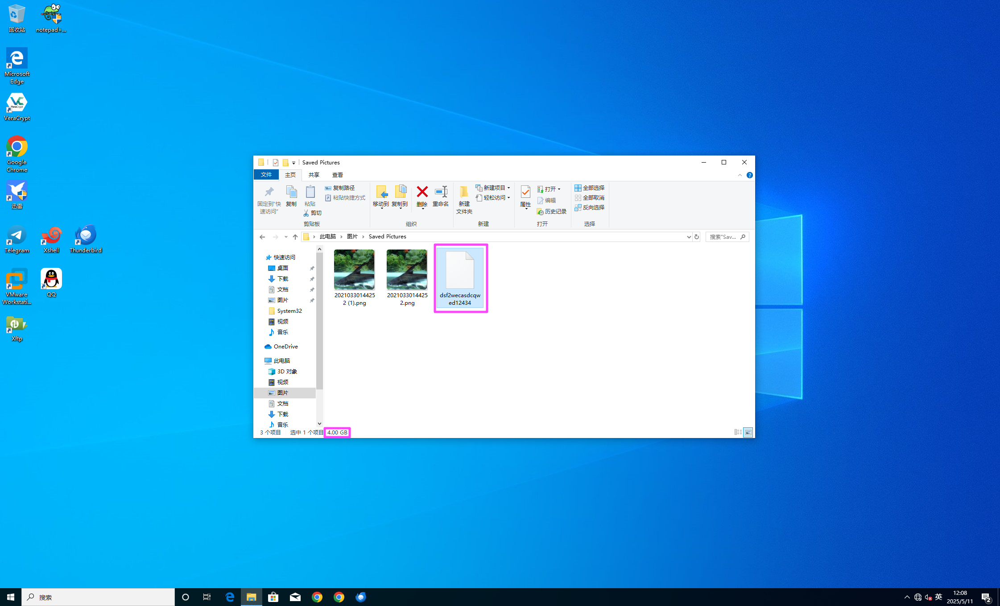

保存的图片里面有一个加密容器，但是不知道密码。

其实，密码在 VR 案情里面，卧室里面有一个暗门，可以直接拿到密码。

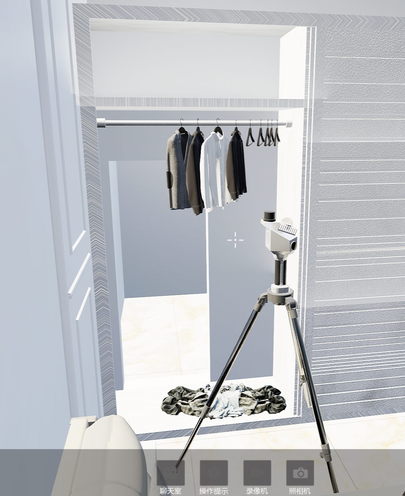


直接用 Passware 去爆密码即可。


```plain
Pgs8521d3j
```

### <font style="color:#AE146E;">Q</font><font style="color:#213BC0;">uestion </font><font style="color:#AE146E;">13</font>
> <font style="color:rgba(0, 0, 0, 0.85);">给出其电脑内加密容器挂载的盘符？[标准格式：C]</font>
>


看一下用户的访问记录，发现有个 F 盘，就是这个挂载的盘符。

```plain
F
```

### <font style="color:#AE146E;">Q</font><font style="color:#213BC0;">uestion </font><font style="color:#AE146E;">14</font>
> <font style="color:rgba(0, 0, 0, 0.85);">给出其电脑内存放了多少张伪造身份证？[标准格式：10]</font>
>

<font style="color:rgba(0, 0, 0, 0.85);">挂载刚才的加密容器，里面都是身份证，一共 1023 张。（注意最后那个是个 Excel 文档不是伪造身份证）</font>


```plain
1023
```

### <font style="color:#AE146E;">Q</font><font style="color:#213BC0;">uestion </font><font style="color:#AE146E;">15</font>
> <font style="color:rgba(0, 0, 0, 0.85);">找出任敏的身份证编号？[标准格式：18位]</font>
>


```plain
430529195112085460
```

### <font style="color:#AE146E;">Q</font><font style="color:#213BC0;">uestion </font><font style="color:#AE146E;">16</font>
> <font style="color:rgba(0, 0, 0, 0.85);">找出其电脑内存放的密钥文件，计算其MD5? [标准格式：字母小写]</font>
>


有个 3pgscup.rar，没找到文件在哪。


无，直接 xwf 爆搜 rar 文件头 `52 61 72 21 1a 07 01 00`。


```plain
1022cc083a4a5a9e2036065e2822c48e
```

### <font style="color:#AE146E;">Q</font><font style="color:#213BC0;">uestion </font><font style="color:#AE146E;">17</font>
> <font style="color:rgba(0, 0, 0, 0.85);">找出其电脑内存放的密钥文件，解密此密钥文件，给出其内容？[标准格式：第3届pgscup]</font>
>

<font style="color:rgba(0, 0, 0, 0.85);">密钥的内容解 Base64。</font>


```plain
zfs加密pool密钥文件
```

### <font style="color:#AE146E;">Q</font><font style="color:#213BC0;">uestion </font><font style="color:#AE146E;">18 [?]</font>
> <font style="color:rgba(0, 0, 0, 0.85);">对macOS系统进行解析，登陆的电子邮件服务是谁提供的？[标准格式:pgscup]</font>
>


```plain
Outlook
```

### <font style="color:#AE146E;">Q</font><font style="color:#213BC0;">uestion </font><font style="color:#AE146E;">19</font>
> <font style="color:rgba(0, 0, 0, 0.85);">系统备忘录的包名是什么？[标准格式:com.dfefef.note]</font>
>


```plain
com.apple.Notes
```

### <font style="color:#AE146E;">Q</font><font style="color:#213BC0;">uestion </font><font style="color:#AE146E;">20</font>
> <font style="color:rgba(0, 0, 0, 0.85);">图片中隐藏的内容是什么？[标准格式：隐藏内容 厨子戏子痞子]</font>
>

<font style="color:rgba(0, 0, 0, 0.85);">之前找到过，就是蜜语规则那三个文件，其中有一个图片。</font>


Red plane 0 通道有一个二维码，扫出来就是隐藏的内容。


```plain
位移加密 正向位移操作
```

### <font style="color:#AE146E;">Q</font><font style="color:#213BC0;">uestion </font><font style="color:#AE146E;">21</font>
> <font style="color:rgba(0, 0, 0, 0.85);">被加密文件的扩展名是什么？[标准格式：123]</font>
>

<font style="color:rgba(0, 0, 0, 0.85);">💡</font><font style="color:rgba(0, 0, 0, 0.85);">阅读此处前，可以先去看一下后面的苹果应用取证</font><font style="color:rgba(0, 0, 0, 0.85);">💡</font>


```plain
enc
```

### <font style="color:#AE146E;">Q</font><font style="color:#213BC0;">uestion </font><font style="color:#AE146E;">22</font>
> <font style="color:rgba(0, 0, 0, 0.85);">被加密的文件总共有几个？[标准格式：5]</font>
>


只有电脑桌面上这一个。

```plain
1
```

### <font style="color:#AE146E;">Q</font><font style="color:#213BC0;">uestion </font><font style="color:#AE146E;">23</font>
> <font style="color:rgba(0, 0, 0, 0.85);">贾韦码家使用的智能门锁品牌型号是什么？[标准格式：小米X号]</font>
>

<font style="color:rgba(0, 0, 0, 0.85);">💡</font><font style="color:rgba(0, 0, 0, 0.85);">阅读此处前，可以先去看一下后面的苹果应用取证</font><font style="color:rgba(0, 0, 0, 0.85);">💡</font>

<font style="color:rgba(0, 0, 0, 0.85);">解密苹果电脑的 </font>`<font style="color:rgba(0, 0, 0, 0.85);">贾韦码资料.rar.enc</font>`<font style="color:rgba(0, 0, 0, 0.85);">。</font>

<font style="color:rgba(0, 0, 0, 0.85);">我们之前逆向了那个程序，其实就是一个 AES-CBC，密钥都是固定的，加密的时候让他输出一下密钥取出来，IV 是文件的前 16 个字节，直接解密。</font>


解压出来一个 face1.jpg 和 资料.docx，这个 face1.jpg 和后面的冰箱有关，另一个资料.docx里面存了贾韦码的一些信息，门锁信息就在其中。


```plain
金刚Ⅲ号
```

## <font style="color:#01B2BC;">EXE取证 PE Binary Forensics</font>
### <font style="color:#AE146E;">Q</font><font style="color:#213BC0;">uestion </font><font style="color:#AE146E;">1</font>
> <font style="color:rgba(0, 0, 0, 0.85);">分析Windows木马，其控制端ip是？[标准格式：192.168.1.11]</font>
>

<font style="color:rgba(0, 0, 0, 0.85);">刚开机 Windows Defender 就行动了，可以直接定位到木马。</font>


```plain
104.18.45.79
```

### <font style="color:#AE146E;">Q</font><font style="color:#213BC0;">uestion </font><font style="color:#AE146E;">2</font>
> <font style="color:rgba(0, 0, 0, 0.85);">软件会复制自身到哪个文件夹下？[标准格式：DaTa]</font>
>


```plain
SubDir
```

### <font style="color:#AE146E;">Q</font><font style="color:#213BC0;">uestion </font><font style="color:#AE146E;">3</font>
> <font style="color:rgba(0, 0, 0, 0.85);">接上题，复制后软件名称是？[标准格式：AppTmp.exe]</font>
>

<font style="color:rgba(0, 0, 0, 0.85);">见上面。</font>

```plain
BwAcr.exe
```

### <font style="color:#AE146E;">Q</font><font style="color:#213BC0;">uestion </font><font style="color:#AE146E;">4</font>
> <font style="color:rgba(0, 0, 0, 0.85);">软件一共可以窃取多少种浏览器的信息？[标准格式：3]</font>
>


.NET 写的，用 dnSpy 去看。

有疑似获取账户和密码的操作，这几个里面有几个是浏览器。


交叉引用一下里面的 ReadAccounts，用到他的浏览器有 Firefox, Edge, Yandex, Opera, Google Chrome, OperaGX, Brave, IE 一共 8 个，剩下两个是 FileZilla 和 winscp，和这个题没关系。


```plain
8
```

### <font style="color:#AE146E;">Q</font><font style="color:#213BC0;">uestion </font><font style="color:#AE146E;">5 [*]</font>
> <font style="color:rgba(0, 0, 0, 0.85);">软件查询安装的杀毒软件出错或异常会返回什么字符串？[标准格式：Apps]</font>
>

<font style="color:rgba(0, 0, 0, 0.85);"></font>

## <font style="color:#01B2BC;">苹果应用取证 macOS Apps Forensics</font>
### <font style="color:#AE146E;">Q</font><font style="color:#213BC0;">uestion </font><font style="color:#AE146E;">1</font>
> <font style="color:rgba(0, 0, 0, 0.85);">对mac电脑中的加密程序进行分析，使用了一个特定的数作为密钥生成的种子，请问这个数是什么？[标准格式：1234]</font>
>


加密程序在苹果电脑的桌面，拷出来逆向一下。


直接运行会报错，找不到这个 encrypt_deobfuscated 模块，这个就是加密文件的核心。


lib 文件夹里面有这个模块，解压出来用 pylingual 反编译一下。

```python
# Decompiled with PyLingual (https://pylingual.io)
# Internal filename: encrypt_deobfuscated.pyc
# Bytecode version: 3.8.0rc1+ (3413)
# Source timestamp: 2025-04-17 01:58:27 UTC (1744855107)

import os
import sys
import tkinter as tk
from tkinter import filedialog, messagebox
from Crypto.Cipher import AES
import base64
import hashlib
import time
import random

class EncryptionTool:

    def __init__(self):
        self._generate_key()

    def _generate_key(self):
        seed_values = [(19, 7, 83), (5, 31, 69), (13, 11, 86), (41, 3, 76), (2, 57, 55), (23, 5, 96), (17, 13, 58), (29, 7, 94), (11, 19, 102), (7, 17, 42), (43, 3, 48), (37, 11, 51), (3, 43, 52), (59, 7, 53), (47, 5, 54)]
        key_parts = []
        for a, b, base in seed_values:
            val = (a * b % 60 + base) % 256
            if val % 2 == 0:
                val = (val + 13) % 256
            else:
                val = (val + 7) % 256
            key_parts.append(chr(val))
        scrambled = []
        indices = [3, 7, 2, 12, 0, 11, 5, 14, 9, 1, 6, 4, 10, 8, 13]
        for idx in indices:
            scrambled.append(key_parts[idx])
        raw_key = ''.join(scrambled)
        timestamp = int(time.time()) % 1000
        random_val = random.randint(1, 255)
        entropy = chr(timestamp % 256) + chr(random_val)
        temp_key = hashlib.sha256((raw_key + entropy).encode()).digest()
        self._descramble_key(temp_key)

    def _descramble_key(self, temp_key):
        mixed_base = b''.join([bytes([b ^ 42]) for b in temp_key[:10]])
        actual_key = 'SecureKey123456'
        self.enhanced_key = self.enhance_key(actual_key)

    def enhance_key(self, key):
        round1 = self._add_salt(key)
        round2 = self._ascii_transform(round1)
        round3 = self._xor_transform(round2)
        round4 = round3[::-1]
        final_key = hashlib.md5(round4.encode()).digest()
        return final_key

    def _add_salt(self, key):
        salt_components = ['salt', '_', 'value']
        return key + ''.join(salt_components)

    def _ascii_transform(self, text):
        result = ''
        for i in range(len(text)):
            ascii_val = ord(text[i])
            if i % 3 == 0:
                result += chr((ascii_val + 7) % 256)
            elif i % 3 == 1:
                result += chr((ascii_val ^ 15) % 256)
            else:
                result += chr(ascii_val * 5 % 256)
        return result

    def _xor_transform(self, text):
        xor_keys = ['XorKey123456789', 'AnotherKey987654']
        result = text
        for xor_key in xor_keys:
            temp = ''
            for i in range(len(result)):
                temp += chr(ord(result[i]) ^ ord(xor_key[i % len(xor_key)]))
            result = temp
        return result

    def pad_data(self, data):
        block_size = AES.block_size
        padding_length = block_size - len(data) % block_size
        padding = bytes([padding_length]) * padding_length
        return data + padding

    def unpad_data(self, data):
        padding_length = data[-1]
        return data[:-padding_length]

    def encrypt_file(self, input_file, output_file=None):
        if not output_file:
            output_file = input_file + '.enc'
        try:
            cipher = AES.new(self.enhanced_key, AES.MODE_CBC)
            iv = cipher.iv
            with open(input_file, 'rb') as f:
                file_data = f.read()
            padded_data = self.pad_data(file_data)
            encrypted_data = cipher.encrypt(padded_data)
            with open(output_file, 'wb') as f:
                f.write(iv + encrypted_data)
            return (True, output_file)
        except Exception as e:
            return (False, str(e))

class EncryptionGUI:

    def __init__(self, root):
        self.root = root
        self.root.title('File Encryption Tool')
        self.root.geometry('500x300')
        self.root.resizable(False, False)
        self.encryptor = EncryptionTool()
        self.setup_ui()

    def setup_ui(self):
        file_frame = tk.Frame(self.root, pady=20)
        file_frame.pack(fill='x')
        tk.Label(file_frame, text='Select File to Encrypt:').pack(side='left', padx=10)
        self.file_path = tk.StringVar()
        tk.Entry(file_frame, textvariable=self.file_path, width=30).pack(side='left', padx=5)
        tk.Button(file_frame, text='Browse', command=self.browse_file).pack(side='left', padx=5)
        action_frame = tk.Frame(self.root, pady=20)
        action_frame.pack()
        tk.Button(action_frame, text='Encrypt File', command=self.encrypt_file, bg='#4CAF50', fg='white', width=15, height=2).pack(pady=10)
        status_frame = tk.Frame(self.root, pady=10)
        status_frame.pack(fill='x')
        self.status_var = tk.StringVar()
        self.status_var.set('Ready')
        tk.Label(status_frame, textvariable=self.status_var, bd=1, relief=tk.SUNKEN, anchor=tk.W).pack(fill='x', padx=10)

    def browse_file(self):
        filename = filedialog.askopenfilename(title='Select File to Encrypt')
        if filename:
            self.file_path.set(filename)

    def encrypt_file(self):
        file_path = self.file_path.get()
        if not file_path:
            messagebox.showerror('Error', 'Please select a file first!')
            return
        self.status_var.set('Encrypting...')
        self.root.update()
        success, result = self.encryptor.encrypt_file(file_path)
        if success:
            self.status_var.set(f'Encryption complete! Output: {result}')
            messagebox.showinfo('Success', f'File encrypted successfully!\nOutput: {result}')
        else:
            self.status_var.set(f'Encryption failed: {result}')
            messagebox.showerror('Error', f'Encryption failed: {result}')

def main():
    root = tk.Tk()
    app = EncryptionGUI(root)
    root.mainloop()
if __name__ == '__main__':
    main()
    
```


```plain
42
```

### <font style="color:#AE146E;">Q</font><font style="color:#213BC0;">uestion </font><font style="color:#AE146E;">2</font>
> <font style="color:rgba(0, 0, 0, 0.85);">分析文件头部元素并确定它们的正确顺序。将字段名称按顺序连接并提交？[标准格式：字段1_字段2_字段3...]</font>
>


加密后文件的结构是 IV 和加密内容。

```plain
iv_encrypted_data
```

### <font style="color:#AE146E;">Q</font><font style="color:#213BC0;">uestion </font><font style="color:#AE146E;">3</font>
> <font style="color:rgba(0, 0, 0, 0.85);">密钥派生过程中使用了几个算法步骤。其中一个函数使用了与其实际功能不符的名称。找出这个函数名并提交？[标准格式：函数名]</font>
>


这个函数是对密钥进行一些混淆，但是这个 mixed_base 变量根本就没用到，相当于直接把下面的 actual_key 当成了密钥，符合题目描述。

```plain
_descramble_key
```

### <font style="color:#AE146E;">Q</font><font style="color:#213BC0;">uestion </font><font style="color:#AE146E;">4 [*]</font>
> <font style="color:rgba(0, 0, 0, 0.85);">程序中实现了一个故意减慢加密过程的机制，延迟值是多少？[标准格式：1.1]</font>
>

<font style="color:rgba(0, 0, 0, 0.85);"></font>

### <font style="color:#AE146E;">Q</font><font style="color:#213BC0;">uestion </font><font style="color:#AE146E;">5 [*]</font>
> <font style="color:rgba(0, 0, 0, 0.85);">程序中隐藏了一个版本标识符，请找出版本号？[标准格式：v1.1.1]</font>
>

<font style="color:rgba(0, 0, 0, 0.85);"></font>

## <font style="color:#01B2BC;">服务器取证 Server Forensics</font>
### <font style="color:#DF2A3F;">仿真</font>
**感谢 Cn5uk 师傅分享的思路**

**还参考了 S1eepS0rt 大佬的 WP**

[https://r1.pub/p/pangushi-pgs-forensics-2025-pre-unraid-server/](https://r1.pub/p/pangushi-pgs-forensics-2025-pre-unraid-server/) 


**<font style="color:#A58F04;">前置：计算机取证 Q17 拿到 keyfile</font>**

server1.001 是系统盘。

server2.001 是数据盘，被 LUKS 加密了，我们之前在计算机里面拿到了一个密钥文件就是用来解这个的。


先把 server1.001 和 server2.001 转成 vmdk。


管理员身份运行 VMware，新建虚拟机。


现有磁盘选择 server2.vmdk。

其他默认。


到虚拟机设置里面，把固件类型更改成 UEFI。

打开虚拟机目录，把之前转换出来的 server1.vmdk 拷过来，然后修改一下 vmx 文件。

在末尾添加如下内容：

```plain
ehci:0.present = "TRUE"
ehci:0.deviceType = "disk"
ehci:0.fileName="server1.vmdk"
ehci:0.readonly="FALSE"
```

保存，然后重新双击打开 vmx。


接下来需要解密数据盘，关掉虚拟机，先挂载 server1.vmdk，把 keyfile 丢到 config 目录里面，然后修改 disk.cfg，把 luks 密钥路径修改成刚才 keyfile 的。


然后重新开启虚拟机。


需要账户密码，直接把 config 里面是 shadow 提出来，john 爆一下 root 密码就好了。

`root:P@ssw0rd`


由于虚拟机硬盘 ID 以及名称可能会变化，进去可能检测不到磁盘，需要把 config 目录的 super.dat 删除。


仿真成功。

### <font style="color:#AE146E;">Q</font><font style="color:#213BC0;">uestion </font><font style="color:#AE146E;">1</font>
> <font style="color:rgba(0, 0, 0, 0.85);">分析服务器检材，找出服务器系统启动盘的GUID？[标准格式:数字、字母、-的组合，字母大写]</font>
>


```plain
223DCB83-82B0-4C62-864A-DB28D84735B8
```

### <font style="color:#AE146E;">Q</font><font style="color:#213BC0;">uestion </font><font style="color:#AE146E;">2</font>
> <font style="color:rgba(0, 0, 0, 0.85);">找出服务器网关IP？[标准格式:1.1.1.1]</font>
>


```plain
192.168.56.128
```

### <font style="color:#AE146E;">Q</font><font style="color:#213BC0;">uestion </font><font style="color:#AE146E;">3</font>
> <font style="color:rgba(0, 0, 0, 0.85);">找出服务器数据盘的文件系统格式？[标准格式:ntfs]</font>
>


```plain
zfs
```

### <font style="color:#AE146E;">Q</font><font style="color:#213BC0;">uestion </font><font style="color:#AE146E;">4</font>
> <font style="color:rgba(0, 0, 0, 0.85);">找出服务器数据盘的解密密钥文件名？[标准格式:abcd]</font>
>

<font style="color:rgba(0, 0, 0, 0.85);">之前修改的 disk.cfg 里面，那个 luksKeyfile 就是密钥的路径，文件名就是 keyfile。</font>

```plain
keyfile
```

### <font style="color:#AE146E;">Q</font><font style="color:#213BC0;">uestion </font><font style="color:#AE146E;">5</font>
> <font style="color:rgba(0, 0, 0, 0.85);">找出服务器密码？[标准格式：key@123]</font>
>

<font style="color:rgba(0, 0, 0, 0.85);">上面仿真的时候已经爆出来了，就是 P@ssw0rd。</font>

```plain
P@ssw0rd
```

### <font style="color:#AE146E;">Q</font><font style="color:#213BC0;">uestion </font><font style="color:#AE146E;">6</font>
> <font style="color:rgba(0, 0, 0, 0.85);">找出服务器版本号？[标准格式：0.0.0]</font>
>


```plain
7.0.1
```

### <font style="color:#AE146E;">Q</font><font style="color:#213BC0;">uestion </font><font style="color:#AE146E;">7</font>
> <font style="color:rgba(0, 0, 0, 0.85);">找出服务器内Docker虚拟硬盘位置？[标准格式：/home/abc/adc.raw]</font>
>


```plain
/mnt/disk1/docker.img
```

### <font style="color:#AE146E;">Q</font><font style="color:#213BC0;">uestion </font><font style="color:#AE146E;">8</font>
> <font style="color:rgba(0, 0, 0, 0.85);">找出服务器启动盘的启动标识？[标准格式：D100，写出型号即可]</font>
>

<font style="color:rgba(0, 0, 0, 0.85);">在系统盘 logs 目录里面的日志可以看到，导出看一下。</font>


这个 U210 就是他的启动标识。

```plain
aigo_U210
```

### <font style="color:#AE146E;">Q</font><font style="color:#213BC0;">uestion </font><font style="color:#AE146E;">9</font>
> <font style="color:rgba(0, 0, 0, 0.85);">找出服务器内共有多少个容器镜像？[标准格式：10]</font>
>


一共 9 个。

```plain
9
```

### <font style="color:#AE146E;">Q</font><font style="color:#213BC0;">uestion </font><font style="color:#AE146E;">10</font>
> <font style="color:rgba(0, 0, 0, 0.85);">找出服务器内网站服务器所用数据库运行的容器名？[标准格式：abc-abc-1]</font>
>

<font style="color:rgba(0, 0, 0, 0.85);">数据库对应的镜像是那个 mysql，NAME 字段就是容器名。</font>


```plain
www-db-1
```

### <font style="color:#AE146E;">Q</font><font style="color:#213BC0;">uestion </font><font style="color:#AE146E;">11</font>
> <font style="color:rgba(0, 0, 0, 0.85);">找出服务器内虚拟币容器对外暴露的端口号？[标准格式：8000]</font>
>

<font style="color:rgba(0, 0, 0, 0.85);">搜一下，发现那个 Doge-Node 是虚拟币容器。</font>


`docker inspect 容器 ID` 看一下对外暴露的端口。


```plain
22556
```

### <font style="color:#AE146E;">Q</font><font style="color:#213BC0;">uestion </font><font style="color:#AE146E;">12</font>
> <font style="color:rgba(0, 0, 0, 0.85);">找出投资理财网站的域名？[标准格式：3w.baidu.com]</font>
>

<font style="color:rgba(0, 0, 0, 0.85);">重启一下 web 服务和数据库的容器。</font>


可以先看 Question 14，再看这里，需要进后台。


后台系统设置直接看到域名，其实根据浏览记录也能确定，但是不太保险。

```plain
panguite.cup
```

### <font style="color:#AE146E;">Q</font><font style="color:#213BC0;">uestion </font><font style="color:#AE146E;">13</font>
> <font style="color:rgba(0, 0, 0, 0.85);">找出投资理财网站内连接数据库的密码？[标准格式：password]</font>
>

<font style="color:rgba(0, 0, 0, 0.85);">看 config.php，里面有数据库的连接配置。</font>


```plain
www_dkewl_com
```

### <font style="color:#AE146E;">Q</font><font style="color:#213BC0;">uestion </font><font style="color:#AE146E;">14</font>
> <font style="color:rgba(0, 0, 0, 0.85);">找出投资理财网站后台访问地址？[标准格式：http://www.baidu.com/login.html]</font>
>


看一下计算机的浏览记录，发现有个后台管理的路由，尝试去访问。


需要密码才能进去，连一下数据库。


似乎没有加盐，直接就查出来了，试一下，发现能进后台。


```plain
http://2025.pgscup.com:8080/www9nwcc/index.html
```

### <font style="color:#AE146E;">Q</font><font style="color:#213BC0;">uestion </font><font style="color:#AE146E;">15</font>
> <font style="color:rgba(0, 0, 0, 0.85);">找出投资理财网站会员等级设置存放在那个数据库表内？[标准格式：user]</font>
>


```plain
user_member
```

### <font style="color:#AE146E;">Q</font><font style="color:#213BC0;">uestion </font><font style="color:#AE146E;">16</font>
> <font style="color:rgba(0, 0, 0, 0.85);">找出投资理财网站提现成功的金额？[标准格式：10000]</font>
>


这个数据库的容器还映射了两个 .sql，直接导入进来。


注意 1 是已提现，筛选一下。

```sql
SELECT SUM(money) FROM `cash` where status = 1;
```


```plain
5769477
```

### <font style="color:#AE146E;">Q</font><font style="color:#213BC0;">uestion </font><font style="color:#AE146E;">17</font>
> <font style="color:rgba(0, 0, 0, 0.85);">找出投资理财网站内用户王欣的银行卡号？[标准格式：16位数字]</font>
>

<font style="color:rgba(0, 0, 0, 0.85);">在 bank 表里面。</font>

```sql
SELECT * FROM `bank` where name = "王欣";
```


```plain
2114313505182218
```

### <font style="color:#AE146E;">Q</font><font style="color:#213BC0;">uestion </font><font style="color:#AE146E;">18</font>
> <font style="color:rgba(0, 0, 0, 0.85);">找出投资理财网站用户的最低提现金额？[标准格式：10000]</font>
>

<font style="color:rgba(0, 0, 0, 0.85);">还是在系统设置里面。</font>


```plain
100
```

### <font style="color:#AE146E;">Q</font><font style="color:#213BC0;">uestion </font><font style="color:#AE146E;">19</font>
> <font style="color:rgba(0, 0, 0, 0.85);">给出存放投资理财用户表内clock为0表示用户处于那种状态？[标准格式：核实]</font>
>


模棱两可，去后台看看会员列表确定一下。


对应的是冻结这个字段，0 就是正常。

```plain
正常
```

### <font style="color:#AE146E;">Q</font><font style="color:#213BC0;">uestion </font><font style="color:#AE146E;">20</font>
> <font style="color:rgba(0, 0, 0, 0.85);">找出投资理财网站内通过支付宝支付充值状态为未支付的金额？[标准格式：10000]</font>
>


充值表是这个 recharge。


把 status 为 0 和支付宝扫码的都提取出来。

```sql
SELECT SUM(money) FROM recharge WHERE type = "支付宝扫码" AND status = 0;
```


```plain
11642201
```

### <font style="color:#AE146E;">Q</font><font style="color:#213BC0;">uestion </font><font style="color:#AE146E;">21</font>
> <font style="color:rgba(0, 0, 0, 0.85);">对贾韦码计算机进行分析，账本系统使用的web框架是什么？[标准格式:Django]</font>
>

<font style="color:rgba(0, 0, 0, 0.85);">贾韦码的文档里面存了一个 windows 虚拟机，导出来打开。</font>


要密码，不知道。


这里有两条路，第一条是用之前的掩码爆破爆出来密码，第二条是直接注释掉 vmx 的最后两行，直接绕过。

这里选择第二条路。


密码 123456。


```plain
Vue
```

### <font style="color:#AE146E;">Q</font><font style="color:#213BC0;">uestion </font><font style="color:#AE146E;">22</font>
> <font style="color:rgba(0, 0, 0, 0.85);">对账本系统进行分析，账本使用的数据库版本是多少？[标准格式:1.1.1]</font>
>

<font style="color:rgba(0, 0, 0, 0.85);">开一下前后端服务，如果不知道命令的话可以去看一下历史命令。</font>


发现数据库是 MongoDB，去安装路径看看。


```plain
5.0.3
```

### <font style="color:#AE146E;">Q</font><font style="color:#213BC0;">uestion </font><font style="color:#AE146E;">23</font>
> <font style="color:rgba(0, 0, 0, 0.85);">对账本系统进行分析，使用的数据库名称是？[标准格式：test]</font>
>

<font style="color:rgba(0, 0, 0, 0.85);">去改一下 mongod.cfg，把绑定的 IP 改成 0.0.0.0，这样可以从物理机去连接。</font>


修改后重启服务。


```plain
crm
```

### <font style="color:#AE146E;">Q</font><font style="color:#213BC0;">uestion </font><font style="color:#AE146E;">24</font>
> <font style="color:rgba(0, 0, 0, 0.85);">对账本系统进行分析，用户手机号码在数据库中的加密方法是？[标准格式：xor-325-dfg]</font>
>

<font style="color:rgba(0, 0, 0, 0.85);">去看后端的源码，加密手机号码的逻辑在 util/crypto.js 里面。</font>


```plain
aes-128-cbc
```

### <font style="color:#AE146E;">Q</font><font style="color:#213BC0;">uestion </font><font style="color:#AE146E;">25</font>
> <font style="color:rgba(0, 0, 0, 0.85);">分析`crypto.js`中的`_0x3ad7`函数，找出返回加密数据的编码格式？[标准格式：ascii]</font>
>


_0x4c8a 中索引为 1 的是 utf8。

```plain
utf8
```

### <font style="color:#AE146E;">Q</font><font style="color:#213BC0;">uestion </font><font style="color:#AE146E;">26 [*]</font>
> <font style="color:rgba(0, 0, 0, 0.85);">分析`crypto.js`中的`_0x3ad7`函数，找出使用异常作为控制流的触发语句？[标准格式：Test:connec]</font>
>

<font style="color:rgba(0, 0, 0, 0.85);"></font>

### <font style="color:#AE146E;">Q</font><font style="color:#213BC0;">uestion </font><font style="color:#AE146E;">27 [?]</font>
> <font style="color:rgba(0, 0, 0, 0.85);">分析keyManager.js`中`initializeKeys`函数的密钥获取优先级是什么？[标准格式：我是谁>我是谁>我是谁]</font>
>

<font style="color:rgba(0, 0, 0, 0.85);">这个就是初始化密钥的函数，有两个选择，第一个是直接获取 .env 里面的密钥。</font>


第二个也是 .env 里面的，叫 MASTER_PASSWORD，如果没有，就随机生成密钥。


```plain
AES_SECRET_KEY>JWT_SECRET>MASTER_PASSWORD
```

### <font style="color:#AE146E;">Q</font><font style="color:#213BC0;">uestion </font><font style="color:#AE146E;">28</font>
> <font style="color:rgba(0, 0, 0, 0.85);">对账本系统进行分析，账本记录的用户总数是多少？[标准格式：1234]</font>
>

<font style="color:rgba(0, 0, 0, 0.85);">存用户的表是 customers。</font>


```plain
2000
```

### <font style="color:#AE146E;">Q</font><font style="color:#213BC0;">uestion </font><font style="color:#AE146E;">29 [*]</font>
> <font style="color:rgba(0, 0, 0, 0.85);">对账本系统进行分析，身份证号“430014197812200986”用户的投资金额是多少？[标准格式：111111]</font>
>

<font style="color:rgba(0, 0, 0, 0.85);">数据库里面的身份证号和手机号被加密了，为了方便就重构好网站进后台看。</font>


把 ! 去掉，这样可以任意密码登录。


把这个改成 127.0.0.1，这样可以连接到数据库。


成功进入后台，现在去搜索身份证号。


没有，尝试把指定的身份证号按照加密规则加密，然后丢到数据库里面查，也没查到。


### <font style="color:#AE146E;">Q</font><font style="color:#213BC0;">uestion </font><font style="color:#AE146E;">30</font>
> <font style="color:rgba(0, 0, 0, 0.85);">对账本系统进行分析，姓名为明凤英的客户共有几人？[标准格式：1]</font>
>


```plain
2
```

## <font style="color:#01B2BC;">物联网取证 IOT Forensics</font>
### <font style="color:#AE146E;">Q</font><font style="color:#213BC0;">uestion </font><font style="color:#AE146E;">1</font>
> <font style="color:rgba(0, 0, 0, 0.85);">分析冰箱，请问智能冰箱的品牌？[标准格式:xiaomi]</font>
>

<font style="color:rgba(0, 0, 0, 0.85);">直接用 010 看即可。</font>


```plain
Panasonic
```

### <font style="color:#AE146E;">Q</font><font style="color:#213BC0;">uestion </font><font style="color:#AE146E;">2</font>
> <font style="color:rgba(0, 0, 0, 0.85);">请问智能冰箱的型号？[标准格式:MiFridge2024]</font>
>

<font style="color:rgba(0, 0, 0, 0.85);">同上。</font>

```plain
NR-E46CV1
```

### <font style="color:#AE146E;">Q</font><font style="color:#213BC0;">uestion </font><font style="color:#AE146E;">3 [?]</font>
> <font style="color:rgba(0, 0, 0, 0.85);">请找智能冰箱的uuid？[标准格式：34567890-12cd-efab-3456-789012cdefab]</font>
>

<font style="color:rgba(0, 0, 0, 0.85);">只能是这个了，别的地方根本找不到。</font>


```plain
12345678-90ab-cdef-1234-567890abcdef
```

### <font style="color:#AE146E;">Q</font><font style="color:#213BC0;">uestion </font><font style="color:#AE146E;">4</font>
> <font style="color:rgba(0, 0, 0, 0.85);">请问智能冰箱默认保存几张图片？[标准格式：1]</font>
>

<font style="color:rgba(0, 0, 0, 0.85);">在里面发现很明显的 jpg 文件头，去搜一下。</font>


发现基本上每张图片前都有一个 face(n)，去搜一下 face。


一共有五个，这种可能是开冰箱的时候所保存的图片，符合本题要求。

```plain
5
```

### <font style="color:#AE146E;">Q</font><font style="color:#213BC0;">uestion </font><font style="color:#AE146E;">5</font>
> <font style="color:rgba(0, 0, 0, 0.85);">请问冰箱中已存的第一张图片上的内容是什么？[标准格式：满城尽带黄金甲]</font>
>


一共 4 张图片，全部提取出来。


这是第一张，写了 “盘古石杯贾韦码”。

```plain
盘古石杯贾韦码
```

### <font style="color:#AE146E;">Q</font><font style="color:#213BC0;">uestion </font><font style="color:#AE146E;">6</font>
> <font style="color:rgba(0, 0, 0, 0.85);">请问冰箱中已存的第二张图片的名称是什么？[标准格式：123.jpg]</font>
>

<font style="color:rgba(0, 0, 0, 0.85);">根据前面的分析，每张图片的名称应该是 face(n).jpg。</font>

```plain
face2.jpg
```

### <font style="color:#AE146E;">Q</font><font style="color:#213BC0;">uestion </font><font style="color:#AE146E;">7</font>
> <font style="color:rgba(0, 0, 0, 0.85);">请找冰箱中隐藏的内容？[标准格式：chuzixizipizi]</font>
>

<font style="color:rgba(0, 0, 0, 0.85);">strings 看一下。</font>


```plain
pangushicup
```

### <font style="color:#AE146E;">Q</font><font style="color:#213BC0;">uestion </font><font style="color:#AE146E;">8</font>
> <font style="color:rgba(0, 0, 0, 0.85);">请找出冰箱中嫌疑人图片MD5值的后六位？[标准格式：1a2b3d]</font>
>

<font style="color:rgba(0, 0, 0, 0.85);">结合案情，可以知道嫌疑人是钟无声。</font>


答案就是这张图的 MD5 值的后六位。

```plain
882564
```

### <font style="color:#AE146E;">Q</font><font style="color:#213BC0;">uestion </font><font style="color:#AE146E;">9</font>
> <font style="color:rgba(0, 0, 0, 0.85);">请找出冰箱最后一次开门时间？[标准格式：10:11]</font>
>

之前在苹果电脑中解密了 `贾韦码资料.rar.enc`，解压出来一个 face1.jpg 和 资料.docx，这个 face1.jpg 很明显和冰箱有关，就是冰箱保存的图片，这个图片的修改时间就是冰箱开门的时间。


```plain
15:48
```

### <font style="color:#AE146E;">Q</font><font style="color:#213BC0;">uestion </font><font style="color:#AE146E;">10</font>
> <font style="color:rgba(0, 0, 0, 0.85);">默认图片的存储限制大小是多少？[标准格式：1KB]</font>
>


计算一下相邻 face 之间地址相差了多少，发现是 102400 字节，也就是 100 KB。

```plain
100KB
```

### <font style="color:#AE146E;">Q</font><font style="color:#213BC0;">uestion </font><font style="color:#AE146E;">11 [*]</font>
> <font style="color:rgba(0, 0, 0, 0.85);">分析video.E01，被修改的录像md5前5位是？[标准格式：1a2b3]</font>
>

<font style="color:rgba(0, 0, 0, 0.85);"></font>

## <font style="color:#01B2BC;">数据分析 Data Analysis</font>
### <font style="color:#AE146E;">Q</font><font style="color:#213BC0;">uestion </font><font style="color:#AE146E;">1</font>
> <font style="color:rgba(0, 0, 0, 0.85);">对贾韦码计算机检材进行解析，该诈骗集团的最高层领导者的id 和姓名？[标准格式:M000001 姓名]</font>
>

<font style="color:rgba(0, 0, 0, 0.85);">需要的文件都在这里，提出来分析。</font>


level 是 0，没有 upline_id 的就是最高级，也就是这个 M020038。


```plain
M020038 杨俊
```

### <font style="color:#AE146E;">Q</font><font style="color:#213BC0;">uestion </font><font style="color:#AE146E;">2</font>
> <font style="color:rgba(0, 0, 0, 0.85);">找出最高领导的所有下线中提现总额最高的成员ID？[标准格式:M0000001]</font>
>

```python
import csv
from collections import defaultdict

def get_column(fieldnames, keywords):
    """动态匹配包含关键字的列名"""
    for col in fieldnames:
        for kw in keywords:
            if kw.lower() in col.lower():
                return col
    return None

# 读取层级数据
hierarchy = defaultdict(list)
top_leader = None

with open('hierarchy.csv', 'r', encoding='utf-8-sig') as f:
    reader = csv.DictReader(f)
    
    # 动态识别列名
    member_col = get_column(reader.fieldnames, ['member'])
    upline_col = get_column(reader.fieldnames, ['upline'])
    level_col = get_column(reader.fieldnames, ['level'])
    
    # 查找最高领导
    for row in reader:
        if row[level_col] == '0' and not row[upline_col].strip():
            top_leader = row[member_col]
            break
    
    # 构建层级关系
    f.seek(0)
    next(reader)  # 跳过标题行
    for row in reader:
        if row[upline_col].strip():
            hierarchy[row[upline_col]].append(row[member_col])

if not top_leader:
    raise ValueError("找不到最高领导")

# 收集所有下线成员
subordinates = []
queue = [top_leader]
while queue:
    current = queue.pop(0)
    if current in hierarchy:
        queue.extend(hierarchy[current])
        subordinates.extend(hierarchy[current])

# 统计提现金额
withdrawals = defaultdict(float)
with open('transactions.csv', 'r', encoding='utf-8-sig') as f:
    reader = csv.DictReader(f)
    
    payer_col = get_column(reader.fieldnames, ['payer'])
    type_col = get_column(reader.fieldnames, ['type'])
    amount_col = get_column(reader.fieldnames, ['amount'])
    
    for row in reader:
        if row[type_col].lower() == 'withdrawal' and row[payer_col] in subordinates:
            try:
                withdrawals[row[payer_col]] += float(row[amount_col])
            except ValueError:
                pass

# 输出结果
if withdrawals:
    max_member = max(withdrawals.items(), key=lambda x: x[1])
    print(max_member[0])
else:
    print("无提现记录")
    
```


```plain
M019024
```

### <font style="color:#AE146E;">Q</font><font style="color:#213BC0;">uestion </font><font style="color:#AE146E;">3 [?]</font>
> <font style="color:rgba(0, 0, 0, 0.85);">找出从直接下线获得平均佣金最高的成员ID及其平均佣金金额？[标准格式：M0000001,123.12]</font>
>

<font style="color:rgba(0, 0, 0, 0.85);">佣金是 commission。</font>

```python
import pandas as pd

# 读取 CSV 文件
hierarchy = pd.read_csv('hierarchy.csv')
members = pd.read_csv('members.csv')
transactions = pd.read_csv('transactions.csv')

# 获取每个成员的直接下线
direct_downlines = hierarchy[['member_id', 'upline_id']]

# 过滤出佣金交易
commission_transactions = transactions[transactions['type'] == 'commission']

# 将交易数据按成员ID分组，计算每个成员的总佣金
commission_received = commission_transactions.groupby('payee_id')['amount'].sum().reset_index()

# 计算每个成员的直接下线
downline_count = hierarchy.groupby('upline_id').size().reset_index(name='num_downlines')

# 合并直接下线数据
direct_downlines = pd.merge(direct_downlines, downline_count, left_on='member_id', right_on='upline_id', how='left')

# 合并佣金数据
merged = pd.merge(direct_downlines, commission_received, left_on='member_id', right_on='payee_id', how='left')

# 计算每个成员的平均佣金
merged['average_commission'] = merged['amount'] / merged['num_downlines']

# 找到佣金最高的成员及其金额
max_commission_member = merged.loc[merged['average_commission'].idxmax()]

# 输出结果
print(f"{max_commission_member['member_id']},{max_commission_member['average_commission']:.2f}")

```


```plain
M003564,2630.70
```

### <font style="color:#AE146E;">Q</font><font style="color:#213BC0;">uestion </font><font style="color:#AE146E;">4</font>
> <font style="color:rgba(0, 0, 0, 0.85);">找出注册时间最早的前 10% 成员中，交易次数最少的 5 位成员的 id？[标准格式：M000001,M000002,M000003,M000004,M000005]</font>
>

```python
import pandas as pd
import math

# 读取数据
members = pd.read_csv('members.csv')
transactions = pd.read_csv('transactions.csv')

# 转换注册时间为 datetime
members['registration_date'] = pd.to_datetime(members['registration_date'])

# 排序，取前 10% 注册时间最早的成员
members_sorted = members.sort_values(by='registration_date')
top_10_percent_count = math.ceil(len(members_sorted) * 0.1)
top_10_percent_members = members_sorted.head(top_10_percent_count)

# 获取这部分成员的 ID 列表
top_ids = top_10_percent_members['member_id'].tolist()

# 统计交易次数（作为付款人或收款人）
transactions_filtered = transactions[
    transactions['payer_id'].isin(top_ids) | transactions['payee_id'].isin(top_ids)
]

# 计算每位成员的交易次数
from collections import Counter
count = Counter(transactions_filtered['payer_id'].tolist() + transactions_filtered['payee_id'].tolist())

# 构造完整的交易次数记录（即使为 0）
transaction_counts = {member_id: count.get(member_id, 0) for member_id in top_ids}

# 找出交易次数最少的 5 位成员
lowest_5 = sorted(transaction_counts.items(), key=lambda x: x[1])[:5]

# 提取并格式化成员 ID
result = ",".join([member_id for member_id, _ in lowest_5])
print(f"结果是: {result}")

```


```plain
M003135,M004208,M018368,M016076,M016119
```

### <font style="color:#AE146E;">Q</font><font style="color:#213BC0;">uestion </font><font style="color:#AE146E;">5 [?]</font>
> <font style="color:rgba(0, 0, 0, 0.85);">找出交易次数增长率最高的成员ID及其增长率？[标准格式：M000001,24.44%]</font>
>

<font style="color:rgba(0, 0, 0, 0.85);">说的应该是年增长率吧......</font>

```python
import pandas as pd

# 读取交易数据
transactions = pd.read_csv("transactions.csv", parse_dates=["timestamp"])

# 提取年份
transactions['year'] = transactions['timestamp'].dt.year

# 构建参与成员的交易记录（payer + payee）
payer_counts = transactions.groupby(['year', 'payer_id']).size().reset_index(name='count')
payee_counts = transactions.groupby(['year', 'payee_id']).size().reset_index(name='count')

# 统一列名
payer_counts.rename(columns={'payer_id': 'member_id'}, inplace=True)
payee_counts.rename(columns={'payee_id': 'member_id'}, inplace=True)

# 合并 payer 和 payee 的交易次数
all_counts = pd.concat([payer_counts, payee_counts])
member_year_counts = all_counts.groupby(['member_id', 'year'])['count'].sum().reset_index()

# 计算增长率
member_year_counts.sort_values(['member_id', 'year'], inplace=True)
member_year_counts['prev_count'] = member_year_counts.groupby('member_id')['count'].shift(1)
member_year_counts['growth_rate'] = ((member_year_counts['count'] - member_year_counts['prev_count']) / member_year_counts['prev_count']) * 100

# 去除无法计算增长率的（如前一年为 0 或 NaN）
valid_growth = member_year_counts.dropna(subset=['growth_rate'])
valid_growth = valid_growth[valid_growth['prev_count'] > 0]

# 找到增长率最高的成员
max_growth_row = valid_growth.loc[valid_growth['growth_rate'].idxmax()]
member_id = max_growth_row['member_id']
growth = max_growth_row['growth_rate']

# 输出结果
print(f"{member_id},{growth:.2f}%")


```


```plain
M003288,2100.00%
```

### <font style="color:#AE146E;">Q</font><font style="color:#213BC0;">uestion </font><font style="color:#AE146E;">6 [?]</font>
> <font style="color:rgba(0, 0, 0, 0.85);">统计状态 'active'、90天无交易、历史交易额前20%的成员数？[标准格式：111]</font>
>

```python
import pandas as pd
from datetime import timedelta
import math

# 读取数据
members = pd.read_csv('members.csv')
transactions = pd.read_csv('transactions.csv', parse_dates=['timestamp'])

# 筛选活跃成员
active_members = members[members['status'] == 'active']['member_id']

# 计算最后交易时间（payer或payee）
payer_records = transactions[['payer_id', 'timestamp']].rename(columns={'payer_id': 'member_id'})
payee_records = transactions[['payee_id', 'timestamp']].rename(columns={'payee_id': 'member_id'})
all_records = pd.concat([payer_records, payee_records])
last_transaction = all_records.groupby('member_id')['timestamp'].max().reset_index()

# 计算购买总额（仅作为payer）
payer_total = transactions.groupby('payer_id')['amount'].sum().reset_index().rename(columns={'payer_id': 'member_id'})

# 合并数据
active_df = pd.merge(
    pd.DataFrame({'member_id': active_members}),
    last_transaction,
    how='left',
    on='member_id'
).merge(
    payer_total,
    how='left',
    on='member_id'
).fillna({'amount': 0})

# 设置基准时间
baseline_time = transactions['timestamp'].max() if not transactions.empty else pd.Timestamp.now()
cutoff = baseline_time - timedelta(days=90)

# 标记90天无交易
active_df['no_trade_90d'] = active_df['timestamp'].isna() | (active_df['timestamp'] < cutoff)

# 计算前20%阈值
sorted_amounts = active_df['amount'].sort_values(ascending=False)
threshold = sorted_amounts.iloc[math.ceil(len(active_df)*0.2)-1] if not active_df.empty else 0

# 统计最终结果
result = active_df[(active_df['no_trade_90d']) & (active_df['amount'] >= threshold)]
print(f"[{len(result)}]")
```


```plain
765
```

### <font style="color:#AE146E;">Q</font><font style="color:#213BC0;">uestion </font><font style="color:#AE146E;">7</font>
> <font style="color:rgba(0, 0, 0, 0.85);">找出有上线且直接下线最多的成员ID及下线数？[标准格式：M000001:数量]</font>
>

```python
import pandas as pd

# 读取 hierarchy.csv
hierarchy = pd.read_csv('hierarchy.csv')

# 过滤出有上线的成员（即他们本身有 upline_id）
has_upline = hierarchy[hierarchy['upline_id'].notna()]

# 统计每个成员作为 upline_id 出现的次数（即他们的直接下线数量）
downline_counts = has_upline['upline_id'].value_counts()

# 但题目要求只考虑有上线的人，所以需要交集：
# 先列出所有有上线的成员
members_with_upline = set(hierarchy[hierarchy['upline_id'].notna()]['member_id'])

# 筛选统计中只保留那些本身也有上线的成员
filtered_downline_counts = downline_counts[downline_counts.index.isin(members_with_upline)]

# 找到下线最多的成员
if not filtered_downline_counts.empty:
    top_member = filtered_downline_counts.idxmax()
    top_count = filtered_downline_counts.max()
    print(f"{top_member}:{top_count}")
else:
    print("无符合条件的成员。")

```


```plain
M009748:18
```

### <font style="color:#AE146E;">Q</font><font style="color:#213BC0;">uestion </font><font style="color:#AE146E;">8</font>
> <font style="color:rgba(0, 0, 0, 0.85);">比较最早年份Q1与Q4注册成员的总交易额，指出哪个更高及具体金额？[标准格式：Q1:123.12]</font>
>

<font style="color:rgba(0, 0, 0, 0.85);">Q1 是第一季度，Q4 是第四季度。</font>

```python
import pandas as pd

# 读取 CSV 文件
members = pd.read_csv("members.csv", parse_dates=["registration_date"])
transactions = pd.read_csv("transactions.csv")

# 提取季度信息
members['quarter'] = members['registration_date'].dt.quarter
members['year'] = members['registration_date'].dt.year

# 筛选最早年份
earliest_year = members['year'].min()
q1_members = members[(members['year'] == earliest_year) & (members['quarter'] == 1)]
q4_members = members[(members['year'] == earliest_year) & (members['quarter'] == 4)]

# 获取会员ID列表
q1_ids = set(q1_members['member_id'])
q4_ids = set(q4_members['member_id'])

# 计算Q1总交易额（作为付款方或收款方）
q1_transactions = transactions[
    (transactions['payer_id'].isin(q1_ids)) | (transactions['payee_id'].isin(q1_ids))
]
q1_total = q1_transactions['amount'].sum()

# 计算Q4总交易额
q4_transactions = transactions[
    (transactions['payer_id'].isin(q4_ids)) | (transactions['payee_id'].isin(q4_ids))
]
q4_total = q4_transactions['amount'].sum()

# 比较并输出结果
if q1_total > q4_total:
    print(f"Q1:{q1_total:.2f}")
else:
    print(f"Q4:{q4_total:.2f}")


```


```plain
Q1:18161858.93
```

### <font style="color:#AE146E;">Q</font><font style="color:#213BC0;">uestion </font><font style="color:#AE146E;">9</font>
> <font style="color:rgba(0, 0, 0, 0.85);">找出成员地址中最常出现的省份，并计算居住在该省份的所有成员的总提现金额？[标准格式：省份,123.12]</font>
>

```python
import csv
import re

def extract_province(address):
    match = re.match(r'^(.+?(省|市|自治区|特别行政区))', address)
    return match.group(1) if match else None

# 读取members.csv，先验证列名
with open('members.csv', 'r', encoding='utf-8-sig') as file:  # 处理BOM标记
    reader = csv.DictReader(file)
    
    # 打印实际列名用于调试
    print("CSV列名:", reader.fieldnames)  
    
    # 自动匹配member_id列（处理大小写或空格）
    member_id_col = next((col for col in reader.fieldnames if 'member_id' in col.lower()), None)
    
    if not member_id_col:
        raise ValueError("CSV文件中找不到member_id列")

    province_count = {}
    members_province = {}

    for row in reader:
        province = extract_province(row['address'])
        if province:
            province_count[province] = province_count.get(province, 0) + 1
            members_province[row[member_id_col]] = province  # 使用动态匹配的列名
            
# 找到出现次数最多的省份
max_province = max(province_count, key=lambda k: province_count[k])

# 收集该省份的member_id列表
province_member_ids = [mid for mid, p in members_province.items() if p == max_province]

# 计算总提现金额
total_withdrawal = 0.0

with open('transactions.csv', 'r', encoding='utf-8') as file:
    reader = csv.DictReader(file)
    for row in reader:
        if row['type'] == 'withdrawal' and row['payer_id'] in province_member_ids:
            total_withdrawal += float(row['amount'])

# 格式化输出结果
print(province_count)
#print(members_province)
print(f"{max_province},{total_withdrawal:.2f}")


```


```plain
江苏省,2301065.13
```

### <font style="color:#AE146E;">Q</font><font style="color:#213BC0;">uestion </font><font style="color:#AE146E;">10</font>
> <font style="color:rgba(0, 0, 0, 0.85);">计算最高层领导者的净资金流？[标准格式：123.12]</font>
>

收入-支出即可。

```python
import pandas as pd

# 读取数据
hierarchy = pd.read_csv("hierarchy.csv")
transactions = pd.read_csv("transactions.csv")

# 找出最高层领导者（level == 0）
top_leaders = hierarchy[hierarchy['level'] == 0]['member_id']

# 过滤他们的交易记录
inflow = transactions[transactions['payee_id'].isin(top_leaders)]['amount'].sum()
outflow = transactions[transactions['payer_id'].isin(top_leaders)]['amount'].sum()

# 计算净资金流
net_flow = inflow - outflow

# 输出结果（保留两位小数）
print(f"{net_flow:.2f}")

```


```plain
17443.99
```

