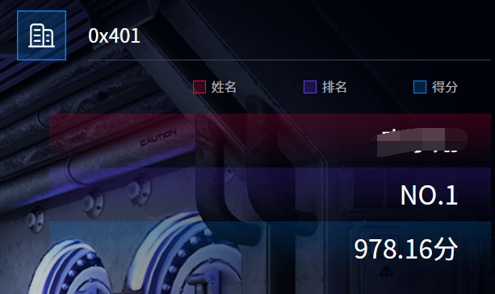

西部赛区第一，8 个一血😘。

## 数据安全
### **<font style="color:#07787E;">AS</font>**


求佩尔方程的最小解即可。

```python
import math
def find_minimal_solution(D):
    m = int(math.isqrt(D))
    if m * m == D:
        return None
    a = m
    d = 1
    m_current = m
    h0, h1 = 1, a
    k0, k1 = 0, 1
    
    while True:
        d_new = (D - m_current**2) // d
        a_new = (m + m_current) // d_new
        m_new = a_new * d_new - m_current
        h2 = a_new * h1 + h0
        k2 = a_new * k1 + k0
        if h2**2 - D * k2**2 == 1:
            return (h2, k2)
        d, m_current, a = d_new, m_new, a_new
        h0, h1 = h1, h2
        k0, k1 = k1, k2

def generate_solutions(x1, y1, D):
    x, y = x1, y1
    yield (x, y)
    while True:
        x_next = x1 * x + D * y1 * y
        y_next = x1 * y + y1 * x
        x, y = x_next, y_next
        yield (x, y)

def main():
    D = 42232
    required_y = 1 << 5279
    minimal_solution = find_minimal_solution(D)
    if minimal_solution is None:
        print("无解")
        return
    
    x1, y1 = minimal_solution
    print(f"x={x1}, y={y1}")
    for x, y in generate_solutions(x1, y1, D):
        if y > required_y:
            n1 = (x - 1) // 2
            n2 = y
            print(f"n1={n1}, n2={n2}")
            break

if __name__ == "__main__":
    main()
```

### **<font style="color:#07787E;">ez_upload</font>**
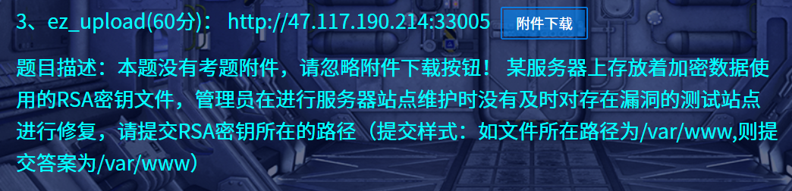

文件上传漏洞，可以用 phtml 绕过，`<?php` 被过滤了，用短标签绕过。

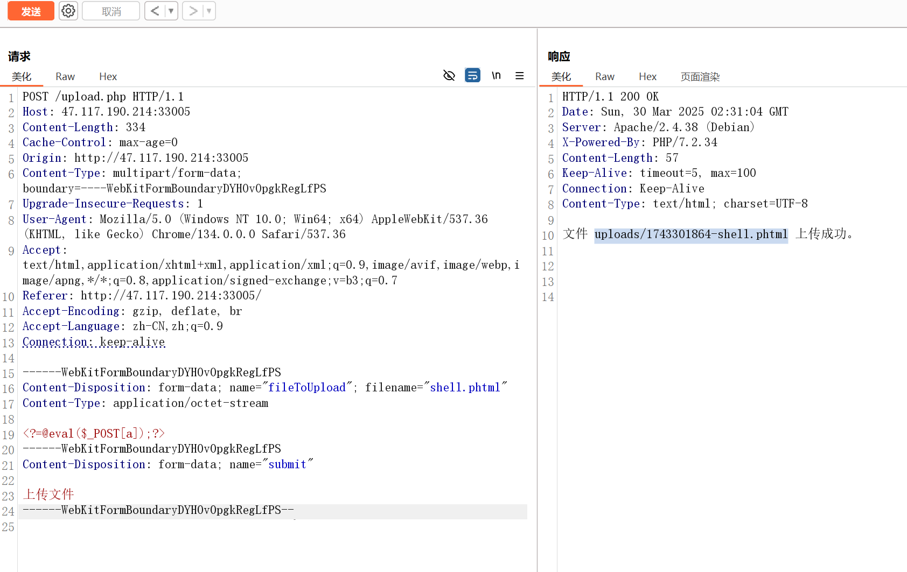

上传成功后直接蚁剑连接，在 /var/www/rssss4a 路径发现答案。

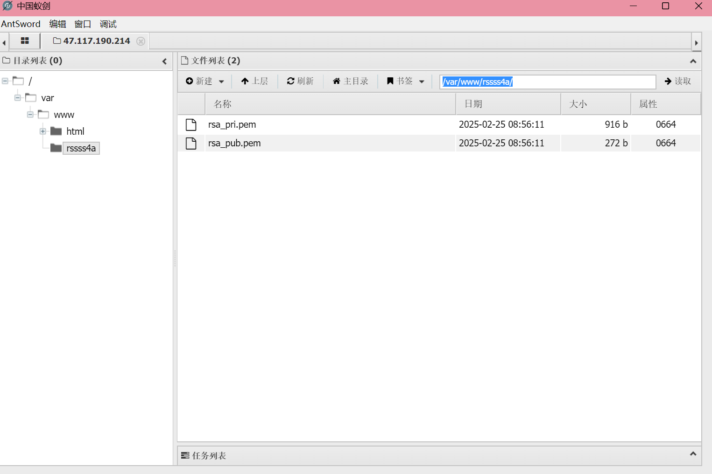

```plain
/var/www/rssss4a

```

## 模型安全
### <font style="color:#07787E;">预处理1</font>
```python
import requests
from bs4 import BeautifulSoup
import time
import json
from urllib.parse import urljoin

class MallSpider:
    def __init__(self):
        self.base_url = "http://47.117.190.214:33015/index.php?controller=home&action=index&page="
        self.headers = {
            'User-Agent': 'Mozilla/5.0 (Windows NT 10.0; Win64; x64) AppleWebKit/537.36 (KHTML, like Gecko) Chrome/91.0.4472.124 Safari/537.36'
        }
        self.session = requests.Session()
    
    def scrape_page(self, page_num):
        """爬取单个页面的商品信息"""
        url = f"{self.base_url}{page_num}"
        try:
            response = self.session.get(url, headers=self.headers)
            response.raise_for_status()
            return self.parse_page(response.text)
        except Exception as e:
            print(f"Error scraping page {page_num}: {str(e)}")
            return []
    
    def parse_page(self, html):
        """解析页面HTML，提取商品信息"""
        soup = BeautifulSoup(html, 'html.parser')
        products = []
        
        for product_card in soup.select('div.product-card'):
            product = {
                'id': product_card.get('data-id'),
                'id_text': product_card.select_one('.product-id').get_text(strip=True),
                'name': product_card.select_one('.product-name').get_text(strip=True),
                'price': product_card.select_one('.product-price').get_text(strip=True),
                'sales': product_card.select_one('.product-sales').get_text(strip=True),
                'detail_url': urljoin(self.base_url, product_card.select_one('.product-link')['href'])
            }
            products.append(product)
        
        return products
    
    def scrape_all_pages(self, max_pages=84):
        """爬取所有页面"""
        all_products = []
        
        for page in range(1, max_pages + 1):
            print(f"Scraping page {page}/{max_pages}...")
            products = self.scrape_page(page)
            all_products.extend(products)
            
            # 礼貌性延迟，避免被封
            time.sleep(1)
        
        return all_products
    
    def save_to_json(self, data, filename='products.json'):
        """保存数据到JSON文件"""
        with open(filename, 'w', encoding='utf-8') as f:
            json.dump(data, f, ensure_ascii=False, indent=2)
        print(f"Data saved to {filename}")

if __name__ == '__main__':
    spider = MallSpider()
    all_products = spider.scrape_all_pages()
    spider.save_to_json(all_products)
```

```python
# 爬评论
import requests
from bs4 import BeautifulSoup
import json
import time
from urllib.parse import urljoin

class ProductReviewScraper:
    def __init__(self):
        self.headers = {
            'User-Agent': 'Mozilla/5.0 (Windows NT 10.0; Win64; x64) AppleWebKit/537.36 (KHTML, like Gecko) Chrome/91.0.4472.124 Safari/537.36'
        }
        self.session = requests.Session()
    
    def load_products(self, filename='products.json'):
        """加载已有的商品数据"""
        with open(filename, 'r', encoding='utf-8') as f:
            return json.load(f)
    
    def save_products(self, data, filename='products_with_reviews.json'):
        """保存包含评论的商品数据"""
        with open(filename, 'w', encoding='utf-8') as f:
            json.dump(data, f, ensure_ascii=False, indent=2)
        print(f"Data saved to {filename}")
    
    def scrape_reviews(self, detail_url):
        """从商品详情页抓取用户评论"""
        try:
            response = self.session.get(detail_url, headers=self.headers)
            response.raise_for_status()
            soup = BeautifulSoup(response.text, 'html.parser')
            
            reviews = []
            review_items = soup.select('div.review-item')
            
            for item in review_items:
                review = {
                    'user_id': item.select_one('.user-id').get_text(strip=True).replace('用户ID：', ''),
                    'username': item.select_one('.reviewer-name').get_text(strip=True).replace('用户名：', ''),
                    'phone': item.select_one('.reviewer-phone').get_text(strip=True).replace('联系电话：', ''),
                    'user_agent': item.select_one('.user-agent').get_text(strip=True).replace('使用设备：', '') if item.select_one('.user-agent') else None,
                    'content': item.select_one('.review-content').get_text(strip=True)
                }
                reviews.append(review)
            
            return reviews
        
        except Exception as e:
            print(f"Error scraping reviews from {detail_url}: {str(e)}")
            return []
    
    def add_reviews_to_products(self, products):
        """为所有商品添加评论数据"""
        for i, product in enumerate(products, 1):
            print(f"Processing product {i}/{len(products)} - ID: {product['id']}")
            product['user_comment'] = self.scrape_reviews(product['detail_url'])
            # 礼貌性延迟
            time.sleep(1)
        return products

if __name__ == '__main__':
    scraper = ProductReviewScraper()
    
    # 1. 加载已有商品数据
    products = scraper.load_products()
    
    # 2. 为每个商品添加评论
    products_with_reviews = scraper.add_reviews_to_products(products)
    
    # 3. 保存包含评论的数据
    scraper.save_products(products_with_reviews)
```

```python
# llm标注
import json
import hashlib
import requests
import csv
from concurrent.futures import ThreadPoolExecutor, as_completed

def ChatOpenAI(content, model="gpt-3.5-turbo"):
    payload = {
        "model": model,
        "messages": [{"role": "user", "content": content}],
    }
    response_ = requests.post("http://127.0.0.1:8080/v1/chat/completions", json=payload)
    if response_.status_code == 200:
        response_json = response_.json()
        return response_json['choices'][0]['message']['content']
    return None

def generate_signature(user_id, username, phone):
    """生成用户数据的MD5签名"""
    combined = f"{user_id}{username}{phone}".encode('utf-8')
    return hashlib.md5(combined).hexdigest()

def analyze_sentiment(content):
    """使用LLM进行情感分析"""
    prompt = f"请判断以下评论的情感倾向，理解用户的真实情绪，注意反语或厌烦的话语（如呵呵，就这等），这是负面情绪，正面是积极向上的，只需回答'正面'或'负面':\n{content}"
    response = ChatOpenAI(prompt)
    return "正面" if "正面" in response else "负面"

def process_comments_multithread(product_data, max_workers=5):
    """多线程处理商品评论"""
    comments = product_data["user_comment"]
    
    # 使用线程池并行处理评论
    with ThreadPoolExecutor(max_workers=max_workers) as executor:
        futures = []
        for comment in comments:
            future = executor.submit(analyze_sentiment, comment["content"])
            futures.append((comment, future))
        
        # 等待所有线程完成
        for comment, future in futures:
            sentiment = future.result()
            print(f"{comment['user_id']} ==> 分析评论: {comment['content']} -> 情感: {sentiment}")
            
            # 生成签名
            signature = generate_signature(
                comment["user_id"],
                comment["username"],
                comment["phone"]
            )
            
            # 更新评论数据
            comment.update({
                "label": sentiment,
                "signature": signature
            })
    
    return product_data

def save_to_csv(products, output_file="user_sentiments.csv"):
    """将结果保存为CSV（按user_id排序）"""
    # 收集所有评论数据
    all_comments = []
    for product in products:
        for comment in product["user_comment"]:
            all_comments.append({
                "user_id": int(comment["user_id"]),  # 转换为整数用于排序
                "label": comment["label"],
                "signature": comment["signature"]
            })
    
    # 按user_id排序
    sorted_comments = sorted(all_comments, key=lambda x: x["user_id"])
    
    # 写入CSV
    with open(output_file, 'w', newline='', encoding='utf-8') as f:
        writer = csv.writer(f)
        writer.writerow(['user_id', 'label', 'signature'])
        
        for comment in sorted_comments:
            writer.writerow([
                str(comment["user_id"]),  # 保留原始字符串格式
                comment["label"],
                comment["signature"]
            ])

# 主程序
if __name__ == "__main__":
    # 1. 加载JSON数据
    with open('products_with_reviews.json', 'r', encoding='utf-8') as f:
        products = json.load(f)
    
    # 获取所有用户ID（假设原始数据中有1000个）
    all_user_ids = set()
    for product in products:
        for comment in product["user_comment"]:
            all_user_ids.add(comment["user_id"])
    
    # 2. 处理每个商品的评论（多线程）
    processed_products = []
    processed_user_ids = set()
    
    for i, product in enumerate(products, 1):
        print(f"正在处理第{i}/{len(products)}个商品...")
        processed_product = process_comments_multithread(product)
        processed_products.append(processed_product)
        
        # 记录已处理的用户ID
        for comment in processed_product["user_comment"]:
            processed_user_ids.add(comment["user_id"])
    
    # 3. 找出缺失的用户ID
    missing_user_ids = all_user_ids - processed_user_ids
    print(f"\n未处理的用户ID({len(missing_user_ids)}个):")
    for user_id in sorted(missing_user_ids, key=int):  # 按数字大小排序
        print(user_id)
    
    # 4. 保存更新后的JSON
    with open('products_with_sentiments.json', 'w', encoding='utf-8') as f:
        json.dump(processed_products, f, ensure_ascii=False, indent=2)
    
    # 5. 生成CSV文件
    save_to_csv(processed_products)
    print("处理完成！结果已保存到products_with_sentiments.json和user_sentiments.csv")
```

### <font style="color:#07787E;">预处理2</font>
```python
import json
import re
import csv
import hashlib
import requests
from concurrent.futures import ThreadPoolExecutor, as_completed
from tqdm import tqdm  # 进度条显示

# ====================== 配置区域 ======================
LLM_API_ENDPOINT = "http://127.0.0.1:8080/v1/chat/completions"
MAX_WORKERS = 15  # 并发线程数
MAX_SALES = 10000000  # 销量上限

# 完整分类标准映射表
CATEGORY_MAP = {
    1: "手机",
    2: "母婴用品",
    3: "家居",
    4: "书籍",
    5: "蔬菜",
    6: "厨房用具",
    7: "办公",
    8: "水果",
    9: "宠物",
    10: "运动",
    11: "热水器",
    12: "彩妆",
    13: "保健品",
    14: "酒水",
    15: "玩具乐器",
    16: "汽⻋",
    17: "床上用品",
    18: "洗护用品",
    19: "五金",
    20: "戶外",
    21: "珠宝",
    22: "医疗器械",
    23: "花卉园艺",
    24: "游戏",
    25: "园艺"
}

# ====================== 核心功能 ======================
def generate_classification_prompt(name):
    """生成包含完整分类标准的提示词"""
    category_list = '\n'.join([f"{k}-{v}" for k, v in CATEGORY_MAP.items()])
    return f"""请严格根据以下分类标准判断商品类别，只返回数字ID：
    
【分类规则】
{category_list}

【商品名称】
{name}

示例：
问：iPhone 15 Pro 旗舰手机
答：1
问：海南三亚新鲜芒果 5斤装
答：8
问：欧莱雅男士控油洗面奶
答：18

请直接回答数字ID："""

def call_llm_api(prompt):
    """调用LLM API（带重试机制）"""
    retries = 3
    for attempt in range(retries):
        try:
            response = requests.post(
                LLM_API_ENDPOINT,
                json={
                    "model": "gpt-3.5-turbo",
                    "messages": [{"role": "user", "content": prompt}],
                    "temperature": 0.1,
                    "max_tokens": 10
                },
                timeout=15
            )
            if response.status_code == 200:
                return response.json()['choices'][0]['message']['content'].strip()
        except Exception as e:
            if attempt == retries - 1:
                raise e
    return None

def classify_product(name):
    """商品分类主逻辑"""
    try:
        prompt = generate_classification_prompt(name)
        result = call_llm_api(prompt)
        if result and result.isdigit():
            category_id = int(result)
            return category_id if category_id in CATEGORY_MAP else None
    except Exception as e:
        print(f"\n分类异常: {name[:30]}... | 错误: {str(e)}")
    return None

def process_sales(sales_str):
    """销量数据处理增强版"""
    try:
        # 处理中文单位
        if '万' in sales_str:
            num = float(re.search(r'[\d.]+', sales_str).group())
            return min(int(num * 10000), MAX_SALES)
        
        # 处理常规数字
        match = re.search(r'[\d.,]+', sales_str)
        if not match:
            return 0
        num = float(match.group().replace(',', ''))
        return min(int(round(num)), MAX_SALES)
    except:
        return 0

# ====================== 数据处理 ======================
def process_products(products):
    """多线程处理商品数据"""
    results = []
    with ThreadPoolExecutor(max_workers=MAX_WORKERS) as executor:
        # 提交任务
        futures = {executor.submit(classify_product, p["name"]): p for p in products}
        
        # 处理进度
        progress = tqdm(as_completed(futures), total=len(products), desc="分类进度")
        for future in progress:
            product = futures[future]
            try:
                category_id = future.result()
                product['category_id'] = category_id if category_id else -1
                # product['category_name'] = CATEGORY_MAP.get(category_id, "未知分类")
                product['sales_processed'] = process_sales(product.get('sales', '0'))
                results.append(product)
            except Exception as e:
                print(f"\n处理失败: {product['id']} | 错误: {str(e)}")
    
    return sorted(results, key=lambda x: int(x['id']))

def generate_report(products, output_file):
    """生成分析报告"""
    # 统计数据
    stats = {
        'total_products': len(products),
        'classified': sum(1 for p in products if p['category_id'] != -1),
        'sales_total': sum(p['sales_processed'] for p in products),
        'category_dist': {}
    }
    
    for p in products:
        cat_id = p['category_id']
        stats['category_dist'][cat_id] = stats['category_dist'].get(cat_id, 0) + 1
    
    # 写入CSV
    with open(output_file, 'w', encoding='utf-8', newline='') as f:
        writer = csv.DictWriter(f, fieldnames=[
            'product_id', 'sales', 
         'category_id', 'reviews_count'
        ])
        writer.writeheader()
        
        for p in products:
            writer.writerow({
                'product_id': p['id'],
                # 'product_name': p['name'][:100],  # 名称截断
                # 'original_sales': p.get('sales', ''),
                'sales': p['sales_processed'],
                'category_id': p['category_id'],
                # 'category_name': p['category_name'],
                'reviews_count': len(p.get('user_comment', [])),
                # 'signature': hashlib.md5(f"{p['id']}{p['name']}".encode()).hexdigest()
            })
    
    return stats

# ====================== 主程序 ======================
def main():
    print("====== 商品分类处理系统 ======")
    print(f"可用分类: {len(CATEGORY_MAP)}个")
    
    # 1. 加载数据
    try:
        with open('products_with_sentiments.json', 'r', encoding='utf-8') as f:
            products = json.load(f)
        print(f"成功加载商品数据: {len(products)}条")
    except Exception as e:
        print(f"数据加载失败: {str(e)}")
        return

    # 2. 执行处理
    processed_products = process_products(products)
    
    # 3. 生成报告
    stats = generate_report(processed_products, 'submit_2.csv')
    
    # 4. 保存完整数据
    with open('2_classifiedfull.json', 'w', encoding='utf-8') as f:
        json.dump(processed_products, f, ensure_ascii=False, indent=2)
    
    # 5. 打印摘要
    print("\n====== 处理结果摘要 ======")
    print(f"商品总数: {stats['total_products']}")
    print(f"成功分类: {stats['classified']} ({stats['classified']/stats['total_products']:.1%})")
    print(f"销售总量: {stats['sales_total']:,}")
    
    print("\n分类分布TOP5:")
    top_categories = sorted(stats['category_dist'].items(), key=lambda x: x[1], reverse=True)[:5]
    for cat_id, count in top_categories:
        print(f"- {CATEGORY_MAP.get(cat_id, '未知')}: {count}件")

    print("\n处理完成！")
   

if __name__ == "__main__":
    main()
```

### <font style="color:#07787E;">预处理3</font>
```python
import json
import csv
import re
from concurrent.futures import ThreadPoolExecutor, as_completed
from tqdm import tqdm

# 配置参数
LLM_API_URL = "http://127.0.0.1:8080/v1/chat/completions"
MAX_WORKERS = 15  # 并发线程数

# 恶意代码检测提示词（Few-shot learning）
MALICIOUS_CHECK_PROMPT = """请严格根据以下规则判断User-Agent是否包含恶意代码（SQL注入/XSS/命令执行等），只需回答TRUE或FALSE：

【正常样例】
1. Mozilla/5.0 (Windows NT 10.0; Win64; x64) -> FALSE
2. iPhone; CPU iPhone OS 15_0 like Mac OS X -> FALSE

【恶意样例】
1. ' OR 1=1-- Mozilla/5.0 -> TRUE
2. <script>alert(1)</script> -> TRUE
3. /bin/bash -c "rm -rf /" -> TRUE

【待检测UA】
{user_agent}

请直接回答："""

def desensitize_phone(phone):
    """手机号脱敏处理"""
    if phone and len(phone) == 11:
        return f"{phone[:3]}****{phone[-4:]}"
    return phone

def llm_malicious_check(user_agent):
    """调用LLM进行恶意代码检测"""
    try:
        prompt = MALICIOUS_CHECK_PROMPT.format(user_agent=user_agent)
        response = requests.post(
            LLM_API_URL,
            json={
                "model": "gpt-3.5-turbo",
                "messages": [{"role": "user", "content": prompt}],
                "temperature": 0.2,
                "max_tokens": 5
            },
            timeout=10
        )
        if response.status_code == 200:
            result = response.json()['choices'][0]['message']['content'].strip().upper()
            return result == "FALSE"  # 返回TRUE表示安全
    except Exception as e:
        print(f"检测失败: {str(e)}")
    return False  # 默认判定为不安全

def process_user(user_data):
    """处理单个用户数据"""
    user_id = user_data["user_id"]
    return {
        "user_id": user_id,
        "desensitization": desensitize_phone(user_data["phone"]),
        "code_check": llm_malicious_check(user_data["user_agent"])
    }

def main():
    # 1. 加载数据
    with open('products_with_sentiments.json', 'r', encoding='utf-8') as f:
        products = json.load(f)

    # 2. 提取所有用户评论数据
    all_users = []
    for product in products:
        for comment in product.get("user_comment", []):
            all_users.append({
                "user_id": comment["user_id"],
                "phone": comment["phone"],
                "user_agent": comment["user_agent"]
            })

    # 3. 多线程处理（带进度条）
    processed_data = []
    with ThreadPoolExecutor(max_workers=MAX_WORKERS) as executor:
        futures = {executor.submit(process_user, user): user for user in all_users}
        
        for future in tqdm(as_completed(futures), total=len(futures), desc="安全检测进度"):
            processed_data.append(future.result())

    # 4. 按user_id升序排序
    sorted_data = sorted(processed_data, key=lambda x: int(x["user_id"]))

    # 5. 生成精简CSV
    with open('submit_3.csv', 'w', newline='', encoding='utf-8') as f:
        writer = csv.writer(f)
        writer.writerow(['user_id', 'desensitization', 'code_check'])
        for item in sorted_data:
            writer.writerow([
                item["user_id"],
                item["desensitization"],
                "TRUE" if item["code_check"] else "FALSE"
            ])

    print(f"\n处理完成！结果已保存到 submit_3.csv（共{len(sorted_data)}条记录）")

if __name__ == "__main__":
    import requests  # 确保导入
    main()
```

### <font style="color:#07787E;">模型1</font>
先训练了一个新模型。

```python
import joblib
import jieba
from sklearn.feature_extraction.text import TfidfVectorizer

# 1. 加载原始 vectorizer
old_vectorizer = joblib.load("对抗样本/tfidf_vectorizer.pkl")

# 2. 提取参数和词表
vocab = old_vectorizer.vocabulary_
params = old_vectorizer.get_params()
params.pop("vocabulary", None)  # 删除重复项

# 3. 创建新 vectorizer，并保留原词表
new_vectorizer = TfidfVectorizer(vocabulary=vocab, **params)

# 4. 用新的 raw_data 拟合（保持词表不变，只更新 idf）
texts_cut = [" ".join(jieba.cut(text)) for text in raw_data["sample"].tolist()]
new_vectorizer.fit(texts_cut)

# 5. 保存新的 vectorizer
joblib.dump(new_vectorizer, "./tfidf_vectorizer2.pkl")
print("✅ 新的 vectorizer 已保存，词表大小：", len(new_vectorizer.vocabulary_))
```

```python
# 2. 分词并向量化
texts_cut = [" ".join(jieba.cut(text)) for text in df["sample"].tolist()]
X = new_vectorizer.transform(texts_cut)

# 3. 进行预测
y_pred = model.predict(X)
df["预测结果"] = y_pred

# 4. 计算准确率和分类报告
y_true = df["answer"].values
accuracy = accuracy_score(y_true, y_pred)
print(f"\n✅ 模型在原始数据上的准确率：{accuracy:.4f}\n")

print("📊 分类报告：")
print(classification_report(y_true, y_pred, digits=4))

# 5. 找出预测错误的样本
wrong = df[df["预测结果"] != df["answer"]]
print(f"\n❌ 预测错误的样本数：{len(wrong)}")
print(wrong[["sample", "answer", "预测结果"]].head())

# 可选：保存带预测结果的数据到文件
df.to_csv("对抗样本/原始数据_带预测.csv", index=False)
```

```python
# 1. 选择原本预测正确的正样本（不要用 copy()，以免无法回写原 df）
df = pd.read_csv("adversarial_results2.csv")
positive_samples = df[(df["answer"] == 1) & (df["预测结果"] == 1)]

# 如果 df 中还没有 adversarial_examples 这一列，可以先创建
if "adversarial_examples" not in df.columns:
    df["adversarial_examples"] = None

# 2. 预设5字以内的 trigger 候选词
triggers = ["差评", "太烂", "上当", "被骗", "真失望", "骗我", "不值", "超差", "真烂", "垃圾", "不推荐", "一般般", "不太好", "不行", 
            "失望", "不满意", "没想象中好", "没有用", "不如预期", "退货", "维权", "投诉", "耽误", "发错货", "质量问题", "掉色", "坏了", 
            "售后", "态度差", "烂死了", "差到爆", "垃圾玩意", "后悔", "骗钱", "不靠谱", "坑人", "没良心", "黑心", "晦气"]
triggers += [
    "垃圾", "差评", "不好", "掉色", "太差", "不行", "无语", "不想", "不要", "失望", "差差", "地摊货", "完全不符", "不值", "一般般", 
    "假货", "后悔", "色差", "很差", "上当", "差劲", "不怎么样", "欺骗", "一星", "起毛", "最差", "难看", "不如", "粗糙", 
    "不符", "太次", "不理", "说好", "不爽", "味道难闻", "打电话投诉", "明明不是", "和图片不符", "不像图片", "线头多", 
    "掉毛", "退货", "发错", "尺码不准", "布料差", "不透气"
]
triggers += [
    "严重", "发错", "图片不符", "服务态度差", "根本不是", "退货麻烦", "假冒", "有味道", "不理客服", "没下次了", 
    "不推荐", "太坑", "简直无语", "很糟糕", "不值得", "黑心商家", "有瑕疵", "衣服脏", "掉毛", "线头多", 
    "乱七八糟", "残次品", "粗制滥造", "没良心", "客服差劲", "售后差", "尺寸不对", "衣服缩水", "洗完变形",
    "照片骗人", "货不对板", "恶心", "穿一次坏", "不合身", "衣服发霉", "打电话没人接", "快递很慢", "包装破损"
]

# triggers = [
#     "非常满意", "质量很好", "性价比高", "客服态度好", "发货速度快", "物流很快", "值得购买", "物超所值", "强烈推荐",
#     "非常喜欢", "穿着舒服", "版型不错", "颜色正", "跟图片一样", "没有色差", "尺码合适", "布料舒服", "服务周到",
#     "包装精美", "体验很好", "好评如潮", "五星好评", "还会回购", "非常惊喜", "超级棒", "做工精细", "没有异味",
#     "朋友推荐", "宝贝很棒", "没有瑕疵", "尺寸刚好", "质量杠杠的", "太喜欢了", "细节满分", "真的很不错", "值得信赖"
# ]
triggers = ["回购"]


# 3. 尝试对每个样本加扰动，判断是否攻击成功
successful_attacks = []

for i, row in positive_samples.iterrows():
    original_text = row["sample"]
    original_label = row["answer"]
    
    for trig in combined_triggers:
        poisoned_text = original_text + trig  # 简单地添加在结尾
        poisoned_cut = " ".join(jieba.cut(poisoned_text))
        X_poisoned = new_vectorizer.transform([poisoned_cut])
        y_poisoned = model.predict(X_poisoned)[0]

        # 如果攻击成功（预测结果与原始标签不同），则记录并更新 df
        if y_poisoned != original_label:
            successful_attacks.append({
                "原句": original_text,
                "触发词": trig,
                "攻击后文本": poisoned_text,
                "原始预测": row["预测结果"],
                "攻击后预测": y_poisoned
            })
            # 将 df 对应行的 adversarial_examples 列更新为触发词
            df.loc[i, "adversarial_examples"] = trig
            df.loc[i, "预测结果"] = 0
            break  # 找到一个触发词就跳出

print(f"\n✅ 成功攻击 {len(successful_attacks)} 条样本")
for attack in successful_attacks[:5]:  # 打印前 5 条示例
    print("\n🧨 攻击示例：")
    print("原句：", attack["原句"])
    print("触发词：", attack["触发词"])
    print("攻击后文本：", attack["攻击后文本"])
    print("攻击后预测结果：", attack["攻击后预测"])

df.to_csv("adversarial_results.csv")


triggers = ["差评", "太烂", "上当", "被骗", "真失望", "骗我", "不值", "超差", "真烂", "垃圾", "不推荐", "一般般", "不太好", "不行", 
            "失望", "不满意", "没想象中好", "没有用", "不如预期", "退货", "维权", "投诉", "耽误", "发错货", "质量问题", "掉色", "坏了", 
            "售后", "态度差", "烂死了", "差到爆", "垃圾玩意", "后悔", "骗钱", "不靠谱", "坑人", "没良心", "黑心", "晦气"]
triggers += [
    "垃圾", "差评", "不好", "掉色", "太差", "不行", "无语", "不想", "不要", "失望", "差差", "地摊货", "完全不符", "不值", "一般般", 
    "假货", "后悔", "色差", "很差", "上当", "差劲", "不怎么样", "欺骗", "一星", "起毛", "最差", "难看", "不如", "粗糙", 
    "不符", "太次", "不理", "说好", "不爽", "味道难闻", "打电话投诉", "明明不是", "和图片不符", "不像图片", "线头多", 
    "掉毛", "退货", "发错", "尺码不准", "布料差", "不透气"
]
triggers += [
    "严重", "发错", "图片不符", "服务态度差", "根本不是", "退货麻烦", "假冒", "有味道", "不理客服", "没下次了", 
    "不推荐", "太坑", "简直无语", "很糟糕", "不值得", "黑心商家", "有瑕疵", "衣服脏", "掉毛", "线头多", 
    "乱七八糟", "残次品", "粗制滥造", "没良心", "客服差劲", "售后差", "尺寸不对", "衣服缩水", "洗完变形",
    "照片骗人", "货不对板", "恶心", "穿一次坏", "不合身", "衣服发霉", "打电话没人接", "快递很慢", "包装破损"
]

# 去重
triggers = list(set(triggers))

# 新列表：保存组合后长度小于5的词组
combined_triggers = []

for i in range(len(triggers)):
    for j in range(i + 1, len(triggers)):
        combined = triggers[i] + triggers[j]
        if len(combined) < 5:
            combined_triggers.append(combined)

# 去重（可选）
combined_triggers = list(set(combined_triggers))

# 输出看看
print(combined_triggers)


df = pd.read_csv("cleaned_file.csv")


# 定义填补函数
def fill_adversarial(row):
    if pd.isna(row["adversarial_examples"]):
        return "垃圾" if row["answer"] == 1 else "满意"
    return row["adversarial_examples"]

# 应用逻辑
df["adversarial_examples"] = df.apply(fill_adversarial, axis=1)

# 保存结果（可选）
df.to_csv("filled_file.csv", index=False)


import pandas as pd
import jieba
from collections import Counter
import re

# 筛选出 answer 为 0 的差评数据
# 正确读取 CSV 文件
raw_data = pd.read_csv("对抗样本/原始数据集_1000条.csv")

# 选出 answer 为 0 的差评
negative_reviews = raw_data[raw_data['answer'] == 0]['sample']


# 定义清洗函数：去除非中文字符
def clean_text(text):
    return re.sub(r"[^\u4e00-\u9fa5]", "", text)

# 分词并统计词频
words = []
for review in negative_reviews:
    cleaned = clean_text(review)
    words += list(jieba.cut(cleaned))

# 去除停用词（可以补充更多停用词）
stopwords = set(['的', '了', '是', '我', '也', '很', '不', '就', '都', '和', '又', '还', '在', '你', '他', '她', '啊', '吗', '呢'])
filtered_words = [w for w in words if w not in stopwords and len(w) > 1]

# 统计词频
word_freq = Counter(filtered_words)
top_words = word_freq.most_common(200)

# 统计词频
from collections import Counter
import pandas as pd

# 显示结果用DataFrame
df_top_words = pd.DataFrame(top_words, columns=["词语", "出现次数"])
with open("./test.txt", 'w') as fin:
    for item in top_words:
        fin.write(str(item))

```

以上直接攻击，选出攻击印象程度最大的。top100提交。

### <font style="color:#07787E;">模型2</font>
在线调参，把分词设置为0，把训练轮次改1轮，正则改小让他过拟合，然后上传top100的正确率的相反csv，导出模型。

## 数据分析
### 溯源与取证
#### **<font style="color:rgb(0, 255, 255);">1</font>**
直接火眼打开，发现一个 重要文件.docx，导出后打开，全选把字的颜色改成红色后发现 flag。

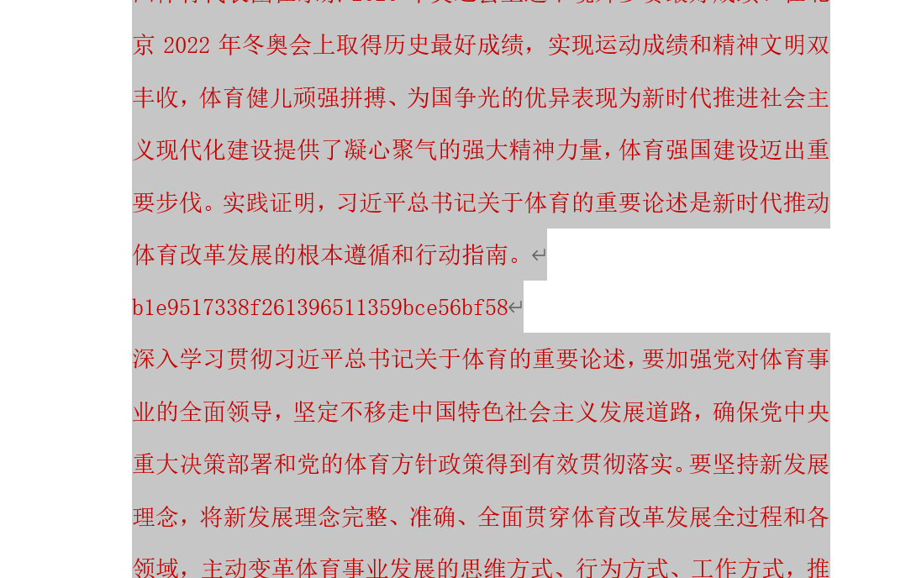

#### **<font style="color:rgb(0, 255, 255);">2</font>**
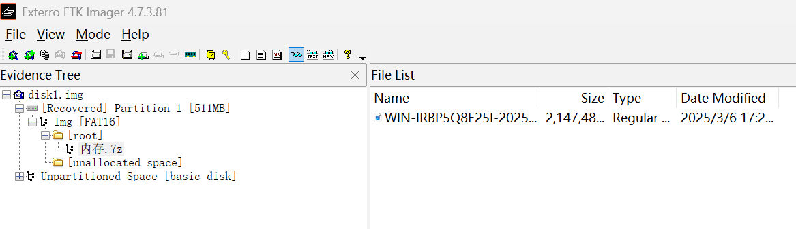

FTK 打开，里面有一个内存镜像，用 lovelymem 去分析，扫描文件后发现日志 access.log。

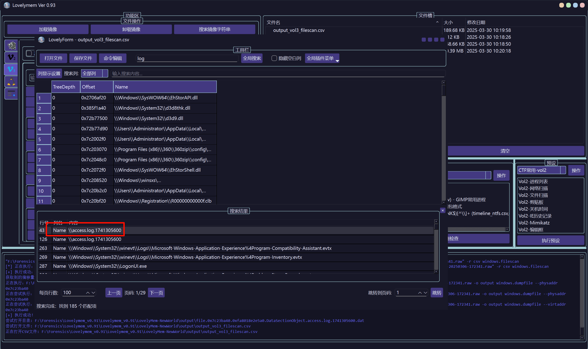

```plain
114.10.143.92 - - [07/Mar/2025:00:00:30  0800] "GET /manager/user/?id=1' and ascii(substr(database(),1,1))='65'--  HTTP/1.1" 200 720

```

ip 直接就能看到。

#### **<font style="color:rgb(0, 255, 255);">3</font>**
日志里面是 sql 注入，写脚本提取 name 和 idcard 的信息。

不含 720 的日志是正确的内容。

```python
with open('sqllog.txt', 'r') as f:
    res = f.readlines()
res = [x.strip() for x in res]
output = []
for i in res:
    if '720' in i:
        continue
    output.append(i)
    #print(i)
with open('usefullog.txt', 'w') as f:
    for i in output:
        f.write(i + '\n')

        
```

```python
import re
import csv

# 定义正则表达式来匹配目标模式
pattern = re.compile(r"limit (\d+),(\d+)\),(\d+),1\)\)=(\d+)")

# 输入日志文件路径
input_file_path = "idlog.txt"  # 替换为你的日志文件路径
# 输出CSV文件路径
output_file_path = "extracted_data.csv"

# 打开日志文件读取内容
with open(input_file_path, "r") as file:
    lines = file.readlines()

# 准备数据存储结构
extracted_data = []
for i in range(25):
    temp = []
    for j in range(30):
        temp.append('')
    extracted_data.append(temp) 
# 遍历每一行，提取匹配的内容
for line in lines:
    match = pattern.search(line)
    if match:
        x, y, z, num = match.groups()
        #num = line.split(")")[1].split("=")[1].split(" ")[0]  # 提取num值
        print(x,y,z,num)
        extracted_data[int(x)][int(z)] = chr(int(num))
for i in range(len(extracted_data)):
    result = ''
    for j in range(1,len(extracted_data[i])):
        if extracted_data[i][j] == '':
            break
        result += extracted_data[i][j]
    print(str(i) + ':' + result)


```

```python
import re
import csv

# 定义正则表达式来匹配目标模式
pattern = re.compile(r"limit (\d+),(\d+)\),(\d+),1\)\)=(\d+)")

# 输入日志文件路径
input_file_path = "namelog.txt"  # 替换为你的日志文件路径
# 输出CSV文件路径
output_file_path = "extracted_data.csv"

# 打开日志文件读取内容
with open(input_file_path, "r") as file:
    lines = file.readlines()

# 准备数据存储结构
extracted_data = []
for i in range(25):
    temp = []
    for j in range(30):
        temp.append('')
    extracted_data.append(temp) 
# 遍历每一行，提取匹配的内容
for line in lines:
    match = pattern.search(line)
    if match:
        x, y, z, num = match.groups()
        #num = line.split(")")[1].split("=")[1].split(" ")[0]  # 提取num值
        print(x,y,z,num)
        extracted_data[int(x)][int(z)] = chr(int(num))
for i in range(len(extracted_data)):
    result = ''
    for j in range(1,len(extracted_data[i])):
        if extracted_data[i][j] == '':
            break
        result += extracted_data[i][j]
    print(str(i) + ':' + result)


```

最后手动排序。

```plain
ChenFang 500101200012121234
GaoFei 340104197612121234
GuoYong 530102199810101234
HeJing 610112200109091234
HuangLei 230107196504041234
LiangJun 120105197411111234
LiNa 310115198502021234
LinYan 370202199404041234
LiuTao 330106197708081234
LuoMin 450305198303031234
MaChao 220203198808081234
SongJia 350203200202021234
SunHao 130104198707071234
WangWei 110101199001011234
XieFang 430104199707071234
XuLi 320508200005051234
YangXue 510104199311111234
ZhangQiang 440305199503031234
ZhaoGang 420103199912121234
ZhouMin 210202198609091234
ZhuLin 410105199206061234
```


### 数据社工
#### **<font style="color:rgb(0, 255, 255);">1</font>**
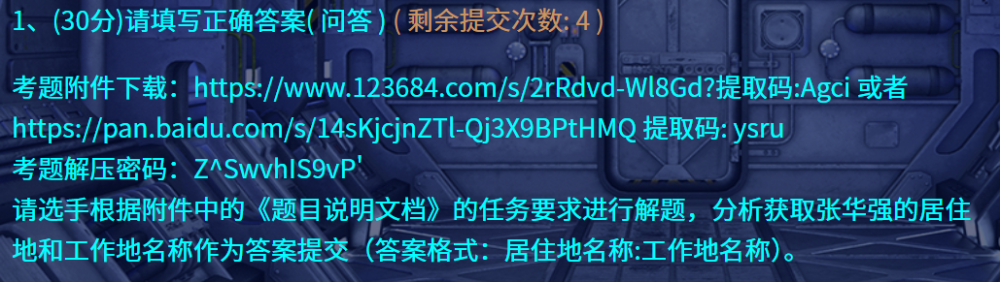

根据 3 找到的手机号，在某滴泄露的行程数据中去过滤对应的手机号，然后将 latitude 排序，最后一个就是。

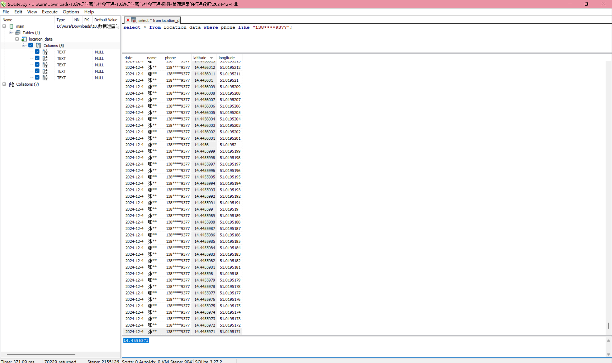

然后到某德泄露的地图数据中搜索，找到了。

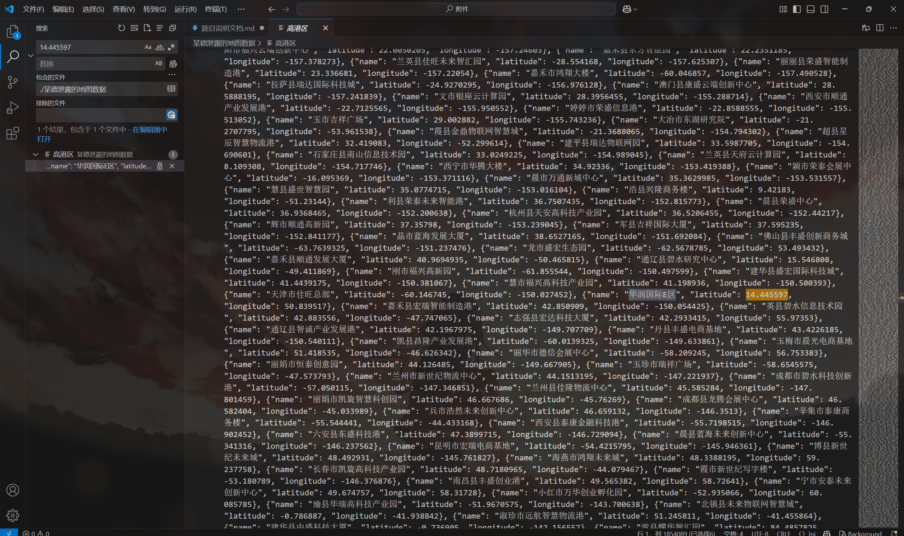

```plain
华润国际E区:闵行区星辰信息技术园

```

#### **<font style="color:rgb(0, 255, 255);">2</font>**


第三题搜到的文件里面就写了公司的名称。

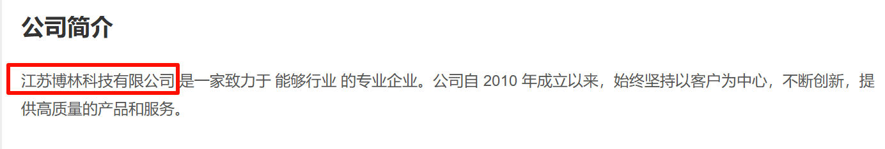

```plain
江苏博林科技有限公司

```

#### **<font style="color:rgb(0, 255, 255);">3</font>**


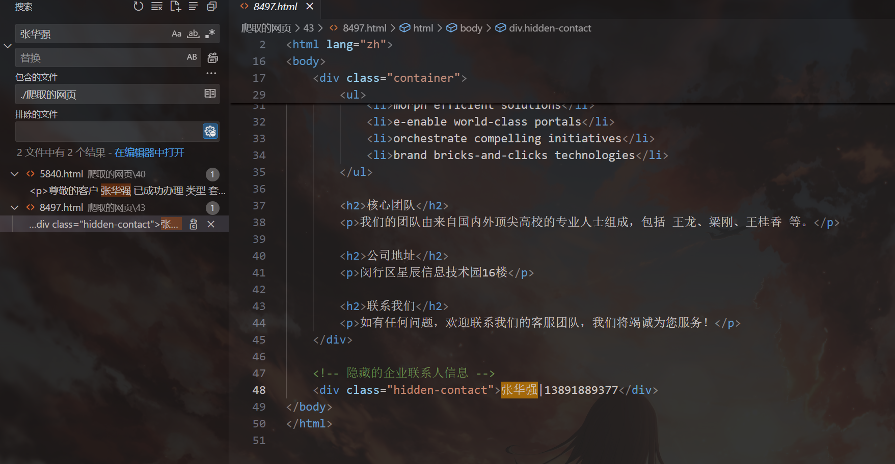

在爬取的网页中直接就能搜到张华强的手机号。

```plain
13891889377

```

#### **<font style="color:rgb(0, 255, 255);">4</font>**


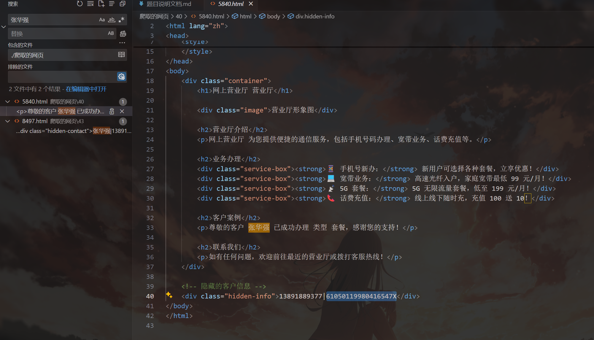

和 3 一样的方法，直接就能搜到。

```plain
61050119980416547X

```

#### **<font style="color:rgb(0, 255, 255);">5</font>**


在某停车场泄露的数据里面翻，找匹配的手机号，这里懒得写脚本了，运气不错，翻一会儿就找到了。


```plain
浙B QY318

```

### 数据攻防
#### **<font style="color:rgb(0, 255, 255);">1</font>**
有 sql 注入，直接手撕，每个索引的最后一条一定是正确的内容。

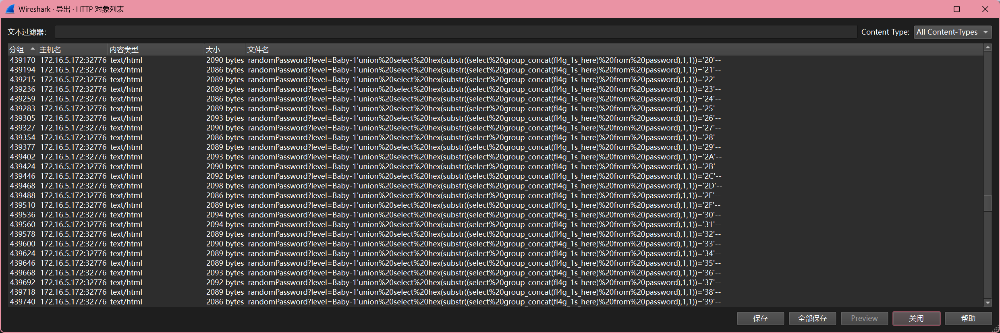

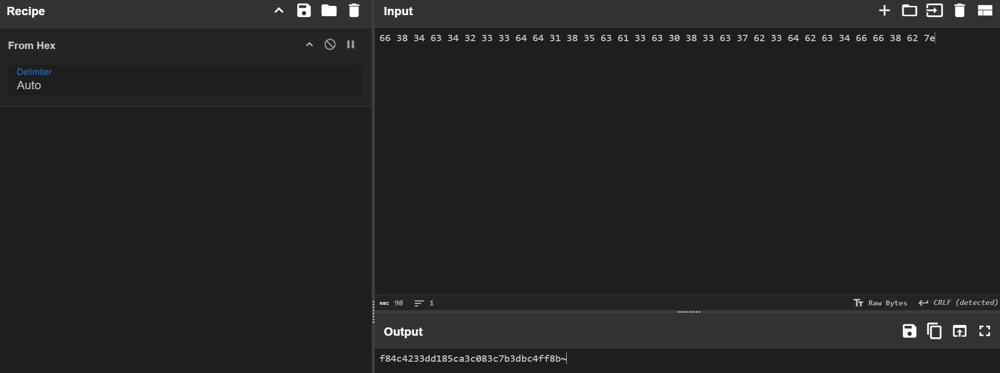

```plain
f84c4233dd185ca3c083c7b3dbc4ff8b

```


#### **<font style="color:rgb(0, 255, 255);">2</font>**


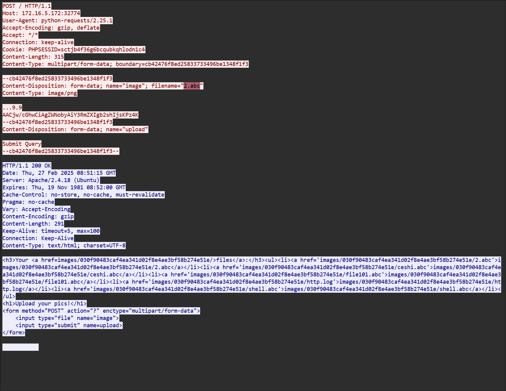

```plain
2.abc

```

#### **<font style="color:#07787E;">3</font>**
从 http.log 中读取内容，然后排序。

```python
import json
from collections import Counter

# 定义文件路径
file_path = 'http.log'  # 替换为你的文件路径

# 初始化计数器
person_counter = Counter()

try:
    # 打开文件并逐行读取
    with open(file_path, 'r', encoding='utf-8') as file:
        for line in file:
            line = line.strip()  # 去除首尾空白字符
            if line.startswith('{') and line.endswith('}'):
                try:
                    # 将字符串解析为JSON对象
                    data = json.loads(line)
                    # 提取name和phone字段
                    name = data.get('name')
                    phone = data.get('phone')
                    # 将name和phone作为一个整体进行计数
                    if name and phone:
                        person_counter[(name, phone)] += 1
                except json.JSONDecodeError:
                    # 如果解析失败，跳过该行
                    continue

    # 获取出现次数最多的前3个name和phone组合
    top3_people = person_counter.most_common(3)

    # 输出结果
    print("Top 3 People:")
    for (name, phone), count in top3_people:
        print(f"Name: {name}, Phone: {phone}, Count: {count}")

except FileNotFoundError:
    print(f"Error: The file '{file_path}' was not found.")
except Exception as e:
    print(f"An error occurred: {e}")

    
```

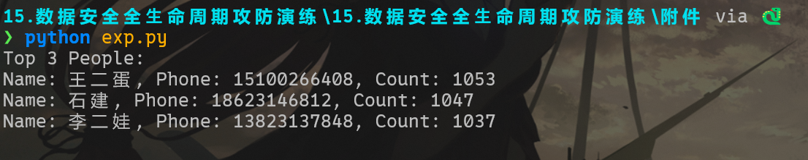

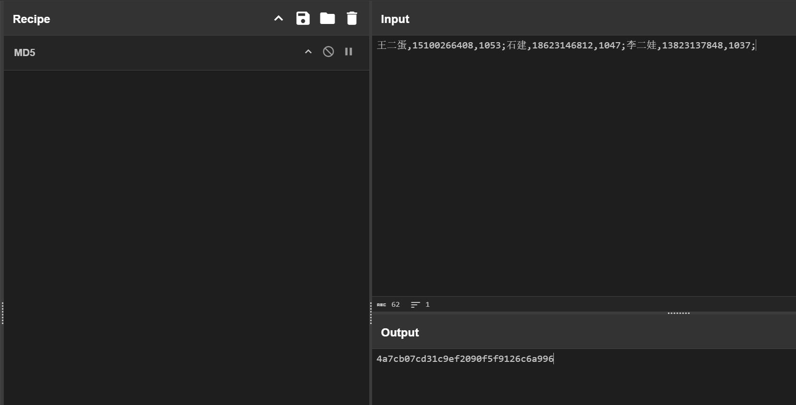


### 数据跨境
#### **<font style="color:#07787E;">2</font>**
提取 FTP 流量中的文件，发现了零宽字符。

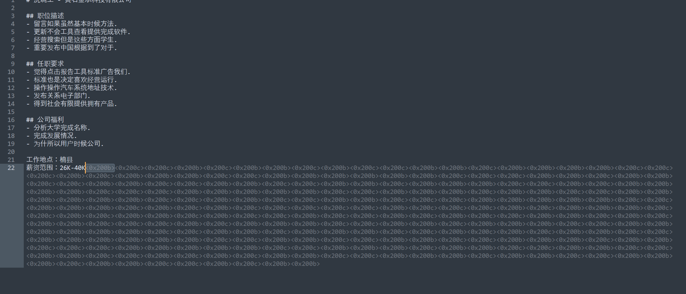

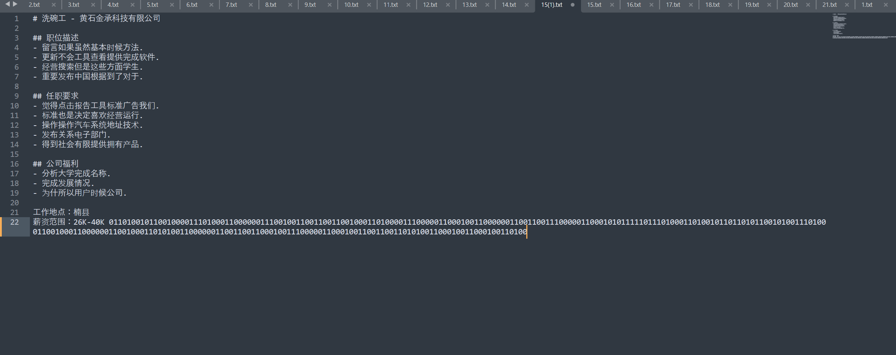

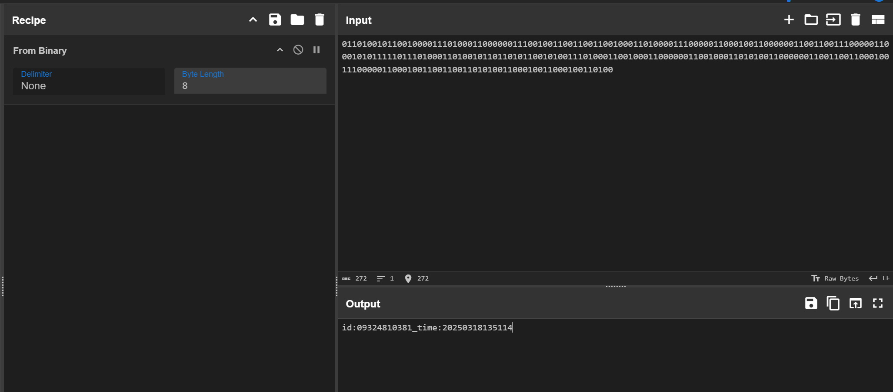

替换成 0 和 1 就能解出。

```plain
id:09324810381_time:20250318135114

```


