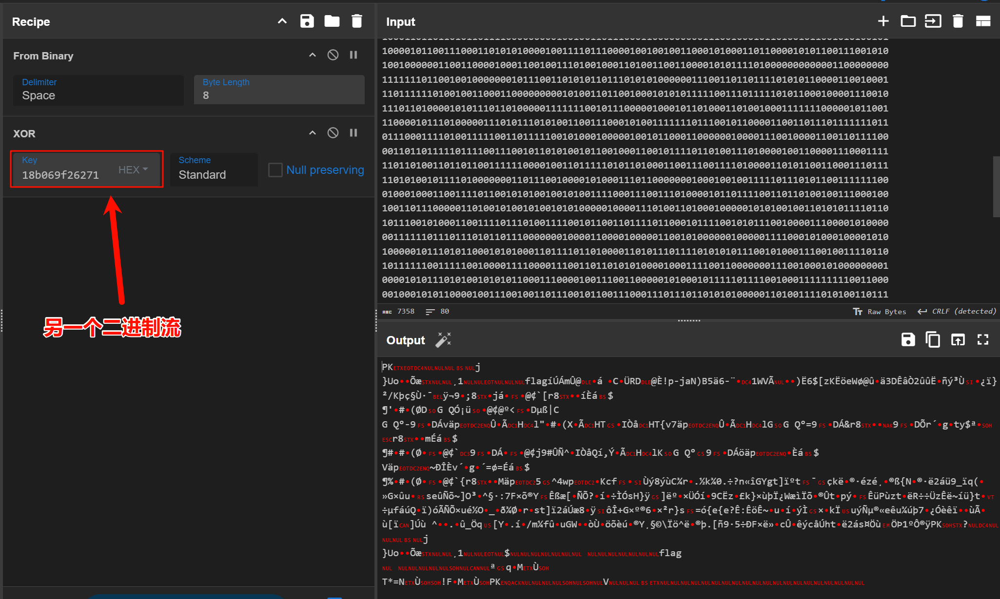
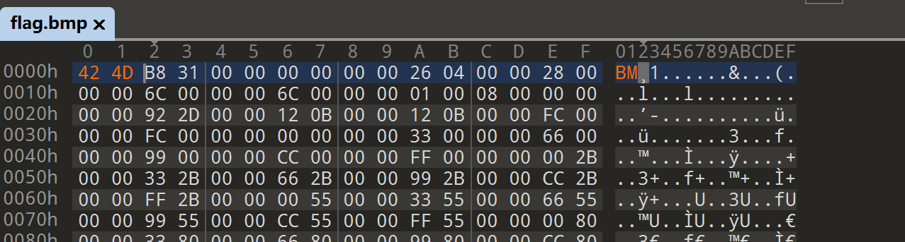
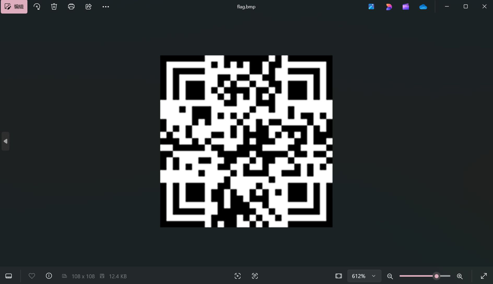
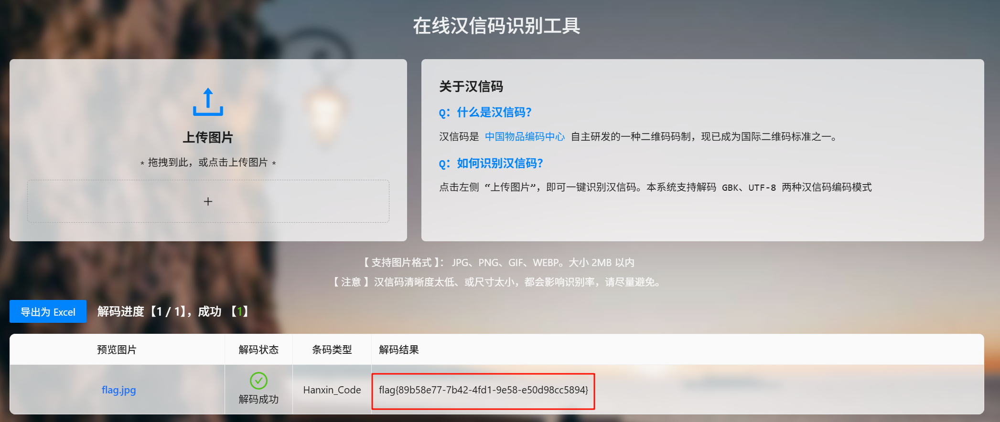

拿到一张 png，010 打开发现尾部插入了一张翻转的 png，直接提取出来。


两张图片分辨率一样，直接异或像素点没有东西，尝试把黑色像素点看成 1，把白色像素点看成 0，两个图片各导出一个二进制流。

```python
from PIL import Image

def png_to_binary(image_path):
    # 打开图片
    img = Image.open(image_path)
    
    # 将图片转换为灰度模式
    img = img.convert("L")
    
    # 获取图片的宽度和高度
    width, height = img.size
    
    # 创建一个空的字符串来存储结果
    binary_output = ""
    
    # 遍历每个像素
    for y in range(height):
        for x in range(width):
            # 获取像素的灰度值
            pixel_value = img.getpixel((x, y))
            
            # 判断像素是黑色还是白色
            if pixel_value < 128:  # 灰度值小于128认为是黑色
                binary_output += "1"
            else:  # 灰度值大于等于128认为是白色
                binary_output += "0"
        binary_output += "\n"  # 每一行结束后换行
    
    return binary_output

# 替换为你的图片路径
image_path = "rev.png"
binary_result = png_to_binary(image_path)

# 输出结果
print(binary_result)
```

```plain
010010001111101101101010111101100111011001110001100110100100001101011000011010001111111101
110010000011111111000111011110101101011100111010101100001010001011010001110000011110000100
110100001001100010100011011010000111011010101101011010001101100011001111100111101010000000
011110000101011111000011011001101001000101001011010110101100101111111011011111111101111101
000101010011111110001000101111110110001000011010111111110000001010111101010010011001000111
011011101001101111000100001000101011101001010101011101010111100111100110101111111111101000
000101001000111100111100101101111111011010010111011100000010101000000001111111010010011000
110000001000010110000011101100000000010011101100001011111001111111001010000101001111010011
010000011101001011011010111011110101111111110011100001111100010100100001111110111101010011
101001011111111101010001101001100110111010000110001001111000011001000100001100110011000101
101101010100010000010000001000101110100000101011110010000110000001111110111111001011001111
101001000101111010101010111000000000101010001111000110110101010110110001000011010011111000
001001000110100010011001011011001101011001111111100110111100011111100000111010111110011100
011110111101000001001111000011101011000011001011000100100000101100111111010110000000101011
101111110111111010100100100101001011110101101010001001000110110100110110011011110101110011
100101100110111011011100110010000001100010111100011001000000101100010000111101111000011101
110010111010101111110011100110110101110010111100101111011010000100110010101110111000101000
010100001001111111111100100111100001101111011110011101110110010110011011000111101101000101
001010100111101110111110000101101111000110010001110101011110001010001100001100011011001011
111011111110001011100100010101111011111110110010100101111101000000000010110000011011110111
111101110100100101010111101110000001100110111100101101100011101101101010001111111101110101
111000011010100110000000101101001101111100100011110100011100111100100011011001011010111110
010100111001111001100100111100001100111011110010100100111100011100000010011001010000010011
011011111110110101001110011010111000111000100100001000001111111001011011010011001001100101
010101011000110010110110010110100010000111100101111000010110011111000001100101100001000100
010110001111101111001110000100010001010101001010101100110101011101010011110110010000101111
100111111110100111101101000001000110110001010001100010110101100110100110010010101011100100
001010010111010100100111000010010001101100111011000111011110000111001100011110001110101111
101100110000010111010011010010000111111111000010111111010110000001101111111000011110010000
101011001001110100100100101010011101110001110010010100100100100100010001001010111110011001
011110000111011010011110011101000010001111011111100000111110011010100000001111011100101101
111101110010000111101001110110011101011110101100111000101111101011001000101110010111001011
001010100010111011001000011010000001111111110001101011111011010110011001111011010000001011
010010100100101000101011100111000111111001111100110000010110011101011001110101110111000110
001110010111000001011110110101110100101100000110011011100100011010110011001010101110110000
100011011011010110111100000000010010011011100011000000000111001000101101001011001010100101
100001011001110001101010100001001111011100001001001001100010100011011000010101100111001010
100100000011001100001000110010011101001000110100110011000010101111010000000000001100000000
111111101100100100000001011100110101011011101010100000011100110110111101010110000110010001
110111111010010011000110000000001010011011001000101010111110011101111101011000100001110010
111011010000101011101101000001111111001011100000100010110100011010010001111111000001011001
110000101110100000111010111010100110011100010100111111101110010110000110011011101111111011
011100011110100111110011011111001010001000001001011000110000001000011100100001100110111100
001101101111101111001110010110101001011001000110010111101101001110100001001100001110001111
110110100110110110011111100001001101111101011010001100111001111010000110101100110001110111
110101001011110100000001101110010000101000111011000000010001001001111101110101100111111100
010001000110011110110010101001001010011110001110011101000010110111100110110100100111000100
100110111000001101001010010100101010000010000111010011010001000001010100100110101011110110
101110010100011001111011101001111001011001101111011000101111001010111001000011100001010000
001111110111011101011011100000001000011000010000011001010000001000001111000101000100001010
100000101110101100010101000110111101101000011010111011110101010111001010001110010011110110
101111110011111001000011110000111001101101010100001000111100110000000111001000101000000001
000010101110101001010101100011100001001110011000001010001011111011110010001111111110011000
001000101011000010011100100110111001011001110001110111011010101000001101001111010100110111
010100000000001100010000110010101000011011001011100110001100110000001010001000000000100101
001010110010011100010110111110011100100010010010010010011101110000111111010001011011110110
101011010010011000001011100110011111110111000010010101011111000100011001101101001000001000
000101101110101011111110100011011101010001010111000111000100111110101001011000101100011111
110111001101001000001100111000100010011100111110110010100111101001011101110001010110000111
011000110101000100000111011110001110010100101001000111010100111111100101110101011101011000
101100011111111101100100001001110010111001011110011001110000110101101000000010011010011101
110100010101000101101101111001011100110000010011000011001010000110001010000001000011001011
110100000100010000001010110000010101001001100000011010000000100111101001010111101100101001
011011000110001010011100100001111101011001010100011010001101100011101111100111101001011000
010101110011100101111111000100110111011100111010111010000100001011010001000001001110011110
000001101010010111010111000011001000100011101101110100010001010110100001011110000011011010
011111011101100001010001101101101001100111100011001110100110000010011000110111111011010111
011100011000011110100110001101011100000000000011000010000001110101010000010101100010011110
001101000111010001001001001011110000101110001010110010100101101111010001000101011110101110
111010001000010101100001000111001101001001100010100111100101000101110000101100110101101000
101110100001101001001101001111110010100100100010001110100100001011010111011111001100101101
111100101011101001110101001110111010101011001011111111101011010110010011100110001010111101
001010001110011000111011000001110100001100000001000001111100000110011011110111000011011001
010011101011000001100101001111000110011010001101101101110000000111100101111111000101111010
001010001100110110001000010101000110001111000101010010101110101000011110110110101010110010
011111101011101000101011000111000110011011010101001110000110001111010101011011110111100111
001111110001010000100101100110110100111000101110001101101000011100010011111100110100111110
100010011000100010010000001110111010100010011001111110111001000101010111011001110101100101
011000111001011101101100111110000101101010110011000001111010101110111010111100000111010011
011101010001000100010000011110110100011100001111101011100100110001111111000110111110101101
```

```plain
000110001011000001101001111100100110001001110001100110100100001101010000011010001001010101
111000011100101010010010110001001001100100111101111001110011101011011001110000011110001111
010100111000100010100011011010000011011010101101011010001101111010101001010110001011011001
100000110010000101110011001111011110011110011011010111101110101010000011001111011011101101
010101101011111101010100111011010010011000001010101111111100101010011100001110011011110010
110001110001111011111100100001111011001010000010111001011010000101010000000111011111001001
010101111001101001001001110110111100011010011110010001111101100010011101010011100100010001
110101100101101100010001010000101111100101110101011110100110000111011010001010100001001010
101001011110000110011110001001011011110100100001101101010011111011011010001100000100001000
011000100000100110011110110000100101000011011100110110000011101110110010111110111000110001
000010101010101001101010010111110111001101010001001110000001111110000100001111110010101100
101010101001000010101010010000100101000000110111011110101101001010010010100111010001011010
010001000011001111101011010101001101010011110110000110010010101000101000000010101110111100
111010111111101010010111100100001010110001000101010100101010100001011110010010000011001111
110011010111101110111001101011101010001010101010110011001000100100111100010010110101011101
000110010110100111111100100110010011010111001011101110110001101111010010011001100100111101
100110100001101111011110101000100100000000111101111110010110000001000100010111111111101000
010000001101011111101011111100000101010011010010001100100100010111001010101011100101101101
010110000100001010111100100100110111100010001101111001001111011000001001011100000110101100
011111011001011001011101000100111110110110100111100010010000110110001111001110001010000111
111100110101101101010010011000111000101101111111101001110111001101111110010100111001101001
110110001011010100000001111100100001111111010111001101011011110100100110011101101010101100
001101001011110111100100110110000101011011010011110000000101011011001010011100010100100110
001100110100000001101011101100100110101010111001001111101011011101110001111010111101100100
010011101111111010001110010110001010100001100111100011001010111000100000100111100011010100
011100100010001101000000000011011001101100001010000100000011010100101011101010110011001011
100101011100111111101100001101111111110110011001100111110001010110111110111010110111000111
101110010101110110111101100001110101001111001101111010011011011001101011111010101001111101
010101100101010000111110011001001010001001010010001111100111000100100111111101011000100001
100000001010010000111000001010001001101010110010001001101010110101100011001011101111010101
011001110001100011011001011101000110001011111111110110100101101000101110001011010100100100
111101011011010001010000110001011101011010101000011000111010010101111100100010101100000011
010111001001101001011111000011111000110101000101100100100100110110100100001001001110001111
011010101101101000000001010001001110100001100000010011110010011111111010101101010100100111
111100011001010001010100111100010100110010110001010011011100011010011011101100101100100011
111101001010100110111101000001011010101110100100010101111111111100110000111100001010100001
100101110001100100100001111001111001000100010101101100010010011100000001101010110100101001
011001111101011000000110001100000001100000000100011101101101111001111110111110000000000010
000100011011101011110111100110011110100000001110111101000101101111001010000111011011101010
001100010011100111000001001010110110000110110001011100010001110110011110110010011011000101
000001000111000000000100101111110110110001001110010101000011110111011111011100001011100011
000111010100010011110001011011011001011111110001100000010101100001000010110011110000000000
110001011001010010001100110010111111101111011000100001000011010001000011001110110111000001
011010010110110010011101101101100111001110010001111101110011111001101111101111010011001001
000011011001100000110001110111011100001110010000111011000111100011011101001111101100110000
100000000100001101011010000011110001110111100100001100100101111110110000111101111000100011
101101011011001001101100000111110000111011000011000010011110000011011000000010110010001010
110010110111000110010100111101110000100001011101100100100110010110101010111001010000111001
000001100001000110011101010010110101100110011010111011010101110001100010011110101000110101
111111001000001010100111111100111010110111100001001001101110011111100110110001101111010100
001101111100010001101010011001100001110110110110010000011110001000100100111001101111101001
111000100001101000000001001111100111011000001101100110111011001010010011010001011111101110
001000110001100110010110010111111100011001001111010111010101011101001111011100000111111101
010111001101001101011110011000001111010001101000000101000101011111000000111011000011101001
101000110010110100001101011001001110010101000010110101110011110011110101011011001110101111
111110101101001011111000010100100100010100110111011111000011000010100011110110101110000101
101100010001101111111000111000101001100010111001001100001100111011010011100011100100100011
110011011100001100000100110111000000001000000100101010100001100001011110010100101011000010
101001000000010010110000000100111101000001100001000101110110000100000111001011111101011110
000110011100110001101000110001100101101010100100111111111010000000010001001011111110110010
010111100110010111100001110111101110110111000100100111100101011010000111000100011111101010
101110101011011111101100100111111010001001101011101101101111011001100111011110110110101100
110000011011000110111111010110011011000010001110101111111111101100011111100001010000110000
110100101000010100000001110101100000001110001011100011010010010001011001111110101010101110
101000101101000110000101100010111101100101100011010100001110010101111000010110000010100001
110111111101111001111001001111100011001100010101011010000111101001100101100111101110101001
001000101010010101010101110110111110011101011000100000110010011010100101011001101101101101
110011101101111101011111010000110101101000011110001000110110011110011100111011100111101101
100100001010001010110000001101101101110101010100111110111110000100000101101110110001010011
101010011010100101100101000101000010111001100010110011100101000101110000101100110111101000
101111001011101011101010111010100111111111011011000000100101111110001001000111001110101101
111100101001010001111001011110111010101011001010111111101011110010010011100110001010111101
001010001110011000111011000001110110001100000001000001111100000110011011110111000011011001
010011110010100111010100101110011111101010100101101101111000000111100101111111000101111010
001010001100110110011000010101011110001111001111111010110011110100000110000111100111110010
100010001111101001101001100010010110110001011010011010111110001100100011001011110011100110
000111100101001010100010110101100100110111110111001101111101011101011000111101100100100110
100010011000100010010000001110111010110010011001111111111001000000001111011001110101100101
011000110001011101011100111110000101101010110011000001111010101110111010111100000111010011
011101010001000100010000011110110100011100001111101011100100110001111111000110111110101101
```



异或出来一个 zip，解压后有一个 flag 文件。



是一个损坏的 bmp，文件头补充 0x42 0x4d 即可。



是一个汉信码，但是左下角被转了 180 度，转回去再扫描即可。




```plain
<font style="color:rgba(0, 0, 0, 0.85);">flag{89b58e77-7b42-4fd1-9e58-e50d98cc5894}</font>

```

