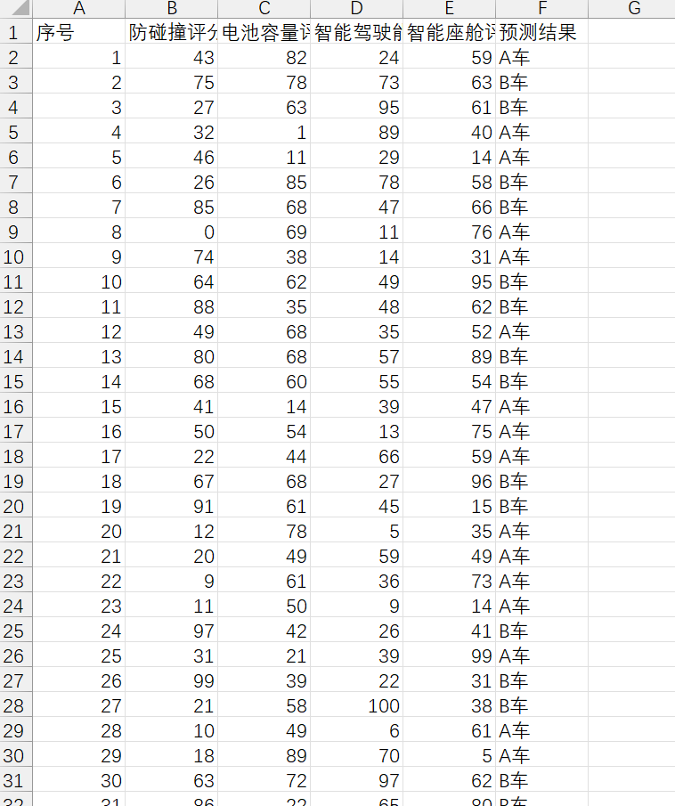
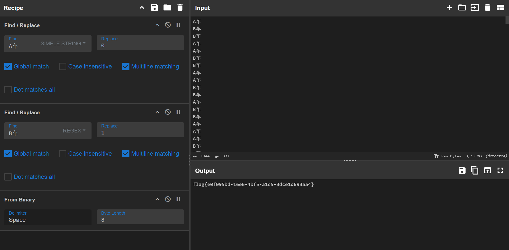

根据提供的数据训练一个模型，最后 `A车` 替换成0，`B车` 替换成1。

```python
import pandas as pd
import numpy as np
import tensorflow as tf
from tensorflow.keras.models import Sequential
from tensorflow.keras.layers import Dense, Dropout
from tensorflow.keras.optimizers import Adam
from sklearn.preprocessing import StandardScaler, LabelEncoder
from sklearn.model_selection import train_test_split
from sklearn.metrics import accuracy_score

# 1. 读取数据
data = pd.read_csv('新能源汽车检测数据.csv', encoding='gbk')
to_predict = pd.read_csv('待检测新能源车.csv', encoding='gbk')

# 2. 数据预处理
# 将目标变量（名称）转换为数值
label_encoder = LabelEncoder()
data['名称'] = label_encoder.fit_transform(data['名称'])

# 分离特征和目标变量
X = data[['防碰撞评分', '电池容量评分', '智能驾驶能力', '智能座舱评分']].values
y = data['名称'].values

# 特征标准化
scaler = StandardScaler()
X_scaled = scaler.fit_transform(X)

# 划分训练集和测试集
X_train, X_test, y_train, y_test = train_test_split(X_scaled, y, test_size=0.2, random_state=42)

# 3. 构建模型
model = Sequential([
    Dense(64, activation='relu', input_shape=(X_train.shape[1],)),
    Dropout(0.2),
    Dense(32, activation='relu'),
    Dropout(0.2),
    Dense(1, activation='sigmoid')  # 二分类问题，输出层使用 sigmoid 激活函数
])

# 编译模型
model.compile(optimizer=Adam(learning_rate=0.001),
              loss='binary_crossentropy',
              metrics=['accuracy'])

# 4. 训练模型
history = model.fit(X_train, y_train, epochs=50, batch_size=16, validation_split=0.2, verbose=1)

# 评估模型性能
loss, accuracy = model.evaluate(X_test, y_test, verbose=0)
print(f'模型准确率: {accuracy:.2f}')

# 5. 预测
# 提取待检测数据的特征并标准化
to_predict_features = to_predict[['防碰撞评分', '电池容量评分', '智能驾驶能力', '智能座舱评分']].values
to_predict_features_scaled = scaler.transform(to_predict_features)

# 进行预测
predictions = model.predict(to_predict_features_scaled)
predicted_labels = (predictions > 0.5).astype(int).flatten()  # 二分类问题，阈值为0.5

# 将预测结果转换回原始标签
predicted_labels = label_encoder.inverse_transform(predicted_labels)

# 6. 导出结果
# 将预测结果添加到待检测数据中
to_predict['预测结果'] = predicted_labels

# 导出到新的 CSV 文件
to_predict.to_csv('预测结果.csv', index=False, encoding='utf-8-sig')

print('预测结果已导出到 预测结果.csv')
```





```plain
flag{e0f095bd-16e6-4bf5-a1c5-3dce1d693aa4}

```

