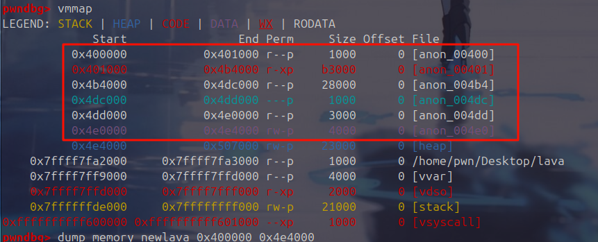
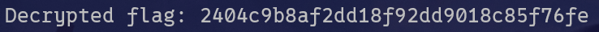
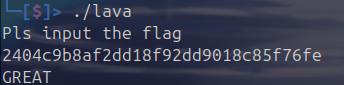

拿到一个带壳的 ELF 文件，用 gdb 手动脱壳。

```shell
pwndbg> catch syscall write
Catchpoint 1 (syscall 'write' [1])
pwndbg> r
Starting program: /home/pwn/Desktop/lava 

```

然后查看内存空间，把该程序 dump 出来。



脱壳成功，IDA 打开发现是一个魔改的 RC4。

直接照抄跑脚本即可。

```cpp
#include <iostream>
#include <cstring>
#include <cstdint> 
#include <vector>

void custom_init(uint8_t* S, const uint8_t* key, size_t key_len) {
    uint8_t v11[256];
    int v10 = 0;
    for (int i = 0; i <= 255; ++i) {
        S[i] = i;
        v11[i] = key[i % key_len];
    }
    for (int j = 0; j <= 255; ++j) {
        v10 = (v11[j] + v10 + S[j]) % 256;
        uint8_t v7 = S[j];
        S[j] = (v7 + S[v10]) % 256;
        S[v10] = (S[v10] + v7) % 256;
    }
}

void custom_decrypt(uint8_t* data, size_t len, const uint8_t* key, size_t key_len) {
    uint8_t S[256];
    custom_init(S, key, key_len);
    int v6 = 0;
    int v7 = 0;
    for (size_t i = 0; i < len; ++i) {
        v6 = (v6 + 1) % 256;
        v7 = (v7 + S[v6]) % 256;
        std::swap(S[v6], S[v7]);
        uint8_t k = S[(S[v6] + S[v7]) % 256];
        data[i] = (data[i] + k) % 256;
    }
}

int main() {
    uint8_t ciphertext[32] = {
        0x64, 0x3A, 0xD0, 0x79, 0xB9, 0xE9, 0x75, 0x52,
        0x6E, 0xE9, 0xFB, 0x0E, 0x52, 0x24, 0x1C, 0xB6,
        0x2B, 0xE4, 0x86, 0xF8, 0x69, 0x52, 0x53, 0x3E,
        0x3C, 0x8E, 0xB0, 0x16, 0x62, 0xE6, 0x98, 0x7F
    };
    const uint8_t key[] = "rc4IsEasy";
    custom_decrypt(ciphertext, 32, key, strlen((const char*)key));
    std::cout << "Decrypted flag: ";
    for (int i = 0; i < 32; ++i) {
        std::cout << (char)ciphertext[i];
    }
    std::cout << std::endl;
    return 0;
}


```





```plain
2404c9b8af2dd18f92dd9018c85f76fe

```

