## <font style="color:#01B2BC;">应急响应主线</font>
### <font style="color:#4C16B1;">1</font>
> 提交堡垒机中留下的flag
>

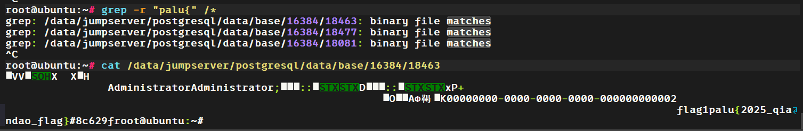

```plain
palu{2025_qiandao_flag}
```


### <font style="color:#4C16B1;">2</font>
> 提交WAF中隐藏的flag
>

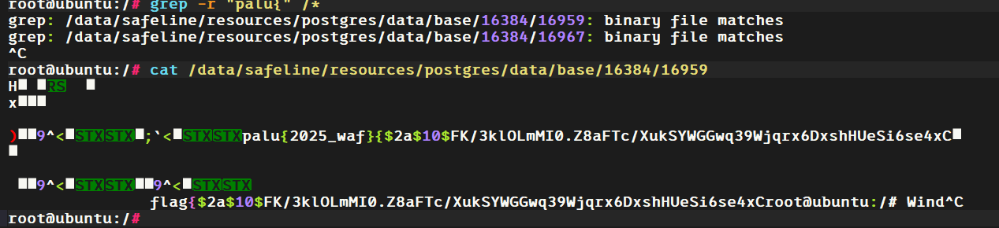

```plain
palu{2025_waf}
```


### <font style="color:#4C16B1;">3</font>
> 提交Mysql中留下的flag
>

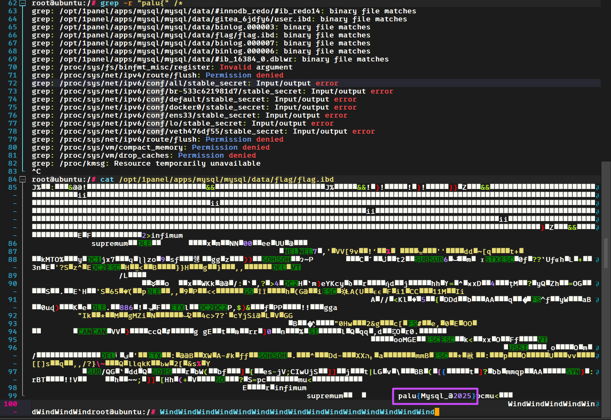

```plain
palu{Mysql_@2025}
```

### <font style="color:#4C16B1;">4</font>
> 提交攻击者的攻击IP
>

```plain
palu{192.168.20.107}
```


### <font style="color:#4C16B1;">5</font>
> 提交攻攻击者最早攻击时间flag格式为palu{xxxx-xx-xx-xx-xx-xx}
>

去看雷池 WAF 的面板。

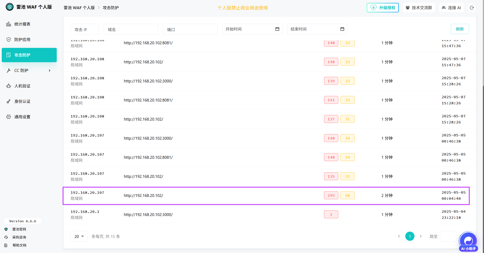

```plain
palu{2025-05-05-00:04:40}
```

### <font style="color:#4C16B1;">6</font>
> 提交web服务泄露的关键文件名
>

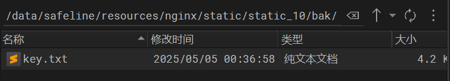

```plain
palu{key.txt}
```

### <font style="color:#4C16B1;">7</font>
> 题解泄露的邮箱地址
>

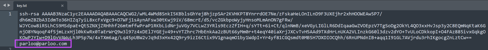

```plain
palu{parloo@parloo.com}
```


### <font style="color:#4C16B1;">8</font>
> 提交立足点服务器ip地址
>

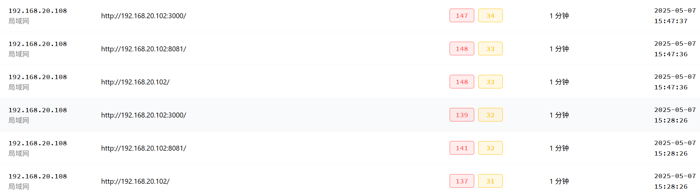

```plain
palu{192.168.20.108}
```

### <font style="color:#4C16B1;">9</font>
> 提交攻击者使用的提权的用户和密码
>

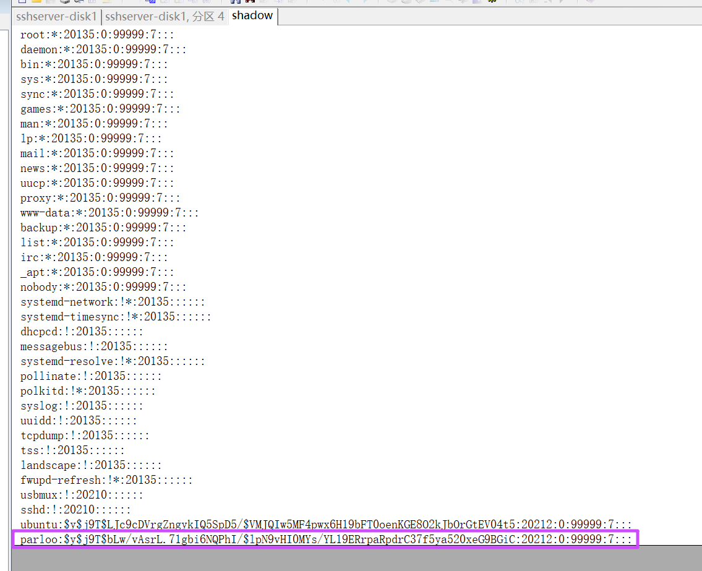

```plain
palu{parloo/parloo}
```

### <font style="color:#4C16B1;">10</font>
> 提交攻击者留下的的文件内容作为flag提交
>

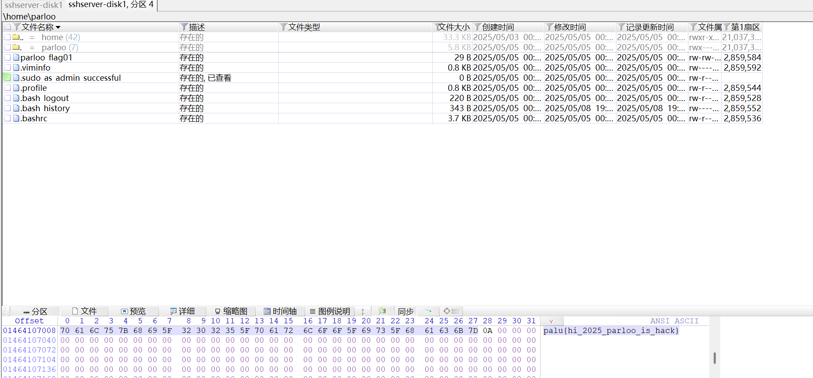

```plain
palu{hi_2025_parloo_is_hack}
```

### <font style="color:#4C16B1;">11</font>
> 提交权限维持方法服务的名称
>

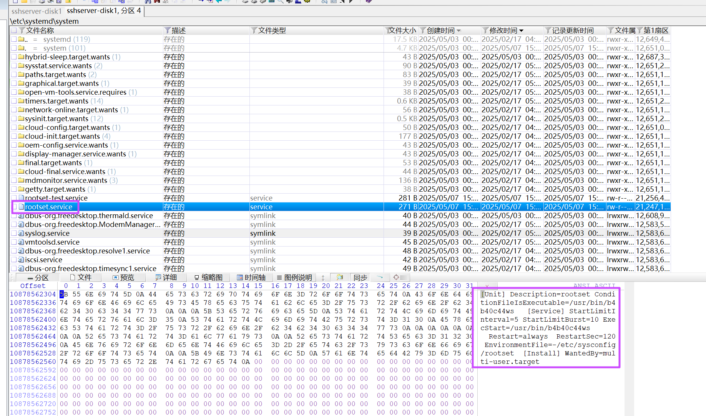

```plain
palu{rootset}
```

### <font style="color:#4C16B1;">12</font>
> 提交攻击者攻击恶意服务器连接地址作为flag提交
>

server 里面有一个 aa 程序。

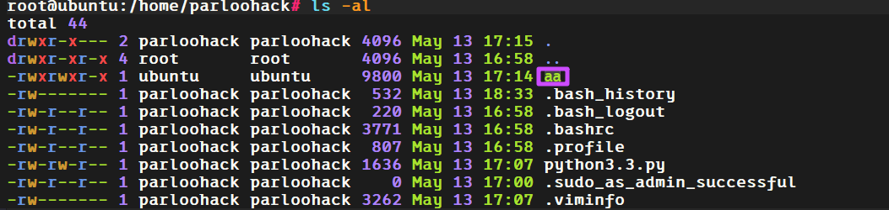

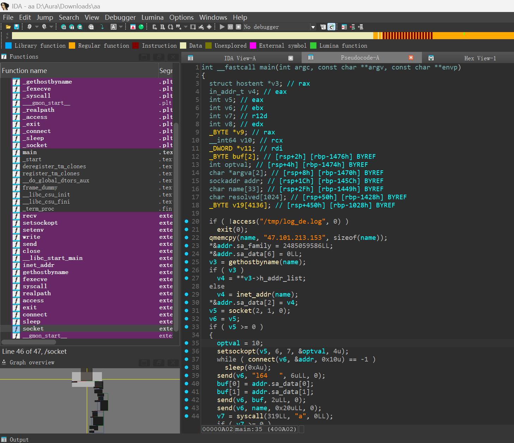

```plain
palu{47.101.213.153}
```

### <font style="color:#4C16B1;">13</font>
> 找到系统中被劫持的程序程序名作为flag提交
>

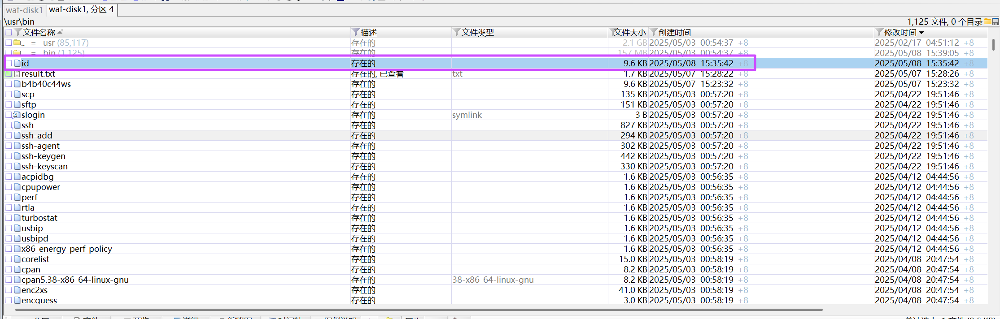

按照修改时间排序，发现 id 很可疑。

```plain
palu{id}
```

### <font style="color:#4C16B1;">14</font>
> 找到系统中存在信息泄露的服务运行端口作为flag提交
>

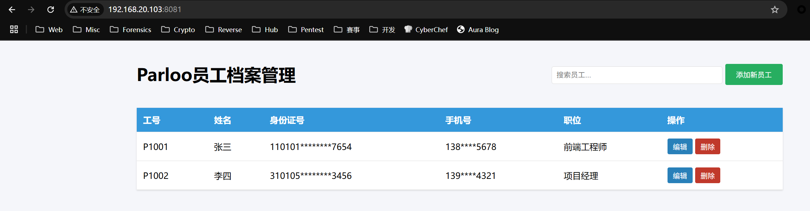

```plain
palu{8081}
```

### <font style="color:#4C16B1;">15</font>
> 提交Parloo公司项目经理的身份证号作为flag提交
>

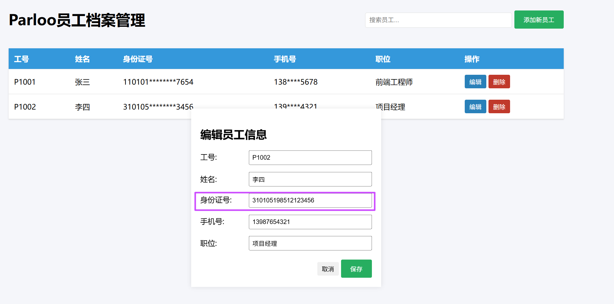

```plain
palu{310105198512123456}
```

### <font style="color:#4C16B1;">18</font>
> 提交攻击者留下的恶意账户名称md5后作为flag进行提交。 格式为palu{md5{xxxxx}}
>

进源机器开机可以选用户，发现一个 hack 用户。

```plain
palu{d78b6f30225cdc811adfe8d4e7c9fd34}
```

### <font style="color:#4C16B1;">19</font>
> 提交内部群中留下的flag并提交
>

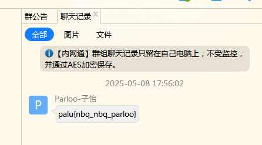

```plain
palu{nbq_nbq_parloo}
```

### <font style="color:#4C16B1;">20</font>
> 请提交攻击者使用维护页面获取到的敏感内容作为flag进行提交
>

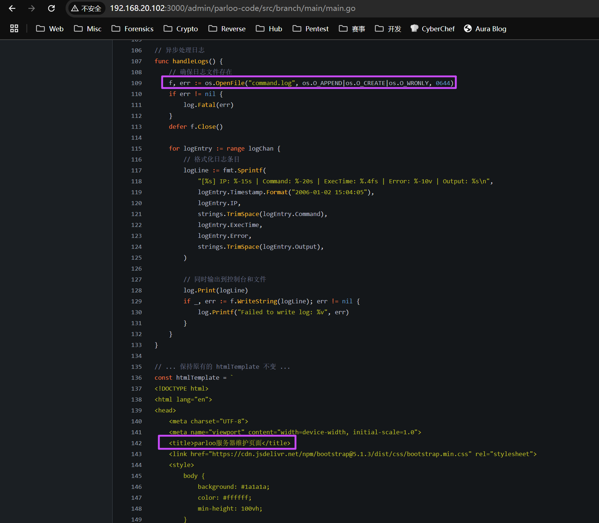

后门程序的源码在 gitea 里面，可以发现把日志放在了 command.log 里面。 

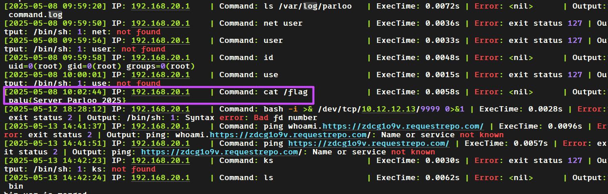

```plain
palu{Server_Parloo_2025}
```

### <font style="color:#4C16B1;">21</font>
> 提交获取敏感内容IP的第一次执行命令时间作为flag进行提交。flag格式为palu{xxxx-xx-xx:xx:xx:xx}
>

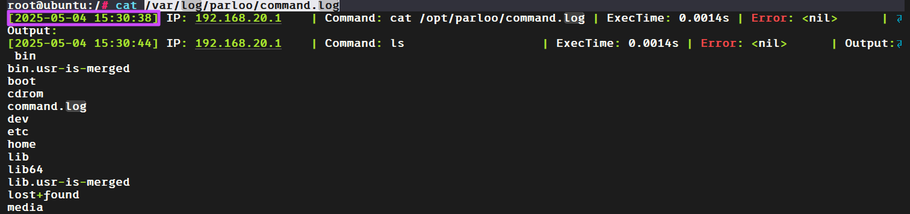

```plain
palu{2025-05-04:15:30:38}
```

### <font style="color:#4C16B1;">22</font>
> 提交攻击者使用的恶意ip和端口flag格式为palu{xx.xx.xx.xx:xxxx}
>

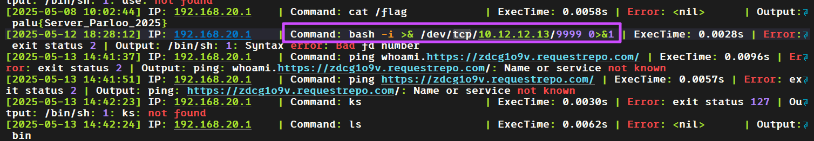

```plain
palu{10.12.12.13:9999}
```

### <font style="color:#4C16B1;">23</font>
> 提交重要数据的名文内容作为flag提交
>

palu03 桌面有个重要的数据.txt，但是交了不对，被加密了。

之前 Gitea 里面还有一个 hack 用户，他的仓库里面有一个加密脚本，但只提供了一个加密函数：

```python
def custom_encrypt(text, key):
    encrypted = []
    key_bytes = [ord(c) for c in key]

    for i, char in enumerate(text):
        shifted = ord(char) + (i % 5 + 1)

        xor_key = key_bytes[i % len(key_bytes)]
        xored = shifted ^ xor_key
        substituted = ((xored & 0x0F) << 4) | ((xored & 0xF0) >> 4)
        encrypted.append(f"{substituted:02x}")
    return "".join(encrypted)


```

自己传个参数进去，发现密文的格式和重要的数据.txt 的内容一致，尝试去解密。

这里不知道密钥，我们猜测解密出来的内容的头部是 palu{，由于明文和密钥是一位一位进行加密的，我们可以进行明文攻击，反推出密钥，最后手动试出来密钥是 `MySecretKey`。

```python
def custom_decrypt(ciphertext, key):
    decrypted = []
    key_bytes = [ord(c) for c in key]
    for i in range(0, len(ciphertext), 2):
        hex_byte = ciphertext[i:i+2]
        substituted = int(hex_byte, 16)
        xored = ((substituted & 0x0F) << 4) | ((substituted & 0xF0) >> 4)

        xor_key = key_bytes[(i // 2) % len(key_bytes)]
        shifted = xored ^ xor_key

        original_char_code = shifted - ((i // 2) % 5 + 1)
        decrypted.append(chr(original_char_code))

    return ''.join(decrypted)

key = "MySecretKey"
ciphertext = "c3a1c3c13e326020c3919093e1260525045e"
plaintext = custom_decrypt(ciphertext, key)
print(plaintext)

```

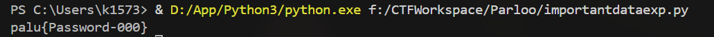

```plain
palu{Password-000}
```

### <font style="color:#4C16B1;">24</font>
> 提交恶意维权软件的名称作为flag进行提交
>

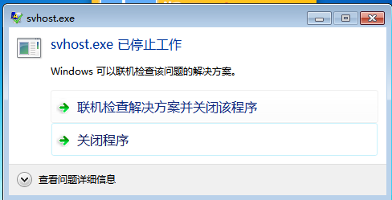

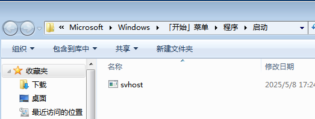

```plain
palu{svhost}
```

### <font style="color:#4C16B1;">25</font>
> 提交恶意程序的外联地址
>

这个程序在 palu03 里面，叫 ipconfig.exe，python 写的。

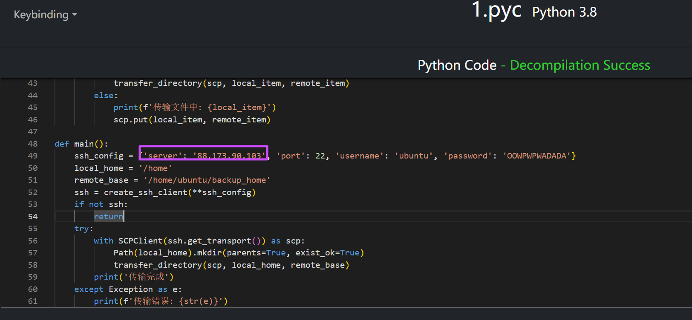

```plain
palu{88.173.90.103}
```

### <font style="color:#4C16B1;">26</font>
> 提交攻击这使用的恶意dnslog域名作为flag进行提交
>

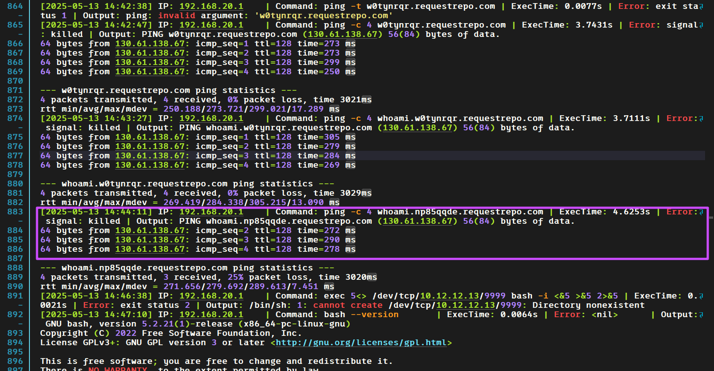

```plain
palu{np85qqde.requestrepo.com}
```

### <font style="color:#4C16B1;">27</font>
> 提交寻找反序列化漏洞的端口作为flag进行提交
>

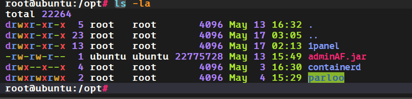

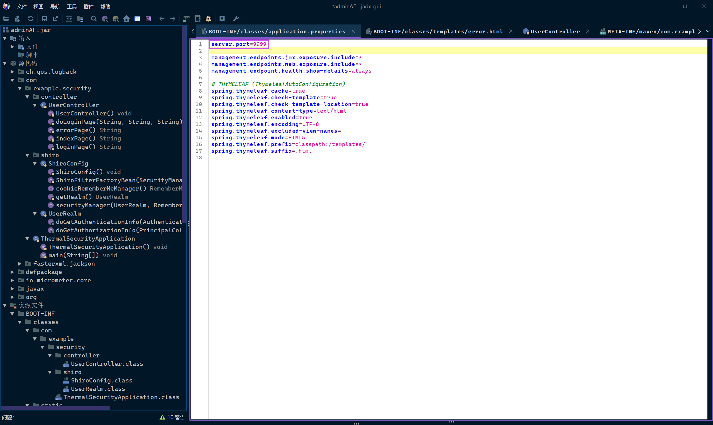

```plain
palu{9999}
```

### <font style="color:#4C16B1;">28</font>
> 提交web服务泄露的密钥作为flag进行提交
>

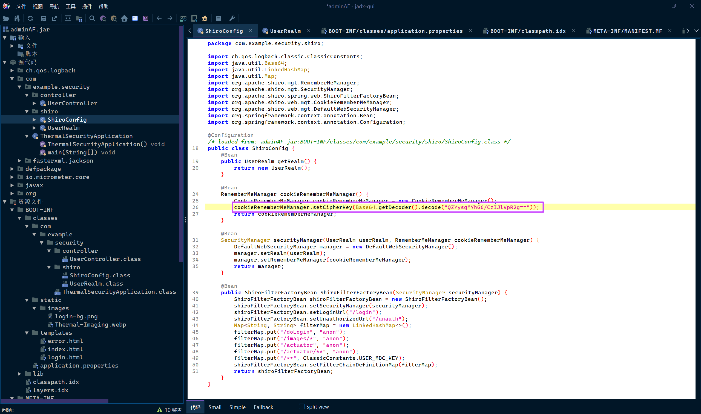

```plain
palu{QZYysgMYhG6/CzIJlVpR2g==}
```

### <font style="color:#4C16B1;">30</font>
> 提交攻击者在server中留下的账户密码作为flag进行提交。flag格式为palu{username/password}
>

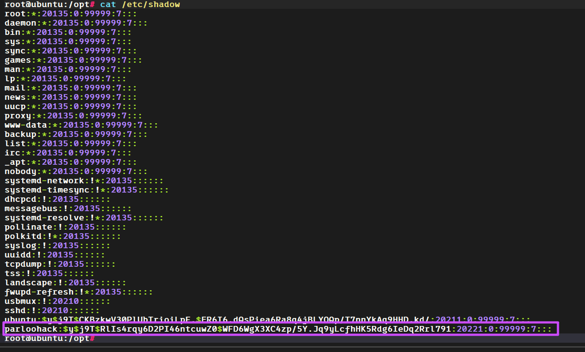

爆出来密码是 123456

```plain
palu{parloohack/123456}
```

### <font style="color:#4C16B1;">32</font>
> 提交攻击者留下的木马md5后作为flag进行提交
>

在 parloohack 的用户文件夹里面，有一个叫 aa 的文件。

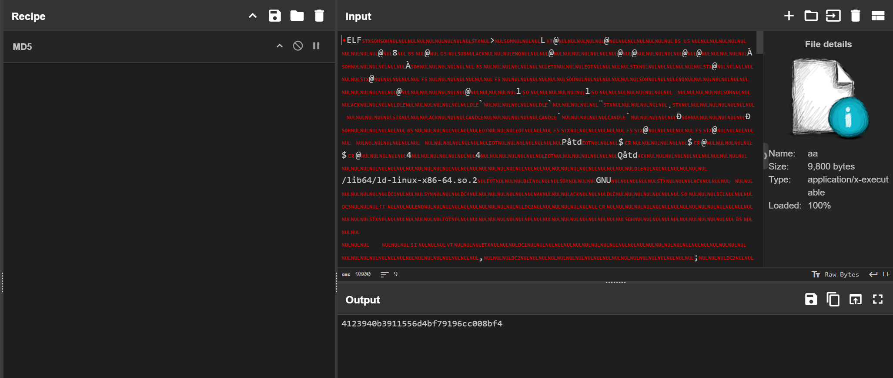

```plain
palu{4123940b3911556d4bf79196cc008bf4}
```

### <font style="color:#4C16B1;">33</font>
> 提交攻击者留下的溯源信息作为flag进行提交
>

神人题。

先做的 46 题，想了想发现不对劲，还有一个保存的用户。

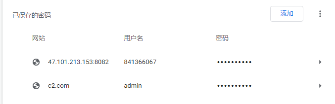

用户名就是 QQ 号，去看他的空间。


不过 flag 不在这里，还是在保存的密码里面。

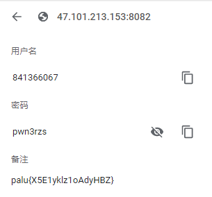

```plain
palu{X5E1yklz1oAdyHBZ}
```

### <font style="color:#4C16B1;">34</font>
> 提交攻击者的githubID作为flag进行提交
>


```plain
palu{ParlooSEc}
```

### <font style="color:#4C16B1;">35</font>
> 提交攻击者在github下留下的的内容作为flag进行提交
>

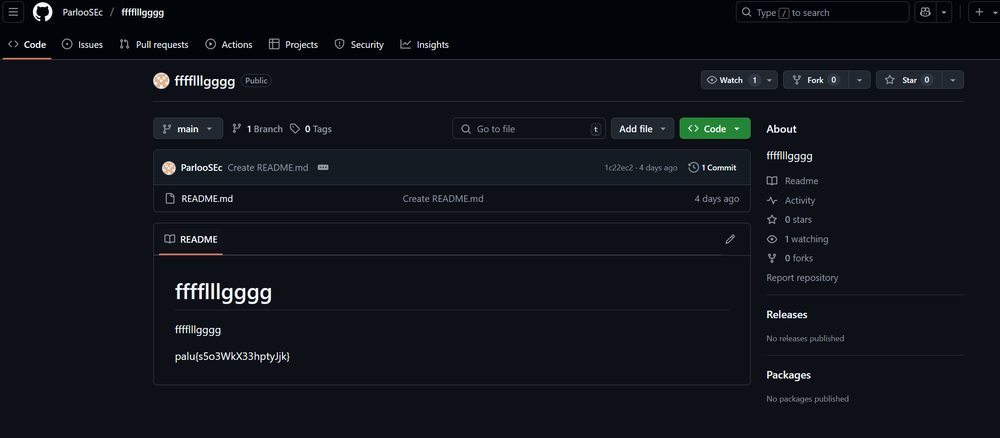

```plain
palu{s5o3WkX33hptyJjk}
```

### <font style="color:#4C16B1;">36</font>
> 提交恶意用户的数量作为flag进行提交
>

看 palu01，在登录系统的时候有一堆用户，除了 Parloo 以外还有 99 个账户。

```plain
palu{99}
```

### <font style="color:#4C16B1;">37</font>
> 提交恶意用户的默认密码作为flag进行提交
>

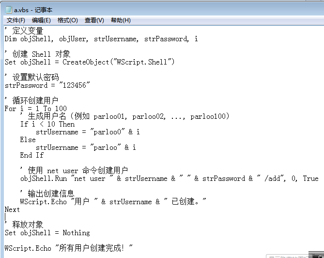

```plain
palu{123456}
```

### <font style="color:#4C16B1;">39</font>
> 提交私人git仓库中留下的内容作为flag进行提交
>

连接 gitea 的数据库。

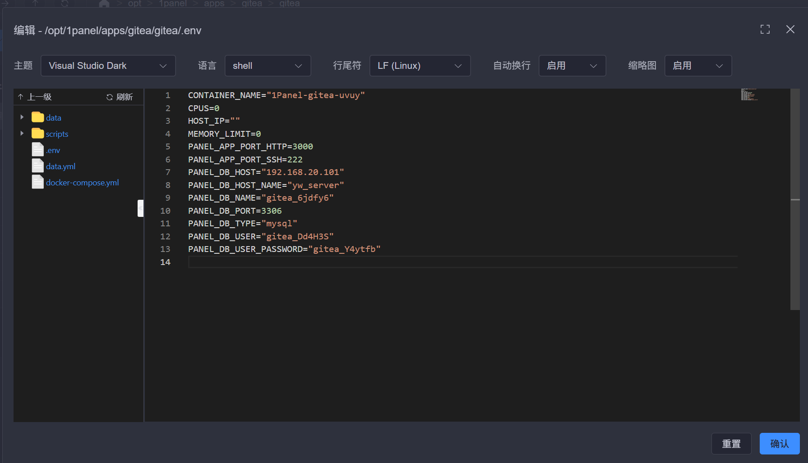

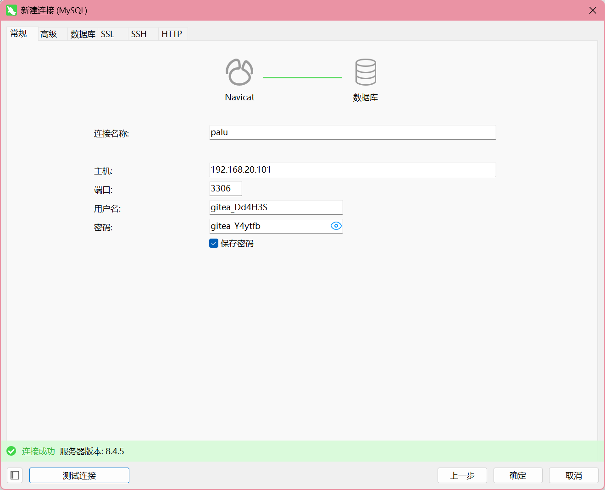

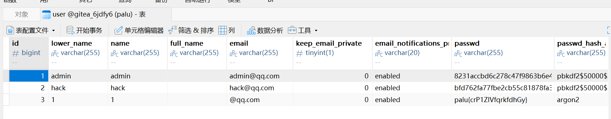

新建一个用户，然后覆盖 admin 的数据。

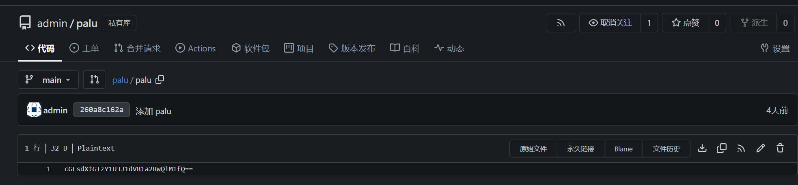

发现 base64 编码的 flag。

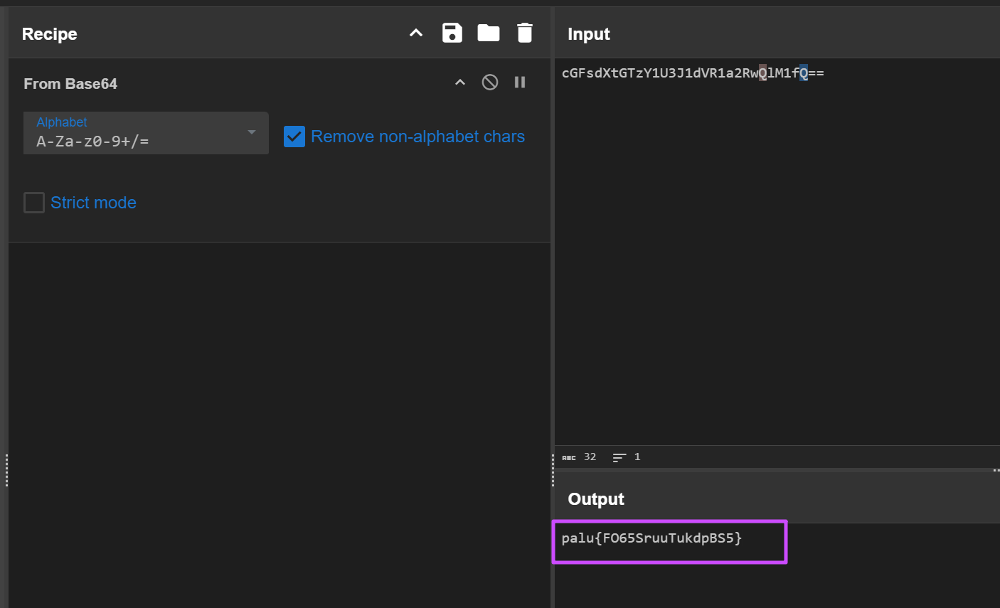

```plain
palu{FO65SruuTukdpBS5}
```

### <font style="color:#4C16B1;">40</font>
> 提交存在在mysql服务器中的恶意程序的MD5作为flag进行提交
>

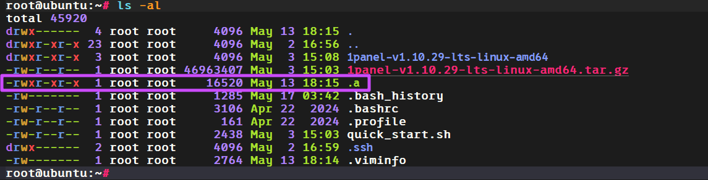

```plain
palu{ba7c9fc1ff58b48d0df5c88d2fcc5cd1}
```


### <font style="color:#4C16B1;">41</font>
> 提交恶意程序中模拟c2通信的函数名称作为flag进行提交
>

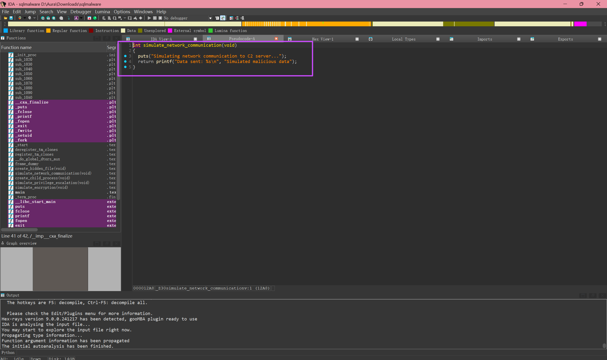

```plain
palu{simulate_network_communication}
```


### <font style="color:#4C16B1;">42</font>
> 提交恶意程序创建隐藏文件的名称作为flag提交
>

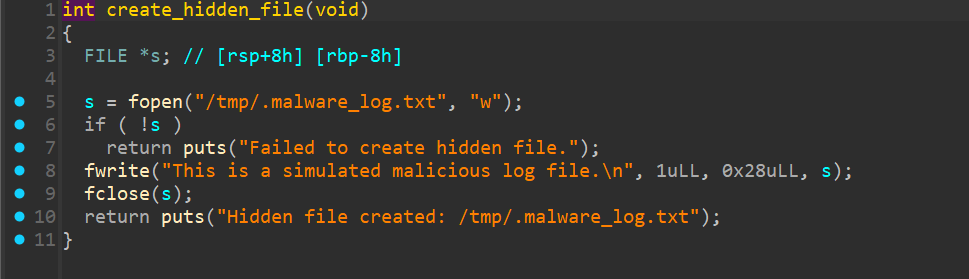

```plain
palu{.malware_log.txt}
```


### <font style="color:#4C16B1;">43</font>
> 提交恶意程序中模拟权限提升的函数作为flag进行提交
>

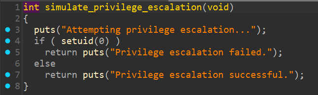

```plain
palu{simulate_privilege_escalation}
```

### <font style="color:#4C16B1;">44</font>
> 提交被钓鱼上线的用户名作为flag进行提交
>


```plain
palu{Parloo-子怡}
```


### <font style="color:#4C16B1;">45</font>
> 提交恶意程序的所在路径作为flag进行提交
>

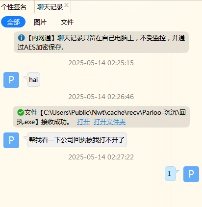

```plain
palu{C:\Users\Public\Nwt\cache\recv\Parloo-沉沉}
```

### <font style="color:#4C16B1;">46</font>
> 分析恶意程序的反连地址作为flag进行提交
>


```plain
palu{47.101.213.153}
```

### <font style="color:#4C16B1;">47</font>
> 提交恶意c2的服务器登录的账号密码作为flag进行提交。flag格式为palu{username/password}
>

在 palu02 里面，看谷歌浏览器保存的密码。


```plain
palu{admin/admin@qwer}
```

## <font style="color:#01B2BC;">畸形的爱</font>
```plain
WebServer
root/root
webserver/webserver

SQL服务器
sql/sql
 
Windows7 PC 1 
administrator/wmx666

Windows10 PC2 
administrator/zjl@123
```

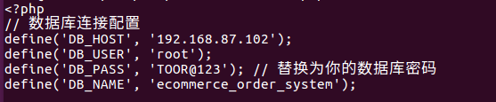

### 1
> 提交攻击者使用的攻击ip地址1
>
> flag格式为：palu{xxxx}
>

看 webserver 的 nginx 日志。

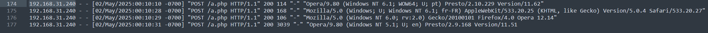

```plain
palu{192.168.31.240}
```

### 2
> 提交攻击者使用的攻击ip地址2.
>
> flag格式为：palu{xxxx}
>

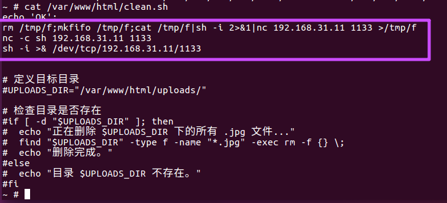

```plain
palu{192.168.31.11}
```

### 4
> 提交攻击者留下的flag1
>
> 格式为palu{xxx}
>

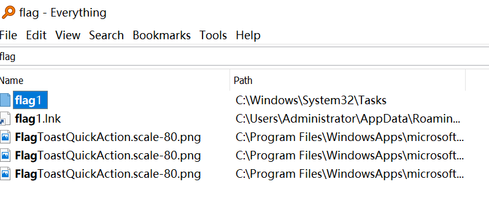

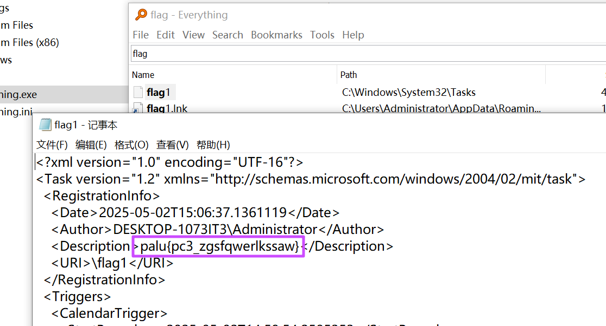

```plain
palu{pc3_zgsfqwerlkssaw}
```

### 5
> 提交攻击者留下的flag2
>
> 格式为：palu{xxxx}
>

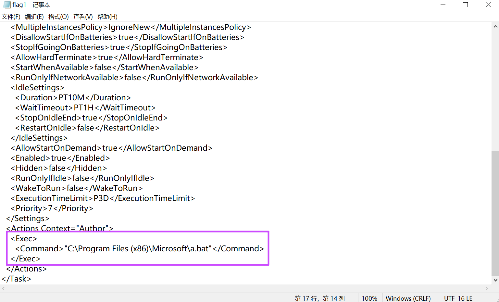

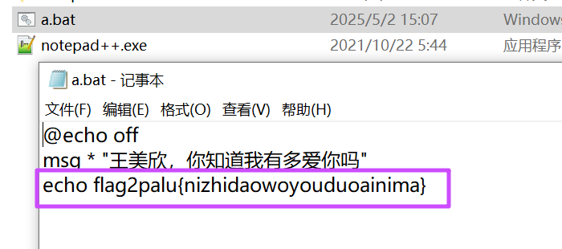

```plain
palu{nizhidaowoyouduoainima}
```

### 6
> 提交攻击者留下的flag3
>
> 提交格式为：palu{xxxx}
>

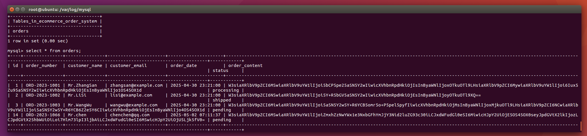

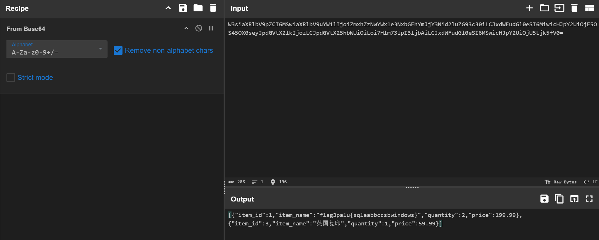

```plain
palu{sqlaabbccsbwindows}
```


### <font style="color:#4C16B1;">7</font>
> 提交钓鱼文件的哈希32位大写
>

回收站里面，捡出来解压，有个简历.exe。

```plain
palu{2977CDAB8F3EE5EFDDAE61AD9F6CF203}
```

### 8
> 提交攻击者留下的webshell-1密码
>
> 格式为：palu{xxxx}
>

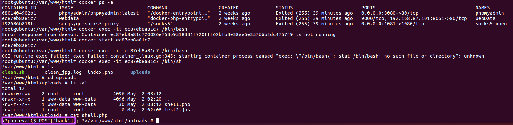

```plain
palu{hack}
```

### <font style="color:#4C16B1;">10</font>
> 提交攻击者留下的webshell密码2
>
> 格式为：palu{xxxx}
>

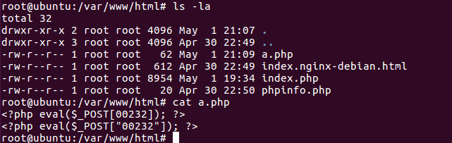

```plain
palu{00232}
```

### <font style="color:#4C16B1;">11</font>
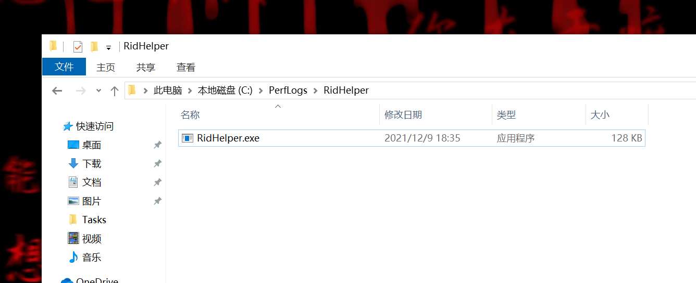

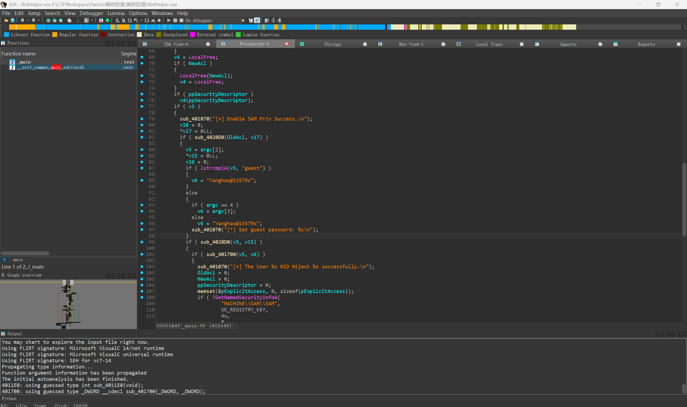

去看一下历史命令，没找到.....

### <font style="color:#4C16B1;">13</font>
> 提交溯源后得到的flag
>
> flag格式为：palu{xxx}
>

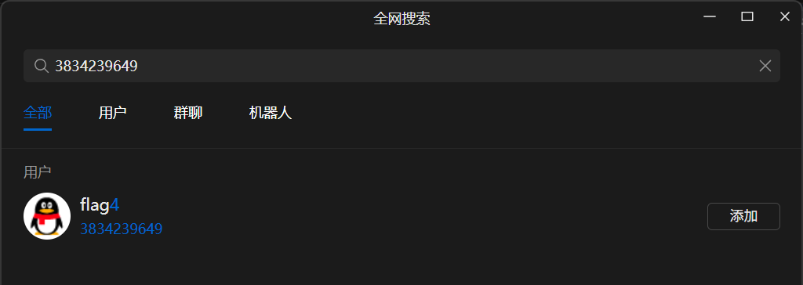

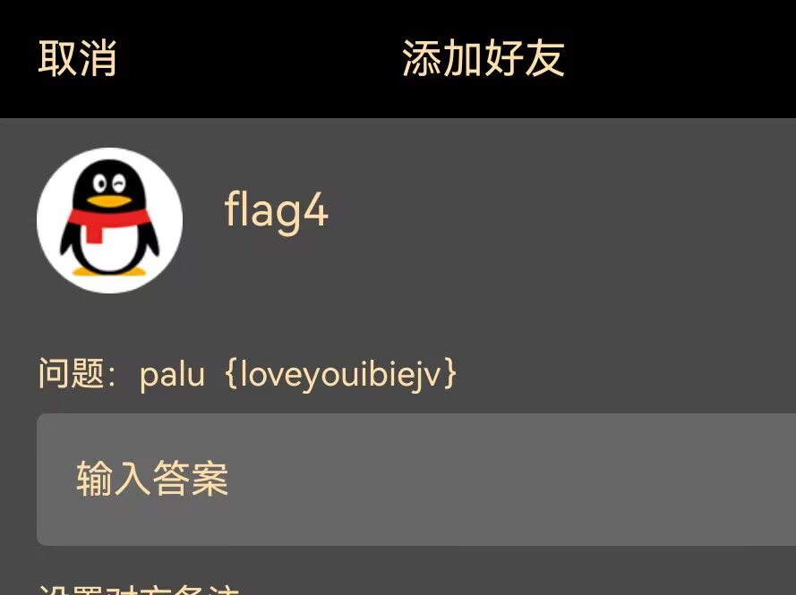

```plain
palu{loveyouibiejv}
```

## Reverse
### <font style="color:#4C16B1;">PositionalXOR</font>
> Flag 被一种基于位置的异或加密算法混淆。加密后数据保存在 encrypted.bin 中，每个字符的加密方式与其在字符串中的位置相关。你需要逆向加密逻辑，恢复原始 Flag。
>

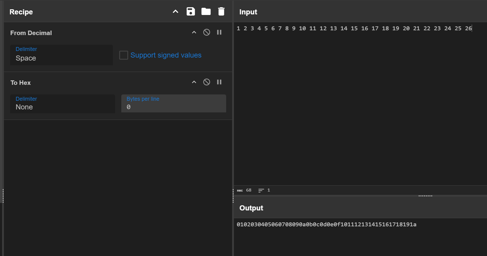

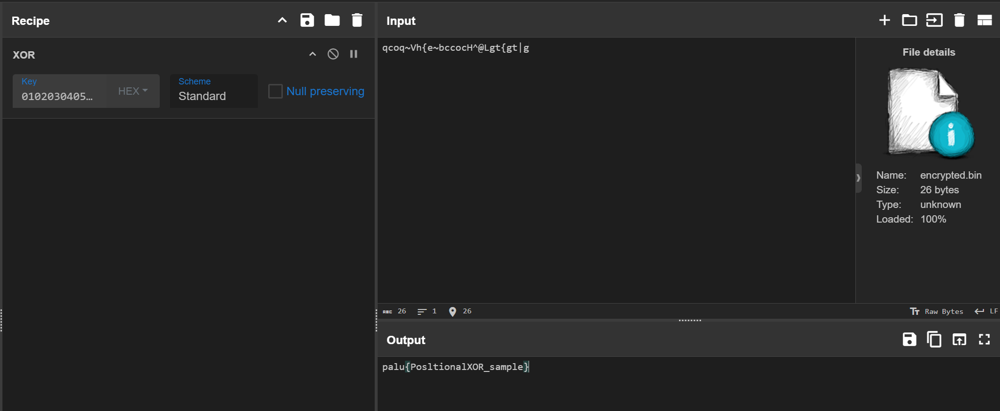


### <font style="color:#4C16B1;">PaluFlat</font>
> 帕鲁不是死肥宅，帕鲁不胖！帕鲁头晕目眩绝对不是炫多了
>

附件是个 7z 压缩包，解压后拿到一个 1G 的 exe，010 查看发现末尾都是 0x00，删去后用 IDA 打开分析。

```python
def reverse_shift(byte):
    for x in range(256):
        if ((16 * x) | (x >> 4)) & 0xFF == byte:
            return x
    raise ValueError(f"No match found for byte: {byte}")

def decrypt(data_hex: str) -> str:
    data = bytes.fromhex(data_hex)
    str_key = b"palu"
    alt_key = b"flat"
    result = []

    for i, b in enumerate(data):
        b = ~b & 0xFF
        b = (b + 85) & 0xFF
        b = reverse_shift(b)
        key = alt_key if (i % 2) else str_key
        k = key[i % len(key)]
        b ^= k
        result.append(b)

    return bytes(result).decode('utf-8', errors='ignore')

# 示例用法
if __name__ == "__main__":
    hex_input = input("Enter hex-encoded encrypted data: ").strip()
    print("Decrypted output:", decrypt(hex_input))

```

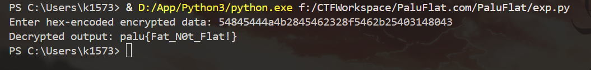

### <font style="color:#4C16B1;">PaluGOGOGO</font>
> 帕鲁该走了，要去当苦命打工人了，GOGOGO！
>

有个反调试，jnz 改成 jz 绕过。

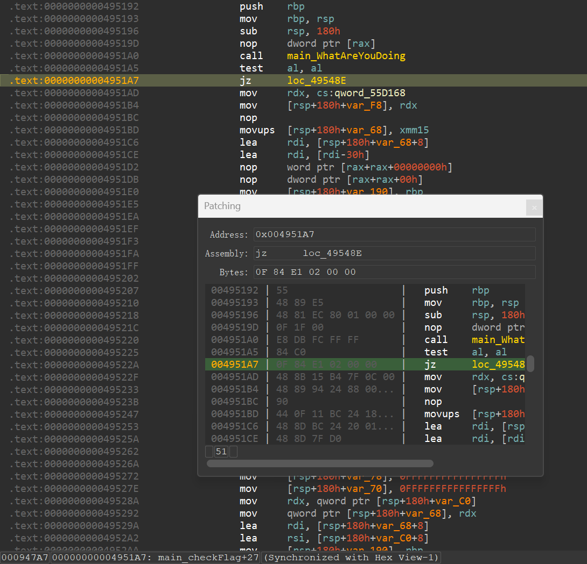

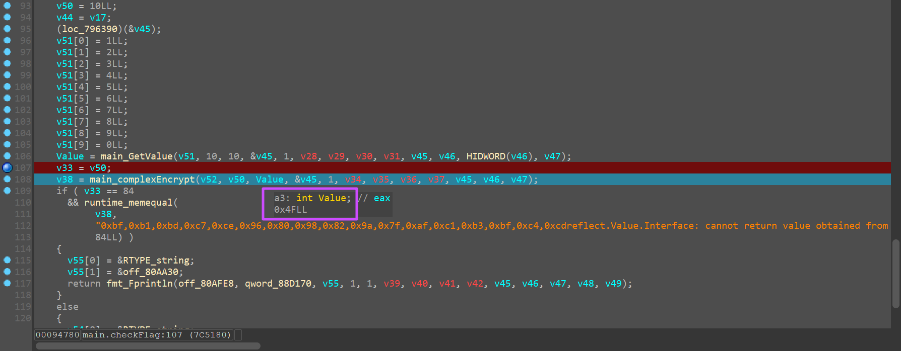

打个断点，动调把 value 取出来。

main_complexEncrypt 函数其实就是一个类似凯撒的函数，直接写脚本解密。

```python
def decrypt(cipher_bytes: bytes, key: int) -> str:
    cipher_text = cipher_bytes
    plain_chars = []
    for i, ch in enumerate(cipher_text):
        orig = ch - key - (i % 5)
        orig &= 0x10FFFF
        plain_chars.append(chr(orig))
    return ''.join(plain_chars)
cipher_hex = [
    0xbf, 0xb1, 0xbd, 0xc7, 0xce, 0x96, 0x80, 0x98,
    0x82, 0x9a, 0x7f, 0xaf, 0xc1, 0xb3, 0xbf, 0xc4, 0xcd
]
cipher_bytes = bytes(cipher_hex)
key = 0x4F
plain = decrypt(cipher_bytes, key)
print("解密结果：", plain)

```

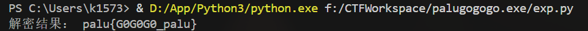

```plain
palu{G0G0G0_palu}
```

### <font style="color:#4C16B1;">CatchPalu</font>
> 主人给了帕鲁好多花花，帕鲁好开心呀！可是主人骗帕鲁，还把帕鲁抓了起来...
>

先去花指令，就是一堆 jz 和 jnz 互补跳转这种结构，把下面 jmp 的第一个字节 NOP 掉即可。

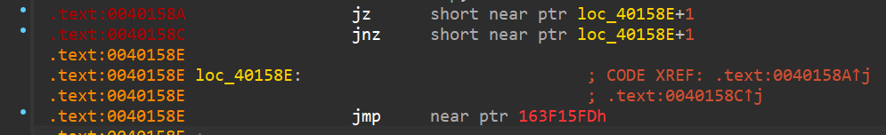

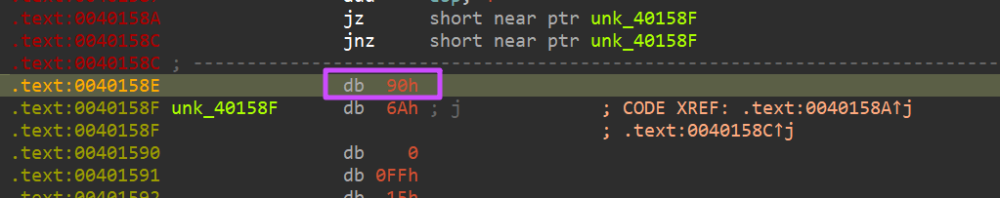

然后 UCP，把所有的处理好即可，接下来逆向程序。

直接下个断点，输入一个假 flag，可以进到解密的地方，直接取出来最终的真 flag。

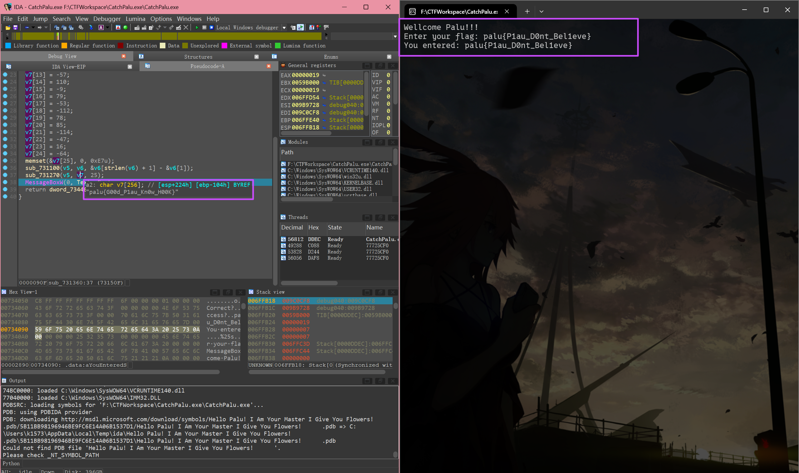

```plain
palu{G00d_P1au_Kn0w_H00K}
```

### <font style="color:#4C16B1;">帕鲁迷宫</font>
> 贪玩的帕鲁来走迷宫啦，主人要求我以最短路径完成全部出口！太难了...
>
> flag格式:palu{md5(最短路径步骤)}
>
> Eg:awsd是最短路径 则计算其MD5值得到palu{2f724716d49d79e1fd0d71d57d451de0}
>
> 最短路径使用BFS算法，flag唯一，核对最后四步为ssds
>

懒得写脚本了，直接手动走。

无语了......有多解，多试几次。

最后走出来这条路径是对的：

```plain
ssssddssddwwddwwddddddddssssssssddssaaaaaaaaaawwddddwwddwwaaaassaaaaaaaassddssssasadsdssssddssddssaassddssaaaaasadwdddddddwwddssddwwwwddddddwwaaaaaaaaaawwwwddssddwwddssddwwwwaawwddddwwwwddddddddddwwwwaawwddwwaawwdddaaassddssaassddssssssssaawwaaaaaassssssssssssssssaaaasadwddddddddddwwddssds
```

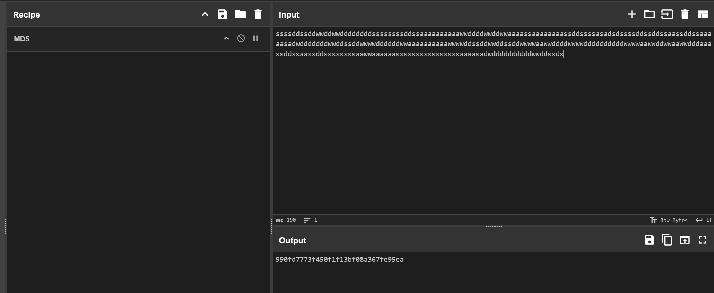

```plain
palu{990fd7773f450f1f13bf08a367fe95ea}
```

### <font style="color:#4C16B1;">PaluArray</font>
> 帕鲁有自己的数组，帕鲁有自己的字典，帕鲁就是帕鲁！帕鲁不要996！
>

魔改 UPX，改回去。

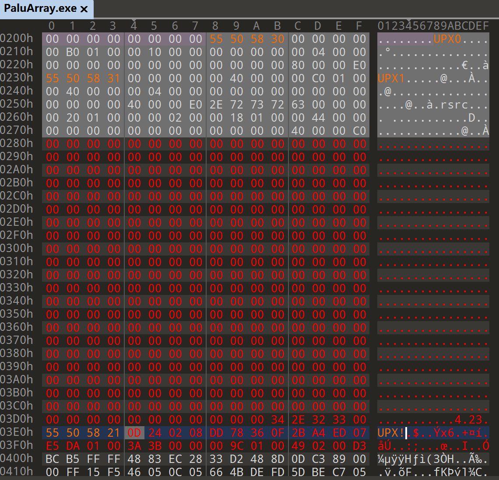

脱壳后直接问 GPT，有一个表是 `Palu_996!?`，要求输入一个字符串，对应的索引是 `1145141919810`。

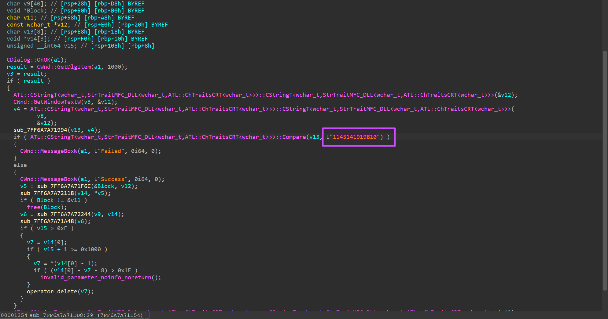

flag 的内容就是最后输入的字符串的 md5，当然如果字符串输对的话，也会弹出来一个带有 flag 的提示框。

手动构造，最后的字符串是 `aa_9a_a?a?!aP`。

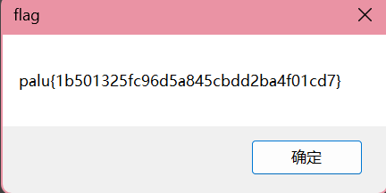

```plain
palu{1b501325fc96d5a845cbdd2ba4f01cd7}
```


