# 队伍：AE
**RK 1**

## <font style="color:#270070;">Misc</font>
### ezmisc-签到
> 关注微信公众号“Geek极安云科”、“OnePanda-Sec”,发送flag，获取片段，并拼接存档内红石音乐歌名，其中OnePanda公众号回复的flag去掉右括号。示例：MCCTF{flag1_flag2_孤勇者}
>

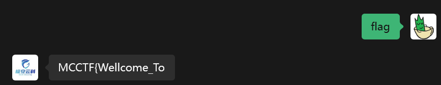

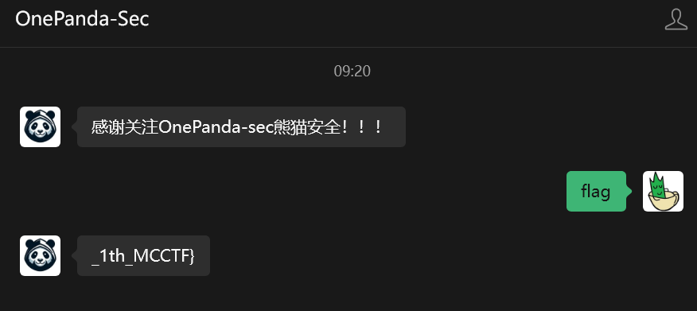

音乐听不出来，队友听出来了。

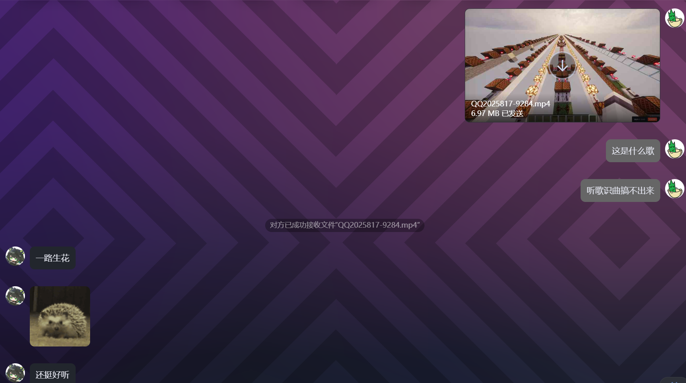

拼起来就是 flag。

### EzChat
> 腐竹收到玩家举报发现间谍Ca1XuKun正在泄露服务器机密，请协助腐竹找出泄露的机密信息
>

流量包里面搜字符串 msg，发现有很多 base64 编码的内容，里面还有假 flag。

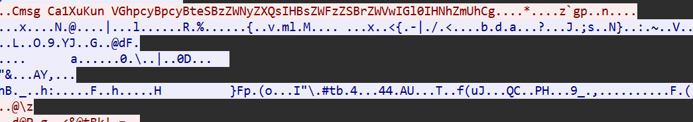

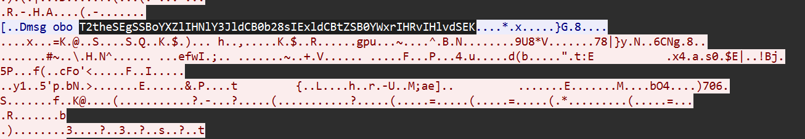

最后定位到 obo 玩家，他的 flag 应该是对的，需要解一下。

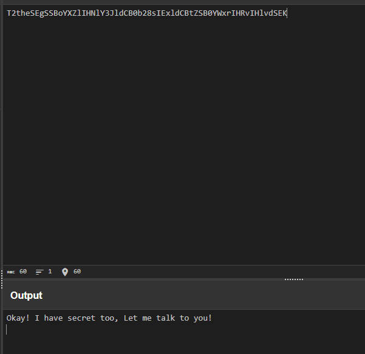

ROT13+base32+base64。

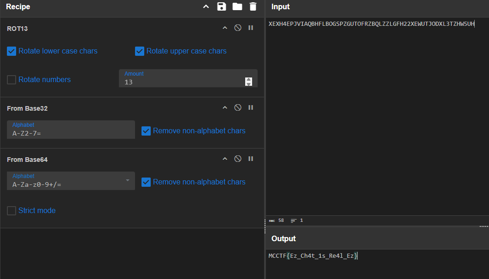

### Minecraft 音乐中的秘密
> 在探索 Minecraft 神秘岛屿时，你偶然发现一段循环播放的背景音乐和一个杂音。村民们说这是远古版本留下的旋律，但你总觉得这段音频中藏着不寻常的节奏 —— 或许，这是某个黑客团队留下的 CTF 挑战？注意大写flag：MCCTF{}
>

第一个音频的最后是 Morse Code，直接解。

```plain
FLAG1MCCTFBING
```

第二个音频是 WAV 的 LSB 隐写，上脚本。

```python
import wave
import libnum

wav = wave.open('Minecraft2.wav', 'r')

# 读取前1000帧的音频数据并将其转换为十六进制字符串
# readframes()返回的是字节数据，.hex()将其转换为十六进制表示
frames_data = wav.readframes(1000).hex()
res = ''

# 遍历十六进制数据，每次处理4个字符(2字节)
# 因为WAV文件通常使用16位(2字节)采样
for i in range(0, len(frames_data), 4):
    data = frames_data[i:i+4]
    # 将数据从小端序转换为大端序，因为WAV文件使用小端序存储数据
    data_rev = int(data[2:] + data[:2], 16)
    # 使用位与运算(&)获取最低有效位(LSB)
    res += str(data_rev & 1)
    
print(libnum.b2s(res))


```

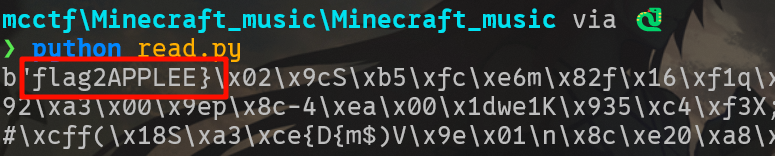

### What is in front of the torch
> 题目内容描述...Steve是位伟大的音乐家，但不幸遇难了，请跟着火把走，看看有什么吧！
>


Morse Code，铁块代表 Dot，泥土代表 Dash，最后解出来要拼上告示牌上面的 010。

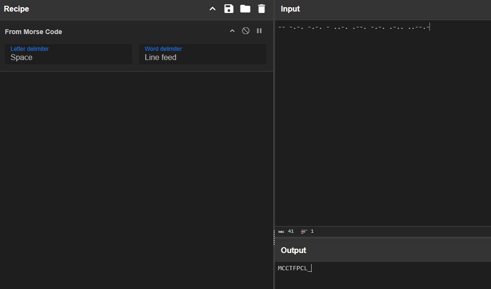

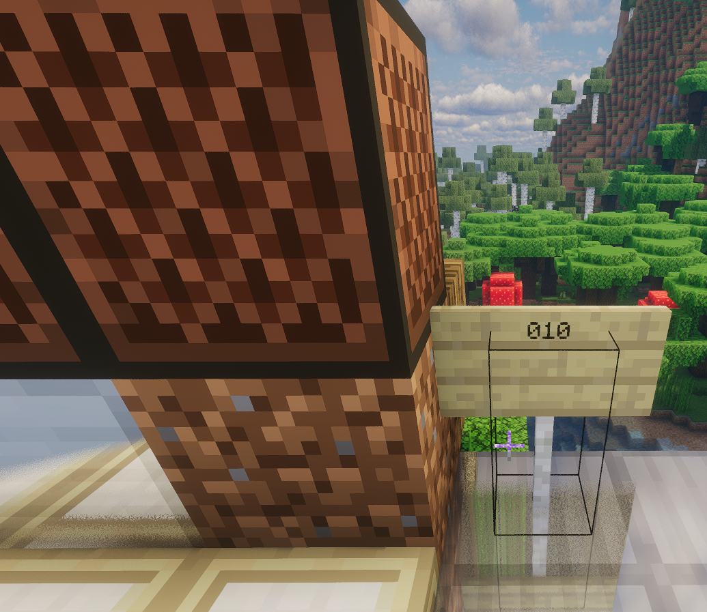

```plain
mcctf{PCL_010}
```

### 小狗学习日记之神秘的数字
> 小狗最近迷恋上数学，史蒂夫给它了一串神秘的数字，并且告诉他，密钥可能藏在随附的一张图片里。史蒂夫喜欢用一些奇怪的数学方法来加密。你能破解出这份神秘的数字清单背后的真相吗？
>

神人题，附件一开始还给错了。

excel 的密码是 123456，可以试出来，试不出来就用 passware 爆。

进去全选颜色改红，发现提示。

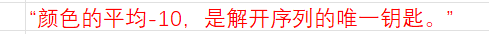

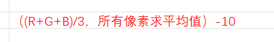

写一个脚本，读取图片的每一个像素，求出每个像素的 (R+G+B)/3 的值，然后再把每个像素的这个值求一个平均值。

```python
from PIL import Image

# 打开图像文件
image_path = 'image.jpg'  # 替换为你的 JPG 文件路径
image = Image.open(image_path)

# 将图像转换为 RGB 模式（确保图像不是其他模式，如 RGBA 或灰度）
#image = image.convert('RGB')

# 获取图像的宽度和高度
width, height = image.size

# 初始化所有像素的 RGB 平均值总和
total_pixel_average = 0

# 遍历每个像素，计算每个像素的 RGB 平均值，并累加
for x in range(width):
    for y in range(height):
        # 获取像素的 RGB 值
        r, g, b = image.getpixel((x, y))
        # 计算该像素的 RGB 平均值
        pixel_average = (r + g + b) / 3
        # 累加到总和中
        total_pixel_average += pixel_average

# 计算所有像素的 RGB 平均值的平均值
total_pixels = width * height
global_average = total_pixel_average / total_pixels

# 输出结果
print(f"所有像素的 RGB 平均值的平均值: {global_average:.2f}")


```

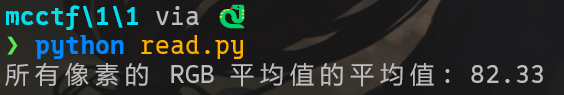

最后有点脑洞，要把密文先异或一下 (82-10)，再把异或后的字符串 -10。

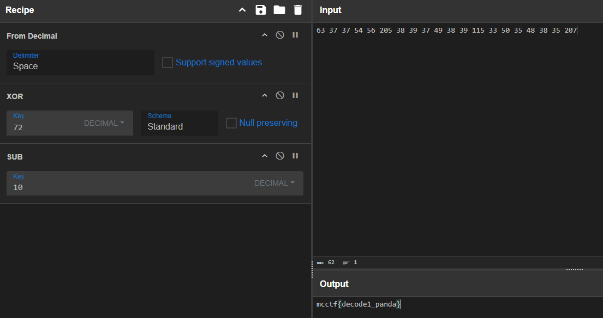

## <font style="color:#270070;">Reverse</font>
### Ezhard_launcher
> 你获得了一个自制的“我的世界”启动器（Python源码/可执行文件）。据说只有输入正确的用户名和密码才能启动游戏并获得 flag。请通过逆向分析启动器，找出认证机制并获得 flag。
>

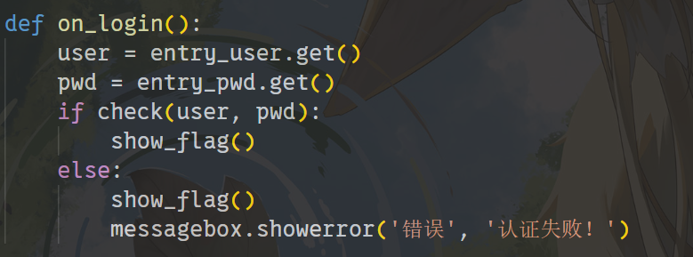

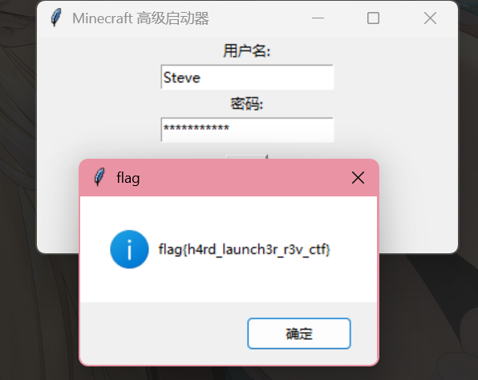

直接改源码。


## <font style="color:#270070;">Web</font>
### ez_Minecraft_login
> 史蒂夫新上线的登录系统似乎有些安全隐患，你能在不知用户名和密码的情况下登录进去并拿到 flag 吗？
>

用户名和密码都填 admin' or 1=1--+，进入后台看源码，直接能看到 flag。

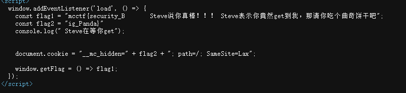

### MinecraftWeb
> Minecraft中的几个核心机制
>

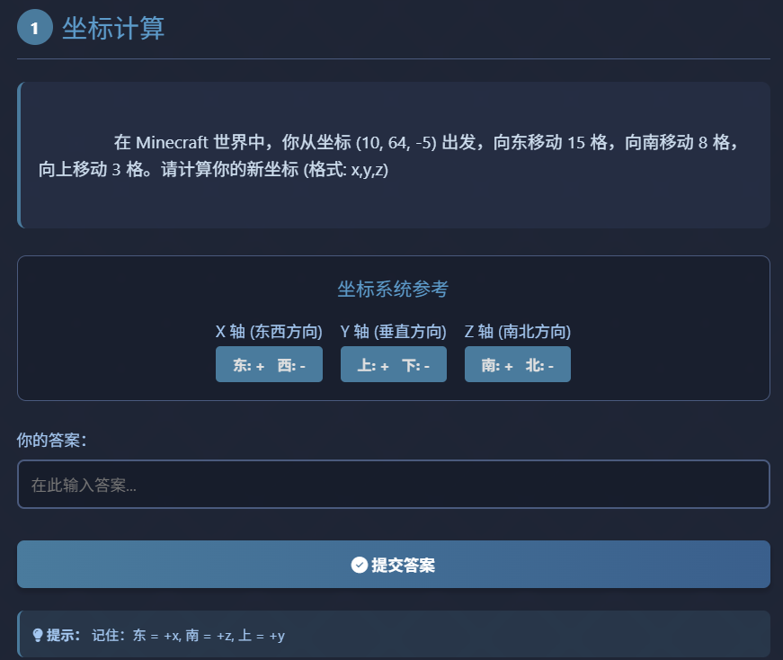

正确答案应该是 25,67,3，出题人 Z 轴坐标算反了，提交 25,67,-13 才对。

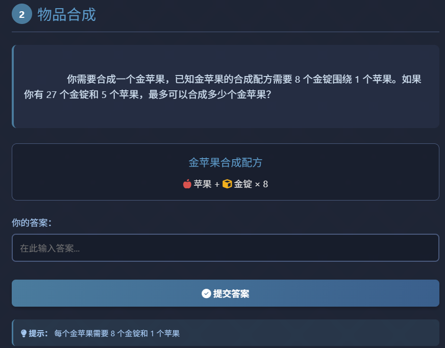

3。

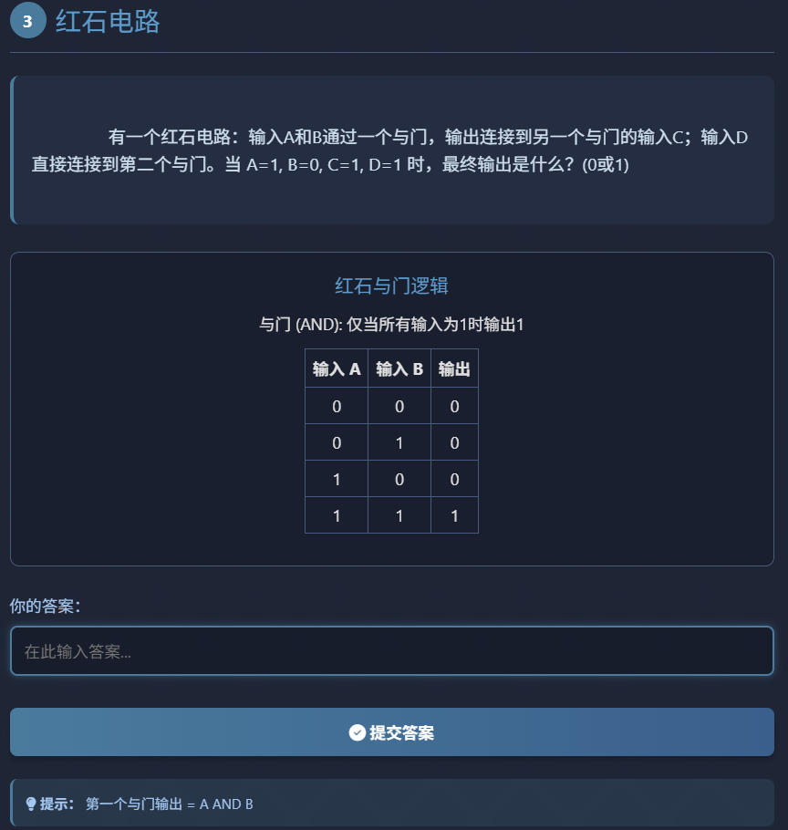

0

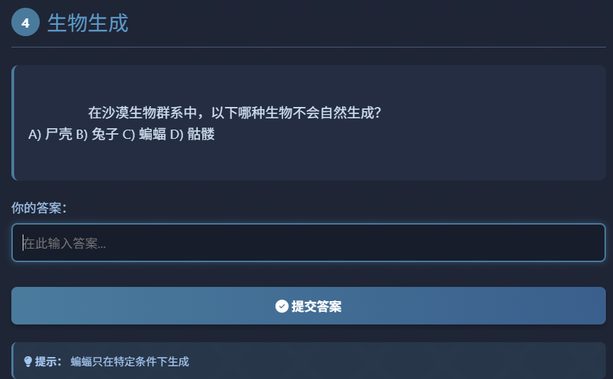

C

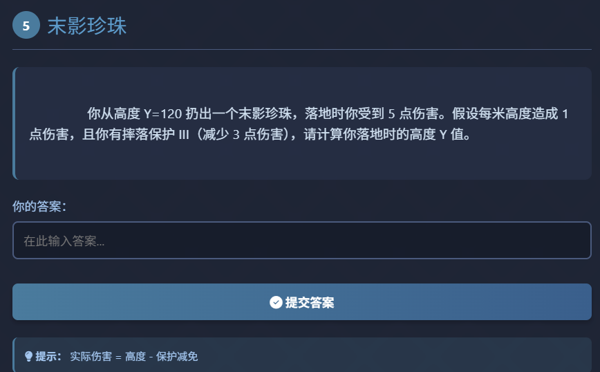

答案应该是 120 - ((5+3) × 1) = 112，出题人又写错了，提交 8 才对。

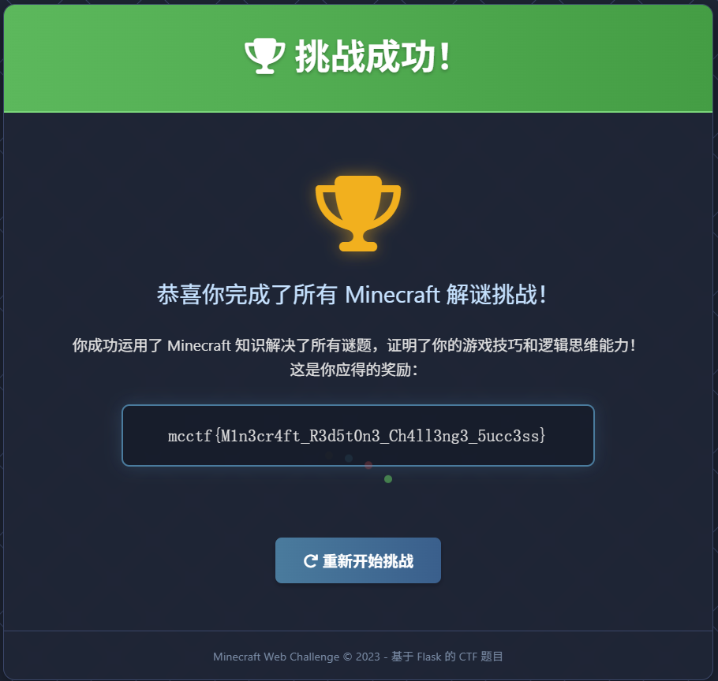

## <font style="color:#270070;">Crypto</font>
### ezlog
> 你是一个《我的世界》服务器管理员，在某个事件后，你发现服务器的日志文件被篡改。根据一条线索，玩家曾经在日志中隐藏了一些敏感信息。你的任务是通过对服务器日志文件进行分析，揭示隐藏的消息。
>

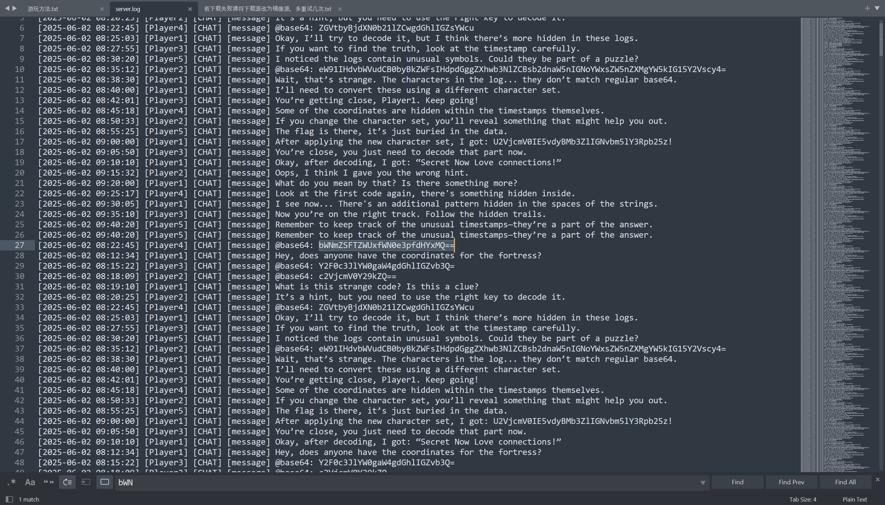

直接搜 base64 编码的 flag 头。

### 咩咩咩
> 咩咩咩咩咩咩咩咩咩咩咩咩咩咩咩
>

去掉咩以后是 Morse Code，然后维吉尼亚。提示给了密钥。

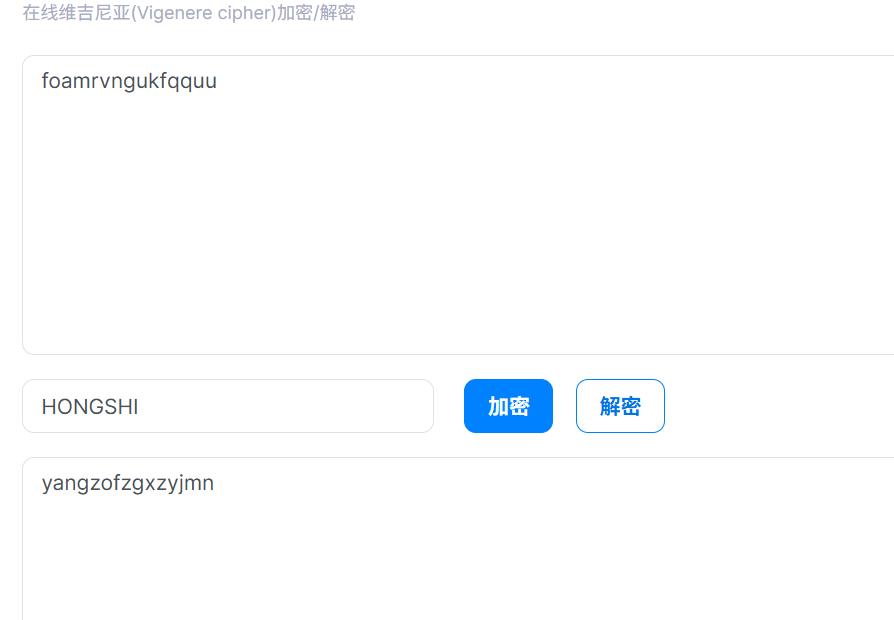

flag 头包裹里面的字符串即可。


### ezRedstoneParkour
> 红石跑酷，酷吧！但是Steve的青金石不见了，你可以帮忙找一找吗？
>

结合题目描述提示，答案应该是青金石在 Minecraft 中的 ID 的偏移，偏移值是固定的 -15。

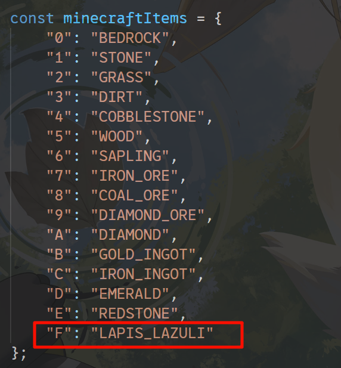

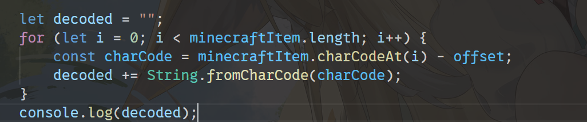

这里输出一下 decoded，就不需要手动去进行偏移了。

一直刷新电路，当二进制是 1 1 1 1 时对应青金石 F，控制台输出的内容就是 flag 里面的字符串。

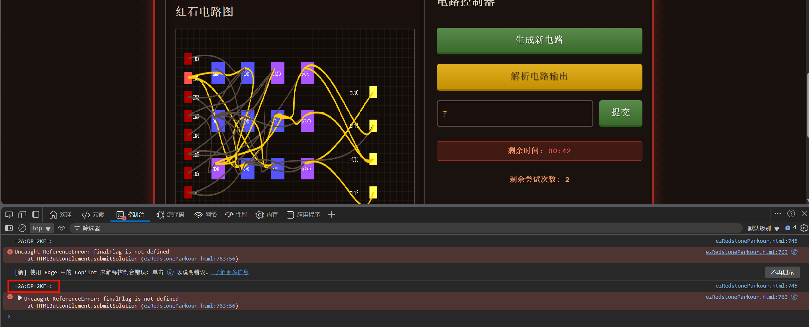

### ez_lattice
> 格永远充斥着无穷的魅力.
>

deepseek 跑出来了，flag 由 mcctf{} 和 一个 uuid 组成，一共 43 个字节。

一共分了 10 块，最后一块是 7 个字节，前面每块都是 4 个字节。

```python
from Crypto.Util.number import bytes_to_long, long_to_bytes, isPrime
import math

n = 
h = []

# 尝试恢复 flag0 为 b'mcct' (4 字节)
flag0_bytes = b'mcct'
flag0 = bytes_to_long(flag0_bytes)
print(f"flag0 (int): {flag0}")

# 计算候选 k: k = (flag0 * h0) mod n
k_candidate = (flag0 * h[0]) % n
print(f"k_candidate (before adjustment): {k_candidate}")

# 由于 k 是 320 位素数，检查范围
k_lower_bound = 2**319
k_upper_bound = 2**320 - 1

# 调整 k 到正剩余系
if k_candidate < 0:
    k_candidate += n

print(f"k_candidate: {k_candidate}")
print(f"Bit length: {k_candidate.bit_length()}")

# 检查 k 是否为素数
if k_candidate < k_lower_bound or k_candidate > k_upper_bound:
    print(f"k_candidate is not in the 320-bit range: bit length = {k_candidate.bit_length()}")
    # 即使不在范围，继续尝试恢复 flag
else:
    print(f"k_candidate is in the 320-bit range: bit length = {k_candidate.bit_length()}")
    if isPrime(k_candidate):
        print("k_candidate is prime!")
    else:
        print("k_candidate is not prime!")

# 使用候选 k 恢复其他 flag 块
def solve_flag_i(i, k_val, n_val, h_i):
    try:
        # 计算 t_i: 解 n * t_i ≡ -k (mod h_i)
        # 即 t_i = (-k) * inv(n, h_i) mod h_i
        inv_n = pow(n_val, -1, h_i)
        t_i = (-k_val) % h_i
        t_i = (t_i * inv_n) % h_i
        
        # 计算 flag_i = (k + t_i * n) // h_i
        numerator = k_val + t_i * n_val
        if numerator % h_i != 0:
            # 尝试调整 t_i: 加一个 h_i 的倍数
            t_i += h_i
            numerator = k_val + t_i * n_val
            if numerator % h_i != 0:
                return None
        flag_i = numerator // h_i
        return flag_i
    except Exception as e:
        print(f"Error for i={i}: {e}")
        return None

flag_parts = []
flag_parts.append(flag0)  # 已知的第一个块

# 恢复其他块 (i=1 到 9)
for i in range(1, 10):
    flag_i = solve_flag_i(i, k_candidate, n, h[i])
    if flag_i is None:
        print(f"Failed to recover flag_{i}")
        # 退出或尝试其他方法
        break
    flag_parts.append(flag_i)

# 将整数块转换为字节
flag_bytes = b''
for idx, part in enumerate(flag_parts):
    if idx < 9:  # 前9块为4字节
        chunk = long_to_bytes(part, 4)
    else:        # 后1块为7字节
        chunk = long_to_bytes(part, 7)
    flag_bytes += chunk


print(f"Recovered flag: {flag_bytes}")

```

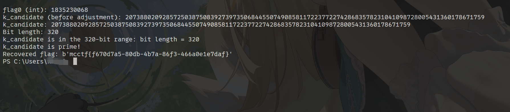

## <font style="color:#270070;">Forensics</font>
> Geek团队运营着一个大型的Minecraft多人服务器，拥有超过5000名注册玩家。2025年8月11日下午，服务器管理员收到多名玩家举报，称服务器出现异常行为，技术在排查后发现服务器文件被勒索组织投放了勒索病毒，导致文件被加密，技术将服务器内存镜像打包交给专业网络安全团队极安云科进行排查，请你协助公司方进行排查。
>
> 用户须知：本题涉及到真实环境勒索病毒，请在隔离环境下进行解题操作，严禁将本题所涉文件与外界互联网接触，下载附件则表示您已接受并承诺遵守该条约，若因违反本条约导致的病毒传播或文件被加密，本组委会不承担任何责任！
>

### 取证-1
> 请提交攻击者IP
>

内网地址的 10.10.0.1。

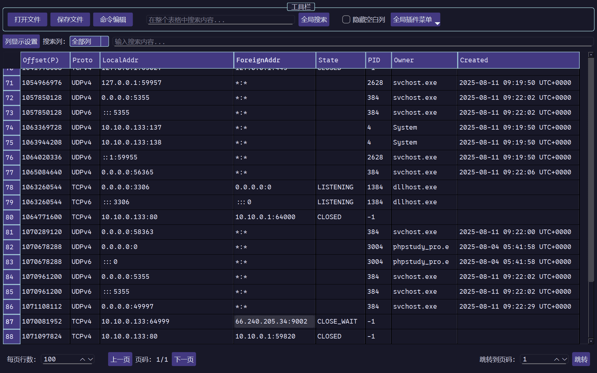

```plain
10.10.0.1
```

### 取证-2
> 请提交攻击者外联IP和端口
>


```plain
66.240.205.34:9002
```

### 取证-3
> 请提交该服务器皮肤上传系统中发现的webshell绝对路径（含文件名）
>
> flag格式：MCCTF{D:/xxx/xxx.php}
>

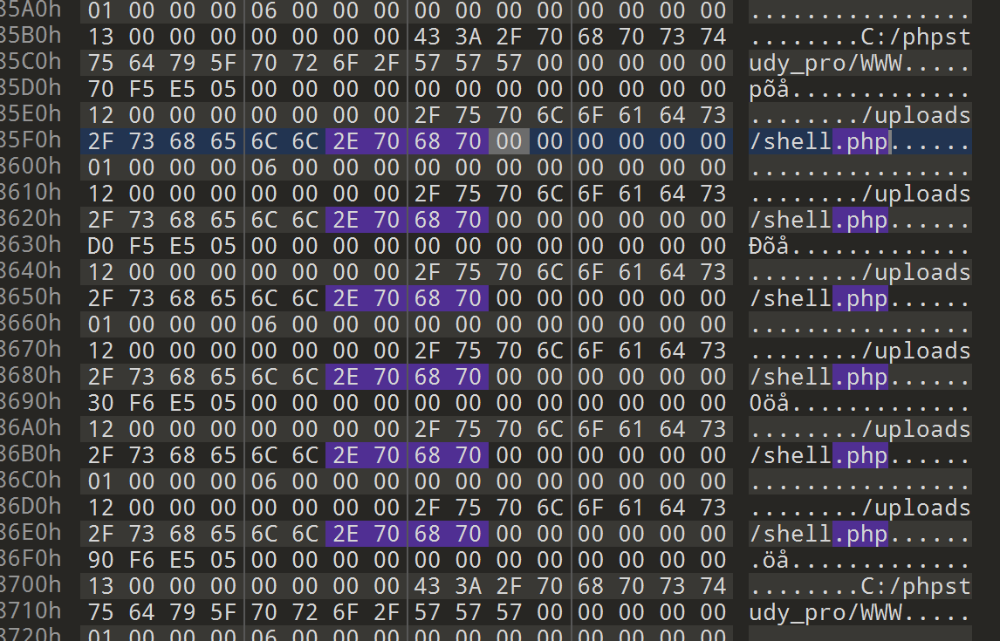

```plain
C:/phpstudy_pro/WWW/uploads/shell.php
```

### 取证-4
> 请提提交该服务器勒索病毒名称
>
> flag格式：MCCTF{WannaCry 1.0}
>

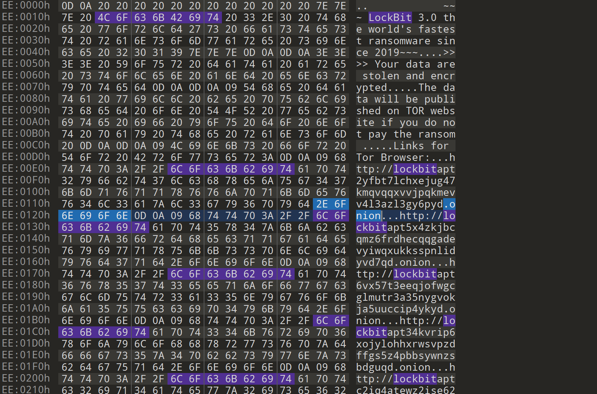

```plain
LockBit 3.0
```

### 取证-5
> 请提提交该勒索组织留下的浏览器地址的顶级域名，如：.com
>
> flag格式：MCCTF{.com}
>


```plain
.union
```


