## Reverse
### <font style="color:rgb(222, 226, 230);background-color:rgb(33, 37, 41);">BASEic</font>
> The space base is in danger and we lost the key to get in!
>

两串 base64 拼起来解码就是 flag。

### <font style="color:rgb(222, 226, 230);background-color:rgb(33, 37, 41);">ExceLLM</font>
> Did you know that the Apollo Guidance Computer used to land on the moon only had clock frequency of 2.048 MHz and about 4kb of RAM? In a similar vein of resource constraints, did you know you can implement machine learning models using Excel if you try hard enough? Our flag checker model is trained specifically to recognize the correct flag. Give it a shot!
>

用微软的 Office 打开会报错，需要用 LibreOffice。

隐藏了 3 个工作表。


里面实现了一个大模型，但是过于复杂。

可以在 Verify 工作表里面发现校验 flag 的时候是一位一位校验的。

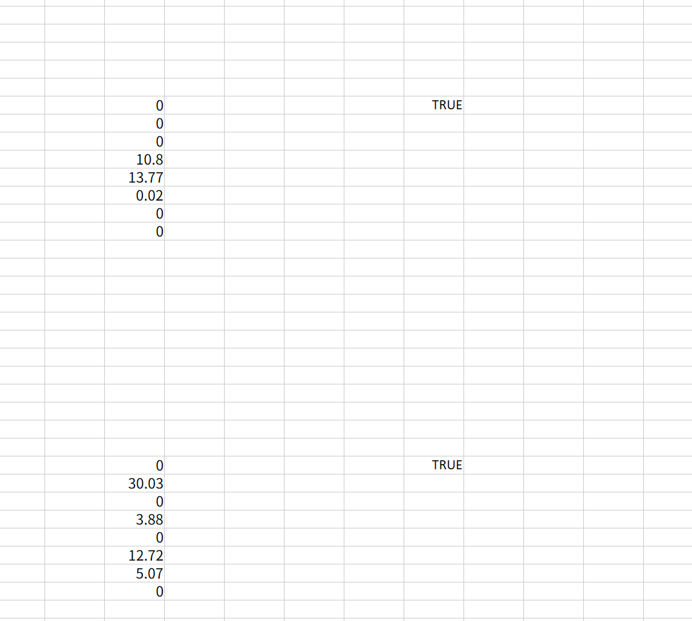

直接逐位爆破即可。

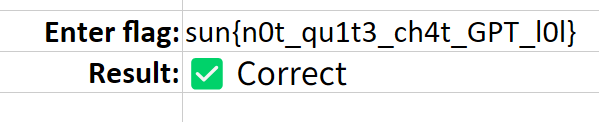

### <font style="color:rgb(222, 226, 230);background-color:rgb(33, 37, 41);">Palatine Pack</font>
> Caesar is raiding the Roman treasury to pay off his debts to his Gallic allies, and to you and his army. Help him find the password to make this Lucius Caecilius Metellus guy give up the money! >:) (he is sacrosanct so no violence!)
>

比较复杂的位运算，一块丢给 GPT 就能出。

```python
#!/usr/bin/env python3
# -*- coding: utf-8 -*-
"""
decrypt_flag.py
读取当前目录下 flag.txt（由给出的 C 程序输出，长度为 8*n），
逆向 3 次 expand，再逆向 flipBits，恢复原始 palatinepackflag.txt 的内容。
输出到 recovered_flag.bin 并在 stdout 打印可打印部分（尝试以 utf-8 解码）。
"""

import sys
from pathlib import Path

def inv_expand(data: bytes) -> bytes:
    """逆向一次 expand：输入长度应为 2 * a2，返回长度 a2"""
    if len(data) % 2 != 0:
        raise ValueError("inv_expand: 输入长度必须为偶数")
    a2 = len(data) // 2
    out = bytearray(a2)
    v4 = 0  # false
    for i in range(a2):
        y0 = data[2*i]
        y1 = data[2*i + 1]
        if not v4:
            # 在原 expand 中： y0 = ((v3 & 0xF) << 4) | (in & 0xF)
            #                   y1 = (in & 0xF0) | (v3 >> 4)
            # 所以恢复 in = (y1 & 0xF0) | (y0 & 0x0F)
            in_b = (y1 & 0xF0) | (y0 & 0x0F)
        else:
            # 在原 expand 中： y0 = (v3 >> 4) | (in & 0xF0)
            #                   y1 = ((v3 & 0xF) << 4) | (in & 0xF)
            # 所以恢复 in = (y0 & 0xF0) | (y1 & 0x0F)
            in_b = (y0 & 0xF0) | (y1 & 0x0F)
        out[i] = in_b
        v4 = not v4
    return bytes(out)

def inv_flipBits(data: bytes) -> bytes:
    """逆向 flipBits：输入长度应为 n，返回长度 n（原始 s）"""
    n = len(data)
    out = bytearray(n)
    v4 = 0  # false initially
    v3 = 105  # initial v3
    for i in range(n):
        b = data[i]
        if v4:
            # original did: b_out = b_in ^ v3; (then v3 += 32)
            # so recover b_in = b_out ^ v3
            orig = b ^ (v3 & 0xFF)
            v3 = (v3 + 32) & 0xFF
        else:
            # original did: b_out = ~b_in
            # so recover b_in = ~b_out
            orig = (~b) & 0xFF
        out[i] = orig
        v4 = not v4
    return bytes(out)

def main():
    path = Path("flag.txt")
    if not path.exists():
        print("错误：当前目录下找不到 flag.txt，请把要解密的文件命名为 flag.txt 放在此目录。", file=sys.stderr)
        sys.exit(2)

    data = path.read_bytes()
    L = len(data)
    if L == 0:
        print("flag.txt 是空的。", file=sys.stderr)
        sys.exit(2)
    if L % 8 != 0:
        print(f"警告：文件长度 {L} 不是 8*n 的形式（可能仍可尝试）。继续处理。", file=sys.stderr)

    print(f"读取 flag.txt，长度 {L} 字节。开始逆向 3 次 expand ...")

    # 三次逆 expand
    try:
        step1 = inv_expand(data)
        print(f"一次 inv_expand 后长度 {len(step1)}")
        step2 = inv_expand(step1)
        print(f"二次 inv_expand 后长度 {len(step2)}")
        step3 = inv_expand(step2)
        print(f"三次 inv_expand 后长度 {len(step3)} (应为原始 n)")
    except Exception as e:
        print("在 inv_expand 过程中出错：", e, file=sys.stderr)
        sys.exit(3)

    # 逆 flipBits
    try:
        recovered = inv_flipBits(step3)
    except Exception as e:
        print("在 inv_flipBits 过程中出错：", e, file=sys.stderr)
        sys.exit(4)

    out_path = Path("recovered_flag.bin")
    out_path.write_bytes(recovered)
    print(f"已写出 {out_path}（{len(recovered)} 字节）。")

    # 尝试以 utf-8 打印人类可读文本（若不是 utf-8 则以 latin-1 展示原 bytes）
    try:
        text = recovered.decode("utf-8")
        print("\n=== 以 UTF-8 解码的内容（完整） ===\n")
        print(text)
    except UnicodeDecodeError:
        # 尝试 latin-1 直接映射 0-255（保证不抛异常），并同时显示可打印字符前后若干
        text = recovered.decode("latin-1")
        print("\n警告：恢复的字节不能用 UTF-8 解码。已把原始字节写入 recovered_flag.bin。")
        print("下面以 latin-1 显示（每字节直接映射），若含有不可见字符请用十六进制查看）：\n")
        # 只打印前 1024 字符以免爆屏
        print(text[:1024])
        if len(text) > 1024:
            print("\n...（输出被截断，完整已写入 recovered_flag.bin）")

if __name__ == "__main__":
    main()


```

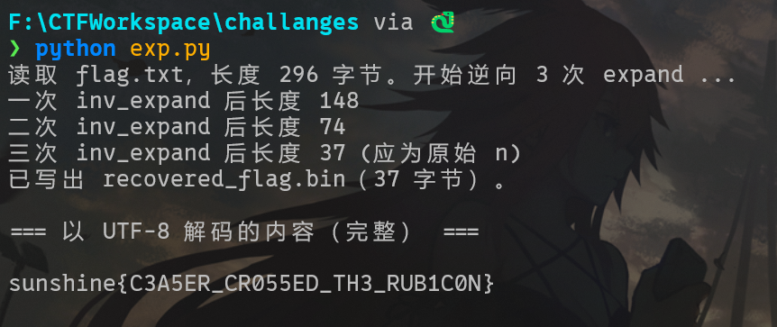

### <font style="color:rgb(222, 226, 230);background-color:rgb(33, 37, 41);">Roman Romance</font>
> When in Rome...
>

袖珍勒索病毒，就是把每个字节加了一。

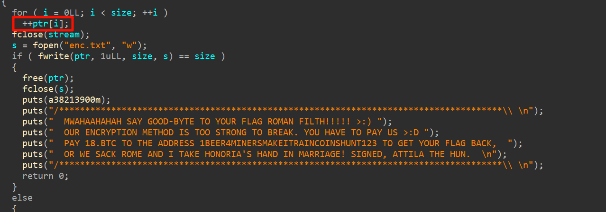

减回去就行。

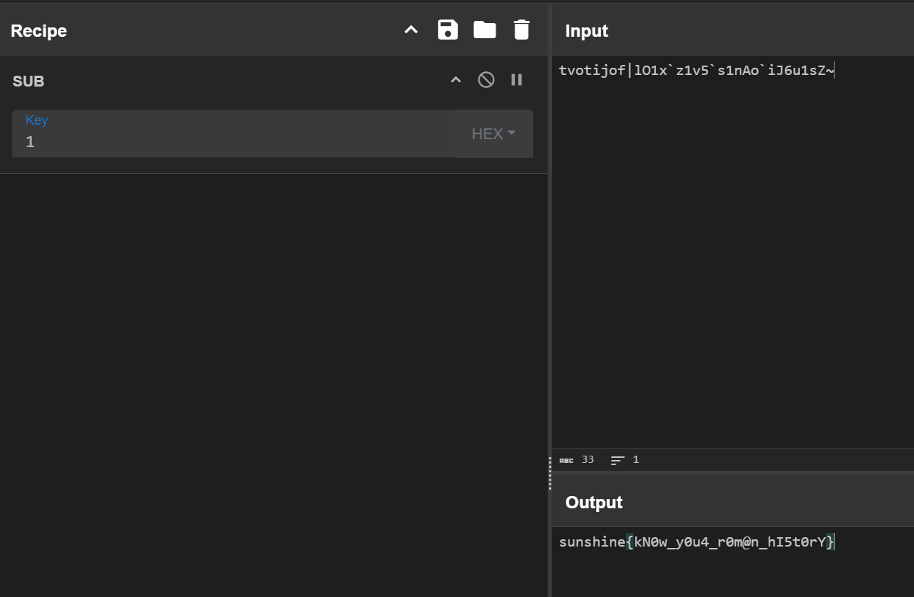

### <font style="color:rgb(222, 226, 230);background-color:rgb(33, 37, 41);">Missioncritical1</font>
> Ground Control to Space Cadet!
>
> 
>
> We've intercepted a satellite control program but can't crack the authentication sequence. The satellite is in an optimal transmission window and ready to accept commands. Your mission: Reverse engineer the binary and find the secret command to gain access to the satellite systems.
>

三个字符串按照 printf 里面的拼接就是 flag。

直接 linux 上运行也可以。


## Web
### <font style="color:rgb(222, 226, 230);background-color:rgb(33, 37, 41);">Lunar Auth</font>
> Infiltrate the LunarAuth admin panel and gain access to the super secret FLAG artifact !
>
> [https://comet.sunshinectf.games](https://comet.sunshinectf.games)
>

/admin 路由，注释里找到 base64 编码的字符串，解码传入后拿到 flag。

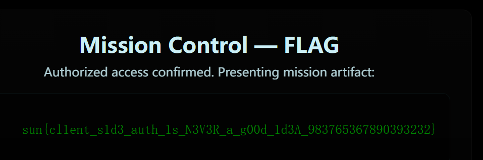

### <font style="color:rgb(222, 226, 230);background-color:rgb(33, 37, 41);">Lunar Shop</font>
> We have amazing new products for our gaming service! Unfortunately we don't sell our unreleased flag product yet !
>
> [https://meteor.sunshinectf.games](https://meteor.sunshinectf.games)
>

SQLite 注入。

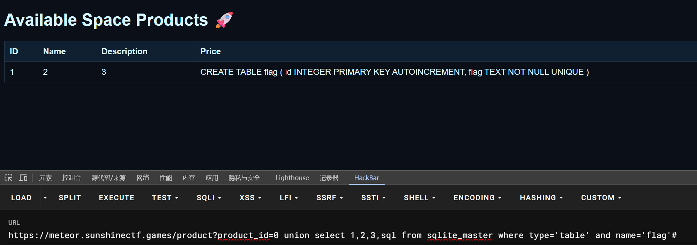

flag 在 flag 表的 flag 字段。

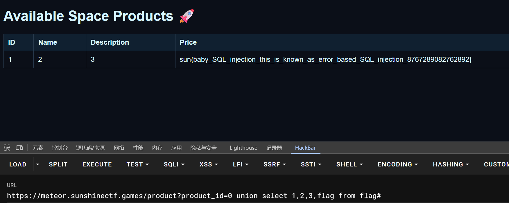


## Forensics
### <font style="color:rgb(222, 226, 230);background-color:rgb(33, 37, 41);">Pretty Delicious Food</font>
> This cake is out of this world! :DDDDDDD
>
> omnomonmonmonmonm
>
> ...
>
> something else is out of place too.
>
> Note: This is not a steganography challenge
>

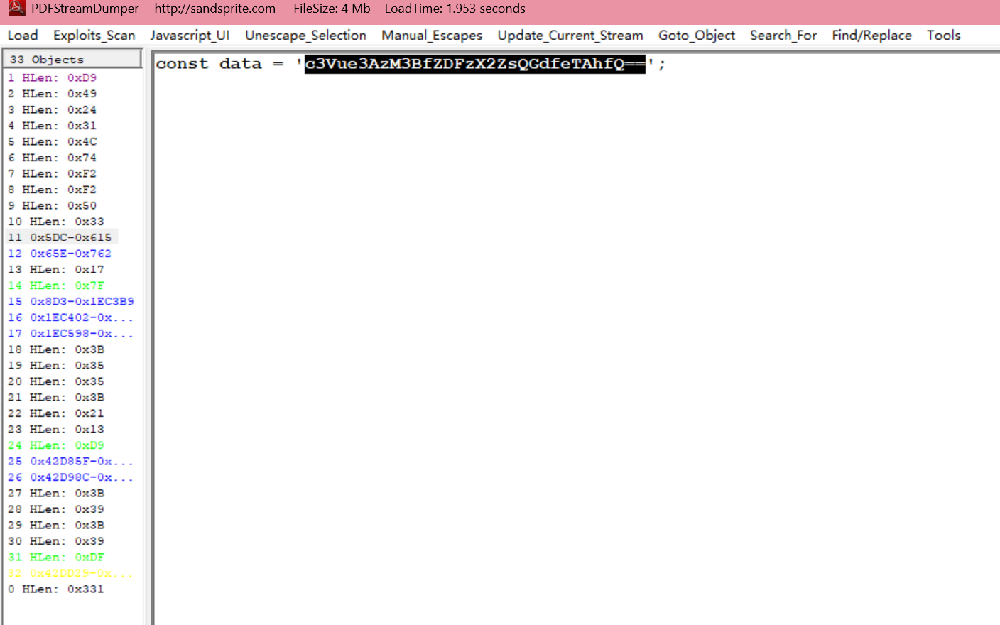

PDFStreamDumper 看到 base64 编码的 flag。

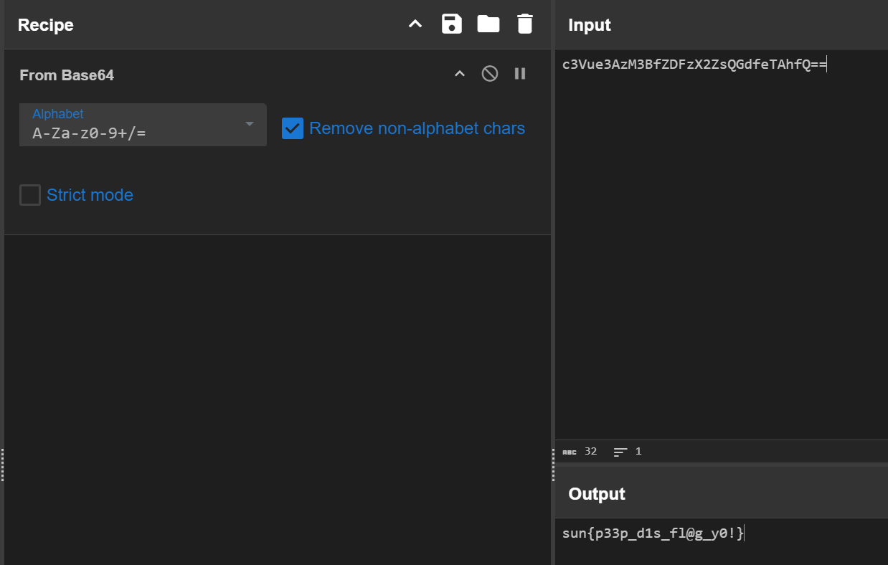

### <font style="color:rgb(222, 226, 230);background-color:rgb(33, 37, 41);">t0le t0le</font>
> Our CCDC business guy made a really weird inject. He's just obsessed with that damn cat... there's nothing hiding in there, right?
>

docx 后缀改成 zip 解压，发现一个 bin 文件。

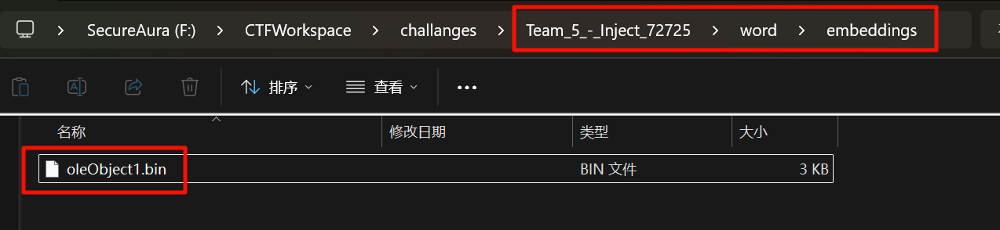

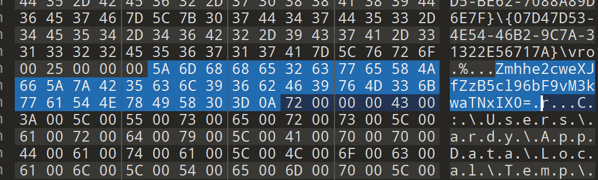

里面找到 base64 编码的 flag，解出来还需要 ROT13 一下。

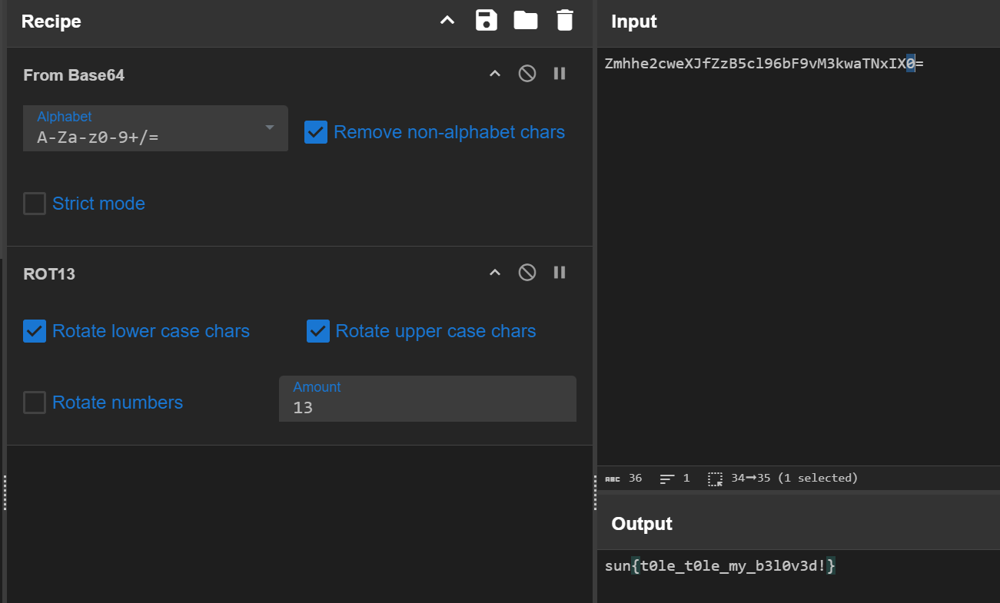


## Misc
### <font style="color:rgb(222, 226, 230);background-color:rgb(33, 37, 41);">Tribble with my Skin</font>
> My Minecraft account got hacked and now my skin seems to be a little off...
>
> Might be having trouble with the tribbles...
>
> Mind checking it out? My Minecraft username is "oatzs".
>
> PS: A Minecraft account/instance is not required for this challenge. The most recently used skin is the suspicious one.
>

找到用户的皮肤，发现不太美观，下载下来发现有 flag 的涂鸦。

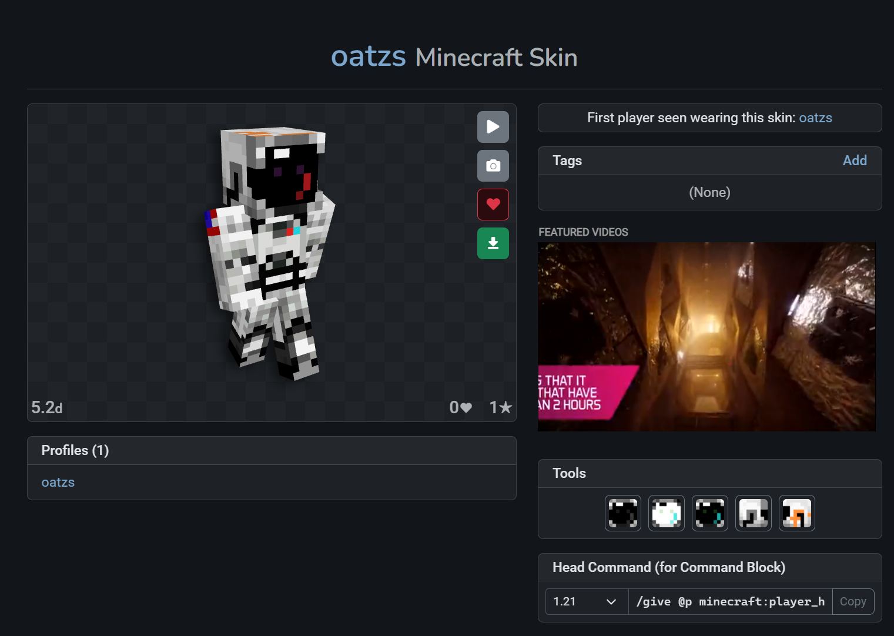


### <font style="color:rgb(222, 226, 230);background-color:rgb(33, 37, 41);">OK BOOMER</font>
> 7778866{844444777_7446666633_444777_26622244433668}
>
> 
>
> alternatively (if that one is producing invalid results)
>
> 
>
> 77778866{8444447777_7446666633_4447777_26622244433668}
>

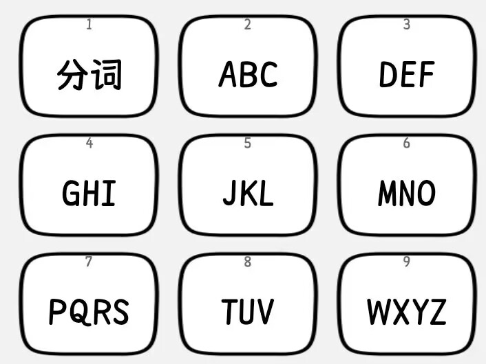

手机九宫格键盘。

sun{this_phone_is_ancient}

### <font style="color:rgb(222, 226, 230);background-color:rgb(33, 37, 41);">BigMak</font>
> I tried typing out the flag for you, but our Astronaut Coleson seems to have changed the terminal's keyboard layout? He went out to get a big mak so I guess we're screwed. Whatever, here's the flag, if you can somehow get it back to normal.
>
> 
>
> rlk{blpdfp_iajylg_iyi}
>

题目意思就是键盘的布局不同导致输出的内容不一样。

输入的时候误以为是 QWERTY 布局，其实是 Colemak  布局，对照敲一遍即可。

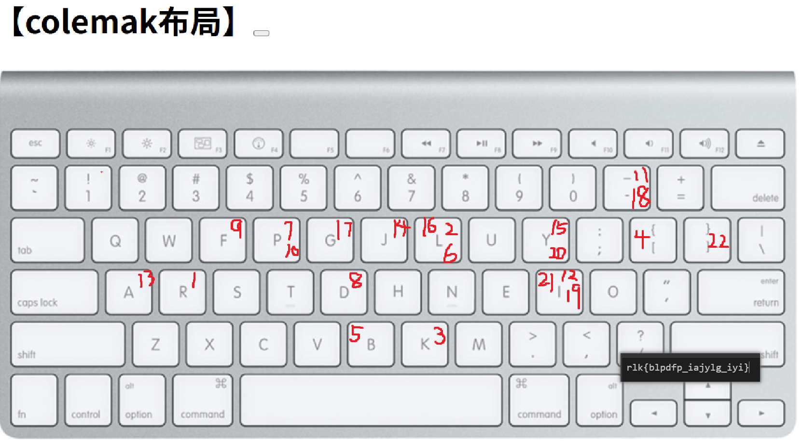

sun{burger_layout_lol}


