## Misc
### 成功男人背后的女人
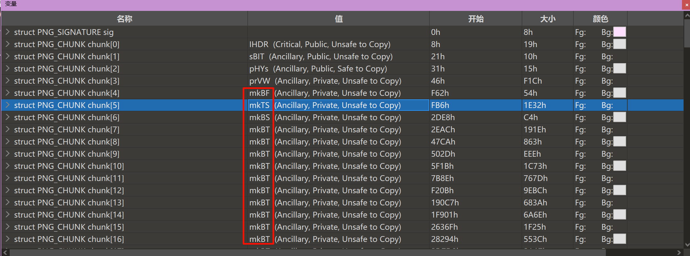

跟正常 png 结构不太一样，多了一堆 mk 开头的数据块。

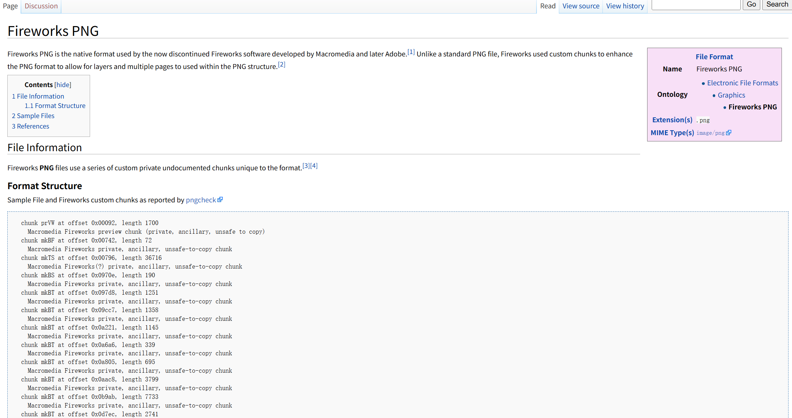

其实是 fireworks png，可以理解为有一堆图层，要下载 Macromedia Fireworks 查看，但是这里有一个在线网站可以查看。https://www.photopea.com/

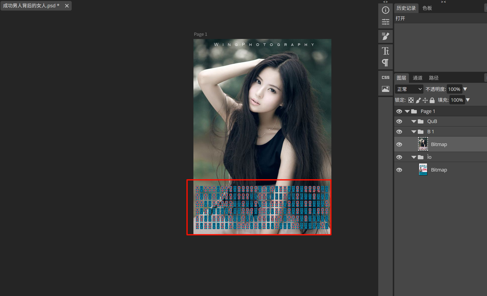

发现一个关掉可见性的图层，给它打开，发现有一堆 ♂♀的符号，把♂看成1，把♀看成0，from binary 即可解出 flag。

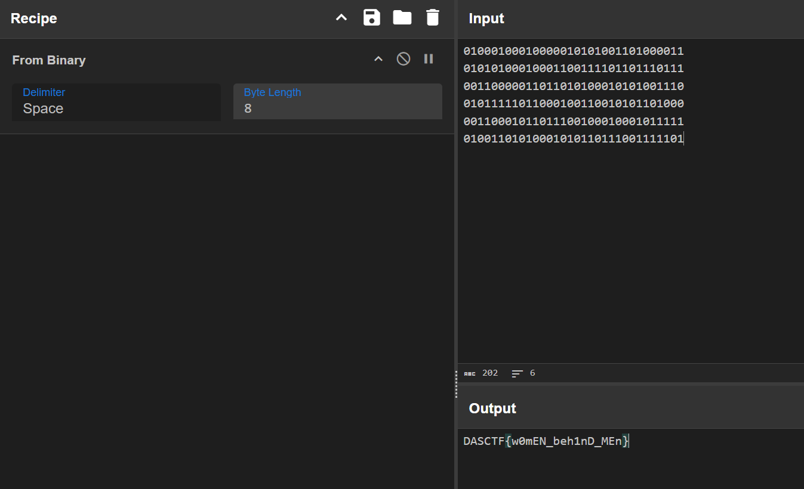

### 别笑，你试你也过不了第二关
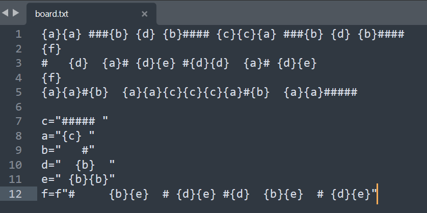

第一关限制代码长度 285 个字符，通过寻找重复片段，然后用 format 去替换重复片段从而缩短长度。

```plain
c="##### "
a=f"{c} "
b="   #"
d=f"  {b}  "
e=f" {b}{b}"
f=f"#     {b}{e}  # {d}{e} #{d}  {b}{e}  # {d}{e}"
hilogo=f"{a}{a} ###{b} {d} {b}#### {c}{c}{a} ###{b} {d} {b}####\n{f}\n#   {d}  {a}# {d}{e} #{d}{d}  {a}# {d}{e}\n{f}\n{a}{a}#{b}  {a}{a}{c}{c}{c}{a}#{b}  {a}{a}#####"
```

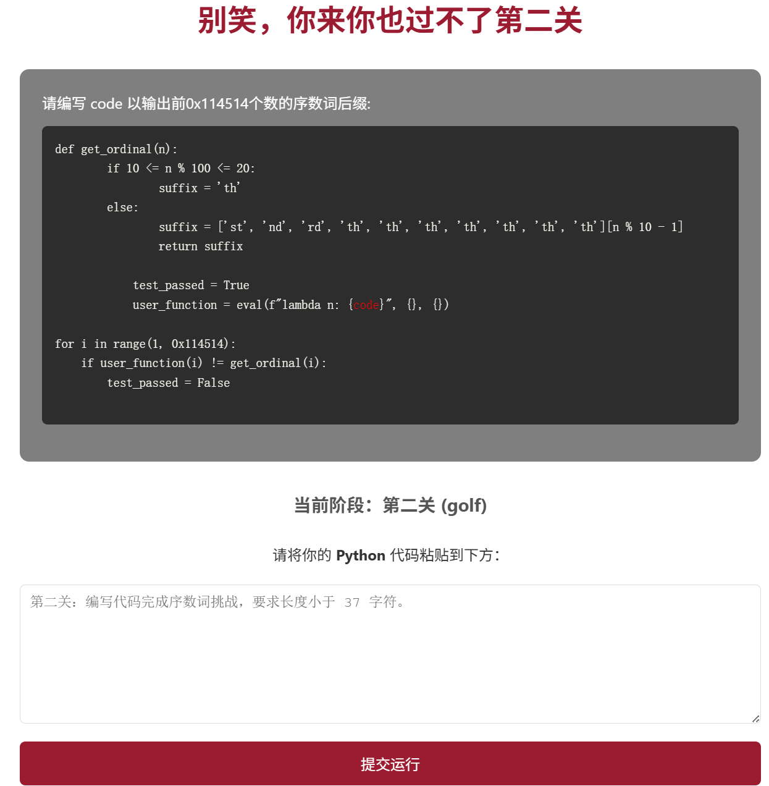

第二关要求输出前0x114514个数的序数词后缀，关卡名是 golf，有个网站是 code golf，就是挑战最短 python 代码完成目标的。

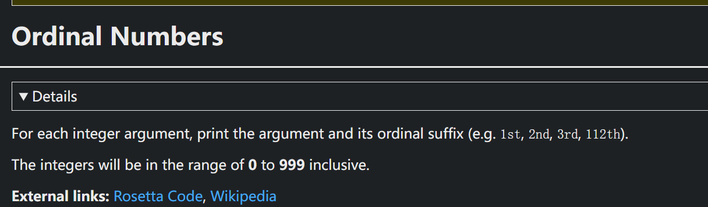

https://codegolf.stackexchange.com/questions/4707/outputting-ordinal-numbers-1st-2nd-3rd

这里有现成的代码，36 个字符完成。

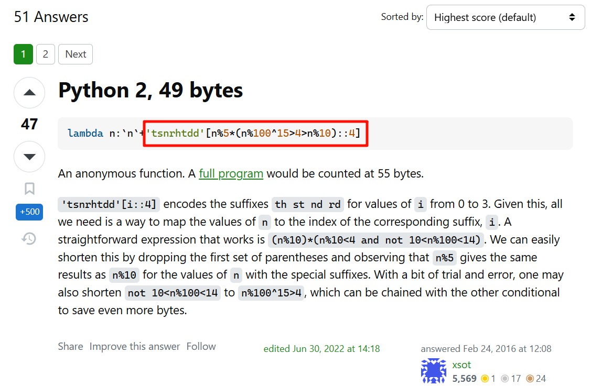

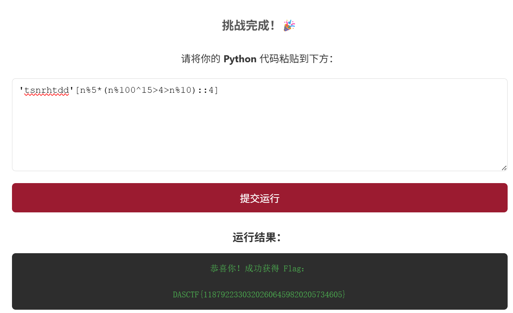

```python
'tsnrhtdd'[n%5*(n%100^15>4>n%10)::4]
```

### 帅的被人砍
首先有一个 flag 生成器，里面有一个简单的位移加密，可以解出来明文是 oeqqh2550i12v3964h5xrtttqrbmkij7，这个有用，后面要考。

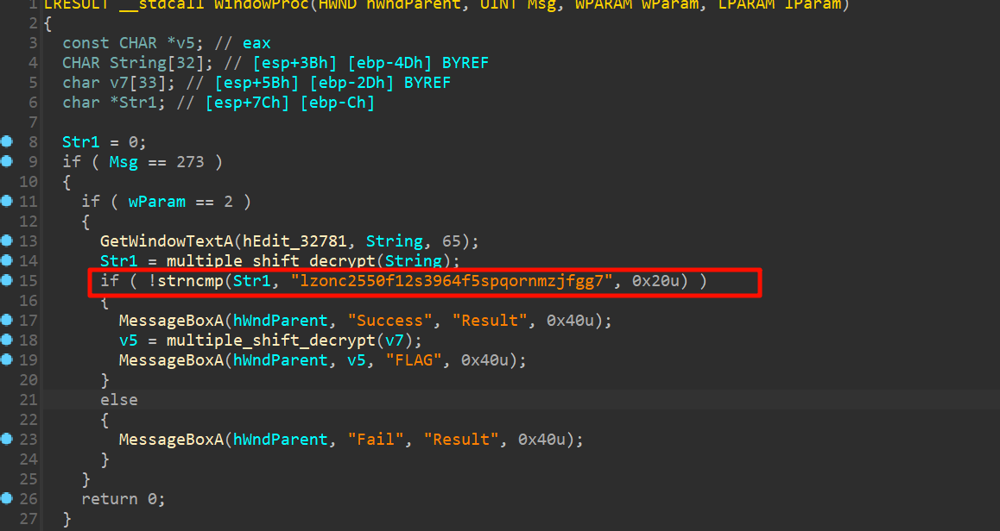

```python
def multiple_shift_encrypt(s):
    # 对应于C代码的逆操作：解密里是 -v5，这里要 +v5
    shifts = [3, 5, 2]
    result = []
    for i, ch in enumerate(s):
        shift = shifts[i % len(shifts)]
        if ch.isalpha():
            if ch.islower():
                base = ord('a')
            else:
                base = ord('A')
            # 加密是反向过程 -> (ch - base + shift) % 26
            result.append(chr((ord(ch) - base + shift) % 26 + base))
        else:
            result.append(ch)
    return ''.join(result)

encrypted = "lzonc2550f12s3964f5spqornmzjfgg7"
original_input = multiple_shift_encrypt(encrypted)
print("Recovered original input:", original_input)
```

还有一个流量包，里面一堆 tcp 流，注意到最后是 z7 收尾，可能是 7z 压缩包，倒过来提取出来。

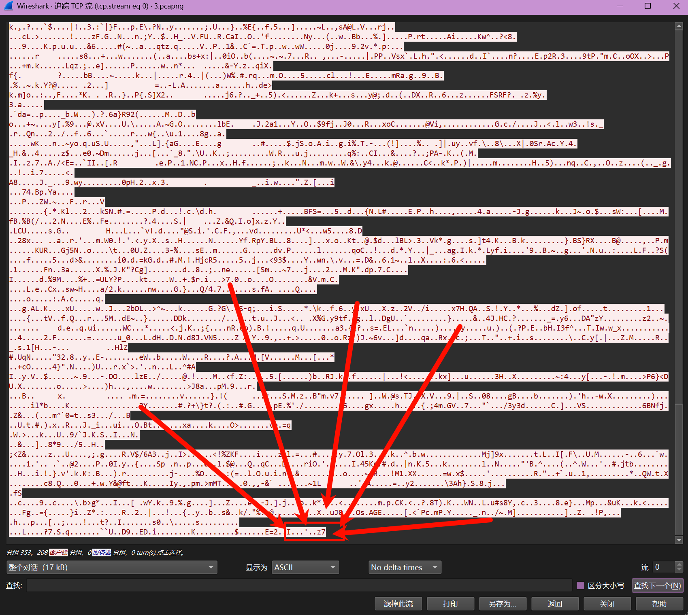

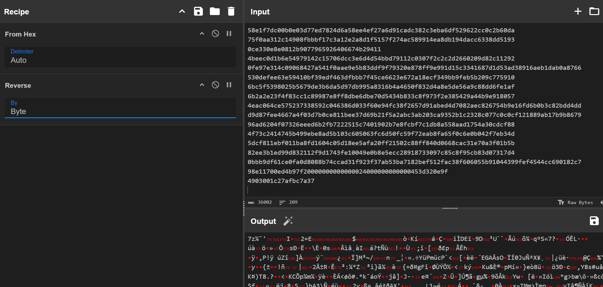

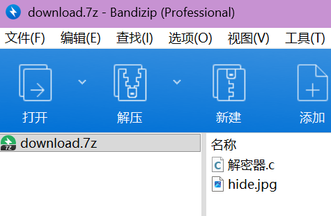

里面有解密器，是用来解密那个 动态KEY生成器.lock 的，还有一个 hide.jpg，解密器的密钥应该在里面，可以用 steghide 空密码提取出来。

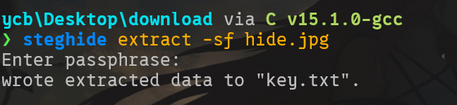

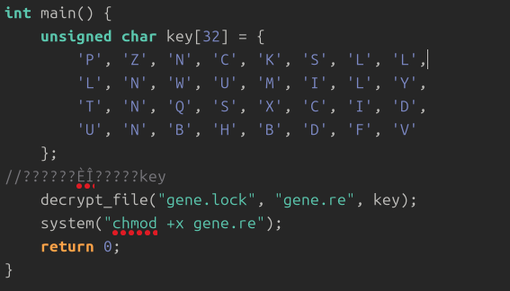

把密钥填好，编译然后解密出 动态KEY生成器.re，ida逆向看看。

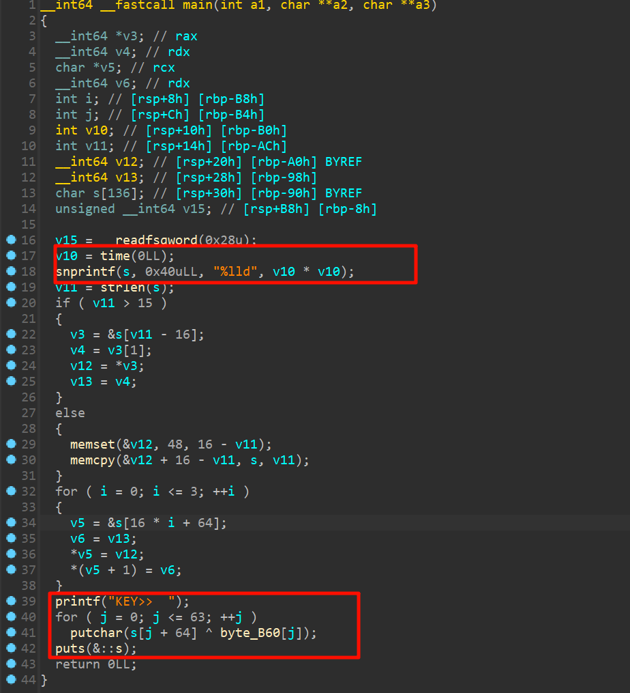

借助系统时间生成了密钥，现在留意题目描述，需要指定一下运行时间，而且是上海时区。

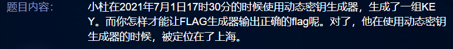

跑出来发现有问题，而且发现 KEY 的开头和刚才的 oeqqh2550i12v3964h5xrtttqrbmkij7 高度相似，那我们可以在 17 点 30 分附近爆破时间，直到 KEY 的开头是 oeqqh2550i12v3964h5xrtttqrbmkij7 即可。

```c
// find_key_prefix.c
// 在中心时间附近爆破（枚举每秒），直到生成的 KEY 的开头是 "oeqqh255"（ASCII）为止。
// 严格按你提供的反编译内存/字节操作实现 KEY 的生成。

#include <stdio.h>
#include <stdint.h>
#include <string.h>
#include <time.h>
#include <stdlib.h>
#include <inttypes.h>

static const unsigned char byte_B60[64] = {
    0x5E, 0x55, 0x44, 0x42, 0x5C, 0x07, 0x04, 0x0D,
    0x07, 0x51, 0x01, 0x0B, 0x42, 0x01, 0x0E, 0x00,
    0x05, 0x58, 0x00, 0x4B, 0x46, 0x41, 0x45, 0x4C,
    0x46, 0x4A, 0x52, 0x54, 0x5F, 0x5B, 0x5D, 0x01,
    0x76, 0x76, 0x60, 0x75, 0x6D, 0x7D, 0x4A, 0x57,
    0x5C, 0x49, 0x53, 0x09, 0x07, 0x07, 0x04, 0x55,
    0x5E, 0x40, 0x41, 0x46, 0x40, 0x59, 0x53, 0x48,
    0x02, 0x01, 0x09, 0x0E, 0x02, 0x50, 0x05, 0x4B, 0x00
    };

/* 要与 KEY 再异或的字符串（循环扩展到 64 字节） */
static const char *xor_str = "oeqqh2550i12v3964h5xrtttqrbmkij7";

/* 目标前缀（ASCII）*/
static const char *target_prefix = "oeqqh2550i12v3964h5xrtttqrbmkij7";

static void print_hex(const unsigned char *buf, size_t len) {
    for (size_t i = 0; i < len; ++i) printf("%02x", buf[i]);
}

/* 严格按反编译内存操作生成 64 字节 key */
static void gen_key_exact(time_t epoch, unsigned char out_key[64]) {
    char s[136];
    memset(s, 0, sizeof(s));

    long long sq = (long long)epoch * (long long)epoch;
    snprintf(s, 0x40, "%lld", sq);
    int v11 = (int)strlen(s);

    uint64_t v12 = 0, v13 = 0;
    unsigned char tmp16[16];

    if (v11 > 15) {
        const char *p = &s[v11 - 16];
        memcpy(&v12, p, 8);
        memcpy(&v13, p + 8, 8);
    } else {
        int pad = 16 - v11;
        memset(tmp16, '0', pad);
        memcpy(tmp16 + pad, s, v11);
        memcpy(&v12, tmp16, 8);
        memcpy(&v13, tmp16 + 8, 8);
    }

    for (int i = 0; i <= 3; ++i) {
        unsigned char *dest = (unsigned char *)(&s[64 + 16 * i]);
        memcpy(dest, &v12, 8);
        memcpy(dest + 8, &v13, 8);
    }

    for (int j = 0; j < 64; ++j) {
        unsigned char sb = (unsigned char)s[64 + j];
        out_key[j] = (unsigned char)(sb ^ byte_B60[j]);
    }
}

/* 将 xor_str 循环扩展到 64 字节 */
static void build_xor_bytes(unsigned char out[64]) {
    size_t len = strlen(xor_str);
    if (len == 0) {
        fprintf(stderr, "xor_str empty\n");
        exit(2);
    }
    for (int i = 0; i < 64; ++i) out[i] = (unsigned char)xor_str[i % len];
}

/* parse center time string "YYYY-MM-DD_HH:MM:SS" （上海时区） */
static time_t parse_center_time(const char *s) {
    struct tm tmc;
    memset(&tmc, 0, sizeof(tmc));
    if (sscanf(s, "%4d-%2d-%2d_%2d:%2d:%2d",
               &tmc.tm_year, &tmc.tm_mon, &tmc.tm_mday,
               &tmc.tm_hour, &tmc.tm_min, &tmc.tm_sec) != 6) {
        return (time_t)-1;
    }
    tmc.tm_year -= 1900;
    tmc.tm_mon -= 1;
    tmc.tm_isdst = -1;
    setenv("TZ", "Asia/Shanghai", 1);
    tzset();
    return mktime(&tmc);
}

int main(int argc, char **argv) {
    /* 默认 center: 2021-07-01 17:30:00 (Asia/Shanghai) */
    time_t center;
    if (argc >= 3) {
        time_t parsed = parse_center_time(argv[2]);
        if (parsed == (time_t)-1) {
            fprintf(stderr, "invalid center time format, use YYYY-MM-DD_HH:MM:SS\n");
            return 2;
        }
        center = parsed;
    } else {
        struct tm tm_center;
        memset(&tm_center, 0, sizeof(tm_center));
        tm_center.tm_year = 2021 - 1900;
        tm_center.tm_mon  = 7 - 1;
        tm_center.tm_mday = 1;
        tm_center.tm_hour = 17;
        tm_center.tm_min  = 30;
        tm_center.tm_sec  = 0;
        setenv("TZ", "Asia/Shanghai", 1);
        tzset();
        center = mktime(&tm_center);
    }

    int half_window = 300; /* 默认 ±300 秒 */
    if (argc >= 2) {
        half_window = atoi(argv[1]);
        if (half_window < 0) half_window = 0;
    }

    /* 准备 xor_bytes（循环扩展到64字节） */
    unsigned char xor_bytes[64];
    build_xor_bytes(xor_bytes);

    unsigned char key64[64];
    unsigned char final64[64];

    size_t tp_len = strlen(target_prefix);
    if (tp_len > 64) tp_len = 64;

    time_t start = center - half_window;
    time_t end   = center + half_window;

    for (time_t t = start; t <= end; ++t) {
        gen_key_exact(t, key64);

        /* 判断 key 的前 tp_len 字节是否等于 target_prefix（ASCII） */
        if (memcmp(key64, target_prefix, tp_len) == 0) {
            /* 生成 FINAL 以额外展示 */
            for (int i = 0; i < 64; ++i) final64[i] = (unsigned char)(key64[i] ^ xor_bytes[i]);

            /* 打印匹配信息并退出 */
            char timestr[64];
            struct tm localtm;
            localtime_r(&t, &localtm);
            strftime(timestr, sizeof(timestr), "%Y-%m-%d %H:%M:%S %Z", &localtm);

            printf("MATCH at %s | epoch=%" PRIdMAX "\n", timestr, (intmax_t)t);

            printf("KEY_hex=  ");
            print_hex(key64, 64);
            printf("\nKEY_ascii=");
            /* 打印 ASCII 可见字符，不可见用 '.' */
            for (size_t i = 0; i < tp_len; ++i) {
                unsigned char c = key64[i];
                putchar((c >= 0x20 && c <= 0x7e) ? c : '.');
            }
            printf("\n");

            printf("FINAL_hex=");
            print_hex(final64, 64);
            printf("\n");

            return 0;
        }
    }

    printf("No match found in window ±%d seconds around center time.\n", half_window);
    return 2;
}
```

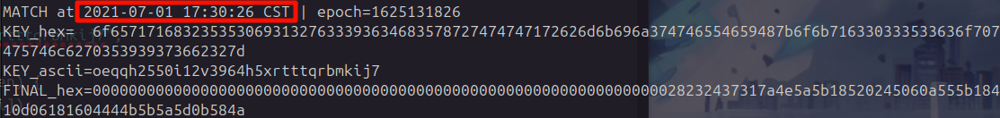

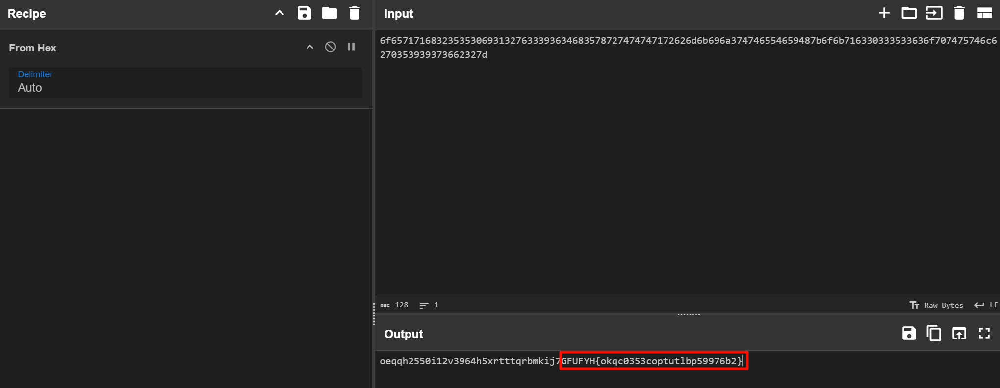

KEY 的最后有点像 flag，再用 flag 生成器的 multiple_shift_decrypt 函数解一下即可。

```python
def multiple_shift_decrypt(s):
    shifts = [3, 5, 2]
    result = []
    for i, ch in enumerate(s):
        shift = shifts[i % len(shifts)]
        if ch.isalpha():
            if ch.islower():
                base = ord('a')
            else:
                base = ord('A')
            result.append(chr((ord(ch) - base - shift) % 26 + base))
        else:
            result.append(ch)
    return ''.join(result)

encrypted = "GFUFYH{okqc0353coptutlbp59976b2}"
original_input = multiple_shift_decrypt(encrypted)
print("Recovered original input:", original_input)
```

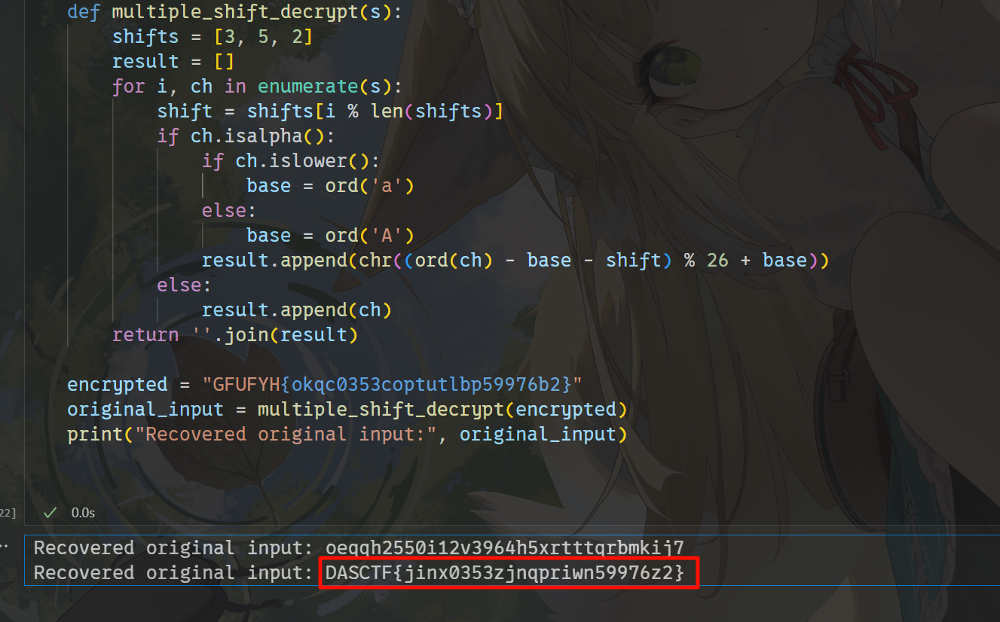

### 你也是旮旯给木大师？
```plain
1.攻击者在攻击过程中用于提权的工具是？
Metasploit

2.攻击者提权成功后用于维权的账户的账户名是？
heicker$

3.攻击者在攻击过程中利用了某个CVE漏洞，其编号为？ （示例： CVE-2024-3102）
CVE-2025-6218

4.攻击者通过某社交软件给受害者发送恶意压缩包的时间是？ （示例： 14:52）
06:45

5.攻击者在恶意程序内藏有一串token，其值为？
T1E2I6O4

6.绝密文件中含有一个重要密钥，其值为？
MIE_CTF_2025_T0k3n_#S3cur3!V3#
```

#### 1.攻击者在攻击过程中用于提权的工具是？
首先拿到三个文件，分别是 恶意的 galgame 的压缩包 PARQUET.zip，一个内存镜像，还有一个被加密的文件 “绝密.ciallo”。

首先去分析压缩包 PARQUET.zip，先不要解压，可以看到里面有一个很诡异的东西。

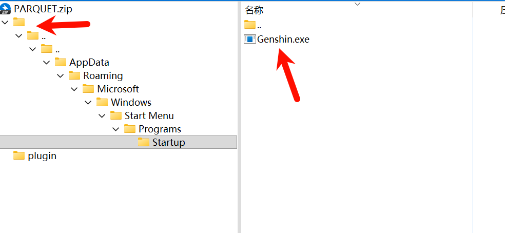

有一个构造好的路径穿越，攻击者想要把 Genshin.exe 放到启动项里面。

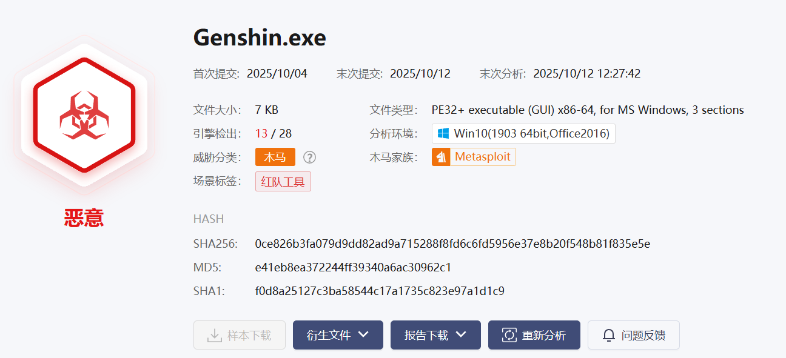

云沙箱看一下，发现是 Metasploit。

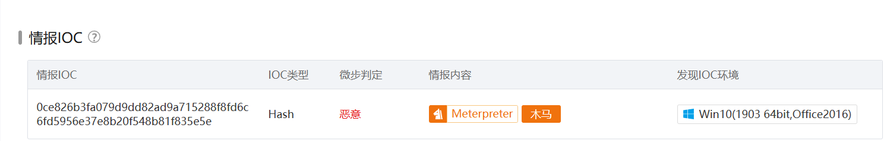

连接后在 windows 下可以 getsystem 提权，这个就是用于提权的工具（没有其他东西了，只有这个可能是）。

```plain
Metasploit
```

#### 2.攻击者提权成功后用于维权的账户的账户名是？
看内存镜像，翻不到其他用户，于是就去导出 SAM 文件看一下。


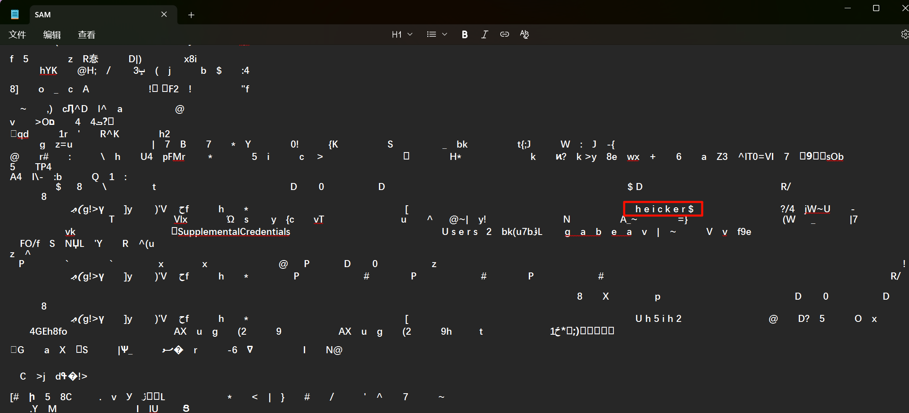

可以发现有一个隐藏用户 heicker$，这个就是用来权限维持的账户。

```plain
heicker$
```

#### 3.攻击者在攻击过程中利用了某个CVE漏洞，其编号为？ （示例： CVE-2024-3102）
去看一下内存中的应用兼容缓存 shimcachemem，可以发现 Genshin.exe 所在的文件夹就是 CVE 编号。

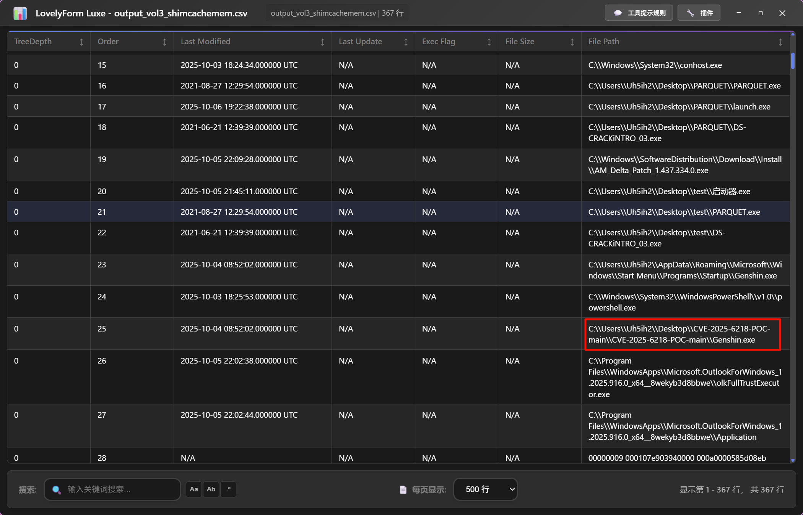


很明显就是这个 CVE。

```plain
CVE-2025-6218
```

#### 4.攻击者通过某社交软件给受害者发送恶意压缩包的时间是？ （示例： 14:52）
这问有点坑，提交是时间格式是 HH:MM。

直接在内存里面去搜索压缩包的名称 PARQUET.zip。

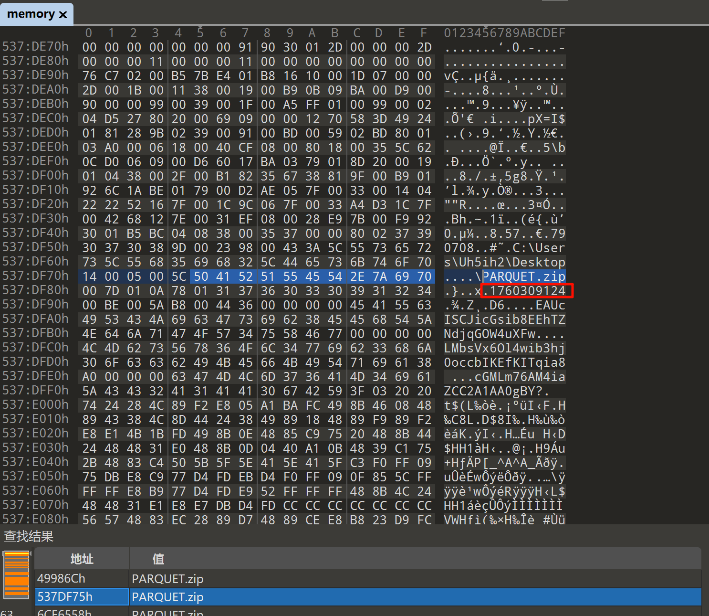

可以看到有一个时间戳，解一下发现是 10 月 13 日的，比赛时间是 10 月 11 日 - 12 日，这个时间很奇怪。

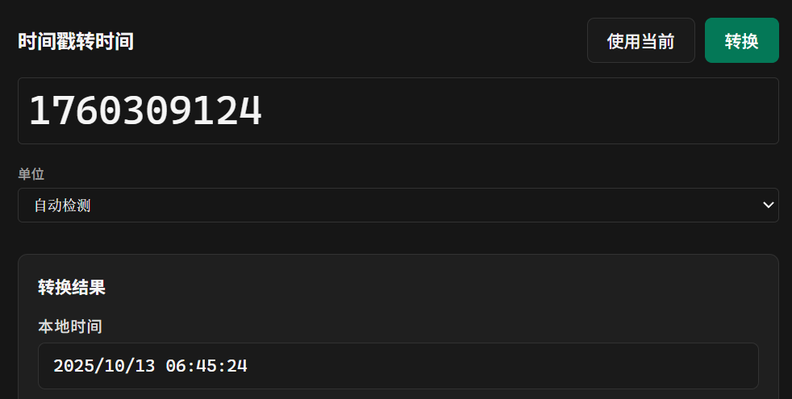

QQ 一般文件过期时间是 7 天，减一下发现正好和被攻击时间对上了，那说明这个时间其实是 PARQUET.zip 的过期时间，那么正好过期时间是整数的天数，不会影响到时分秒，那么发送这个压缩包的时间其实就是 

2025/10/06 06:45:24

```plain
06:45
```

#### 5.攻击者在恶意程序内藏有一串token，其值为？
pyinstxtractor 解包，这里注意一下，可能解包后 PYZ.pyz_extracted 文件夹是空的，这里用在线的工具解包可以避免这个问题。

https://pyinstxtractor-web.netlify.app/

解包后 pylingual 反编译一下 launch.pyc，可以看到主逻辑。

先不管下面写了什么，那个是下一题要用的，先看上面，可以发现导入了一个奇怪的库。

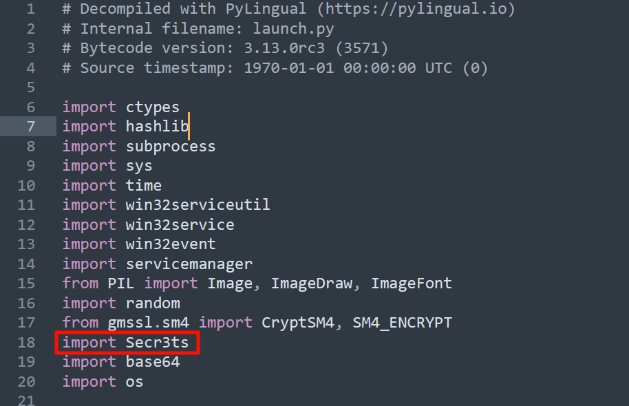

到 PYZ.pyz_extracted 文件夹里面找到这个库的 pyc。


也是 pylingual 给他反编译一下，拿到源码，很明显发现 G1f7 函数会生成一个 token，小改一下代码，直接调用 G1f7 这个函数输出 token，有几行报错直接去掉不管。

```python
# Decompiled with PyLingual (https://pylingual.io)
# Internal filename: Secr3ts.py
# Bytecode version: 3.13.0rc3 (3571)
# Source timestamp: 1970-01-01 00:00:00 UTC (0)

global _counter  # inserted
import time
import random
import hashlib
import base64
from functools import wraps

def xor_bytes(data, key):
    return bytes([b ^ key for b in data])
CONFIG_VERSION = 'v3.1.9'
_SYSTEM_ID = hashlib.sha1(b'noise').hexdigest()
_magic_table = [(i * 37 ^ 85) & 255 for i in range(256)]

class FakeCache:
    def __init__(self):
        self._store = {}

    def set(self, k, v):
        key = hashlib.md5(str(k).encode()).hexdigest()
        self._store[key] = (v, time.time())

    def get(self, k, default=None):
        key = hashlib.md5(str(k).encode()).hexdigest()
        v = self._store.get(key, (default, 0))[0]
        return v

    def purge_old(self, age=60):
        now = time.time()
        keys = list(self._store.keys())
        for k in keys:
            if now - self._store[k][1] > age:
                pass  # postinserted
            else:  # inserted
                del self._store[k]
_cache = FakeCache()

def verbose_marker(name):
    def deco(f):
        @wraps(f)
        def wrapped(*a, **kw):
            h = hashlib.blake2b((name + str(a) + str(kw)).encode(), digest_size=6).hexdigest()
            _cache.set('mark_' + name, h)
            return f(*a, **kw)
        return wrapped
    return deco

def poly_noise(x):
    s = 0
    for i in range(1, 16):
        s += x ** i % (i + 7) * (i ^ 3)
    return s

def weird_transform(s):
    a = s.encode('utf-8')
    b = base64.b64encode(a).decode()
    c = hashlib.sha1(b.encode()).hexdigest()
    return c[:12]

class PhantomStateMachine:
    def __init__(self):
        self.s = 0
        self.history = []

    def step(self, val):
        self.s = self.s * 31 + (val ^ 85) & 4294967295
        self.history.append(self.s)
        return self.s

    def snapshot(self):
        return tuple(self.history[(-5):])

    def reset(self):
        self.s = 0
        self.history.clear()
_phantom = PhantomStateMachine()

def pretend_network_send(payload):
    time.sleep(0.001)
    return {'status': 'ok', 'echo': hashlib.md5(payload.encode()).hexdigest()[:8]}

def pretend_read_file(path):
    try:
        with open(path, 'rb') as f:
            data = f.read(32)
            return data
    except Exception:
        return b''

def random_walk(seed, steps=100):
    r = seed
    for i in range(steps):
        r = r << 1 | r >> 3 ^ i * 158
        yield (r & 4294967295)

def meaningless_loop():
    acc = 0
    for v in random_walk(66, 20):
        acc ^= v & 255
        if acc & 1:
            pass  # postinserted
        else:  # inserted
            acc = acc << 1 & 4294967295
    return acc

def try_many_things():
    try:
        _ = int(hashlib.md5(b'x').hexdigest()[:6], 16)
        return 'done'
    except Exception:
        for i in range(3):
            continue
        return 'done'
    except:
        return 'done'

def fake_sorter(seq):
    a = list(seq)
    n = len(a)
    for i in range(n):
        for j in range(0, n - i - 1):
            if a[j] ^ 170 > a[j + 1] ^ 170:
                pass  # postinserted
            else:  # inserted
                a[j], a[j + 1] = (a[j + 1], a[j])
    return a

class Obfuscator:
    def __init__(self, seed=4660):
        self.seed = seed
        self.table = [_ for _ in range(256)]
        random.shuffle(self.table)

    def mix(self, data):
        return bytes([b ^ self.seed & 255 for b in data])

    def heavy(self, data):
        out = bytearray()
        for i, b in enumerate(data):
            out.append((b ^ self.table[i % 256]) & 255)
        return bytes(out)
_obf = Obfuscator(seed=21930)

def f_a(x):
    return (x * 7 ^ 5) & 255

def f_b(x):
    return (x + 13) % 256

def f_c(x):
    return x << 2 & 255
_mystery_blob = ''.join((chr((i * 3 + 7) % 255) for i in range(512)))
_counter = 0

def orchestrator(flag=False):
    global _counter  # inserted
    _counter += 1
    if flag:
        _cache.purge_old(age=1)
        _phantom.step(_counter)
        return _counter

def G1f7():
    what = '167307700b740d76'
    xor_key = 66
    orchestrator(flag=bool(len(what) % 2))
    _cache.set('len_what', len(what))
    token_bytes = xor_bytes(bytes.fromhex(what), xor_key)
    token_clean = token_bytes
    token = token_clean.decode('utf-8')
    print(token)

def long_useless_procedure():
    res = []
    for i in range(50):
        a = f_a(i)
        b = f_b(i)
        c = f_c(i)
        res.append((a, b, c))
        _phantom.step(i) if i % 7 == 3 else i
        if i % 11 == 0:
            pass  # postinserted
        else:  # inserted
            _cache.set('checkpoint_' + str(i), (a, b, c))
    flat = [x for t in res for x in t]
    s = sum(flat) & 65535
    return hashlib.sha256(str(s).encode()).hexdigest()

def nested_confusion(level):
    if level <= 0:
        pass  # postinserted
    return 0

class RedHerring:
    def __init__(self):
        self.a = meaningless_loop()
        self.b = long_useless_procedure()

    def run(self):
        for i in range(10):
            _cache.set('rh' + str(i), (self.a, self.b, i))
            _ = nested_confusion(i % 4)
        return True
_h1 = RedHerring()
_h2 = RedHerring()
_h3 = RedHerring()

def generate_noise_strings(n=100):
    out = []
    for i in range(n):
        cs = ''.join((chr((i * 37 + j * 11) % 127 + 32) for j in range(32)))
        out.append(cs)
    return out
_noise_strings = generate_noise_strings(80)
if __name__ == '__main__':
    G1f7()
```

```plain
T1E2I6O4
```

#### 6.绝密文件中含有一个重要密钥，其值为？
现在要解密那个 .ciallo 文件，先回到刚才的 launch.py 文件，看一下主逻辑。

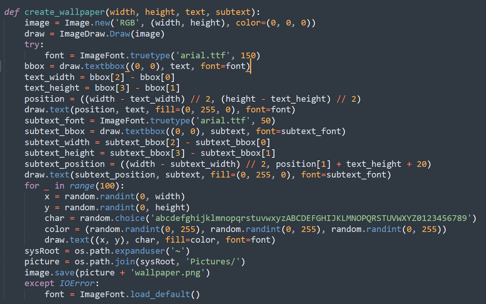

这个函数是生成壁纸的，这个壁纸很有用，后面要考。

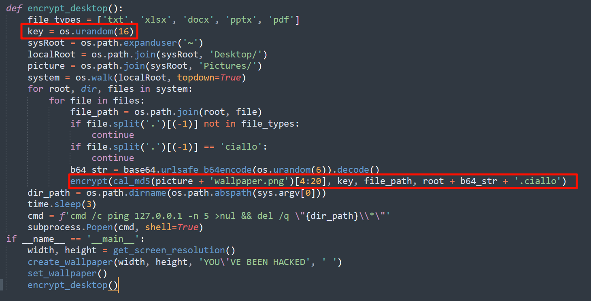

这里可以看到传给加密函数的参数，第一个是 iv，发现 iv 是壁纸的 md5 的第 5 到 20 个字符。

密钥是随机生成的，需要到加密函数里面继续看看。

壁纸可以直接 filescan 导出拿到，注意导出后要把后面的 0x00 全删掉，不然不是原装进口的壁纸，md5 会有错。

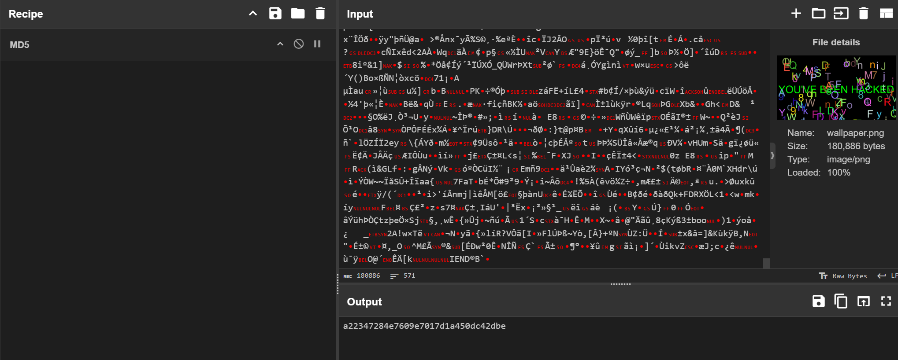

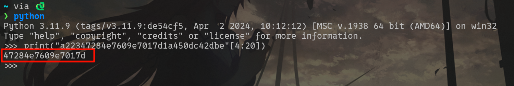

拿到 iv，接下来去看密钥。

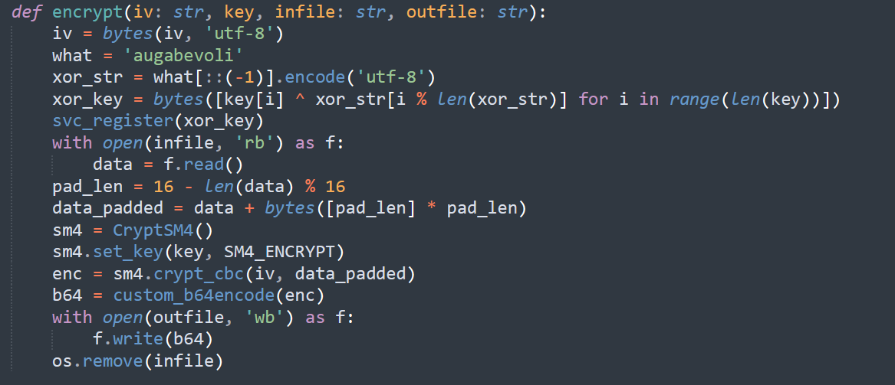

这个是加密函数，可以发现密钥传进来又被加密了一下，将反转的字符串 augabevoli 和密钥循环异或，然后传到了 svc_register 里面。

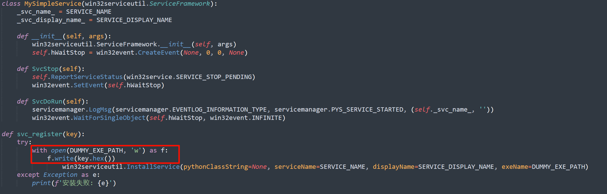

在这里注册了一个系统服务，但是参数我们都不知道，去内存里面搜一下 launch.exe，发现 ServiceKeyName 是 JieJieJie，svclist 可以看到这个服务注册的应用程序是 Cmd.exe（第一个C是大写的），其实就是上面的 DUMMY_EXE_PATH，加密的密钥被写到这个里面了。

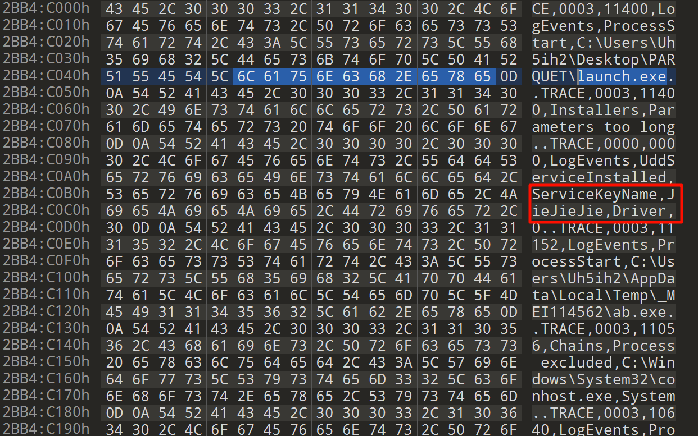

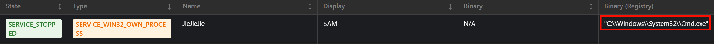

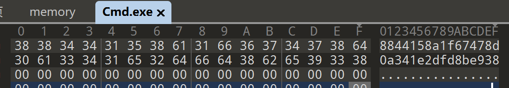

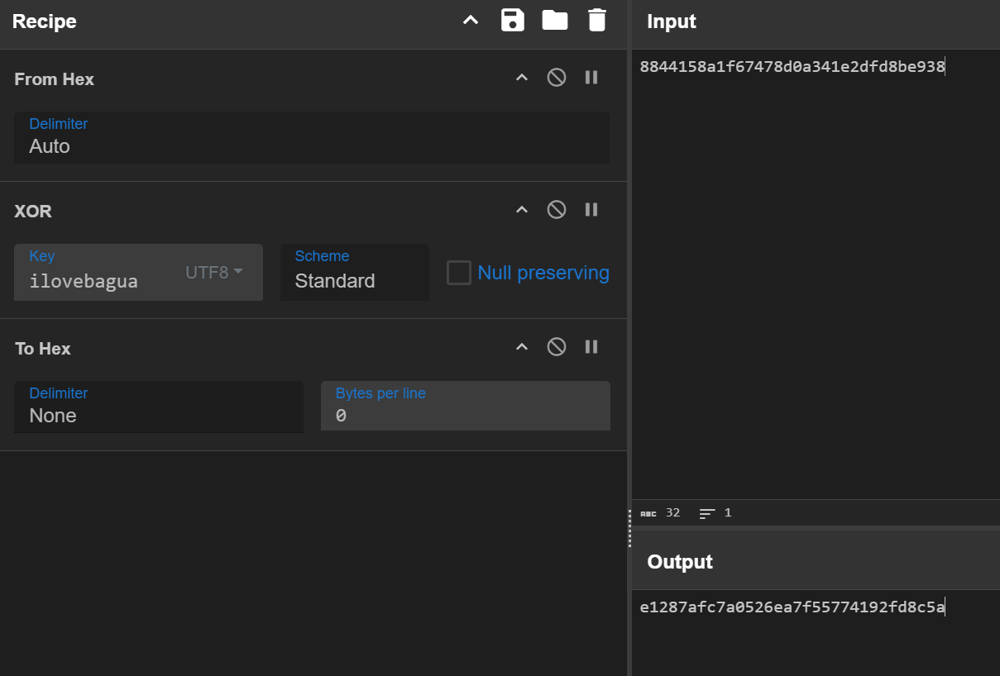

加密后的密文被丢到了 custom_b64encode 函数，里面是一个换表 base64。

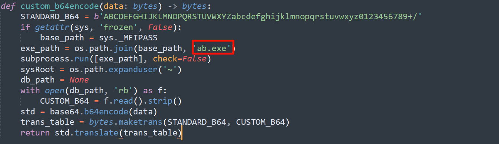

会发现里面运行了一个程序叫 ab.exe，我们可以在解包的文件夹里面发现这个 exe。

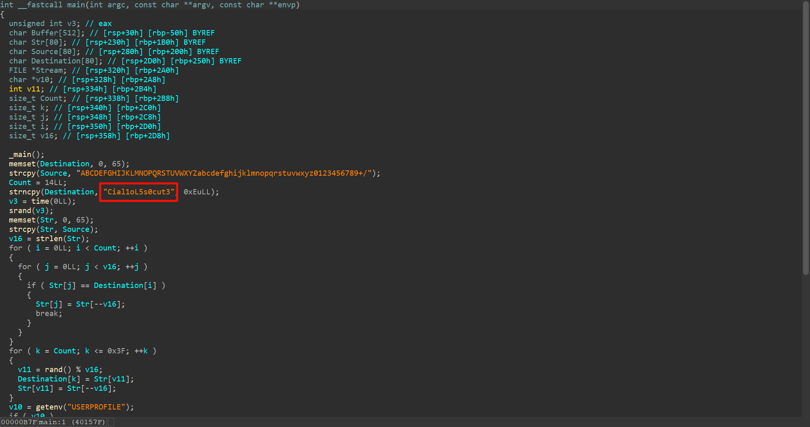

ida 看一下会发现它生成了一个自定义的表，而且已经固定好前缀。

这里为了方便，不去运行程序，直接去内存里面搜这个前缀，就可以找到生好的码表。

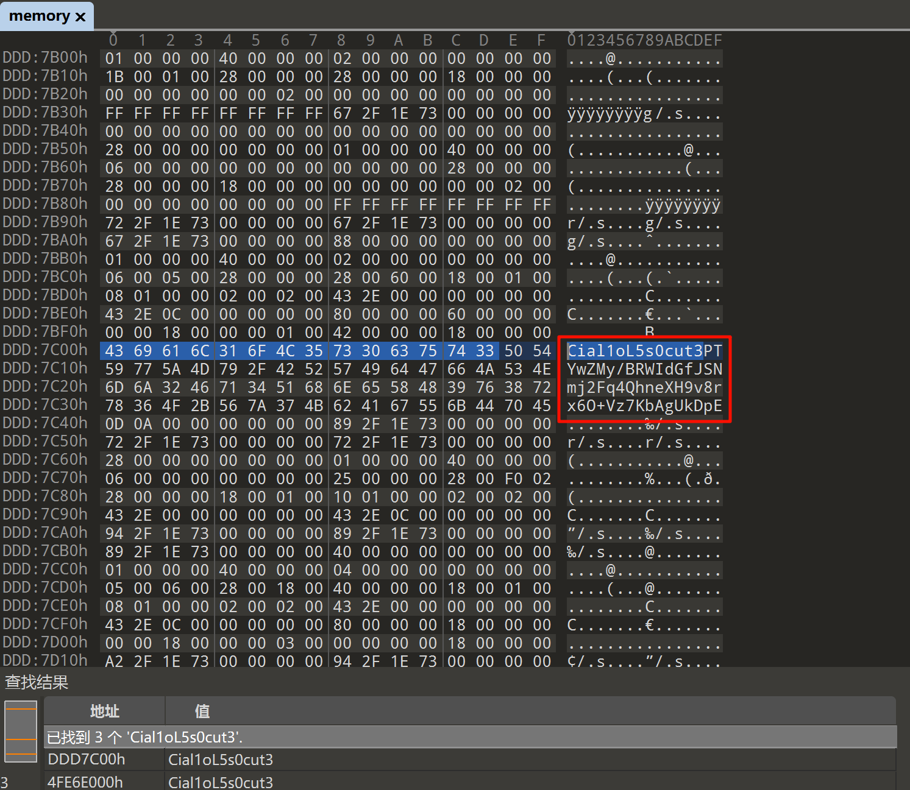

东西都齐了，直接去解密即可，解出来是一个 pdf。

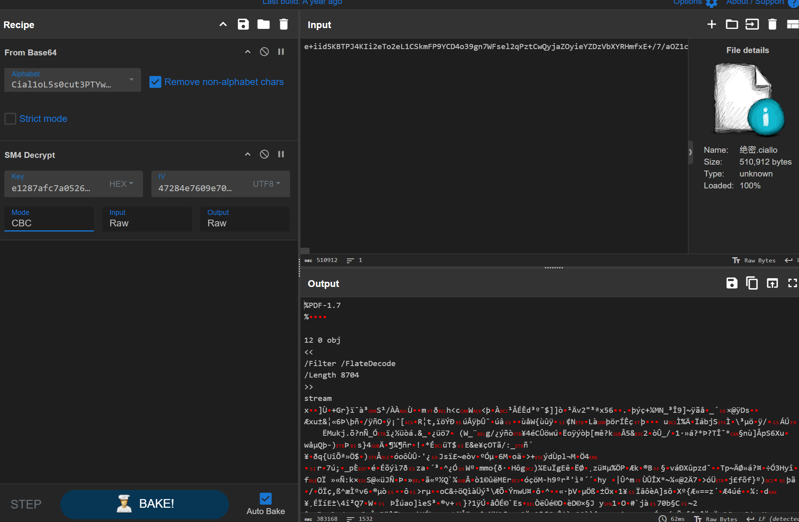

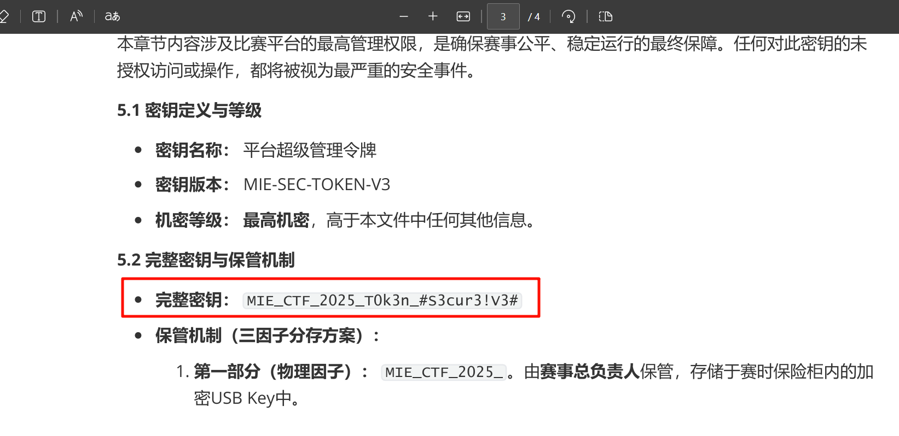

```plain
MIE_CTF_2025_T0k3n_#S3cur3!V3#
```

**最终答案：**

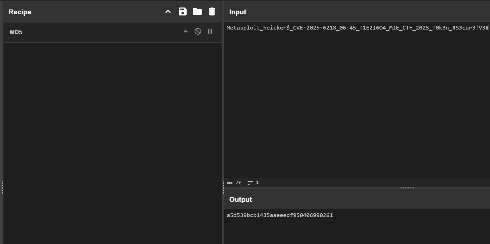

```plain
a5d539bcb1435aaeeedf950406990261
```

